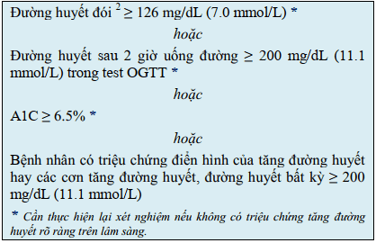

## Phân loại

HIP được chia làm 2 nhóm lớn:

1. Đái tháo đường trong thai kỳ (diabetes in pregnancy - DIP):

- Đái tháo đường lần đầu được chẩn đoán trong thai kỳ
   hoặc 
- Đường huyết cao được chẩn đoán lần đầu trong thai kỳ và **thoả các tiêu chuẩn chẩn đoán đái tháo đường ở người không mang thai của WHO**
- Có thể phát hiện ở bất kỳ thời điểm nào trong thai kỳ kể cả ở **tam cá nguyệt 1**

2. Đái tháo đường thai kỳ (gestational diabetes mellitus - GDM):

- Đường huyết cao trong thai kỳ nhưng **không phải là đái tháo đường thực sự**
- Đường huyết cao được chẩn đoán lần đầu trong thai kỳ
- Có thể phát hiện ở bất kỳ thời điểm nào trong thai kỳ nhưng hầu hết **sau 24 tuần**

## Bệnh sinh

1. Kháng Insulin kết hợp từ 2 yếu tố chính:

- Kháng Insulin của thai nghén bắt đầu từ nửa sau (tuần thứ 20) đến cuối thai kỳ nhằm giảm tiêu thụ glucose, chuyển glucose cho thai.
- Kháng Insulin mạn tính từ trước đó.

2. Khiếm khuyết chức năng tế bào beta không bù đủ sự gia tăng của kháng Insulin.

## Yếu tố nguy cơ

1. Người trưởng thành có BMI &ge; 23 $kg/m^2$ và có 1 trong các nguy cơ sau:

- Gia đình có người mắc đái tháo đường thế hệ cận kề.
- Tiền sử bệnh tim mạch do sơ vữa.
- Tăng huyết áp (huyết áp tâm thu &ge; 140 mmHg hoặc huyết áp tâm trương &ge; 90 mmHg hay điều trị thước tăng huyết áp).
- Nồng độ HDL-C trong máu < 0.9 mmol/L và/hoặc Triglycerid > 2.82 mmol/L.
- Phụ nữ bị buồng trứng đa nang.
- Ít vận động thể lực.
- Có dấu hiệu đề kháng Insulin.

2. Phụ nữ đã mắc đái tháo đường thai kỳ.
3. HbA1C &ge; 5.7%, rối loạn glucose huyết đói hay rối loạn dung nạp glucose ở lần xét nghiệm trước đó.
4. Người thực bắt đầu thực hiện xét nghiệm phát hiện đái tháo đường từ 45 tuổi.

## Tiêu chuẩn chẩn đoán

### Tiêu chuẩn chẩn đoán đái tháo đường trong thai kỳ

Dựa trên tiêu chuẩn của đái tháo đường thực thụ, BN có thể mắc đái tháo đường từ trước nhưng khi có thai mới phát hiện đái tháo đường.

### Tiêu chuẩn chẩn đoán đái tháo đường thai kỳ

Bằng nghiệm pháp dung nạp đường huyết, từ tuần 24-28 của thai kỳ (Các thời gian khác nhất là sau 28 tuần vẫn có thể làm nghiệm pháp). Điều kiện thai phụ phải nhịn ăn ít nhất 8-10 giờ, sau đó uống 75 g đường khan pha với nước, xét nghiệm đường huyết đói, sau 1 giờ và sau 2 giờ.

Theo FIGO 2018, kết quả được đánh giá như sau:

## Mục tiêu điều trị

**HbA1c ít có giá trị với đái tháo đường thai kỳ** vì đái tháo đường thai kỳ xuất hiện từ nửa sau thai kỳ (khoảng 4 tháng cuối) trong khi HbA1c có giá trị đánh giá trong vòng 3 tháng. Ngoài ra còn chịu ảnh hưởng của nhiều yếu tố như đời sống hồng cầu ngắn lại, máu pha loãng.

## Nguyên tắc điều trị

1. Cung cấp đủ năng lượng và các chất dinh dưỡng cho mẹ và thai nhi.
2. Đạt mục tiêu về đường máu (tránh tăng đường máu sau ăn và hạ đường máu xa bữa ăn).
3. Đạt cân nặng hợp lý.
4. Phù hợp thói quen ăn uống, điều kiện kinh tế, không quá khó thực hiện.

## Phương pháp thay đổi đường huyết

### Liệu pháp dinh dưỡng nội khoa

Chế độ dinh dưỡng nội khoa (Medical Nutrition Treatment - MNT) cần đáp ứng được các mục tiêu sau:

1. Ổn định được đường huyết ở mức mục tiêu.
2. Cung cấp đủ năng lượng đảm bảo sức khoẻ cho mẹ và giúp thai phụ tăng cân hợp lý trong thai kỳ.
3. Đảm bảo được sức khoẻ của thai.
4. Ngăn ngừa tình trạng nhiễm cetone.

#### Chế độ ăn và theo dõi

Đến 80% sản phụ đái tháo đường thai kỳ kiểm soát đường huyết đường huyết bằng chế độ ăn và tập luyện.

Tổng Calo phân bố: Carbohydrate 35-45%, protid 20-25%, lipid 35-40%.

Người đang thực hiện MNT nên ăn 5-7 bữa trong ngày (bao gồm 3 bữa chính và 2-4 bữa phụ). Các bữa ăn không hoàn toàn giống nhau.

Trong giai đoạn đầu khi thực hiện MNT, khuyến khích thai phụ tự theo dõi thường xuyên đường huyết đói cũng
như đường huyết 3-4 lần/ngày:

- Đường huyết đói: 1 lần/ ngày, sau khi nhịn đói ít nhất 8 giờ.
- Đường huyết sau ăn: sau ăn 1-2 giờ, 2-3 lần/ ngày, xoay vòng cho các bữa ăn khác nhau trong tuần.
- Ít nhất cũng cần theo dõi đường huyết 1 lần/ngày và phải ghi nhận tương quan với thời điểm bữa ăn.

Ưu tiên thực phẩm có chỉ số đường huyết thấp (<55) hoặc trung bình (56-69).

Khi đã đảm bảo đạt được mục tiêu về đường huyết bằng MNT, việc theo dõi đường huyết có thể được nới lỏng hơn. Nếu thực hiện tốt MNT, rất nhiều thai phụ mắc GDM không cần thiết phải dùng thuốc hạ đường huyết và có kết cục chu sinh tốt.

#### Vận động thể lực

Ngoài thay đổi chế độ ăn, thai phụ mắc GDM nên có chế độ vận động phù hợp với từng cá nhân:

- Vận động khoảng 30 phút/ngày. Nhịp tim tăng từ 10-20% nhịp tim cơ bản của sản phụ.
- Đi bộ nhanh hoặc tập thể dục vùng cánh tay khi ngồi ghế trong 15-20 phút sau ăn 1h mỗi bữa ăn nếu không chống chỉ định.
- Chống chỉ định vận động với: Dọa đẻ non, ối vỡ sớm, hở eo tử cung, xuất hiện 3 tháng giữa/3 tháng cuối thai kỳ, rau tiền đạo, tiền sản giật.
- Những thai phụ vận động tích cực trước khi mang thai được khuyến khích duy trì chế độ vận động của họ trong thai kỳ.

Có thể tham khảo chi tiết [Hướng dẫn điều chỉnh lối sống](./huong-dan-dieu-chinh-loi-song-benh-nhan-dai-duong-thai-ky.docx) và [Phiếu theo dõi đường huyết](./phieu-theo-doi-duong-huyet.docx).

### Thuốc kiểm soát đường huyết

**Bộ Y tế Việt Nam chưa cho phép việc dùng Metformin trong thai kỳ cho DIP/GDM.** Thuốc hạ đường huyết được chỉ định khi MNT thất bại là Insulin.

#### Chỉ định dùng Insulin

- Đái tháo đường trước khi có thai.
- Đái tháo đường thai kỳ:
  - Đái tháo đường thai kỳ chẩn đoán trước tuần 24.
  - Đường máu đói >7 mmol/l.
  - Đường máu bất kỳ > 11.1 mmol/l.
  - Đường máu làm dung nạp đường huyết > 11.1 mmol/l.
- Đường máu đói và/hoặc đường máu sau ăn không đạt mục tiêu trong 20% số lần đo trong 1-2 tuần áp dụng điều chỉnh chế độ ăn.
- Xem xét điều trị Insuline trong trường hợp đường đói 5.6-5.8 mmol/L kết hợp điều chỉnh chế độ ăn và tập luyện.

#### Phân loại Insulin

_Khoanh màu đỏ là Insulin được cấp phép sử dụng cho phụ nữ có thai._

#### Liều dùng Insulin

Liều Insulin thay đổi tùy theo giai đoạn của thai kỳ. Insulin được dùng 2 lần trong ngày. Mỗi lần cần phối hợp NPH Insulin (tác dụng kéo dài) và regular Insulin (thường).

- Tam cá nguyệt 1: 0.7-0.8 U/kg/ngày
- Tam cá nguyệt 2: 0.8-1.0 U/kg/ngày
- Tam cá nguyệt 3: 0.9-1.2 U/kg/ngày

Tổng liều Insulin sẽ được chia ra như sau: 2/3 buổi sáng và 1/3 buổi tối. **Tuy nhiên chỉnh liều Insulin còn phụ thuộc vào từng sản phụ.**

#### Phác đồ minh họa

#### Biến chứng tiêm Insulin

- Hạ đường huyết.
- Loạn dưỡng mỡ tại vị trí tiêm.
- Kháng Insulin.
- Dị ứng.

## Theo dõi trong thai kỳ

Cần lưu ý những điểm mốc trong chăm sóc thai kỳ với đái tháo đường:

- 10 tuần: Tư vấn cũng như đánh giá các biến chứng của đái tháo đường: **khám mắt và thận** nếu chưa được đánh giá cách 03 tháng. **Khám nội tiết cách 1-2 tuần** trong thai kỳ. **Đo HbA1C** để đánh giá nguy cơ. Hướng dẫn cách tự **theo dõi đường huyết cũng như thực hiện OGTT** đối với thai phụ có tiền căn đái tháo đường thai kỳ càng sớm càng tốt trong tam cá nguyệt 1. **Siêu âm thai** xác định tuổi thai và độ sinh tồn thai.
- 16 tuần: **Khám mắt**. **Tự theo dõi đường huyết và OGTT** nếu đến khám lần đầu lúc tam cá nguyệt 2.
- 20 tuần: **Siêu âm hình thái thai** đặc biệt **siêu âm tim**.
- 28 tuần: **Siêu âm** đánh giá **sự phát triển thai và AFI**. **Khám mắt** đối với các trường hợp đái tháo đường trước thai kỳ.
- 32 tuần: Tương tự như lúc khám thai 28 tuần.
- 36 tuần: **Siêu âm** đánh giá sự phát triển thai và AFI. Ngoài ra, sẽ cung cấp và thảo luận về thời điểm, cách thức, xử trí lúc sanh, phương pháp vô cảm, thay đổi điều trị tăng đường huyết trong và sau sinh, chăm sóc bé sau sinh, ngừa thai và theo dõi.
- 37-38 tuần: **Khởi phát chuyển dạ hay mổ lấy thai** nếu có chỉ định.
- 38 tuần: Thực hiện **test đánh giá sức khỏe thai**.
- 39 tuần: Thực hiện **test đánh giá sức khỏe thai**, lên kế hoạch chấm dứt thai kỳ. Phụ nữ có đái tháo đường thai kỳ **không nên kéo dài quá 40 tuần 6 ngày**.

## Theo dõi trong chuyển dạ

Mức đường huyết được cho là hợp lý trong quá trình chuyển dạ là tử > 70 và < 126 mg/dL (> 3.9 và <7 mmol/L), vì ngưỡng đường huyết này ghi nhận không đưa đến tình trạng hạ đường huyết sơ sinh ở những
thai phụ cần điều trị Insulin.

Mức đường huyết trong chuyển dạ > 140 đến 180 mg/dL (7.8 đến 10 mmol/L) liên quan mật thiết đến tình trạng hạ đường huyết sơ sinh và làm tăng nguy cơ nhiễm cetone acid ở mẹ.

## Biến chứng hạ đường huyết cấp tính

### Chẩn đoán

- Hạ đường huyết nhẹ (3.3-3.6 mmol/l): Sản phụ tỉnh, run tay, cồn cào, hoa mắt, nhịp tim nhanh, hồi hộp trống ngực, vã mồ hôi.
- Hạ đường huyết trung bình (2.8-3.3 mmol/l): Sản phụ có biểu hiện thần kinh như nhìn mờ, giảm khả năng tập trung, lơ mơ.
- Hạ đường huyết nặng (<2.8 mmol/l): Mất định hướng, loạn thần, co giật, hôn mê.

### Xử trí

- Ngừng tất cả thuốc liên quan hạ đường huyết.
- Xét nghiệm lại đường máu.
- Nếu sản phụ tỉnh (mức độ nhẹ/trung bình):
  - Cho uống nước đường hoặc ăn đồ chứa đường.
- Nếu sản phụ hôn mê (nặng):
  - Truyền tĩnh mạch nhanh 50 ml glucose 20% hoặc 30%. Lặp lại nếu sản phụ chưa tỉnh. Nếu tỉnh điều chỉnh theo kết quả đường huyết.
  - Duy trì gluocse 5% để đường huyết 5.5-7 mmol/l.

## Kết cục sản khoa

### Đối với mẹ

- Tăng huyết áp, tiền sản giật, nguy cơ nhiễm độc thai nghén.
- Đa ối dẫn tới rau bong non, chuyển dạ sinh non, đờ tử cung.
- Tăng nguy cơ mổ lấy thai.
- Chuyển sang đái tháo đường thực thụ.
- Nhiễm trùng.
- Nguy cơ mắc đái tháo đường những lần sau.

### Đối với con

- Tần suất thai to (thai >= 4000 g) tăng cao.
- Tỷ lệ đột tử của thai tăng.
- Thai có thể bị giới hạn tăng trưởng trong buồng tử cung.
- Chậm trưởng thành các cơ quan như phổi dẫn đến suy hô hấp.
- Hạ đường huyết ở trẻ sơ sinh.
- Nguy cơ trong chuyển dạ như kẹt vai.
- Lâu dài nguy cơ mắc đái tháo đường, thiểu năng tâm thần - thần kinh.

Nhìn chung tăng đường huyết thai kỳ:

- 3 tháng đầu nguy cơ dị tật thai kỳ.
- 3 tháng giữa gây phát triển hành vi và thần kinh.
- 3 tháng cuối thường thay đổi thể trạng như thai to.

## Theo dõi hậu sản

Nhiều thai phụ đái tháo đường **không cần thiết điều trị Insulin** trong 48 đến 72 giờ đầu sau sinh. Đường máu đói sau đẻ &ge; 7 mmol/L và/hoặc đường máu sau ăn &ge; 11.1 mmol/L cần điều trị Insulin. Cần dùng Insulin trong trường hợp có đường huyết tăng với liều khởi đầu sẽ bằng **2/3 liều trước khi mang thai**.

Làm lại nghiệm pháp dung nạp đường với 2 thời điểm (đói và 2h sau ăn) trong vòng 4-12 tuần sau đẻ.

- Nếu đái tháo đường cần điều trị ngay.
- Nếu tiền đái tháo đường (đường máu sau 2h từ 7-8.1 mmol/L) cần điều trị. Nếu đang cho con bú thì cần dùng Insulin mà không dùng thuốc khác. Nếu không cho con bú có thể cân nhắc dùng Metformin.
- Nếu bình thường. Lặp lại tối thiểu mỗi 3 năm/lần. Nếu mắc đái tháo đường cần điều trị bằng thay đổi lỗi sống hoặc thuốc (Metformin).

## Chuẩn bị trước mang thai

Aspirin dự phòng đối với đái tháo đường thực sự khi mang thai liều từ 60-150 mg/ngày trong 3 tháng cuối thai thứ nhất để giảm nguy cơ tiền sản giật.

## Câu hỏi thường gặp

1. Đường huyết mao mạch sau ăn 2 giờ thường được tính như nào?
    Tính từ lúc bắt đầu bữa ăn (không phải khi ăn xong như mọi người lầm tưởng).
2. Tiêm Insuline như thế nào?
    [Hướng dẫn sử dụng bút tiêm Insulin điều trị tiểu đường](https://youtu.be/u5PhTN2VT14?si=lvxC8YfaKneSvl5Q)

## Nguồn tham khảo

- TEAM-BASED LEARNING - Trường Đại học Y Dược Thành phố Hồ Chí Minh 2020.
- PHÁC ĐỒ ĐIỀU TRỊ SẢN PHỤ KHOA 2022 - Bệnh viện Từ Dũ.
- [Bài giảng đái tháo đường thai kỳ - TS. Lê Quang Toàn](https://www.youtube.com/watch?v=WV4g4cJdMCo)
