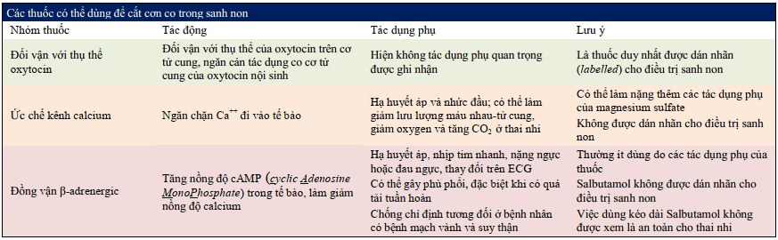

Trẻ sinh non được định nghĩa là trẻ được sinh ra trước khi tuổi thai được 37 tuần.

- Sơ sinh **đủ tháng** được định nghĩa là sơ sinh với tuổi thai lúc sinh là từ 37 đến 42 tuần.
- **Thai kỳ kéo dài quá ngày dự sinh (thai già tháng)** được định nghĩa khi thai kỳ kéo dài > 42 tuần vô kinh.
- **Trẻ sinh non** được định nghĩa là trẻ được sinh ra trước 37 tuần.

## Phân loại

Phân loại dọa đẻ non:

- Tuổi thai dưới 28 tuần: được gọi là sơ sinh cực non. Chiếm khoảng 5% các trường hợp.
- Tuổi thai từ 28 tuần đến 31 tuần 6 ngày: được gọi là sơ sinh rất non. Chiếm khoảng 15% các trường hợp.
- Tuổi thai từ 32 tuần đến 33 tuần 6 ngày. Chiếm khoảng 20% các trường hợp.
- Tuổi thai từ 34 tuần đến 36 tuần 6 ngày. Chiếm khoảng 60% các trường hợp.

## Bệnh học

Có 2 nhóm nguyên nhân lớn của sinh non:

- Cuộc sinh được chỉ định vì 1 lý do y khoa như **tiền sản giật, nhau tiền đạo, thai với giới hạn tăng trưởng trong tử cung nặng gây suy thai**. Nhóm này chiếm khoảng 20%.
- Sinh non **tự phát**, chiếm khoảng 80% các trường hợp còn lại, đa phần liên quan đến **chuyển dạ sinh non** hoặc **ối vỡ non** trên thai non tháng (Preterm Premature Rupture Of Membranes - PPROM). Chúng ta **không thể tìm được nguyên nhân hoặc yếu tố nguy cơ** của chuyển dạ sinh non.

Chuyển dạ sinh non là 1 hội chứng có liên quan đến nhiều cơ chế bệnh sinh khác nhau:

1. Hoạt hóa trục hạ đồi-tuyến yên-tuyến thượng thận ở mẹ hoặc thai nhi do stress, **liên quan corticoid**.
2. **Nhiễm trùng** (màng đệm, màng rụng hoặc toàn thân) và khuẩn hệ âm đạo bệnh lý. Loạn khuẩn âm đạo nên được **điều trị sớm trước tuần 20**, do có thể làm giảm tần suất sinh non, nhờ làm **giảm vỡ ối**.
3. **Giảm tưới máu màng rụng và xuất huyết** tại lớp màng rụng (bong nhau).
4. Căng dãn tử cung quá mức do **đa thai, đa ối, hay di tử cung dị dạng (tử cung đôi)**.

## Yếu tố nguy cơ

Các thai phụ có các đặc điểm sau được xem là có yếu tố nguy cơ cao sinh non:

- **Tiền căn** có sinh non, chuyển dạ sinh non, ối vỡ non.
- **Hở eo cổ tử cung** nguyên phát hoặc thứ phát sau can thiệp y khoa như sau khoét chóp cổ tử cung.
- **Nhiễm trùng** như nhiễm trùng tiểu, loạn khuẩn âm đạo, nhiễm trùng màng ối.
- **Căng dãn tử cung quá mức** như đa thai, đa ối.
- **Tử cung bị biến dạng** do u xơ-cơ trơn tử cung, tử cung có vách ngăn hay các dị tật cấu trúc khác của tử cung.
- **Bất thường bánh nhau**: nhau bong non, nhau tiền đạo.
- Mẹ hút **thuốc lá**.

## Dự báo dọa đẻ non

### Chiều dài cổ tử cung

Chiều dài kênh cổ tử cung được hiểu là khoảng cách đo được từ lổ cổ tử cung ngoài đến lổ cổ tử cung trong. Đo trên siêu âm. **Bình thường**, trong giai đoạn giữa của thai kỳ, cổ tử cung dài khoảng **30-40 mm**.

Vào **tuần lễ 24 của thai kỳ**, trên 1 thai phụ **không có triệu chứng**, nếu chiều dài **cổ tử cung ngắn < 25 mm** thì nguy cơ sinh non sẽ tăng lên. Ngược lại, nếu **có các cơn gò tử cung** nhưng **cổ tử cung vẫn còn dài hơn 30 mm** thì nguy cơ có sinh non trong vòng 7 ngày kế tiếp chỉ là 1%.

Năm 2015, FIGO **khuyến cáo** thực hiện việc **khảo sát chiều dài kênh cổ tử cung thường qui ở tuổi thai 19-23 tuần +6 ngày**.

### Hình dạng lỗ trong và ngoài

Các cổ tử cung có dạng U, dạng Y được biết đến như là những dạng có nguy cơ cao sinh non. Dạng I thường có tiên lượng tốt hơn.

### Fetal Fibronectin (fFN)

Khi thực hiện fFN, người ta thường chỉ sử dụng giá trị dự báo âm, mà không sử dụng giá trị dự báo dương.

### Placental alpha microglobulin-1

Việc khảo sát sự gia tăng bất thường của nồng độ PAMG-1 trong dịch tiết cổ tử cung sẽ giúp tầm soát các trường hợp có vỡ non các màng ối.

fFN, PAMG-1 có cùng giá trị dự báo âm, nhưng khả dĩ dương có chuyển dạ sinh non khi có PAMG-1 (+) cao khả dĩ dương có chuyển dạ sinh non khi có fFN (+) dương gấp 4 lần.

### Nguyên tắc đánh giá nguy cơ sinh non

**Tuổi thai** được đánh giá bằng các thông tin có được từ đầu thai kỳ.

Cổ tử cung được **khám bằng mỏ vịt, qua siêu âm hoặc bằng tay**. Lưu ý rằng, **khám bằng tay có thể vô tình làm tăng nguy cơ sinh non do vô tình tách các màng ối**.

Chiều dài và tình trạng kênh tử cung sẽ được **đánh giá qua siêu âm khảo sát kênh cổ tử cung**. Thay đổi tình trạng cổ tử cung giúp ta chẩn đoán và theo dõi đáp ứng điều trị.

**Siêu âm** giúp kiểm định lại tuổi thai, phát triển bào thai, lượng dịch ối, ngôi thai, và vị trí bánh nhau, cũng như khảo sát dị tật của thai nhi.

Theo dõi bằng **monitor sản khoa** để đánh giá tần số và cường độ cơn gò.

Theo dõi **tình trạng xuất huyết** của sản phụ, vì nhau bong non và nhau tiền đạo có liên quan đến chuyển dạ sinh non.

## Điều trị đẻ non

### Corticosteroids liệu pháp dự phòng

Corticoidsteroid liệu pháp nhằm mục đích dự phòng hội chứng suy hô hấp cấp ở sơ sinh.

Nếu thực hiện corticosteroid liệu pháp cho chuyển dạ sinh non xảy ra ở 1 **thai có khả năng nuôi sống được (ở Việt Nam, dù rằng 1 vài cơ sở định mốc sống là 24 tuần, nhưng mốc nuôi sống phổ biến vẫn là khoảng 28 tuần)** và có **tuổi thai dưới 34 tuần** vô kinh. Corticoid liệu pháp là **không cần thiết sau 34 tuần**.

Chỉ thực hiện duy nhất 1 đợt corticosteroid cho thai phụ đang **có nguy cơ trực tiếp của sinh non trong vòng 7 ngày, hiện đang ở giữa tuần thai 24 và 34.**

Corticosteroid liệu pháp **có khả năng gây tác hại cho hệ thần kinh thai nhi khi bị lạm dụng.**

Corticosteroid được dùng với 1 trong 2 lựa chọn sau: **Betamethasone (12 mg) tiêm bắp, 2 liều, cách 24 giờ** hoặc **Dexamethasone (6 mg) tiêm bắp, 4 liều, cách 12 giờ.**

### Thuốc khống chế tạm thời cơn co tử cung

Có 3 nhóm dược chất lớn có thể được dùng cho mục đích khống chế tạm thời các cơn co tử cung:

1. Thuốc đối vận với thụ thể oxytocin
2. Các chất đồng vận beta-adrenergic
3. Các chất ức chế kênh calcium

### Bảo vệ thần kinh thai bằng Magnesium Sulfate

Magnesium sulfate có vai trò bảo vệ thần kinh cho thai rất non, dưới 32 tuần. $MgSO_4$ vẫn được dùng với các liều dùng phổ biến cho điều trị tiền sản giật có dấu hiệu nặng hay liều giảm co tử cung.

## Dự phòng (Điều trị) dọa đẻ non

3 biện pháp dự phòng được đề cập nhiều nhất là:

1. Progesterone
2. Khâu vòng cổ tử cung
3. Pessary

### Progesterone

Có thể dùng progesterone để dự phòng sinh non cho thai phụ có **tiền căn sinh non** và hiện có **kênh tử cung ngắn dưới 25 mm**.

### Khâu vòng cổ tử cung

Có thể khâu vòng cổ tử cung để dự phòng sinh non cho thai phụ có **hở eo tử cung** và hiện có **kênh tử cung ngắn < 25mm.**

Những trường hợp có cổ tử cung ngắn nhưng **không có tiền căn sinh non** thì **không thấy lợi ích nào** khi tiến hành thủ thuật này. Ở những trường hợp **song thai**, khi khâu cổ tử cung sẽ làm **tăng nguy cơ chuyển dạ sinh non**.

### Vòng nâng cổ tử cung (cerclage pessary)

Giảm số trường hợp sinh non dưới 34 tuần và cả dưới 37 tuần.

Tiết dịch âm đạo bất thường là than phiền hay gặp nhất ở những thai phụ sử dụng dụng cụ nâng đỡ cổ tử cung.

## Nguồn tham khảo

- TEAM-BASED LEARNING - Trường Đại học Y Dược Thành phố Hồ Chí Minh 2020.
