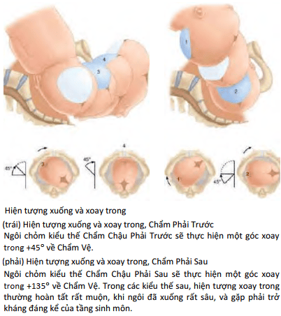

Ngôi chỏm là một ngôi mà trong phần lớn các trường hợp sẽ sinh được qua đường âm đạo.

## Cơ chế đẻ thường ngôi chỏm

Trong cuộc sinh ngôi chỏm, mỗi phần lớn nhất của thai nhi (đầu, vai, mông) đều phải lần lượt qua các eo của
khung chậu: eo trên, eo giữa, eo dưới, được chia ra những thì tuần tự như sau:

1. Qua eo trên gọi là thì lọt.
2. Đi từ eo trên xuống eo dưới gọi là thì xuống và xoay.
3. Qua eo dưới gọi là thì sổ.

Trong thực tế, các hiện tượng trên xảy ra kế tiếp nhau, hiện tượng này chưa hoàn tất thì hiện tượng sau đã bắt đầu, nên cũng có thể chia cơ chế sinh thành 2 thì:

1. Thì lọt và xuống, xảy ra ở các vị trí cao.
2. Thì xoay và sổ, xảy ra ở các vị trí thấp.

**Bình chỉnh ngôi thai** trong những tuần cuối cùng của thai kỳ, khi phần thân thai đã trở nên lớn hơn rất nhiều so với phần đầu thai, thì thân thai sẽ có xu hướng di chuyển lên phía đáy tử cung, là nơi rộng rãi hơn, còn đầu thai, do có kích thước nhỏ, sẽ hướng về phía dưới, là nơi có thể tích hẹp hơn.

### Lọt

**Ngôi gọi là lọt** khi đường kính lọt của ngôi đã đi qua được măt phẳng của eo trên 12.75 cm. **Đường kính lọt lý thuyết của ngôi chỏm là đường kính hạ chẩm-thóp trước (9.5 cm).** **Trên lâm sàng, người ta dùng đường kính lưỡng đỉnh (9.5cm) thay vì dùng đường kính hạ chẩm-thóp trước.** **Chẩn đoán hiện tượng lọt qua** khám bụng và khám âm đạo.

- Khám bụng: Phần đầu thai nhi còn trên xương vệ tương ứng độ rộng bao nhiêu ngón tay khép lại sẽ tương ứng với độ lọt bao nhiêu phần năm. Nếu toàn bộ đầu thai nhi nằm trên xương vệ, tương ứng với chiều rộng của năm ngón tay khi khép lại, ta nói đầu ở vị trí 5/5. Nếu toàn bộ thai nhi đã xuống dưới xương vệ, ta nói đầu ở vị trí 0/5. **Ngôi thai lọt sẽ có vị trí khoảng 2/5.**
- Khám âm đạo: Khi ngôi thai chưa lọt, phần thấp nhất của xương đầu vẫn còn ở trên vị trí của gai hông, được đánh giá -1, -2, -3. Khi ngôi thai đã lọt, phần thấp nhất của xương đầu (phần xương cứng) đã vượt khỏi vị trí của gai hông, được đánh giá +1, +2, +3.

### Xuống

**Hiện tượng xuống** là sự di chuyển của ngôi trong tiểu khung sau khi ngôi đã lọt.

### Xoay

**Hệ quả của xoay trong** là ngôi hướng được đường kính sổ của mình trùng với đường kính trước sau của eo dưới.

### Sổ

**Hiện tượng sổ** thai qua eo dưới có điểm tựa bờ dưới khớp vệ. Ngôi sẽ thực hiện động tác sổ trên điểm tựa này.

## Kỹ thuật đỡ đẻ ngôi chỏm

Các giai đoạn sau đây (a đến d) diễn ra theo cơ chế sinh tự nhiên. Không được can thiệp vào các giai đoạn này.

Giai đoạn cần hỗ trợ để cuộc sinh an toàn (e đến h). Chỉ được phép can thiệp khi có đủ tất cả các điều kiện sau:

1. Ngôi đã hoàn thành xoay về chẩm vệ.
2. Ngôi đã sẵn sàng để sổ, ở vị trí +3 làm căng phồng tầng sinh môn, âm hộ nhìn về phía trần nhà.
3. Hai âm môi bé tách rộng ra.

Người đỡ sinh dùng ba ngón tay giữa của tay phải đè vào vùng thượng chẩm để cho đầu cúi thêm, cho tới khi hạ chẩm ra đến bờ dưới khớp vệ. Song song với giúp đầu cúi bằng tay phải, người đỡ sinh tay trái đè vào vùng tầng sinh môn tránh rách thêm tầng sinh môn.

Khi hạ chẩm ra đến bờ dưới khớp vệ, bắt đầu dùng tay phải kiểm soát tốc độ ngửa của đầu khi thực hiện sổ trán. Tay còn lại giữ tầng sinh môn. Nếu tầng sinh môn quá căng thì có thể thực hiện cắt tầng sinh môn lúc này.

Khi đầu đã sổ, nếu thấy dây rốn quấn cổ lỏng, tháo dây rốn qua đầu thai ngay. Nếu dây rốn quấn cổ chặt quấn chặt thì kẹp cắt dây rốn ngay tại vùng cổ thai.

Sau khi đầu sổ hoàn toàn, để đầu tự xoay ngoài về vị trí nguyên thủy của nó (xoay ngoài thì 1st), chờ thêm để cho cơn co tự nhiên đưa vai lọt vào tiểu khung. Khi vai đã lọt, đường kính lưỡng mỏm vai đi vào đường kính chéo của eo trên và xoay. Vai xoay trong sẽ làm cho đầu xoay ngoài thêm một thì nữa, gọi là xoay ngoài thì 2nd. Cuối thì này, vai đã vào đến đường kính trước sau eo dưới, đầu có vị trí chẩm ngang. Người đỡ sinh có thể giúp thai hoàn thành thì xoay ngoài thứ nhì, rồi bắt đầu đỡ vai.

- Đỡ vai trước: người đỡ sinh dùng hai tay ôm hai bên đầu thai nhi, vùng đỉnh, kéo đầu thai về phía chân mình và hơi xuống phía dưới để mỏm vai trước ra hẳn cho đến khi bờ dưới cơ delta tì dưới khớp vệ. **Nhớ chú ý giữ đúng phương kéo để tránh gãy xương đòn.**
- Đỡ vai sau: sau khi vai trước đã sổ hoàn toàn, người đỡ kéo ngược thai lên trên, vai trước sát vùng tiền đình, thân thai nhi sẽ cong lại và vai sau sẽ sổ nhẹ nhàng, không làm rách âm tầng sinh môn. **Nhớ chú ý giữ tầng sinh môn khi sổ vai sau.**

Phần còn lại của thai và mông sẽ dễ dàng. Bàn tay trái đỡ cổ thai nhi, bàn tay phải vuốt dọc lưng thai
nhi tới chân, nắm hai chân bằng cách cầm hai bàn chân bằng ba ngón cái, trỏ và giữa bàn tay phải. Sau sổ thai, cần giữ đầu thai nhi thấp hơn bàn sinh.

**Thủ thuật cắt tầng sinh môn là cần thiết nhưng không phải là một can thiệp thường qui.** Trong khi đỡ sinh, sau khi đã giúp cho đầu cúi tối đa, hạ chẩm đã ra đến bờ dưới khớp vệ, có thể bắt đầu cho đầu thai ngửa dần làm thoát âm các phần của đầu thai với đường kính ngày càng lớn đi qua tầng sinh môn. **Nên cắt tầng sinh môn khi quá căng để mở rộng chủ động ở lối ra của đường sinh, nhằm tránh các tổn thương không kiểm soát được.**
Việc cắt tầng sinh môn không phải luôn luôn cần thiết. Một số tình huống mà trong đó việc cắt tầng sinh môn sẽ có lợi như sinh con to, sinh thủ thuật. Con so không phải là một tình huống mà trong đó việc cắt tầng môn được thực hiện thường qui.
Cần lưu ý rằng cắt tầng sinh môn không giúp rút ngắn giai đoạn rặn sổ thai, không làm cho sản phụ sinh nhanh hơn.

## Nguồn tham khảo

- TEAM-BASED LEARNING - Trường Đại học Y Dược Thành phố Hồ Chí Minh 2020.
