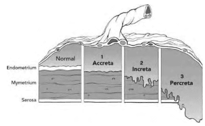

Rau tiền đạo (Placenta Previa) là 1 vấn đề lớn mà các nhà sản khoa phải đối mặt, do những thai phụ với rau tiền đạo có thể phải được nằm bệnh viện theo dõi dài hạn, tăng nguy cơ truyền máu, sinh non, tỉ lệ cắt tử cung vì băng huyết tăng cao (đến 5.3%), dẫn đến tử suất của mẹ cao.

## Rau cài răng lược

**Rau cài răng lược** là trường hợp bánh rau bám sâu 1 cách bất thường vào thành cơ của tử cung. Rau cài răng lược làm tăng nguy cơ chảy máu, và là mối đe dọa đến sinh mạng của thai phụ.

Rau cài răng lược được phân ra:

- Kiểu accreta, nếu mô rau bám tới lớp nông của cơ tử cung.
- Kiểu increta, mô rau bám sâu vào trong cơ tử cung.
- Kiểu percreta, mô rau bám xuyên qua cơ tử cung tới thanh mạc hoặc thỉnh thoảng lan tới bàng quang nằm kế cận.

Tỉ lệ rau cài răng lược vào khoảng 1:2500 thai kỳ, nhưng tăng mạnh nếu thai phụ có tiền căn mổ lấy thai trước đó.
