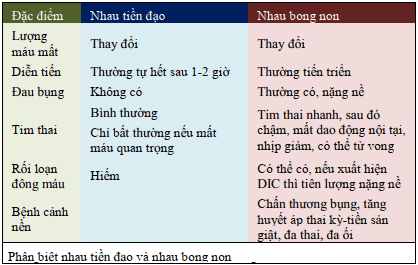
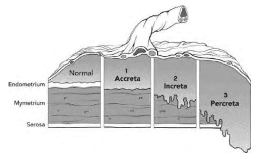

Nhau tiền đạo (Placenta Previa) là một vấn đề lớn mà các nhà sản khoa phải đối mặt, do những thai phụ với nhau tiền đạo có thể phải được nằm bệnh viện theo dõi dài hạn, tăng nguy cơ truyền máu, sinh non, tỉ lệ cắt tử cung vì băng huyết tăng cao (đến 5.3%), dẫn đến tử suất của mẹ cao.

## Định nghĩa

Nhau tiền đạo được định nghĩa là khi nhau bám ở đoạn dưới tử cung mà không bám ở vị trí bình thường của nó.

## Phân loại

1. Nhau tiền đạo toàn phần (trung tâm) (complete) khi bánh nhau bám lan tới và che hết cổ trong cổ tử cung
2. Nhau tiền đạo một phần (bán phần) (partial) khi bánh nhau chỉ bám qua một phần lổ trong cổ tử cung
3. Nhau bám mép (marginal) khi mép dưới của bánh nhau bám sát tới bờ lổ cổ tử cung
4. Nhau bám thấp (low lying) là khi bánh nhau bám ở đoạn dưới của tử cung nhưng mép dưới của nó chưa lan tới lổ trong cổ tử cung.

Siêu âm đầu dò âm đạo phân loại nhau tiền đạo dùng đơn vị là milimet (mm) để miêu tả khoảng cách giữa mép bánh nhau và lổ cổ trong cổ tử cung.

- Trong trường hợp mép bánh nhau nằm ngay ở lổ trong cổ tử cung thì khoảng cách này được mô tả là 0 mm.
- Nếu mép bánh nhau bám chưa lan tới lổ trong cổ tử cung thì sẽ mô tả khoảng cách từ lổ trong cổ tử cung đến mép bánh nhau.
- Khi mép bánh nhau bám lan qua lổ trong cổ tử cung thì mô tả khoảng mà mép bánh nhau đã bám lan qua lổ cổ tử cung.

## Yếu tố nguy cơ

- Nhau tiền đạo ở thai kỳ trước.
- Sinh nhiều lần.
- Mẹ lớn tuổi.
- Tiền căn mổ sinh hoặc đã chịu các phẫu thuật khác trên tử cung như bóc nhân xơ tử cung.
- Các yếu tố khác như sử dụng cocaine, hút thuốc lá.

## Chẩn đoán

Vị trí bám của bánh nhau sẽ thay đổi cùng với tiến trình lớn lên của thai nhi. **Chỉ được phép xác lập chẩn đoán nhau tiền đạo kể từ sau khi tuổi thai đạt 28 tuần lễ tròn vô kinh.**

Theo nghiên cứu, khảo sát mép bánh nhau bám lan qua lổ trong cổ tử cung **23 mm ở tuổi thai 11-14 tuần** thấy chỉ có khoảng 8% số này là có nhau tiền đạo lúc sinh. Nếu mép bánh nhau bám lan qua lổ trong cổ tử cung với khoảng cách **nhỏ hơn 10 mm ở tuổi thai 9-16 tuần** thì rất ít khả năng xuất hiện nhau tiền đạo sau đó. Nhau tiền đạo **gần như bằng 0 nếu khảo sát trước đó cho thấy mép bánh nhau chưa lan qua lổ trong cổ tử cung**. Nếu mép bánh nhau vượt qua lổ trong cổ tử cung với **khoảng cách lớn hơn 25 mm** thì khả năng có nhau tiền đạo lúc sinh là rất lớn, đạt đến 40-100%.

Siêu âm đầu dò âm đạo là công cụ giúp chẩn đóan rau tiền đạo.

Cộng hưởng từ (MRI) có thể có ích trong khảo sát nhau cài răng lược.

## Bệnh sinh

**Xuất huyết âm đạo trong 3 tháng cuối thai kỳ không kèm theo đau bụng** là một dấu hiệu điển hình của nhau tiền đạo.

**Máu chảy ra** ngoài trong nhau tiền đạo là **máu mẹ**.

**Khả năng tự cầm máu sau sinh của cuộc sinh với nhau tiền đạo rất kém.** Cơ chế cầm máu bình thường sau sổ nhau trong các trường hợp nhau bám ở thân tử cung là do các thớ **cơ đan chéo** siết chặt các mạch máu bị hở ra sau sinh ở các hồ máu. Trong nhau tiền đạo, do các hồ máu có vị trí là ở đoạn dưới tử cung, **không có các lớp cơ đan chéo**, nên các mạch máu này không được siết lại sau khi sinh.

**Phân biệt ra máu 3 tháng cuối thai kỳ giữa rau tiền đạo, rau bong non và vỡ tử cung.** Vỡ tử cung có những dấu hiệu riêng. Có thể chẩn đoán phân biệt rau tiền đạo và rau bong non qua bảng sau:

## Rau cài răng lược

**Nhau cài răng lược** là trường hợp bánh nhau bám sâu một cách bất thường vào thành cơ của tử cung. Nhau cài răng lược làm tăng nguy cơ chảy máu, và là mối đe dọa đến sinh mạng của thai phụ.

Nhau cài răng lược được phân ra:

- Kiểu accreta, nếu mô nhau bám tới lớp nông của cơ tử cung.
- Kiểu increta, mô nhau bám sâu vào trong cơ tử cung.
- Kiểu percreta, mô nhau bám xuyên qua cơ tử cung tới thanh mạc hoặc thỉnh thoảng lan tới bàng quang nằm kế cận.

Tỉ lệ nhau cài răng lược vào khoảng 1:2500 thai kỳ, nhưng tăng mạnh nếu thai phụ có tiền căn mổ lấy thai trước đó.

## Diễn biến

- Phải sinh mổ: Nếu khảo sát ở tuổi thai trên 35 tuần cho thấy mép bánh nhau bám chưa đến lổ cổ tử cung và khoảng cách này trên 20 mm.
- Chảy máu: Đợt chảy máu âm đạo đầu tiên thường tự ổn định trong vòng 1-2 giờ, nếu như nó không quá nghiêm trọng để có chỉ dịnh chấm dứt thai kỳ. Nếu chảy máu là trầm trọng hoặc thai nhi đã trưởng thành thì chấm dứt thai kỳ là lựa chọn. **Số đợt xuất hiện chảy máu không có mối liên quan đến độ nặng của nhau tiền đạo cũng như kết cục của thai nhi.**
- Quyết định chấm dứt thai kỳ phải dựa vào tuổi thai và tình trạng lâm sàng của thai phụ. Trong điều kiện bệnh nhân ổn định, **mổ lấy thai thường được chỉ định ở tuổi thai 37-38 tuần**. Đôi khi phải chấm dứt thai kỳ **sớm hơn nếu chảy máu nhiều hoặc thai phụ đi vào chuyển dạ sinh non.**
- Về phương pháp vô cảm lúc mổ lấy thai: Trong phần lớn trường hợp, gây tê vùng là lựa chọn khi mổ lấy thai nhau tiền đạo. Tuy nhiên, trong trường hợp dự đoán cuộc mổ kéo dài hay khó khăn như trong trường hợp của nhau cài răng lược thì **gây mê nội khí quản** sẽ được chọn lựa.

## Nguồn tham khảo

- TEAM-BASED LEARNING - Trường Đại học Y Dược Thành phố Hồ Chí Minh 2020.
