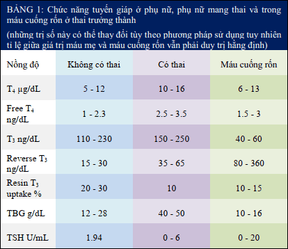

Trong thai kỳ, chức năng tuyến giáp của mẹ bị thay đổi. Điều này có ảnh hưởng tới cả mẹ và con.

## Sinh lý tuyến giáp mẹ và thai

Sự tăng lọc cầu thận trong thai kỳ làm thận tăng thải iod, do đó làm giảm nồng độ iod vô cơ trong huyết thanh.

**Free $T_4$ (free thyroxine - $FT_4$) là phương pháp đánh giá chức năng tuyến giáp chính xác duy nhất** khi có sự thay đổi của TBG (Thyroxin Binding Globulin) vì nồng độ của $T_3$ (total triiodothyronin) và $T_4$ tăng trong suốt thai kỳ.

Về chức năng tuyến giáp của thai, **trước 10 tuần không có iod hữu cơ trong tuyến giáp thai nhi.** **Từ tuần 11 đến tuần 12, tuyến giáp thai nhi có thể sản xuất được iodothyronine và $T_4$.** Nồng độ TSH của thai nhi, $T_4$ và $FT_4$ đã chứng tỏ sự trưởng thành và khả năng hoạt động độc lập của trục tuyến giáp-tuyến yên.

**Iod tự do có thể đi qua bánh rau nhưng TSH thì không.** Đặc điểm này cho phép 1 lượng $T_4$ giới hạn có thể qua bánh rau và đóng vai trò quan trọng trong việc **phát triển hệ thần kinh thai trong 3 tháng đầu thai kỳ** trước khi chức năng tuyến giáp của thai bắt đầu hoạt động. Những đồng vận của hormone tuyến giáp như **propylthiouracil (PTU) và methimazole** với trọng lượng phân tử thấp hơn có thể qua hàng rào rau và có thể **gây ra nhược giáp ở thai.** **TRH (Thyroid Releasing Hormone) có thể qua hàng rào rau, nhưng không có ý nghĩa** vì nồng độ chất này lưu thông qua rau rất thấp.

## Cường giáp

### Cường giáp trong thai kỳ

**Cường giáp thường đi kèm với tăng nguy cơ sanh non, IUGR, tiền sản giật, thai lưu và tăng bệnh suất và tử suất sơ sinh.**

**Bệnh Graves** là 1 bệnh lý tự miễn do có kháng thể kích thích tuyến giáp và là nguyên nhân thường gặp nhất của cường giáp. 1 số nguyên nhân khác trong thai kỳ như thai trứng và nhân giáp độc. Bệnh nhân bị Graves có khuynh hướng giảm trong thai kỳ và trầm trọng hơn trong thời kỳ hậu sản.

### Chẩn đoán cường giáp

**Các triệu chứng lâm sàng giúp định hướng chẩn đoán cường giáp:**

- Mạch lúc nghỉ > 100 lần/phút và giảm đi thành mạch chậm sau thủ thuật Valsava.
- Thay đổi ở mắt.
- Giảm cân, không tăng cân dù tăng lượng thức ăn.
- Không chịu được nóng.
- Tăng $FT_4$ và giảm TSH là các khảo sát cận lâm sàng cho phép thiết lập chẩn đoán.

### Điều trị cường giáp

Điều trị cường giáp trong thai kỳ là **điều trị bằng kháng giáp,** liều tối thiểu nhằm duy trì $FT_4$ ở giới hạn cao của mức bình thường. **Iod phóng xạ bị chống chỉ định trong thai kỳ.** **Thioamides** là thuốc kháng giáp chính dùng trong điều trị, nó ngăn chặn sự tổng hợp nhưng không làm giảm hormone tuyến giáp. **Propylthiouracil (PTU) và methimazole (Tapazole)** có thể được sử dụng hoán đổi cho rau.

**Lưu ý về thuốc kháng giáp trạng:**

1. Do những thuốc này qua được rau dễ dàng, nên khi điều trị với những thuốc này có thể gây ra bướu giáp và nhược giáp ở thai. Mặc dù không có bằng chứng chắc chắn rằng PTU gây ra chứng đần độn hay bất thường về phát triển tâm thần vận động ở thai nhi, nhưng khoảng 1-5% trẻ em có tiếp xúc với PTU trong tử cung có bướu giáp. Vì lý do này mà thuốc điều trị kháng giáp được sử dụng ở liều tối thiểu nhằm duy trì $FT_4$ ở giới hạn cao của mức bình thường. Nồng độ $FT_4$ được kiểm tra mỗi 2-4 tuần và thuốc kháng giáp thường được ngưng sau 30 tuần vô kinh.
2. PTU có thể làm tăng tác dụng ngăn chuyển $T_4$ thành $T_3$ và methimazole có thể gây dị tật dạ dày ruột ở thai nhi.
3. PTU bài tiết qua sữa rất ít và không có bất kỳ sự thay đổi chức năng tuyến giáp nào ở trẻ sơ sinh được ghi nhận.
4. Điều trị ngoại khoa vì cường giáp trong tam cá nguyệt thứ 2 chỉ được sử dụng nếu điều trị nội khoa thất bại.

### Cơn bão giáp trạng

Nguy cơ chính của phụ nữ mang thai bị cường giáp là cơn bão giáp.

**Yếu tố khởi phát cơn bão giáp** bao gồm nhiễm trùng, chuyển dạ, mổ lấy thai, không tuân thủ điều trị nội khoa.

**Các dấu hiệu và triệu chứng của cơn bão giáp** bao gồm tăng thân nhiệt, tăng nhịp tim, vã mồ hôi, dấu mất nước nặng. Thường ít khi nhầm lẫn các dấu hiệu và triệu chứng của cường giáp nặng và tiền sản giật. Cường giáp nặng thường không có tiểu đạm.

**Xử trí bão giáp** gồm:

- Chặn tiết hormone tuyến giáp bằng sodium iodide 1g tiêm mạch, ngăn chặn sự tổng hợp hormone tuyến giáp.
- Chặn sự chuyển $T_4$ thành $T_3$ bằng 1200-1800 mg PTU chia làm nhiều liều.
- Ngăn chặn về sau sự nitơ hóa $T_4$ thành $T_3$ bằng dexamethasone 8 mg/ngày.
- Điều trị triệu chứng cường giao cảm bằng block β-Adrenergic như propranolol 20–80 mg/6 giờ, cung cấp đủ dịch và hạ thân nhiệt.

Do kháng thể kích thích tuyến giáp có thể truyền qua rau, thoáng qua và duy trì ít nhất 2-3 tháng ở thai nên **khoảng 1% phụ nữ bị Graves có con bị ngộ độc giáp, làm tăng tỉ lệ tử vong sơ sinh lên 16%.** **Nghi ngờ nhiễm độc giáp ở thai khi tim thai cơ bản hằng định trên 160 lần/phút. Bướu giáp thai có thể xác định được trên siêu âm.**

## Suy giáp

### Suy giáp trong thai kỳ

**Nguyên nhân thường gặp nhất của nhược giáp ở phụ nữ** trong độ tuổi sinh đẻ là viêm giáp Hashimoto, phẫu thuật cắt bỏ tuyến giáp và xạ trị do ung thư tuyến giáp, ngoài ra còn có 1 số bệnh lý khác như đái tháo đường type 1,...

Phụ nữ mang thai bị nhược giáp nếu được điều trị thay thế thích hợp có thể có 1 kết cục thai kỳ bình thường. Tuy nhiên, nếu **tình trạng nhược giáp của thai phụ không được điều trị sẽ làm tăng nguy cơ sẩy thai, tiền sản giật, thai lưu, cân nặng lúc sanh thấp, giảm chỉ số thông minh của trẻ.**

### Chẩn đoán và điều trị suy giáp

**Tiêu chuẩn quan trọng nhất để chẩn đoán nhược giáp là tăng TSH, ngoài ra có thể thấy $FT_3$ và $FT_4$ giảm.** Chẩn đoán được nhược giáp thì **phải điều trị ngay với levothyroxin và kiểm tra nồng độ TSH mỗi tháng để chỉnh liều levothyroxin phù hợp.**

### Kết cục sản khoa của suy giáp

**Thiếu hormone tuyến giáp trong thai kỳ và giai đoạn sơ sinh sớm sẽ gây ra chậm phát triển tâm thần.**
Tỉ lệ mới mắc của nhược giáp bẩm sinh là khoảng 1:4000. Nguyên nhân là do loạn sản tuyến giáp, rối loạn chức năng tuyến giáp, suy giáp do thuốc. Nguyên nhân thường gặp nhất của bướu giáp sơ sinh là do mẹ dùng iod có trong si rô ho. Dạng bướu giáp này thường to và gây tắc nghẽn; khác với dạng bướu giáp do mẹ dùng
PTU.

## Nguồn tham khảo

- TEAM-BASED LEARNING - Trường Đại học Y Dược Thành phố Hồ Chí Minh 2020.
