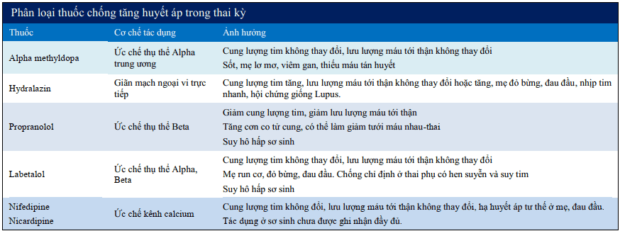
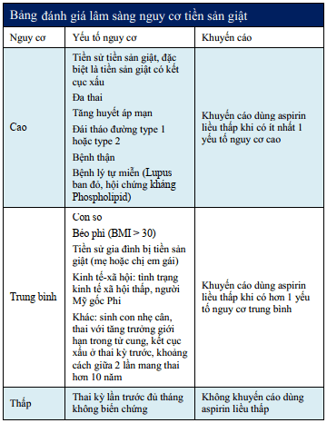

## Cơ chế bệnh sinh

Giả thiết do nhiều nguyên nhân phối hợp dẫn tới tổn thương não, gan, thận và hệ thống mạch máu (tim, mắt):

1. Làm tổ bánh nhau với sự xâm nhập bất thường của các nguyên bào nuôi vào động mạch xoắn.
2. Sự không tương hợp giữa mẹ, bố (bánh nhau) và mô thai, Cơ thể mẹ thích nghi kém với những thay đổi về tim mạch và đáp ứng viêm trong thai kỳ.
3. Các yếu tố về di truyền.
4. Giả thuyết được chấp nhận nhiều nhất hiện nay là làm tổ bánh nhau với sự xâm nhập bất thường của các nguyên bào nuôi vào động mạch xoắn.

**Bánh nhau đóng vai trò then chốt trong sự phát triển và thoái lui của tiền sản giật.** Bánh nhau, không phải thai, là điều kiện cần trong sự phát triển tiền sản giật.

Mất cân bằng giữa yếu tố tân tạo và kháng tạo mạch giữ vai trò then chốt trong cơ chế bệnh sinh của tiền sản giật. Do đó khảo sát sFlt-1 và PlGF có thể giúp tiên đoán tiền sản giật. Khoảng 5 tuần trước khi tiền sản giật xuất hiện trên lâm sàng, tỷ số sFlt-1/PlGF tăng cao ở nhóm sau này bị tiền sản giật.

Nguồn gốc xuất hiện tiền sản giật bắt đầu từ bánh nhau nhưng cơ quan đích là các tế bào nội mô của mẹ dẫn đến:

- Huyết áp: Co mạch làm tăng huyết áp.
- Mạch máu: Tổn thương nội mô gây thoát quản các thành phần huyết tương và huyết cầu:
  - Cô đặc máu, tăng Hematocrit do mất đạm, giảm áp lực keo, nặng có thể gây sốc tim.
  - Tiêu thụ tiểu cầu ngoài lòng mạch.
- Gan: nhồi máu, hoại tử và xuất huyết trong nhu mô, gây rối loạn chức năng tế bào gan và làm tiến triển thêm các rối loạn đông máu.
- Thận: Tổn thương tế bào nội mô của thận làm tổn hại nghiêm trong chức năng lọc vi cầu thận. Độ lọc cầu thận giảm tới 40% so với bình thường, hệ quả là gây tăng creatinin máu, tăng acid uric máu và xuất hiện đạm niệu.
- Não: Tổn thương nội mô ở não gây các triệu chứng thần kinh, phù não và xuất huyết trong nhu mô não.

## Một số yếu tố nguy cơ

- Con so.
- Béo phì.
- Đa thai.
- Mẹ lớn tuổi.
- Tiền căn từng bị tiền sản giật trong lần mang thai trước.
- Tăng huyết áp mạn, đái tháo đường, bệnh thận, Lupus.
- Tiền sử gia đình có mẹ hoặc chị em gái bị tiền sản giật.

## Phân loại tăng huyết áp thai kỳ

Tăng huyết áp trong thai kỳ phân thành 4 loại:

1. Hội chứng tiền sản giật-sản giật = Tăng huyết áp + Đạm niệu + Từ tuần thứ 20 của thai kỳ.
2. Tăng huyết áp thai kỳ = Tăng huyết áp + Không đạm niệu + Từ tuần thứ 20 của thai kỳ.
3. Tăng huyết áp mạn (do bất cứ nguyên nhân nào) = Tăng huyết áp + Trước tuần thứ 20 của thai kỳ.
4. Tiền sản giật ghép trên tăng huyết áp mạn = Tăng huyết áp mạn không đạm niệu + Từ tuần thứ 20 của thai kỳ có đạm niệu = Tăng huyết áp mạn có đạm niệu + Từ tuần thứ 20 có dấu hiệu tăng nặng.

## Tiêu chuẩn chẩn đoán tiền sản giật

### Phân loại tiền sản giật

Tiền sản giật được phân loại thành tiền sản giật không có dấu hiệu nặng và tiền sản giật có dấu hiệu nặng.

Dấu hiệu nặng của tiền sản giật:

1. Huyết áp tâm thu &ge; 160 mmHg hoặc huyết áp tâm trương &ge; 110 mmHg qua 2 lần đo cách nhau ít nhất 4 giờ khi bệnh nhân đã nghỉ ngơi (trừ trường hợp thuốc hạ áp đã được sử dụng trước đó)
2. Giảm tiểu cầu: tiểu cầu <100,000/µL.
3. Suy giảm chức năng gan: men gan tăng (gấp đôi so với bình thường), đau nhiều ở hạ sườn phải hoặc đau thượng vị không đáp ứng với thuốc và không có nguyên nhân khác.
4. Suy thận tiến triển (creatinin huyết thanh > 1.1 mg/dL hoặc gấp đôi nồng độ creatinin huyết thanh bình thường mà không do bệnh lý thận khác)
5. Phù phổi.
6. Các triệu chứng của não và thị giác.

### Tiên lượng tiền sản giật

Mốc 34 tuần để tiên lượng tiền sản giật. Tiền sản giật trước tuần 34 có tiên lượng xấu tăng tỷ lệ chết sơ sinh, chu sinh, phù phổi, sản giật, v.v.

### Sản giật

Chẩn đoán sản giật đòi hỏi phải có sự hiện diện của 3 yếu tố (1) những cơn co giật và (2) hôn mê (3) xảy ra trên một bệnh nhân có hội chứng tiền sản giật.

## Hội chứng HELLP

### Định nghĩa

Hội chứng HELLP là một biến chứng nặng của tiền sản giật và sản giật, thể hiện mọi đặc điểm của tổn thương nội mô đa cơ quan, đặc trưng bởi:

1. Tán huyết (Hemolysis)
2. Tăng men gan (Elevated Liver Enzyme)
3. Giảm tiểu cầu (Low Platelet Count)

### Tiêu chuẩn chẩn đoán

- Lâm sàng:
  - Xuất huyết dưới da, niêm mạc.
  - Đau hạ sườn phải.
- Cận lâm sàng:
  - LDH > 600 IU/L.
  - Bilirubin toàn phần > 12 mg/dL.
  - AST > 70 IU/L.
  - Giảm Haptoglobin.

### Chấm dứt thai kỳ

- Phụ thuộc tình trạng của sản phụ (cá thể hóa điều trị).
- Ổn định cho mẹ trước khi chấm dứt thai kỳ:
  - Theo dõi huyết áp, mạch, nước tiểu, nhịp thở.
  - Hạn chế nước vào < 100 mL/h.
  - Dự trù 2 đơn vị hồng cầu và tiểu cầu. Truyền tiểu cầu khi dưới 50 T/L (chỉnh từ 6-10 đơn vị).
  - Theo dõi tim thai, monitoring.
  - Theo dõi ngộ độc MgSO4 (phản xạ gân xương bánh chè).

## Biến chứng tăng huyết áp thai kỳ

### Về phía mẹ

- Sản giật.
- Hoại tử tế bào gan.
- Hội chứng HELLP.
- Suy thận.
- Phù não, xuất huyết não.
- Phù phổi cấp.
- Rau bong nong.
- Băng huyết sau sinh.

### Về phía con

- Tử vong chu sinh.
- Đẻ non.
- Thai chậm tăng trưởng trong buồng tử cung.

## Thuốc chống tăng huyết áp

### Mục tiêu

**Giữ cho huyết áp ổn định ở mức 140-150/90-100 mmHg chứ không phải đưa huyết áp trở về bình thường** vì việc đó sẽ dẫn tới giảm tưới máu tử cung-nhau, ảnh hưởng đến thai.

Trong tiền sản giật, huyết áp thường được chỉ định khi có tình trạng tăng huyết áp nặng:

- Huyết áp tâm thu &ge; 160 mmHg
- hoặc Huyết áp tâm trường &ge; 110 mmHg

Nếu tăng huyết áp nặng dùng đường tiêm tĩnh mạch sau chuyển sang dạng uống.

### Tổng quan

### Lợi tiểu và ức chế men chuyển

**Thuốc lợi tiểu và thuốc ức chế men chuyển không được dùng để kiểm soát huyết áp trong điều trị tiền sản giật:**

- Thuốc lợi tiểu làm giảm Na+ và thể tích dịch lưu hành, dẫn đến suy giảm tuần hoàn tử cung-nhau. Nó chỉ được dùng khi có chỉ đặc biệt như suy
  thận-vô niệu trong sản giật hay hội chứng HELLP.
- Không dùng thuốc ức chế men chuyển do nguy cơ gây dị tật thai nhi.

#### Lợi tiểu quai Henlé: Furosemide

Thuốc lợi tiểu được dùng trong trường hợp tiền sản giật rất nặng với thiểu niệu / vô niệu / suy thận, để cứu mẹ.

Sử dụng thuốc lợi tiểu được đặt ra trong trường hợp thiểu niệu hoặc vô niệu (nước tiểu 24 giờ < 800 mL, đặc biệt trong trường hợp nước tiểu 24 giờ < 400 mL), đe dọa phù phổi cấp, phù não, v.v.

Trong các trường hợp tiền sản giật rất nặng này, thai phụ thường có biểu hiện suy thận kèm ure và creatinin tăng và độ thanh thải của thận giảm. Khi đó, tính mạng của mẹ là ưu tiên và phải dùng thuốc để cứu thai phụ.

### Thuốc hủy giao cảm: alpha methyldopa

Alpha methyldopa là thuốc được xem là an toàn nhất trong suốt thai kỳ.

Cơ chế tác dụng của alpha methyldopa chưa được hiểu thấu đáo. Do thuốc ức chế dẫn truyền dopaminergic, nên gây ra tê liệt dẫn truyền thần kinh ngoại vi điều hòa giao cảm. Thuốc còn có tác dụng trung ương.

Liều lượng và cách dùng alpha methyldopa, viên 250 mg: Khởi đầu 1-3 viên mỗi ngày, liều tối đa 8 viên mỗi ngày. Dạng thuốc và hàm lượng: Viên nén: 125 mg, 250 mg và 500 mg. Hỗn dịch uống: 250 mg / 5 mL.

Tác dụng phụ alpha methyldopa có thể gây ra tác dụng phụ gồm trầm cảm, buồn ngủ, chóng mặt, thay đổi chức năng gan.

Chống chỉ định trong các trường hợp sau: viêm gan cấp tính, mạn tính hoặc xơ gan, tiền sử viêm gan do thuốc, thiếu máu tán huyết, trầm cảm trầm trọng.

### Thuốc tác dụng trực tiếp trên cơ trơn thành mạch: Hydralazin

Hydralazin thường là thuốc chống tăng huyết áp được lựa chọn đầu tay do đánh trực tiếp vào cơ chế bệnh sinh là co thắt tiểu động mạch ngoại vi.

Cơ chế thuốc gây giãn mạch trực tiếp, tác động trên các tiểu động mạch ngoại vi, là xuất phát điểm của bệnh sinh của tiền sản giật. Tác dụng của hydralazin nhanh và ngắn. Sau khi cho hydralazin, huyết áp sẽ hạ sau 10-30 phút và kéo dài trong 2-4 giờ. Tác dụng ngoại ý khác là nhịp tim nhanh, đánh trống ngực, đau thắt ngực, bồn chồn, khó ngủ, tiêu chảy, táo bón, buồn nôn, nhức đầu, rối loạn tạo máu, nổi mẫn, ớn lạnh, v.v. Kết hợp hydralazin và labetalol là một kết hợp có thể khắc phục được các nhược điểm của hydralazin.

Liều lượng và cách dùng hydralazin: Hydralazin được dùng đường tiêm mạch chậm với liều đầu 5 mg trong 1-2 phút, nếu sau 15-20 phút không
đạt được hạ áp, cho 5-10 mg tĩnh mạch chậm tiếp. Nếu sau tổng liều 25 mg mà vẫn không kiểm soát được huyết áp thì nên dùng thuốc khác. Như
vậy tổng liều tối đa không quá 25 mg. Dạng thuốc và hàm lượng: Viên nén: 10 mg, 25 mg và 50 mg. Ống tiêm 25 mg / 1 mL.

Tác dụng không mong muốn quan trọng nhất là hạ huyết áp đột ngột có thể gây suy thai.

Chống chỉ định trong các trường hợp quá mẫn với hydralazin, cũng như các bệnh lý mà thay đổi huyết động đột ngột có thể gây nguy hiểm như bệnh động mạch vành, van 2 lá do thấp, phình động mạch chủ cấp. Không dùng hydralazin trong trường hợp có lupus đỏ.

### Thuốc phong tỏa α, β adrenergic: Labetalol

Thường được dùng chung với hydralazin để bù trừ lại những tác dụng không mong muốn do giãn mạch nhanh và mạnh của hydralazin.

Cơ chế của thuốc là ức chế thụ thể β giao cảm ở tim và mạch máu ngoại vi, do đó làm chậm nhịp tim và hạ huyết áp. Cơ chế này làm cho thuốc thường được dùng chung với hydralazin. Thuốc bắt đầu tác dụng sau tiêm tĩnh mạch 5 phút, và mất 1-2 giờ để đạt nồng độ đỉnh trong máu. Labetalol có khởi phát tác dụng nhanh hơn và giảm nguy cơ bị nhịp nhanh so với hydralazin.

Liều lượng và cách dùng labetalol: Liều boluses 20-80 mg (tối đa 220 mg), sau đó duy trì bằng đường uống 200 mg x 3 lần mỗi ngày, tối đa 800
mg trong 8 giờ. Sau 2-3 ngày điều trị, điều chỉnh tùy vào từng bệnh nhân, thường là 200-400 mg mỗi ngày. Dạng thuốc và hàm lượng: Viên nén
100 mg, 200 mg, 300 mg, Ống tiêm 5 mg / 1mL. Dung dịch tiêm truyền 100 mg / 20mL.

Chống chỉ định ở bệnh nhân suy tim sung huyết, hen suyễn và nhịp chậm xoang.

### Thuốc ức chế kênh calcium: Nifedipin và Nicardipin

Các chất chẹn kênh calcium là thuốc dùng trong những trường hợp tăng huyết áp nặng.

#### Nifedipin

Cơ chế ức chế kênh calcium loại 2, tức là ức chế chọn lọc dòng canxi đi vào trong cơ trơn mạch máu dẫn đến giãn mạch và hạ huyết áp. Nifedipin tác động trên cả các mạch máu trung bình, nên nó khởi phát tác dụng nhanh hơn hydralazin.

Liều lượng và cách dùng nifedipin: Liều điều trị của nifedipin là 10-20 mg / 20-30 phút (viên uống tác dụng nhanh), tối đa 50 mg. Sau đó 10-20
mg / 4-6 giờ (tối đa không quá 120 mg mỗi ngày) để duy trì huyết áp ở mức mong muốn. Có thể dùng nifedipin viên uống tác dụng kéo dài. Dạng thuốc và hàm lượng: Viên nang mềm: 10 mg, có thể dùng uống, đặt dưới lưỡi. Viên nén bao phim tác dụng chậm 20 mg. Viên phóng thích kéo dài 30 mg hoặc 60 mg.

Tác dụng không mong muốn nói chung bao gồm tim đập nhanh, nhức đầu và hồi hộp.

Ion Mg++ có khả năng cạnh tranh với ion Ca++ nên phối hợp nifedipin và MgSO4 có thể dẫn đến tụt huyết áp.

#### Nicardipin

Cơ chế tác dụng của nicardipin tương đối giống với nifedipin như đã nói ở trên. Tác dụng chọn lọc lên mạch máu, đồng thời ít
tác dụng lên co bóp tim, nên ít làm tăng nhịp tim phản xạ. Nicardipin có thời gian bắt đầu tác dụng khoảng 10 phút. Đạt nồng độ đỉnh sau 30-120 phút, tác dụng kéo dài 8 giờ.

Liều lượng và cách dùng nicardipin: Uống 20 mg x 3 lần mỗi ngày. Hoặc truyền tĩnh mạch với liều bolus 0.5-1 mg, sau đó duy trì 2 mg mỗi
giờ (pha 1 ống nicardipin trong 40 mL dung dịch Glucose 5%, dùng bơm tiêm điện truyền với tốc độ 10 mL mỗi giờ), chỉnh liều theo huyết áp
bệnh nhân. Dạng thuốc và hàm lượng: Viên nang 20 mg, 30 mg. Viên nang tác dụng kéo dài 30 mg, 40 mg, 45 mg, 60 mg. Dung dịch tiêm 10 mg / 10 mL.

Tác dụng phụ đau đầu, chóng mặt, buồn nôn, nôn, đau dạ dày. Nicardipin ít qua sữa mẹ.

Chống chỉ định của nicardipin gồm cơn đau thắt ngực không ổn định hoặc cấp tính, sốc tim, hẹp van động mạch chủ giai đoạn muộn, thận trọng khi dùng trong 2 tam cá nguyệt đầu, có thể dùng trong tam cá nguyệt 3.

## Dự phòng co giật

**Trong tiền sản giật, không dùng diazepam hay pheyltoin**. Khi được dùng trong tiền sản giật, chúng có hiệu quả kém, do sản giật là một bệnh lý mà cơ chế sinh co giật hoàn toàn khác với động kinh. Hơn nữa, chúng có thể có ảnh hưởng xấu trên thai nhi.

**MgSO4 được dùng để phòng ngừa co giật. MgSO4 làm cho co giật không thể xảy ra chứ không điều trị bệnh sinh của tiền sản giật.** Tại các bản đệm thần kinh-cơ, ion Mg++ trong MgSO4 cạnh tranh với ion Ca++, do đó ngăn cản co giật xuất hiện. MgSO4 còn kích hoạt giãn mạch máu não, làm giảm thiếu máu cục bộ bởi sự co thắt mạch máu não trong cơn sản giật.

Cách dùng MgSO4: Liều khởi đầu: 4-6 gram MgSO4 trong 20 phút (6 g MgSO4 pha trong 100 mL Glucose 5%). Duy trì: 2 g MgSO4 mỗi giờ (tương đương 40 g trong 1 L Lactated Ringer chảy 50 mL/giờ hoặc 20 g trong 1 L Lactated Ringer chảy 100 mL/giờ), trong chuyển dạ và sau sanh 12-24 giờ. Ngưng MgSO4 sau sinh 24 giờ, hoặc trong trường hợp có biểu hiện ngộ độc MgSO4.

**Chỉ dùng MgSO4 cho tiền sản giật có biệu hiện nặng.**

MgSO4 thường được dùng bằng đường truyền tĩnh mạch. Hiếm khi dùng MgSO4 qua đường tiêm bắp do đau và có thể gây áp xe vùng chích.

Luôn chú ý đến dấu ngộ độc MgSO4 khi dùng MgSO4. Trong điều trị, phải duy trì nồng độ ion Mg++ đạt ngưỡng điều trị, nhưng thấp hơn ngưỡng ngộ độc. Để đạt được hiệu quả điều trị, nồng độ Mg++ phải ở trong khoảng 4-6 mEq/L. Khi nồng độ Mg++ bắt đầu vượt ngưỡng điều trị, dấu hiệu mất phản
xạ gân xương bánh chè sẽ là dấu hiệu sớm nhất. Vì thế, cần theo dõi phản xạ gân xương bánh chè như một chỉ báo là nồng độ Mg++ đã vượt ngưỡng điều trị và cần phải ngưng ngay việc dùng thêm MgSO4.

Ngộ độc MgSO4 được xử lý bằng calcium gluconate. Calcium gluconate được dùng với liều 10mL calcium gluconate 10% tiêm mạch trong thời gian không dưới 10 phút và đặt nội khí quản nếu bệnh nhân ngưng thở.

**Xem xét tạm ngưng liều duy trì MgSO4 khi có thiểu niệu.** Vì MgSO4 chỉ bài tiết qua thận ở những thai phụ bị tiền sản giật nặng mà nước tiểu dưới 30 mL mỗi giờ thì cần ngưng dùng khi cung lượng nước tiểu ở dưới ngưỡng này.

## Xử trí sản giật

### Khi có cơn sản giật

- Đảm bảo đường thở và cung cấp dưỡng khí là hành động trước tiên:
  - Trước tiên đặt cây ngáng lưỡi, hút đàm rãi, bảo đảm thông đường thở, và cung cấp oxy.
  - Nên đo khí máu động mạch, điều chỉnh cân bằng kiềmtoan, để theo dõi hiệu quả của tình trạng thông khí sau co giật.
  - Cần mở đường truyền tĩnh mạch.
- Co giật thường tự giới hạn. Không cần phải dùng đến các thuốc chống co giật:
  - Dùng các thuốc chống co giật như barbiturate hay các zepam là không cần thiết, có thể gây khó khăn cho theo dõi sau sản giật.
  - Chỉ có MgSO4 là cần thiết trong trường hợp có sản giật.
- Mục tiêu của điều trị MgSO4 là để phòng ngừa các cơn co giật có khả năng sẽ xảy ra sau đó. Nếu bệnh nhân bị sản giật dù đang được truyền MgSO4, cần tiêm tĩnh mạch chậm thêm 2 gram MgSO4 nữa, sau đó định lượng ion Mg++ trong máu.
- Cần đặt ống thông Foley để theo dõi chính xác lượng nuớc tiểu và đồng thời để giúp quyết định điều trị với MgSO4. Nếu có thiểu niệu, cần truyền nhanh 1 lít dung dịch Glucose 5% trong 30 phút. Cảnh giác với phù phổi khi truyền nhanh. Nếu bài niệu vẫn không cải thiện, có thể đã có hoại tử ống thận cấp. Trong trường hợp này, cần phải được chăm sóc tại chuyên khoa hồi sức tích cực nội khoa.

### Sau cơn sản giật

Nếu mẹ có tăng huyết áp nhiều, thiểu niệu, dấu hiệu rối loạn về tim mạch thì nên cân nhắc đặt catheter tĩnh mạch trung tâm.

Theo dõi liên tục điện tim bằng monitor. Sản giật thường làm nhịp tim thai thay đổi thoáng qua, thường tự giới hạn trong vòng 15 phút. Dấu hiệu lo ngại là khi biến động tim thai kéo dài hơn 20 phút mà chưa hồi phục. Điều này thể hiện hệ đệm của thai đã cạn kiệt, không còn đủ khả năng đệm khi đã xảy ra toan hô hấp.

Chỉ định chấm dứt thai kỳ thường phải được thực hiện trong vòng 12 giờ sau khi kiểm soát được sản giật. Khởi phát chuyển dạ bằng oxytocin nếu tình trạng cổ tử cung thuận lợi. Mổ lấy thai là biện pháp thích hợp, do tránh được stress do qua trình chuyển dạ và rút ngắn được thời gian nguy cơ xảy ra các cơn giật kế tiếp. Khi mổ có thể gây mê toàn thân hoặc gây tê ngoài màng cứng với điều kiện là không có rối loạn đông máu. Không được dùng ergot alkaloids (ergometrin) để dự phòng hay điều trị băng huyết sau sanh trong tiền sản giậtsản giật vì chúng làm tăng nguy cơ co giật và tai biến mạch máu não.

## Chấm dứt thai kỳ

Quyết định chấm dứt thai kỳ phụ thuộc vào tình trạng của mẹ và của con:

- Tình trạng của mẹ tại thời điểm đánh giá: Tiên lượng diễn tiến bệnh có nặng không. Mong ước của mẹ. Đã có chuyển dạ chưa.
- Tình trạng của con tại thời điểm đánh giá: Sức khỏe thai. Tuổi thai. Ối còn hay vỡ.

Tham khảo [Chấm dứt thai kỳ Hội chứng HELLP](#hội-chứng-hellp).

### Tiền sản giật không có dấu hiệu nặng

Theo dõi tăng cường là nội dung chủ yếu của tiền sản giật không có biểu hiện nặng, và khi thai chưa đủ tháng (tuổi thai dưới 37 tuần).

Tần suất khám 2 lần một tuần nếu không có dấu hiệu nặng.

Về phía mẹ gồm nghỉ ngơi nhiều, chế độ ăn giàu đạm, rau cải, theo dõi huyết áp tại nhà với nhật ký ghi lại diễn biến huyết áp 2 lần mỗi ngày hay gần hơn. Không được dùng thuốc lợi tiểu, an thần. Không có chỉ định dùng thuốc chống tăng huyết áp cho tiền sản giật không có dấu hiệu
nặng. Hướng dẫn bệnh nhân phát hiện dấu hiệu nặng.

Về phía con cũng là một theo dõi tăng cường, hướng dẫn đếm cử động thai hàng ngày, lượng giá sức khỏe thai bằng BPP biến đổi như một test tầm soát. Non-stress test được thực hiện 2 lần mỗi tuần. Siêu âm sinh trắc và đo chỉ số ối (AFI) 3 tuần một lần, ngoại trừ khi cần theo dõi gần hơn.

### Tiền sản giật có dấu hiệu nặng

Sinh là biện pháp duy nhất giải quyết triệt để tình trạng tiền sản giật có biểu hiện nặng và sản giật.

#### Khi tình trạng nặng và tuổi thai dưới 23 tuần

Khi xảy ra tình trạng nặng và tuổi thai dưới 23 tuần, tính mạng của mẹ là quan trọng. Tình trạng thai là không có hy vọng. Xử lý hợp lý nhất là chấm dứt thai kỳ để cứu mẹ.

Do thai nhi (1) hầu như không có triển vọng sống, (2) thời gian chờ đợi đến khi có khả năng sống quá dài, (3) nếu sống cũng có khả năng khuyết tật cao, và (4) tình trạng mẹ không cho phép chờ đợi, nên xử lý hợp lý nhất là chấm dứt thai kỳ để cứu mẹ.

Chuyển dạ được khởi phát bằng prostaglandin E2 (PGE2) đặt âm đạo, theo sau bằng oxytocin.

Trong trường đặc biệt là bệnh nhân không muốn chấm dứt thai, muốn giữ thai bằng mọi giá, thì có thể chấp nhận theo dõi tiếp nhưng phải tư vấn một cách chi tiết về nguy cơ rất cao của mẹ, dự hậu rất xấu của thai và tương lai bất định của trẻ.

#### Khi tuổi thai không quá non, từ 23-32 tuần 6 ngày

Trong giai đoạn này, mẹ vẫn ưu tiên hơn con.

Nếu quyết định kéo dài thai kỳ được đặt ra thì có thể cân nhắc corticosteroids liệu pháp dự phòng suy hô hấp cấp và MgSO4 liệu pháp dự phòng tổn thương não.

### Khi tuổi thai từ 33-34 tuần 6 ngày

Cần cân nhắc tình trạng mẹ có cho phép kéo dài thêm 48 giờ cho corticoids liệu pháp dự phòng suy hô hấp cấp hay không?

2 điều kiện tiên quyết để thực hiện corticoisteroids liệu pháp là (1) tình trạng mẹ phải đảm bảo cho việc kéo dài thai kỳ thêm 48 giờ mà không ảnh hưởng xấu đến mẹ, và (2) tình trạng tuần hoàn tử cung-nhau và dự trữ kiềm của con phải đảm bảo chịu đựng cuộc sống trong tử cung thêm 48 giờ.

#### Khi thai trên 34 tuần

Việc kéo dài thêm thai kỳ hoàn toàn không có lợi, mà chỉ dẫn đến làm tăng nguy cơ cho mẹ và con. Ở tuổi thai này, có thể chấm dứt thai kỳ vô điều kiện.

Thông thường, người ta cố gắng khởi phát chuyển dạ để chấm dứt thai kỳ. **Chỉ nên mổ lấy thai trong trường hợp khởi phát chuyển dạ thất bại hoặc trong các trường hợp mà tính mạng mẹ hoặc thai đang nguy kịch, cần chấm dứt ngay.** Thai phụ này có nguy cơ cao băng huyết sau sanh, và cũng dung nạp rất kém băng huyết sau sanh do không có sự tăng thỏa đáng của dự trữ thể tích máu trong thai kỳ, hậu quả của thoát mạch và cô đặc máu.

## Theo dõi sau sinh

Sau khi đã chấm dứt thai kỳ, nguy cơ xảy ra sản giật và hội chứng HELLP vẫn còn đó.

Nếu bệnh nhân đang dùng MgSO4 thì điều trị này phải được tiếp tục kéo dài 12-24 giờ sau sanh.

Không nên kê toa thuốc kháng viêm không steroid để giảm đau hậu sản đối với bệnh nhân tiền sản giật nặng.

Tại thời điểm xuất viện, đa số bệnh nhân có huyết áp trở về trị số bình thường. Nếu huyết áp vẫn còn cao, cần duy trì thuốc chống tăng huyết áp, và đánh giá lại sau 1 tuần.

## Dự phòng tăng huyết áp thai kỳ

WHO khuyến cáo dùng Aspirin liều thấp 60-80 mg/ngày để dự phòng tiền sản giật ở các phụ nữ có nguy cơ cao. Các thai phụ với ít nhất một đặc điểm tiền căn sau được xếp vào nhóm có nguy cao tiền sản giật:

- Có tiền sản giật trong thai kỳ trước đó, nhất là có tiền căn bị tiền sản giật khởi phát sớm và sanh non trước khi tuổi thai đạt 34 tuần.
- Đái tháo đường.
- Tăng huyết áp mạn.
- Bệnh lý thận.
- Bệnh lý tự miễn.
- Đa thai.

Theo ACOG, Aspirin nên được khởi động từ 12 - 28 tuần (tốt nhất trước 16 tuần) cho đến khi sinh.

## Nguồn tham khảo

- TEAM-BASED LEARNING. Trường Đại học Y Dược Thành phố Hồ Chí Minh 2020.
