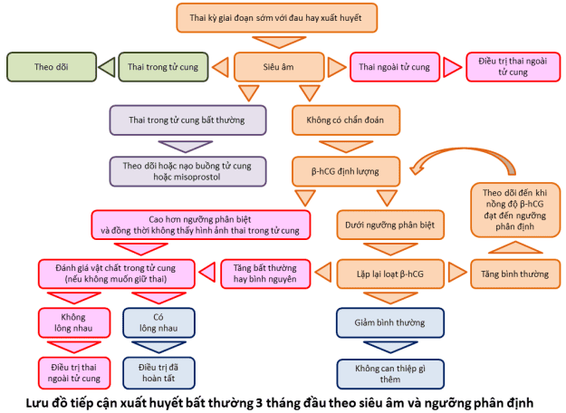

Ra máu trong 3 tháng đầu có thể do 1 số nguyên nhân sau:

- Xuất huyết không liên quan đến thai kỳ (rối loạn phóng noãn, xuất huyết tử cung do tổn thương thực thể,...).
- Dấu hiệu thai làm tổ trong buồng tử cung.
- Thai nghén thất bại (Dọa sảy thai/Sảy thai).
- Thai ngoài tử cung.
- Chửa trứng.

## Hỏi bệnh và tiền sử

- **Ra huyết âm đạo đương nhiên là triệu chứng cơ năng quan trọng nhất:** Hoàn cảnh ra máu (ra máu tự nhiên hay sau sang chấn), máu ra có tính chất gì (đỏ tươi, đỏ sẫm hoặc màu đen), lượng máu ra bao nhiêu (nhiều hoặc ra ít, kéo dài). Triệu chứng kèm theo khi chảy máu (Đau bụng âm ỉ hoặc từng cơn, đau bụng khu trú hoặc toàn bộ vùng hạ vị). **Ra huyết mang tính chất cấp tính** với lượng nhiều liên quan đến 1 tình trạng sẩy thai đang có chiều hướng diễn tiến, có thể là thai thường hay thai trứng.
- **Đặc tính của lần hành kinh cuối cùng và các lần hành kinh bình thường gần nhất:** giúp hướng đến chẩn đoán có thai và phân biệt với **chảy máu không liên quan đến thai kỳ do đặc điểm tiền sử và bệnh sử (xuất huyết tử cung cơ năng do rối loạn phóng noãn, xuất huyết tử cung do tổn thương thực thể như khối u xơ tử cung, xuất huyết do dùng thuốc nội tiết ngoại lai như dùng thuốc tránh thai nội tiết sai, dùng tránh thai khẩn cấp...)**. **Test nhanh nước tiểu định tính β-hCG sẽ là cần thiết cho việc loại bỏ khả năng của các xuất huyết không liên quan đến thai kỳ.**
- **Hỏi tiền sử nhằm tầm soát và tìm hiểu các yếu tố nguy cơ:** **Các yếu tố nguy cơ của một tình trạng thai nghén thất bại sớm** như lớn tuổi, tiền căn đã từng có nhiều lần thai nghén bị thất bại sớm liên tiếp hay lặp lại, hay tiền căn đã từng có thai bị lệch bội, hay tình trạng có chuyển đoạn Robertson đã biết, tử cung bất thường. **Các yếu tố nguy cơ của thai ngoài tử cung** như tiền sử viêm vùng chậu cấp hay kinh niên, tiền sử từng có thai ngoài tử cung, tiền sử có can thiệp phẫu thuật tạo hình trên ống dẫn trứng, các phương pháp tránh thai đã dùng,...
- **Triệu chứng cơ năng khác:** Tình trạng nghén rất nặng có thể do 1 hoạt động nguyên bào nuôi gia tăng trong đa thai hay thai trứng. Tình trạng nghén biến mất 1 cách đột ngột thể hiện sự giảm bất thường gợi ý một thai nghén thất bại sớm.

## Triệu chứng thực thể

Phần lớn các trường hợp, triệu chứng lâm sàng **thường rất nghèo nàn,** nhiều khi ra huyết và biết có thai là những triệu chứng duy nhất.

Một số trường hợp điển hình như trong trường hợp của sẩy thai trứng, sẩy thai đang diễn tiến, xuất huyết nội do thai ngoài tử cung vỡ,...

## Siêu âm là biện pháp tiếp cận sơ cấp

So với siêu âm thực hiện qua đường bụng (Transabdominal Ultrasound Scan - TAS), siêu âm thực hiện qua đường âm đạo (Transvaginal Ultrasound Scan - TVS) có độ phân giải hình ảnh tốt hơn, cho phép phân biệt các chi tiết có kích thước cỡ milimet (mm). Tuy nhiên TVS lại có tầm nhìn hạn chế hơn TAS.

**2 thông tin mà TVS có thể cung cấp tốt nhất là:**

1. Sinh tồn trứng.
2. Hình ảnh túi thai trong tử cung.

**Sự hiện diện của túi thai trong tử cung** hướng hẳn chẩn đoán về phía thai nghén thất bại sớm, ngoại trừ trường hợp của hình ảnh túi thai giả, hay song thai một trong tử cung và một ở ngoài tử cung.

**Khi túi thai không được nhìn thấy,** chỉ có thể kết luận là không nhìn thấy túi thai qua TVS, mà không được kết luận là thai ngoài tử cung, ngoại trừ trường hợp hiếm hoi thấy được túi thai bên ngoài tử cung với quầng nguyên bào nuôi, yolk-sac, có hay không có phôi thai với hoạt động tim phôi.

**Hình ảnh điển hình của thai trứng trên siêu âm là hình ảnh tổ ong** của các gai nhau bị thoái hóa nước. **Chẩn đoán sẽ khó khăn hơn trong trường hợp thai trứng bán phần,** do hình ảnh không còn điển hình lại kèm với hình ảnh của thai, có thể là thai sống và tiến triển. **Thai lưu với nhau thoái hóa có thể cho hình ảnh tương tự thai trứng.**

## Định lượng β-hCG là tiếp cận thứ cấp

Trong vài tuần đầu của thai trong tử cung bình thường (66% trường hợp) β-hCG sẽ tăng gấp đôi trong mỗi 2 ngày và không bao giờ tăng < 53% mỗi 2 ngày.

**β-hCG tăng không được đến 53% trong mỗi 2 ngày, thì nên nghĩ đến 1 trong 2 khả năng:**

1. Có thai trong tử cung với diễn biến bất thường.
2. Có thai ngoài tử cung.

**Sau khi sẩy thai tự nhiên,** β-hCG huyết thanh sẽ **giảm ít nhất 21-35% mỗi 2 ngày.** Nếu **β-hCG huyết thanh giảm chậm, dưới 20% mỗi 2 ngày thì có nhiều khả năng là 1 trong 2 tình trạng:**

1. Còn tồn tại sản phẩm thụ thai.
2. Có thai ngoài tử cung.

**Ngưỡng β-hCG thường dùng là 1.500-2.000 mUI/mL để có thể thấy túi đơn thai trong lòng tử cung và ngưỡng này tăng lên 3000 mUI/mL đối với song thai.** Khi không thấy hình ảnh túi thai trong buồng tử cung và nồng độ hCG trên ngưỡng phân biệt, thì phải nghĩ đến khả năng có thai ngoài tử cung,

## Lược đồ tiếp cận với siêu âm

## Nguồn tham khảo

- TEAM-BASED LEARNING - Trường Đại học Y Dược Thành phố Hồ Chí Minh 2020.
- [Chảy máu trong nửa đầu thời kỳ mang thai](https://www.vinmec.com/vi/tin-tuc/thong-tin-suc-khoe/san-phu-khoa-va-ho-tro-sinh-san/chay-mau-trong-nua-dau-thoi-ky-mang-thai/) - Vinmec.
