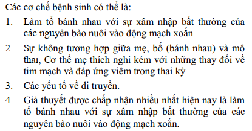
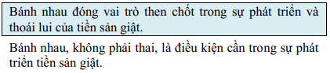
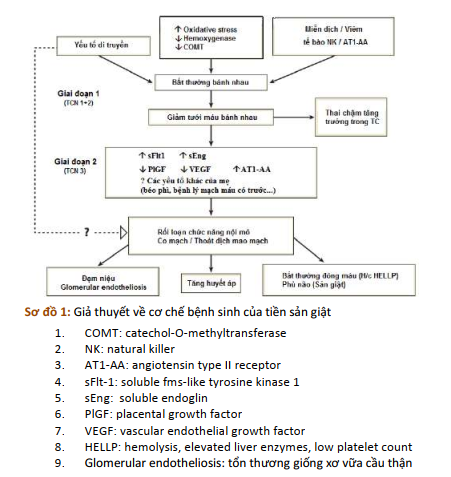
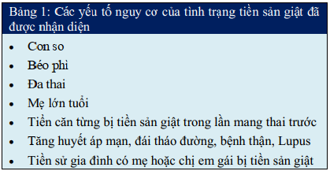
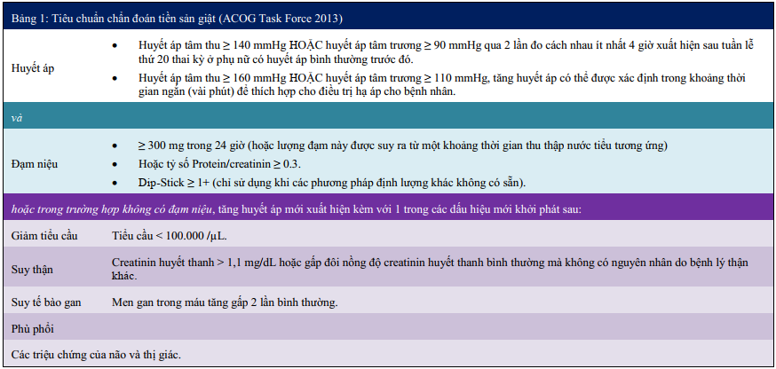
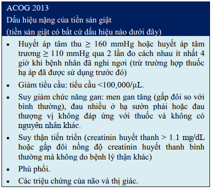
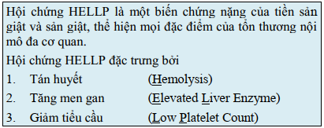

## Cơ chế bệnh sinh

:::note
Bánh rau => Tổn thương nội mô của mẹ => Co mạch => Tăng huyết áp.

Tổn thương nội mô => Thoát mạch => Cô đặc máu và tiêu thụ tiểu cầu => Tăng Hct, giảm áp lực keo, sốc tim do giảm thể tích. Gan nhồi máu, hoại tử, xuất huyết, rối loạn chức năng tế bào gan, rối loạn đông máu. Tổn thương thận gây đạm niệu, giảm mức lọc cầu thận, răng creatinin, acid uric. Tổn thương thần kinh gây phù não, xuất huyết não.
:::

## Một số yếu tố nguy cơ

## Phân loại tăng huyết áp thai kỳ

:::note
Tiền sản giật = Tăng huyết áp + Đạm niệu + Từ tuần thứ 20 của thai kỳ

Tăng huyết áp thai kỳ = Tăng huyết áp + Không đạm niệu + Từ tuần thứ 20 của thai kỳ

Tăng huyết áp mạn = Tăng huyết áp + Trước tuần thứ 20 của thai kỳ

Tăng huyết áp mạn kết hợp tiền sản giật = Tăng huyết áp mạn không đạm niệu + Từ tuần thứ 20 của thai kỳ có đạm niệu = Tăng huyết áp mạn có đạm niệu + Từ tuần thứ 20 có dấu hiệu tăng nặng
:::

## Tiêu chuẩn chẩn đoán tiền sản giật

### Tiền sản giật có dấu hiệu nặng

### Tiên lượng tiền sản giật

Mốc 34 tuần để tiên lượng tiền sản giật. Tiền sản giật trước tuần 34 có tiên lượng xấu tăng tỷ lệ chết sơ sinh, chu sinh, phù phổi, sản giật, v.v.

## Hội chứng HELLP

### Định nghĩa

Là tình trạng nặng của tiền sản giật.

### Tiêu chuẩn chẩn đoán

- Lâm sàng
  - Xuất huyết dưới da, niêm mạc
  - Đau hạ sườn phải
- Cận lâm sàng
  - LDH > 600 IU/L
  - Bilirubin toàn phần > 12%
  - AST > 70 IU/L
  - Giảm Haptoglobin

### Chấm dứt thai kỳ

- Phụ thuộc tình trạng của sản phụ (cá thể hóa điều trị)
- Ổn định cho mẹ trước khi chấm dứt thai kỳ
  - Theo dõi huyết áp, mạch, nước tiểu, nhịp thở.
  - Hạn chế nước vào < 100 mL/h.
  - Dự trù 2 đơn vị hồng cầu và tiểu cầu. Truyền tiểu cầu khi dưới 50 T/L (chỉnh từ 6-10 đơn vị).
  - Theo dõi tim thai, monitoring.
  - Theo dõi ngộ độc MgSO4 (phản xạ gân xương bánh chè).

## Biến chứng tăng huyết áp thai kỳ

### Về phía mẹ

- Sản giật (Tiêu chuẩn đủ 3 yếu tố (1) Co giật + (2) Hôn mê + (3) Được chẩn đoán tiền sản giật)
- Hoại tử tế bào gan
- Hội chứng HELLP
- Suy thận
- Phù não, xuất huyết não
- Phù phổi cấp
- Rau bong nong
- Băng huyết sau sinh

### Về phía con

- Tử vong chu sinh
- Đẻ non
- Thai chậm tăng trưởng trong buồng tử cung

## Xử trí sản giật

[WIP]

## Thuốc chống tăng huyết áp

[WIP]

## Chấm dứt thai kỳ

[WIP]

## Theo dõi sau sinh

[WIP]

## Nguồn tham khảo

- TEAM-BASED LEARNING. Trường Đại học Y Dược Thành phố Hồ Chí Minh 2020.
