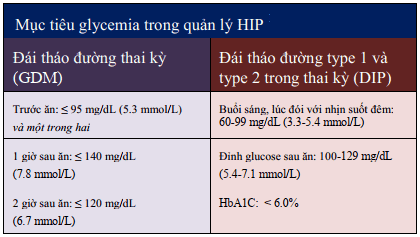

## Phân loại

Chia làm 2 nhóm lớn

## Tiêu chuẩn chẩn đoán

## Tầm soát đái tháo đường thai kỳ

Bằng nghiệm pháp dung nạp đường huyết. Điều kiện thai phụ phải nhịn ăn ít nhất 8 h, sau đó uống 75 g đường khan pha với nước, xét nghiệm đường huyết đói, sau 1 h và sau 2 h.

## Mục tiêu điều trị

## Kết cục sản khoa

### Ở con

- Tần suất thai to (thai >= 4000g) tăng cao.
- Tỷ lệ đột tử của thai tăng.
- Thai có thể bị giới hạn tăng trưởng trong buồng tử cung.
- Chậm trưởng thành các cơ quan như phổi dẫn đến suy hô hấp.
- Hạ đường huyết ở trẻ sơ sinh.
- Nguy cơ trong chuyển dạ như kẹt vai.
- Lâu dài nguy cơ mắc đái tháo đường, thiểu năng tâm thần - thần kinh.

### Ở mẹ

- Tiền sản giật.
- Đa ối dẫn tới rau bong non, chuyển dạ sinh non, đờ tử cung.
- Nhiễm trùng.
- Mổ lấy thai.
- Chuyển sang đái tháo đường thực thụ.

## Khuyến cáo về chấm dứt thai kỳ

## Theo dõi hậu sản

Kiểm tra lại đường huyết 6-12 tuần sau sinh. Lặp lại tối thiểu mỗi 3 năm/lần. Nếu mắc đái tháo đường cần điều trị bằng thay đổi lỗi sống hoặc thuốc (Metformin).

## Nguồn tham khảo

- TEAM-BASED LEARNING. Trường Đại học Y Dược Thành phố Hồ Chí Minh 2020.
