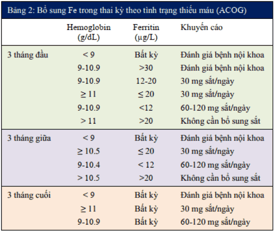

## Các nhóm thuốc thường dùng

### Giảm đau, hạ sốt

#### Tatanol 500mg

- Hoạt chất - hàm lượng: Paracetamol 500 mg.
- Dạng: Viên uống.
- Tác dụng: Thuốc hạ sốt.
- Liều dùng: Tác dụng giảm đau trong vòng 5-10 phút sau khi bắt đầu dùng thuốc, hiệu quả giảm đau cao đạt được trong 1 giờ và thời gian tác dụng thường là 4-6 giờ. Tác dụng hạ sốt trong vòng 30 phút sau khi bắt đầu dùng thuốc với thời gian tác dụng hạ sốt tối thiểu 6 giờ. Tối đa của paracetamol cho người lớn là 1g/lần và 4g (4000 mg)/ngày hoặc không quá 75 mg/kg trong vòng 24 giờ.

#### Elaria 100 mg

- Hoạt chất - hàm lượng: Diclofenac 100 mg.
- Dạng: Viên đặt hậu môn.
- Tác dụng: Giảm đau NSAIDs.
- Liều dùng: 1 viên/ngày.

### Nội tiết - Giảm co

#### Duphaston 10 mg

- Hoạt chất - hàm lượng: Dydrogesteron 10 mg.
- Dạng: Viên uống.
- Tác dụng: Thuốc nội tiết.
- Liều dùng: Đơn thường kê 02 viên/lần x 02 lần/ngày, sáng/chiều. [Link 1](https://www.vinmec.com/vi/tin-tuc/thong-tin-suc-khoe/san-phu-khoa-va-ho-tro-sinh-san/cach-su-dung-thuoc-noi-tiet-duphaston-toan/).

#### Utrogestan 200 mg

- Hoạt chất - hàm lượng: Progesterone 200 mg.
- Dạng: Viên đặt âm đạo/hậu môn.
- Tác dụng: Progesterone nội tiết dạng mịn.
- Liều: Thường dùng 1 viên/lần x 2 lần/ngày đặt âm đạo, sáng/chiều. Tối đa 800 mg/ngày. [Link 1](https://www.vinmec.com/vi/thong-tin-duoc/su-dung-thuoc-toan/thuoc-utrogestan-200mg-co-tac-dung-gi/).

#### Cyclogest 400mg

- Hoạt chất - hàm lượng: Progesterone 400mg.
- Dạng: Viên đặt âm đạo/hậu môn.
- Tác dụng: Progesterone nội tiết.
- Liều: Tương tự Utrogestan nhưng ra ít dịch nhày hơn so với Utrogestan, bù lại có giá thành cao hơn.

#### Mezaverin 120 mg

- Hoạt chất - hàm lượng: Alverin citrat 120 mg.
- Dạng: Viên nang uống
- Tác dụng: Chống co thắt cơ trơn loại papaverine.
- Liều: Đơn thường dùng 1 viên/lần x 2 lần/ngày, sáng/chiều.

#### No-spa 80 mg

- Hoạt chất - hàm lượng: Drotaverin 80 mg.
- Dạng: Viên.
- Tác dụng: Chống co thắt cơ trơn loại papaverine.
- Liều: Đơn thường dùng 1 viên/lần x 2 lần/ngày, sáng/chiều.

#### No-spa 40 mg/2ml

- Hoạt chất - hàm lượng: Drotaverin 40 mg/2ml.
- Dạng: Ống tiêm.
- Tác dụng: Chống co thắt cơ trơn loại papaverine.

#### Atropin sulphat 0.25 mg/ml

- Hoạt chất - hàm lượng: Atropin sulphat 0.25 mg/ml.
- Dạng: Ống tiêm
- Tác dụng: Kháng acetylcholin (ức chế đối giao cảm). Chống co thắt.

#### Neostigmin 0.5 mg

- Hoạt chất - hàm lượng: Neostigmine 0.5 mg.
- Dạng: Ống tiêm.
- Tác dụng: Thuốc giống đối giao cảm, giãn cơ.

#### Atosiban 37.5 mg/5ml

- Hoạt chất - hàm lượng: Tractocile 37.5 mg/5ml.
- Dạng: Lọ tiêm.
- Tác dụng: Thuốc chống sinh non.
- Liều: Liệu trình có chống co cường co dùng 4 lọ. 1 lọ pha 45 ml NaCl 0.9% truyền bơm kim điện bolus 9ml, truyền 24 ml/h trong 3h đầu, 8 ml/h trong những giờ tiếp theo.

### Tăng co

#### Oxytocin 5IU/ml hoặc 10IU/ml

- Hoạt chất - hàm lượng: Oxytocin 5IU/ml.
- Dạng: Ống tiêm bắp/Truyền tĩnh mạch.
- Tác dụng: Tăng co tử cung.

#### Heraprostol 200 mg

- Hoạt chất - hàm lượng: Misoprostol 200 mg.
- Dạng: Viên uống
- Tác dụng: 4 công dụng chính sau là khởi phát chuyển dạ, phòng và điều trị băng huyết sau sinh (BHSS), sảy thai tự nhiên và phá thai.
- Liều dùng: [Link 1](https://www.vinmec.com/vi/thong-tin-duoc/su-dung-thuoc-toan/dung-thuoc-misoprostol-trong-san-khoa/).
- Tác dụng phụ: Có thể gây run, sốt. Qua được hàng rào nhau thai nên không được sử dụng cho con bú. Trường hợp dùng khởi phát chuyển dạ phải lưu ý với những trường hợp có vết mổ đẻ cũ.

#### Carbetocin 100 mg

- Hoạt chất - hàm lượng: Hemotocin 100 mg.
- Dạng: Lọ tiêm.
- Tác dụng: Thuốc co hồi tử cung.
- Liều dùng: Tiêm tĩnh mạch chậm 1 ống (sau sinh nếu tử cung co hồi kém).

### Kháng sinh

#### Midatin 875 mg + 125 mg

- Hoạt chất - hàm lượng: Amoxiciline 875 mg + 125 mg.
- Dạng: Viên uống.
- Tác dụng: Kháng sinh.
- Liều dùng: [Link 1](https://www.vinmec.com/vi/thong-tin-duoc/su-dung-thuoc-toan/cong-dung-thuoc-midantin/).

#### Ceftibiotiz 1g

- Hoạt chất - hàm lượng: Ceftizoxim 1g.
- Dạng: Lọ pha tiêm.
- Tác dụng: Kháng sinh.
- Liều dùng: Đơn thường dùng 1 lọ/lần x 2 lần/ngày, tiêm sáng/chiều.

#### Cefvidi

- Hoạt chất - hàm lượng: Cefotaxim 1g.
- Dạng: Lọ tiêm.
- Tác dụng: Kháng sinh.

#### Metronidazol 250 mg

- Hoạt chất - hàm lượng: Metronidazol 250 mg.
- Dạng: Viên uống.
- Tác dụng: Thuốc kháng sinh.
- Liều dùng: Lưu ý đây là thuốc không dùng cho mẹ cho con bú hoặc phụ nữ có thai. [Link 1](https://www.vinmec.com/vi/thong-tin-duoc/su-dung-thuoc-toan/luu-y-ve-lieu-dung-thuoc-metronidazol/).

#### Moretel 500 mg/100ml

- Hoạt chất - hàm lượng: Metronidazol 500 mg/100ml.
- Dạng: Chia/lọ tiêm truyền.

### Hạ áp

#### Cordaflex 20 mg

- Hoạt chất - hàm lượng: Amlodipin 20 mg.
- Dạng: Viên uống.
- Tác dụng: Thuốc hạ áp chẹn kênh Calci.
- Liều dùng: Thường được dùng để hạ áp trong trường hợp tăng huyết áp cấp (Đơn thường dùng ngậm dưới lưỡi 3 viên, mỗi lần 1 viên, cách nhau 30 phút) hoặc sử dụng để giảm co trong trường hợp dọa sinh non (Đơn thường sử dụng ngậm dưới lưỡi 3 viên/ngày, mỗi lần 1 viên, cách nhau 8h). [Link 1](https://www.vinmec.com/vi/thong-tin-duoc/su-dung-thuoc-toan/cordaflex-20mg-la-thuoc-gi/).

#### Vincardipin 10 mg/10ml

- Hoạt chất - hàm lượng: Nicardipin 10 mg/10ml.
- Dạng: Ống tiêm.
- Tác dụng: Thuốc hạ áp.

#### Methyldopa 250 mg

- Hoạt chất - hàm lượng: Dopegyt 250 mg.
- Dạng: Viên uống.
- Tác dụng: Thuốc hạ áp.
- Liều khởi đầu: 250 mg/ lần x 2 - 3 lần/ngày. Liều duy trì: 0,5 - 2g/ ngày. Không quá 3g/ngày.

### Corticoid

#### Dexamethason

- Hoạt chất - hàm lượng: Dexamethason 4 mg/1ml
- Dạng: Ống tiêm.

#### Diprospan

- Hoạt chất - hàm lượng: Betamethasone 5 mg/ml + 2 mg/ml (Betamethasone 12 mg).
- Dạng: Ống tiêm.
- Tác dụng: Corticoid.
- Liều dùng: Đơn thường dùng x 1 ống/lần x tiêm lúc 8h00.

#### Vinsolon 40 mg

- Hoạt chất - hàm lượng: Methyprednisolon 40 mg.
- Dạng: Ống tiêm.
- Tác dụng: Corticoid.

### Thuốc kiểm soát đường huyết

#### NovoRapid

- Hoạt chất: Insuline.
- Dạng: Tiêm dưới da.
- Tác dụng: Insuline tác dụng nhanh. NovoRapid khởi phát tác dụng trong vòng 10 - 20 phút sau khi tiêm dưới da và đạt hiệu quả tối đa khoảng từ 1 - 3 giờ sau tiêm, thời gian kéo dài tác dụng khoảng 3-5 giờ.

#### Levemir Flexpen

- Hoạt chất: Insuline.
- Dạng: Tiêm dưới da.
- Tác dụng: Insuline nền, tác dụng kéo dài lên tới 24 giờ.

#### Scilin (30/70)

- Hoạt chất: Insuline.
- Dạng: Tiêm dưới da.
- Tác dụng: Insuline trộn. Tiêm trước bữa ăn 30 phút. Thuốc có tác dụng hạ đường huyết trong vòng 1giờ , hiệu quả tối đa đạt được sau 3- 10 giờ tiêm . Tác dụng thuốc được kéo dài trong 24 giờ.

### Thuốc khác

#### Progynova Tab 2mg

- Hoạt chất - hàm lượng: Estradiol valerat 2mg.
- Dạng: Viên uống.
- Tác dụng: Estrogen cắt sữa sau sảy, hút thai.
- Liều: Đơn thường dùng 2 viên/lần x 2 lần/ngày uống sáng, chiều.

#### Calci clorid 0.5g/5ml

- Hoạt chất - hàm lượng: Calci clorid 0.5g/5ml.
- Dạng: Ống tiêm.

#### Dimedrol 10 mg

- Hoạt chất - hàm lượng: Diphenhydramin 10 mg.
- Dạng: Ống tiêm.
- Tác dụng: Chống dị ứng.

#### Vinzix 100 mg

- Hoạt chất - hàm lượng: Furosemid 100 mg.
- Dạng: Ống tiêm.

#### Tranexamic 500 mg

- Hoạt chất - hàm lượng: Tranexamic acid 500 mg.
- Dạng: Ống tiêm.
- Tác dụng: Cầm máu.
- Liều dùng: Đơn thường dùng 02 viên/lần x 02 lần/ngày.

#### Haemostop 500 mg

- Hoạt chất - hàm lượng: Tranexamic acid 500 mg.
- Dạng: Ống tiêm.
- Tác dụng: Cầm máu.

#### Vigomin 0.2 mg/ml

- Hoạt chất - hàm lượng: Methylergometrin 0.2 mg/ml.
- Dạng: Ống tiêm.
- Tác dụng: Phòng và điều trị chảy máu sau sinh.

#### Ferlatum 40mg/15ml

- Hoạt chất - hàm lượng: Sắt 40mg/15ml.
- Dạng: Ống uống.
- Tác dụng: Bổ sung sắt.
- Liều: 
  [Link 1](https://www.vinmec.com/vi/thong-tin-duoc/su-dung-thuoc-toan/cong-dung-cua-thuoc-ferlatum/)

#### Propess

- Hoạt chất - hàm lượng: Dinoprostone 10mg, hay còn gọi là Prostaglandin E2 (PGE2).
- Dạng: Đặt âm đạo.
- Tác dụng: Khởi phát chuyển dạ.
- Liều dùng: 1 viên 10 mg được thiết kế để giải phóng ở mức xấp xỉ 0,3 mg / giờ trong khoảng thời gian 12 giờ.

#### Mifestad 200

- Hoạt chất - hàm lượng: Mifepristone 200mg.
- Dạng: Viên uống.
- Tác dụng: Tác động làm cho niêm mạc tử cung không được phát triển thuận lợi cho việc làm tổ của trứng đã được thụ tinh. Dùng kết hợp với Misopristol để phá thai nội khoa.
- Liều dùng: Tùy thuộc vào tuổi thai.
  - Tuổi thai < 9 tuần thường dùng 1 viên Mifepristone 200mg và Misopristol với liều 800 mcg sau đó 48 giờ.
  - Tuổi thai 9-12 tuần thường dùng 1 viên Mifepristone 200mg và Misopristol với liều 800 mcg sau đó 36-48 giờ. Sau liều đầu có thể thêm Misopristol 400 mcg, tối đa 1600 mcg.

## Đơn thuốc trong một số trường hợp

### Đẻ thường

#### Trong đẻ

1. Fentanyl 50 mcg/ml x 2 ml x 01 ống, pha 10 ml nước cất x 01 ống, tiêm tĩnh mạch chậm
2. Oxytocin 10 UI/ml x 01 ống, tiêm bắp
3. Lidocain 40 mg/2 ml x 02 ống, pha 10 ml nước cất, tê tầng sinh môn
4. Vitamin K1 (Vinphyton 1 mg/ml) 1 mg/ml x 01 ống, tiêm bắp con

#### 15 phút sau đẻ

1. Oxytocin 10 UI/ml x 01 ống, pha 01 chai Glucose 5% 500ml x 01 chai, truyền tĩnh mạch 60 giọt/phút
2. Methyl ergomettrin maleat (Vingomin) 0.2 mg/ml x 01 ống, tiêm bắp
3. Amoxicilin 875 mg + Acid clavulanic 125 mg x 01 viên, uống
4. Diclofenac (Diclovat) 100mg x 01 viên, đặt hậu môn

#### Ngày 1 sau đẻ

1. Amoxicilin 875 mg + Acid clavulanic 125 mg x 02 viên, uống 01 viên/lần x 02 lần/ngày
2. Diclofenac (Diclovat) 100mg x 01 viên, đặt hậu môn

#### Ngày 2 sau đẻ

1. Amoxicilin 875 mg + Acid clavulanic 125 mg x 02 viên, uống 01 viên/lần x 02 lần/ngày

### Đẻ mổ

#### Dùng Duratocin

1. Carbetocin (Hemotocin) 100 mg x 01 ống, tiêm tĩnh mạch chậm

#### Sau đẻ 4h

1. Oxytocin 10 UI/ml x 01 ống, pha Glucose 5% 500ml x 01 chai, truyền tĩnh mạch 60 giọt/phút
2. Natri Clorid 0.9% 500ml x 01 chai, truyền tĩnh mạch 60 giọt/phút
3. Diclofenac (Diclovat) 100mg x 01 viên, đặt hậu môn
4. Vitamin K1 (Vinphyton 1 mg/ml) 1 mg/ml x 01 ống, tiêm bắp con

#### Ngày 2 sau đẻ

1. Ceftibiotic 1000mg x 02 lọ, pha ống nước cất 10ml x 02 ống, tiêm tĩnh mạch sáng/chiều
2. Oxytocin 10 UI/ml x 02 ống, tiêm bắp, sáng/chiều
3. Diclofenac (Diclovat) 100mg x 02 viên, đặt hậu môn, 1 viên sáng và 1/2 viên tối

#### Ngày 3 sau đẻ

1. Ceftibiotic 1000mg x 02 lọ, pha ống nước cất 10ml x 02 ống, tiêm tĩnh mạch sáng/chiều
2. Diclofenac (Diclovat) 100mg x 01 viên, đặt hậu môn

#### Ngày 4 và 5 sau đẻ

1. Ceftibiotic 1000mg x 02 lọ, pha ống nước cất 10ml x 02 ống, tiêm tĩnh mạch sáng/chiều

### Nạo hút thai

#### Trong nạo

1. Fentanyl 50 mcg/ml x 2 ml x 01 ống, pha 10 ml nước cất x 01 ống, tiêm tĩnh mạch chậm
2. Oxytocin 10 UI/ml x 01 ống, tiêm bắp
3. Tranexamic 500 mg x 01 ống, tiêm bắp
4. Lidocain 40 mg/2 ml x 01 ống, tiêm bắp

#### 15 phút sau nạo

1. Oxytocin 10 UI/ml x 01 ống, pha 01 chai Glucose 5% 500ml x 01 chai, truyền tĩnh mạch 60 giọt/phút
2. Amoxicilin 875 mg + Acid clavulanic 125 mg x 01 viên, uống
3. Metronidazol 250mg x 02 viên, uống
4. Misopriston 400 mcg x 02 viên, đặt âm đạo

#### Ngày 1 sau nạo

1. Amoxicilin 875 mg + Acid clavulanic 125 mg x 02 viên, uống 01 viên/lần x 02 lần/ngày, sáng/chiều
2. Metronidazol 250mg x 04 viên, uống 02 viên/lần x 02 lần/ngày, sáng/chiều
3. Misopriston 400 mcg x 02 viên, đặt dưới lưỡi 01 viên/lần x 02 lần/ngày, sáng/chiều

#### Thuốc ra viện

1. Amoxicilin 875 mg + Acid clavulanic 125 mg x 10 viên, uống 01 viên/lần x 02 lần/ngày, sáng/chiều
2. Metronidazol 250mg x 20 viên, uống 02 viên/lần x 02 lần/ngày, sáng/chiều
3. Estradiol valerat (Progynova Tab) 2mg x 20 viên, uống 02 viên/lần x 02 lần/ngày, sáng/chiều
