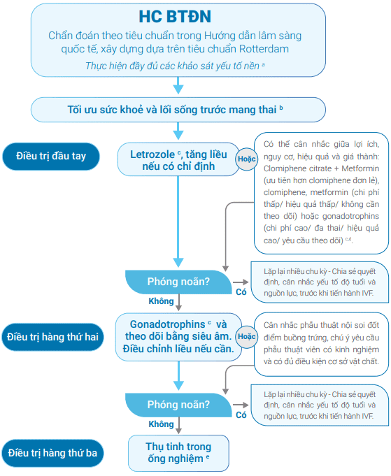

**Hội chứng buồng trứng đa nang (PCOS - Polycystic Ovary Syndrome)** là rối loạn nội tiết-chuyển hóa thường gặp (5-10% phụ nữ trong độ tuổi sinh sản) với 3 dấu ấn chính:

- Rối loạn phóng noãn (rong kinh, kinh thưa, vô kinh).
- Cường androgen (rậm lông, mụn, hói đầu, cường testosterone).
- Hình ảnh buồng trứng đa nang trên siêu âm.

## Chẩn đoán

:::note[Tiêu chuẩn chẩn đoán buồng trứng đa nang]

- Chu kỳ kinh nguyệt không đều + cường androgen lâm sàng (cần loại trừ các nguyên nhân khác).
- **Hoặc** nếu không cường androgen lâm sàng cần xét nghiệm khảo sát cường androgen sinh hóa (cần loại trừ các nguyên nhân khác).
- **Hoặc** nếu CHỈ có chu kỳ kinh nguyệt không đều HOẶC cường androgen: Ở trẻ gái có độ tuổi vị thành niên, siêu âm không được chỉ định = cân nhắc phân nhóm trẻ là gia tăng các yếu tố nguy cơ của hội chứng buồng trứng đa nang và đánh giá về sau. Ở phụ nữ trưởng thành, chỉ định siêu âm phụ khoa là cần thiết (cần loại trừ các nguyên nhân khác).

:::

_Loại trừ các nguyên nhân khác bằng xét nghiệm TSH, prolaction, 17-OH progesterone, FSH hoặc khám lâm sàng tìm nguyên nhân khác (hội chứng Cushin, u tuyến thượng thận). Tình huống suy hạ đồi - suy tuyến yên, thường do tỷ lệ mỡ thấp hoặc hoạt động thể lực quá mức, có thể loại trừ dựa trên lâm sàng và với LH/FSH, PCOS: Hình ảnh buồng trứng đa nang trên siêu âm._

### Rối loạn kinh nguyệt

Định nghĩa rối loạn kinh nguyệt:

- Trên 1 năm và dưới 3 năm khi bắt đầu hành kinh < 21 ngày hoặc > 45 ngày.
- Trên 3 năm khi bắt đầu hành kinh < 21 ngày hoặc > 35 ngày hoặc < 8 chu kỳ/năm.
- Trên 1 năm có chu kỳ kinh nguyệt kéo dài > 90 ngày.

### Cường androgen

Cường androgen sinh hóa:

- Testosterone toàn phần ≥ 1.8 nmol/L và FAI (free androgen index) ≥ 6 cho dân số Việt Nam.
- Rất khó để đánh giá cường androgen sinh hóa trên phụ nữ dùng COCs vì thuốc làm tăng globulin liên kết với hormon sinh dục và giảm sản xuất androgen phụ thuộc gonadotrophin. Cần dừng thuốc 3 tháng trước khi đánh giá.
- Nếu androgen cao cần chú ý đến các nguyên nhân như u buồng trứng, tuyến thượng thận, tăng sản tuyến thượng thận bẩm sinh, hội chứng Cushing, Ovarian hyperthecosis (sau mãn kinh), thứ phát sau điều trị iatrogenic và kháng insulin nghiêm trọng.

Cường androgen lâm sàng:

- SỬ dụng thang điểm Ferriman Gallwey cải biến. Điểm số ≥ 3 được xem là rậm lông.
- Sử dụng thang điểm Ludwig và thang điểm hình ảnh Olsen đánh giá hói đầu.

### PCOM

Đánh giá hình ảnh buồng trứng đa nang (PCOM) sử dụng số nang noãn trên mỗi buồng trứng (FNPO), số lượng nang noãn trên một mặt cắt nang (FNPS) và thể tích buồng trứng (OV):

- FNPO ≥ 20 ở 1 bên hoặc cả 2 bên ở phụ nữ trưởng thành.
- OV ≥ 10 ml hoặc FNPS ≥ 10 ở 1 hoặc cả 2 bên ở phụ nữ trưởng thành.

Siêu âm đường âm đạo đánh giá chính xác nhất, siêu âm đường bụng khó đánh giá hơn.

Cần chuẩn hóa rõ ràng khi đánh giá PCOM:

- Chu kỳ kinh cuối.
- Tần số đầu dò.
- Cách tiếp cận buồng trứng.
- Tổng số nang 2-9 mm trên mỗi buồng trứng.
- Kích thước 3 chiều buồng trứng.
- Các đặc điểm u nang, nang hoàng thể, nang trội (≥ 10mm).
- Đặc điểm và/hoặc bệnh lý tử cung bao gồm độ dày và nội mạc tử cung.

Có thể sử dụng AMH huyết thanh để chẩn đoán PCOM ở phụ nữ trưởng thành. AMH có thể ảnh hưởng bởi:

- Độ tuổi (thường đạt đỉnh từ 20-25 tuổi).
- Chỉ số BMI, AMH thường thấp hơn ở người có BMI cao.
- Phẫu thuật buồng trứng.
- Thuốc tránh thai hằng ngày. AMH thực tế và AFC có thể cao hơn 20% khi sử dụng COCs. Tác động COCs thường tạm thời, sau khi ngừng thuốc sẽ thường phục hồi về mức ban đầu sau 2-6 tháng.
- AMH có thể thay đổi trong 1 chu kỳ kinh nhưng không đáng kể.

## Nguy cơ

### Rối loạn chuyển hóa đường

Dù bất kỳ tuổi và BMI nào, phụ nữ PCOS đều có nguy cơ rối loạn đường huyết đói, rối loạn dung nạp đường và đái tháo đường type 2.

:::note[Tiêu chuẩn chẩn đoán hội chứng chuyển hóa]
Có 3 trong 5 tiêu chuẩn.
| Yếu tố nguy cơ | Ngưỡng bất thường |
| --------------------------------------------------------- | ------------------------------------------------- |
| **Béo phì ở bụng (đo vòng eo)** | > 80cm |
| **Triglycerides** | ≥ 150 mg/dL |
| **HDL-C** | < 50 mg/dL |
| **Huyết áp** | ≥ 130/≥ 85mmHg |
| **Đường huyết lúc đói và 2h sau làm test dung nạp đường** | 110-126 mg/dL và/hay glucose sau 2h 140-199 mg/dL |
:::

Kháng insulin đóng vai trò quan trọng trong cơ chế sinh bệnh học của PCOS.

Đường huyết được đánh giá mỗi 1-3 năm dựa vào các yếu tố nguy cơ. Khuyến cáo thực hiện dung nạp đường với 75g đường (OGTT) là XN chính xác nhất để đánh giá. Nếu không thực hiện được có thể dùng đường đói và/hoặc HbA1c có thể được cân nhắc nhưng độ chính xác sẽ giảm.

Khi có kế hoạch mang thai hoặc điều trị hỗ trợ sinh sản, OGTT nên được cân nhắc dựa trên yếu tố nguy cơ. Nếu không thực hiện trước mang thai, OGTT có thể được thực hiện lần khám thai đầu tiên và tất cả thai phụ PCOS được khuyến cáo thực hiện ở thời điểm 24-28 tuần.

### Nguy cơ tim mạch

Phụ nữ PCOS có nguy cơ tim mạch cao hơn và có khả năng tử cung bởi bệnh lý tim mạch cao hơn.

Cần làm xét nghiệm tình trạng lipid máu (cholesterol, LDL-C, HDL-C và triglyceride) ngay khi có chẩn đoán PCOS.

Tầm soát huyết áp mỗi năm, khi có kế hoạch mang thai hoặc điều trị hỗ trợ sinh sản.

### Tăng sản và ung thư nội mạc tử cung

Vô kinh kéo dài không được điều trị, thừa cân, đái tháo đường type 2 và nội mạc tử cung dày, tồn tại kéo dài là yếu tố nguy cơ gây tăng sản nội mạc tử cung và ung thư nội mạc tử cung.\

BN PCOS nên được thông báo dự phòng gồm điều chỉnh cân nặng, điều hòa kinh nguyệt và liệu pháp progesteron.

### Phụ nữ có thai

Phụ nữ PCOS có nguy cơ cao hơn với:

- Tăng cân trong thai kỳ.
- Sảy thai.
- Đái tháo đường.
- Tăng huyết áp và tiền sản giật.
- Thai chậm tăng trưởng, thai nhỏ hơn tuổi thai.
- Sinh non.
- Mổ lấy thai.

Nên chỉ định OGTT cho phụ nữ PCOS trước hoặc khi khám hiếm muộn. Nếu không thực hiện trước mang thai nên thực hiện ở lần khám thai đầu tiên và lặp lại tuần 24-28.

## Điều trị

### Không mong có thai

Các vấn đề sức khỏe chính của nhóm người bệnh này gồm:

- Rối loạn kinh nguyệt/vô kinh.
- Cường androgen (rậm lông, béo phì, mụn trứng cá, hói đầu).
- Hội chứng chuyển hóa (tiểu đường, tăng lipid máu).

#### Thuốc tránh thai kết hợp

**Progestogen đơn thuần**: Dùng tối thiểu 12 ngày để giảm nguy cơ tăng sinh nội mạc tử cung và ung thư nội mạc tử cung.

**Viên tránh thai kết hợp** (ethinyl estradiol + progestogen kháng androgen như cyproterone, drospirenone):

- Điều hòa kinh nguyệt, giảm nguy cơ tăng sinh nội mạc tử cung. Chế phẩm estrogen tự nhiên và estrogen thấp nhất có hiệu quả (20-30 μg thinyl oestradiol hoặc tương đương) được xem xét sử dụng.
- Viên phối hợp không nên dùng liên tục mà chỉ sử dụng mỗi 3-4 tháng/lần để tránh tác dụng phụ trên béo phì và chuyển hóa.
- Ethinylestradiol liều cao (≥ 30 μg) không có lợi ích lâm sàng hơn so với ethinylestradiol liều thấp (< 30 μg) trong điều trị rậm lông.
- **Viên 35 μg ethinyloestradiol và cyproterone acetae** nên là lựa chọn hàng thứ 2 sau viên ngừa thai phối hợp.

#### Metformin

Sử dụng đơn trị khi có BMI ≥ 25 kg/m² nhằm cải thiện nhân chắc học, rối loạn chuyển hóa như kháng insuslin, đường huyết và mỡ máu.

Bắt đầu với liều thấp, tăng dần 500mg mỗi 1-2 tuần, sử dụng các chế phẩm phóng thích kéo dài để giảm tác dụng phụ và tăng tuân thủ thuốc.

Liều tối đa 2.5 g ở phụ nữ trưởng thành và 2 g ở trẻ gái vị thành niên.

Metformin an toàn khi sử dụng lâu dài. Sử dụng metformin liên quan đến giảm nồng độ vitamin B12 (nên cân nhắc với nhóm đối tượng đái tháo đường, sau phẫu thuật giảm cân/chuyển hóa, thiếu máu ác tính, chế độ ăn chay...).

Kết hợp COCs và metformin mang lại nhiều lợi ích ở nhóm có BMI > 30 kg/m². Nhưng không mang lại hiệu quả so với điều trị COCs và metformin đơn đọc ở phụ nữ trưởng thành BMI ≤ 30 kg/m².

#### Thuốc điều trị béo phì

Các thuốc liraglutide, semaglutide (đồng vận thụ thể GLP-1) và orlistat có thể được xem xét sử dụng khi BMI ≥ 25 kg/m².

Khuyến cáo sử dụng GLP-1 để giảm tác dụng phụ trên đường tiêu hóa.

#### Thuốc kháng androgen

Cân nhắc sử dụng thuốc kháng androgen điều trị rậm lông, hói đầu. Nếu sau ít nhất 6 tháng sử dụng COCs và/hoặc liệu pháp thẩm mỹ chưa tối ưu.

Các thuốc cân nhắc được sử dụng:

- Spironolactone liều 25-100 mg/ngày ít tác dụng phụ.
- Cyproterone acetate ≥ 10 mg không được khuyến cáo do tăng nguy cơ phát triển u màng não.
- Finasteride làm tăng nguy cơ tổn thương gan.
- Flutamide và bicalutamide nguy cơ tổn thương gan nặng.

#### Inositol

Được cân nhắc sử dụng. Có khả năng cải thiện về chỉ số sinh hóa mạc dù lợi ích lâm sàng còn hạn chế.

#### Laser và liệu pháp ánh sáng

Giúp điều trị giảm rậm lông vùng mặt và giảm rối loạn lo âu, trầm cảm, giúp nâng cao chất lượng cuộc sống.

### Mong có thai

**Mục tiêu**: Gây phóng noãn đơn noãn, gần với sinh lý, tránh quá kích buồng trứng và đa thai.

_Hình ảnh "Lược đồ điều trị hiếm muộn cho phụ nữ buồng trứng đa nang" - HOREM._

- Letrozole là điều trị đầu tay.
- Metformin có hiệu quả thấp hơn nhưng chí phí và tỷ lệ đa thai thấp hơn hơn.
- Gonadotrophins có hiệu quả cao hơn nhưng chi phí và tỷ lệ đa thai cao hơn.
- IVF là điều trị hàng thứ 3 trừ khi không có tác nhân hiếm muộn khác như yếu tố nam hoặc ống dẫn trứng.

#### Thay đổi lối sống

Chế độ ăn giảm năng lượng (giảm chất béo, tăng chất xơ) và tăng hoạt động thể chất.

Giảm ≥ 5% trọng lượng cơ thể có thể phục hồi phóng noãn tự nhiên.

Metformin được xem xét trong 1 số tình huống như nguy cơ dọa đẻ non. Thai phụ được tư vấn về những ảnh hưởng của metformin lên sức khỏe lâu dài của em bé chưa được làm rõ. Nên ngừng thuốc vào cuối tam cá nguyệt đầu tiên.

Nên sử dụng vitamins bổ trợ trước mang thai thường quy cùng thời điểm gây phóng noãn.

#### Letrozole

Letrozole (LE) là chất ức chế aromatase. Được xem là thuốc gây phóng noãn đầu tay do không phóng noãn nguyên phát:

- LE ức chế sinh tổng hợp estrogen do đó làm cản trở phản hồi âm của trục hạ đồi-tuyến yên của estrogen, do đó tăng FSH nội sinh và thúc đẩy nang noãn phát triển.
- Phác đồ LE thường sử dụng liều 2.5 - 5 mg dùng trong 5 ngày (bắt đầu vào ngày thứ 2, 3 hoặc 4 của chu kỳ kinh) và liều tối đa là 7.5 mg.
- Nang trứng đáp ứng khi nang > 10 mm, E2 < 70 pg /mL, progesterone < 1,0ng/mL.

Đa thai ít hơn khi sử dụng letrozole so với clomiphone citrate.

Giao hợp thường xuyên mỗi 2-4 ngày và khi phát hiện có tăng LH. Sự rụng trứng được ghi nhận bằng sự biến mất của một nang trứng > 14 mm đồng thời với giảm E2 > 50% và tăng progesterone > 1,0 ng/mL, hoặc progesterone huyết thanh > 5 ng/mL với kết quả là mang thai hoặc hành kinh.

#### Clomiphene citrate

Clomiphene citrate (CC):

- Hoạt động như chất kháng estrogen, gắn vào thụ thể estrogen ở vùng hạ đồi và tuyến yên. Việc này ức chế tín hiệu feedback âm tính của estrogen, khiến não bộ tăng cường sản xuất hormone giải phóng Gonadotropin (GnRH), sau đó là Follicle-Stimulating hormone (FSH) và Luteinizing hormone (LH). FSH và LH là các hormone quan trọng thúc đẩy sự phát triển của nang noãn (trứng) trong buồng trứng.
- Liều khởi đầu: 50 mg/ngày × 5 ngày (ngày 2-5 chu kỳ).
- Liều tối đa: 150 mg/ngày; Không điều trị quá 6 chu kỳ liên tiếp hoặc > 12 chu kỳ suốt đời sinh sản.
- Đề kháng CC khi không đáp ứng sau 3-6 chu kỳ điều trị.

CC kết hợp metformin có thể được ưu tiên hơn CC đơn lẻ.

#### Gonadotropin

Gonadotropin là một nhóm hormone peptide điều hòa tuyến sinh dục (buồng trứng và tinh hoàn), bao gồm các hormone chính như FSH (kích thích nang noãn) và LH (kích thích hoàng thể) do tuyến yên tiết ra, cùng với hCG (hCG):

- FSH được tiết ra bởi tuyến yên trước, FSH kích thích sự phát triển của các nang noãn trong buồng trứng.
- LH cũng được tuyến yên trước tiết ra, LH đóng vai trò quan trọng trong việc gây ra sự rụng trứng và thúc đẩy hoàng thể sản xuất progesterone.
- hCG được sản xuất bởi nhau thai trong thai kỳ, hCG có tác dụng tương tự như LH và giúp duy trì thai kỳ.

Thường sử dụng ở người kháng CC. Cũng có thể được dùng để tăng số lượng tinh trùng.

**Phác đồ step-up**: FSH khởi đầu 37.5-50 IU/ngày trong 14 ngày, sau đó tăng dần 25-37.5 IU/ngày tùy đáp ứng; Theo dõi siêu âm chặt chẽ. Ở người có BMI thấp, có thể khởi đầu 25 IU/ngày.

Sử dụng gonatropin cần lưu ý:

- Chi phí.
- Sử dụng phác đồ liều thấp, tăng dần nhằm tối ưu hóa tỷ lệ phát triển đơn noãn.
- Nguy cơ đa thai.

#### Metformin

Mục tiêu: Cải thiện phóng noãn, giảm cân và giảm cường androgen. Dùng cho người PCOS béo phì hoặc có rối loạn dung nạp đường.

Liều gợi ý: 500 mg × 3 lần/ngày trong 1 tháng, sau đó 500 mg × 2 lần/ngày trong 6 tháng.

#### Nội soi đốt điểm

Dành cho người kháng CC và thất bại với gonadotropin.

Đốt 4-10 điểm, sâu 4 mm, công suất 40 W × 4 giây. Theo dõi hiệu quả 3-6 tháng; Không lặp lại nếu không hiệu quả.

#### Thụ tinh trong ống nghiệm (IVF/ICSI)

Khi thất bại với mọi phương pháp trên hoặc có chỉ định khác.

Dùng phác đồ GnRH antagonist để giảm nguy cơ hội chứng quá kích.

Dùng metformin 1000-2500 mg/ngày trong 8 tuần trước và/ hoặc trong kích thích có thể giảm nguy cơ quá kích buồng trứng.

#### In-Vitro Maturation (IVM)

Lấy noãn non, nuôi trưởng thành ngoài cơ thể, tránh kích thích buồng trứng mạnh. Tuy nhiên tỷ lệ trẻ sinh sống thấp hơn.

IVM ưu tiên lựa chọn ở phụ nữ có tiền sử hoặc nguy cơ cao hội chứng quá kích buồng trứng mức độ nặng khi điều kiện trung tâm đủ đáp ứng.

IVM kém hiệu quả hơn so với IVF/ICSI.

#### Inositol và thuốc giảm cân

Cân nhắc sử dụng có khả năng cải thiện về chỉ số sinh hóa mạc dù lợi ích lâm sàng còn hạn chế dù chưa có bằng trứng.

## Tài liệu tham khảo

- HOSREM - _[Cẩm nang Hội chứng buồng trứng đa nang](https://hosrem.org.vn/detailNews/hoatdong/te-bao-la-nuoi-phoi-trophectoderm-te-o-phoi-kham-cho-thay-muc-do-chet-theo-chuong-trinh-te-bao-tang-va-khiem-khuyet-kha-nang-biet-hoa-bang-chung-sinh-hoc-phan-tu-ve-tiem-nang-sinh-san-cua-phoi-kham-8303)_
- HOSTEM - _[Kéo dài thời gian điều trị letrozole có hiệu quả trong việc gây rụng trứng ở phụ nữ mắc hội chứng buồng trứng đa nang và kháng letrozole](https://hosrem.org.vn/detailNews/thongtin/keo-dai-thoi-gian-dieu-tri-letrozole-co-hieu-qua-trong-viec-gay-rung-trung-o-phu-nu-mac-hoi-chung-buong-trung-da-nang-va-khang-letrozole-6668)_
