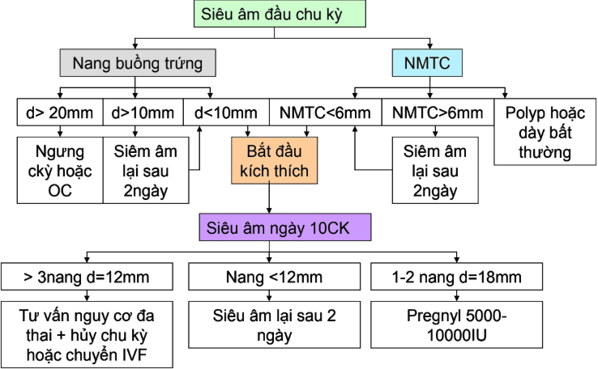
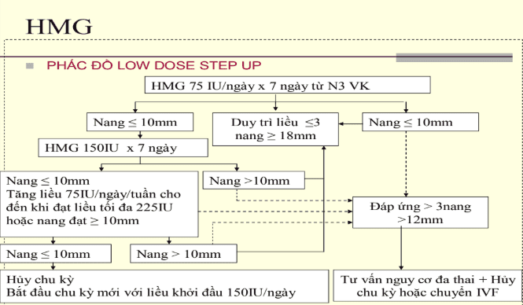
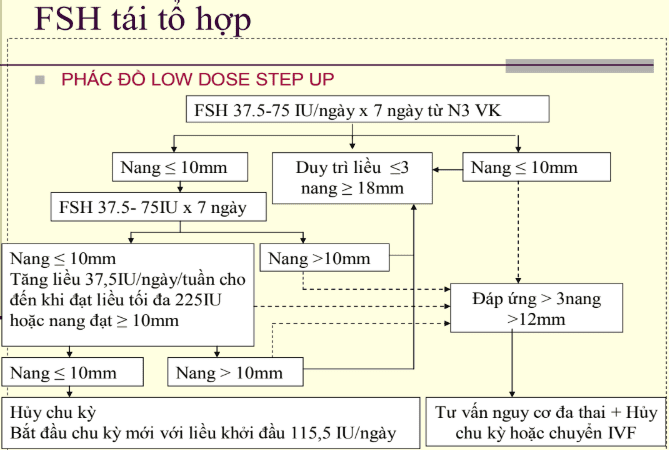

Trong IUI, thường kích thích buồng trứng (thay vì để rụng trứng tự nhiên) nhằm:

- Tạo nhiều nang noãn trưởng thành hơn → tăng khả năng có ít nhất 1 trứng tốt để thụ tinh.
- Đồng bộ thời điểm rụng trứng với bơm tinh trùng.
- Tăng tỷ lệ thành công (so với chu kỳ tự nhiên).

## Chỉ định

Có chỉ định làm IUI sau khi đã thăm dò các bilan hiếm muộn:

- Có ít nhất 1 ống dẫn trứng thông trên phim HSG và sau mổ nội soi.
- Định lượng nội tiết cơ bản nằm trong giới hạn.
- Chưa phát hiện bất thường trong lòng tử cung và 2 buồng trứng.
- Tinh trùng có thể thực hiện IUI.

Bên cạnh đó cần đầy đủ giấy tờ chứng minh tình trạng hôn nhân.

## Các phác đồ kích trứng trong IUI

_Hình ảnh "Lược đồ tiếp cận bệnh nhân kích thích đơn noãn" - Bệnh viện Hùng Vương._

### Clomiphene citrate

#### Chỉ định

Clomiphene citrate (CC) là chất kháng estrogen. Hiệu quả trên những BN rối loạn phóng noãn WHO nhóm 2 nhưng không hiệu quả trên nhóm 1 và 3.

_Theo WHO, không phóng noãn được chia thành 3 nhóm: - Nhóm 1 (10%): Nguồn gốc từ hạ đồi - tuyến yên → nồng độ gonadotropins thấp lẫn estrogen thấp. - Nhóm 2 (80-90%): FSH và estrogen bình thường, đa phần do hội chứng buồng trứng đa nang. - Nhóm 3 (5%): Suy giảm chức năng buồng trứng → estrogen thấp nhưng gonadotropin tăng cao._

#### Thực hiện

Liều 25 mg x 2 lần/ngày từ ngày 2-5 chu kỳ kinh, tối đa 150 mg. Đề kháng với CC khi không phóng noãn với liều 200 mg/ngày.

Siêu âm đánh giá nang noãn vào ngày 10 chu kỳ kinh:
- Nếu xuất hiện nang trội > 12 mm tiếp tục theo dõi đến khi trưởng thành.
- Nếu không xuất hiện siêu âm lại ngày 13 và 14 chu kỳ kinh.
- Không đáp ứng nếu 16-17 chu kỳ kinh không có nang trọi.
- Nếu nang > 25 mm vào ngày 10, quan hệ tự nhiên, tiên lượng nang trống.

Đỉnh LH xuất hiện sau 5-12 ngày sau viên CC cuối cùng:

- Không chủ động trưởng thành noãn: Quan hệ cách ngày trong 1 tuần sau viên CC cuối cùng.
- Chủ động trưởng thành noãn khi có nang trội 18-20 mm: hCG 5000 IU (Pregnyl). hCG không được khuyến cáo sử dụng cho những trường hợp có đỉnh LH nội sinh.

Tác dụng phụ:

- Làm chất nhày cổ tử cung đặc và ít.
- Làm mỏng niêm mạc tử cung.
- Giảm sự chấp nhận nội mạc và tăng tỷ lệ sảy thai sớm.
- Giảm tưới máu cơ tử cung.
- Nóng mặt, chướng bụng, căng ngực, buồn nôn, nôn, hoa mắt, nhức đầu.

#### Đánh giá

Trong 6 chu kỳ đầu dùng CC, tỷ lệ phóng noãn 73%. Tỷ lệ ngày giảm theo tuổi bệnh nhân, BMI và FAI tăng. Sau 6 tháng tỷ lệ có thai giảm do tác dụng kháng estrogen với niêm mạc và chất nhày cổ tử cung.

Thất bại với CC:

- Tăng liều đến 200-250 mmg x 8-10 ngày.
- Giảm cân phối hợp với CC. Sử dụng metformin với CC, liều 500 mg x 2 lần/ngày x 8 tuần với trường hợp đề kháng với insulin.
- Dexamethasone 0.5 mg x 1 lần/ngày với CC hoặc thuốc ngừa thai dạng uống với trường hợp WHO nhóm 2 có DHEA > 2 µg/mL.
- Phối hợp gonadotrophin (hMG, rFSH).
- Sử dụng aromatase inhibitor thay thế.
- Điều chỉnh prolactine máu nếu cao bằng bromocriptine hoặc carbegolin.
- Nội soi đốt điểm.

### Aromatase inhibitor

#### Chi định

Aromatase inhibitor (AI) là men phụ thuộc ty thể P450, tham gia bước cuối chuyển hóa androgen thành estrogen. AI ức chế men aromatase bằng cách gắn kết với heme của men này làm giảm hoạt tính với estrogen. Khi nống độ E2 hạ thấp kích thích tuyến yên tiết FSH. Khác CC, AI không tác dụng bất lợi trên niêm mạc tử cung và chất nhày cổ tử cung.

_Bảng "Phân loại aromatase inhibitor (AI)"._
| Thế hệ | Type I (steroid analoge của androstenedion) | Type II (nonsteroid analoge của androstenedion) |
|---------|------------------------------------------------|---------------------------------------------------|
| 1       |                                               | Aminoglutethimid                                  |
| 2       | Formestane                                     | Fadrozole Roglethimide                            |
| 3       | Exemestane                                     | Anastrozole (Arimidex)  Letrozole (Femara 2,5mg)  Vorozole |

Sử dụng ở phụ nữ rối loạn phóng noãn, thất bại với CC hoặc niêm mạc tử cung < 5mm. Ngoài ra còn được dùng điều trị ung thư vú ở phụ nữ mãn kinh.

#### Thực hiện

Liều khởi đầu letrozole 2.5 mg x 2 lần/ngày từ ngày 2-5 chu kỳ kinh.

Tác dụng phụ gồm:
- Đau xương, nóng mặt, đau lưng, buồn nôn, tiêu chảy.
- Cần loại trừ có thai trước điều trị do nguy cơ bất thường vận động, tim mạch, dị tật ở trẻ sơ sinh.

#### Đánh giá

Tỷ lệ phóng noãn 75%, có thai 25%. Số noãn trung bình 2.3 trong đó 90% có > 2 noãn.

### HMG

_Hình ảnh "Phác đồ kích trứng HMG" - Bệnh viện Hùng Vương._

### FSH tái tổ hợp

_Hình ảnh "Phác đồ kích trứng FSH tái tổ hợp" Bệnh viện Hùng Vương._

### CC và/hoặc AI + HMG/FSH

Sử dụng theo phác đồ sau:

- CC 25 mg x 2 lần/ngày x 5 từ ngày 2-5 chu kỳ. AI 2.5 mg x 2 lần/ngày x 5 từ ngày 2-5 chu kỳ.
- Siêu âm kiểm tra nang trội vào ngày 8 chu kỳ kinh. Nếu chưa có nang trội sử dụng HMG hoặc FSH tái tổ hợp từ ngày 8 của chu kỳ kinh. Siêu âm sau 2-3 ngày, nếu chưa có nang trội duy trì thêm 14 ngày. Nếu sau 14 ngày không có nang noãn. Hủy chu kỳ, bắt đầu chu kỳ khác.

## Nguồn tham khảo

- Bệnh Viện Hùng Vương - [_Phác đồ Hiếm muộn cập nhật 2020_](https://bvhungvuong.vn/danh-cho-nhan-vien/phac-do-hiem-muon-cap-nhat-2020)
