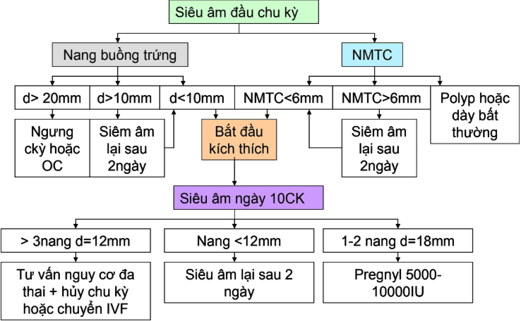
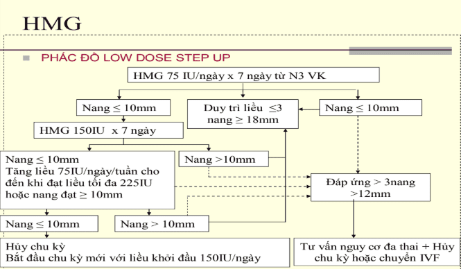
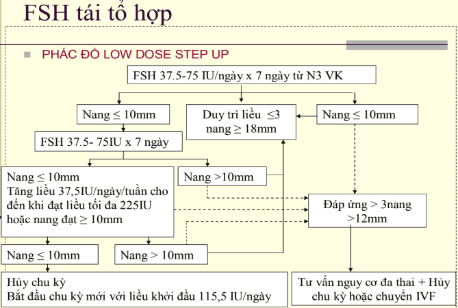

Trong IUI, kích thích buồng trứng thường được sử dụng (thay vì để rụng trứng tự nhiên) nhằm:

- Tạo nhiều nang noãn trưởng thành hơn → tăng cơ hội có ít nhất 1 trứng chất lượng để thụ tinh.
- Đồng bộ thời điểm rụng trứng với thời điểm bơm tinh trùng.
- Nâng cao tỷ lệ thành công so với chu kỳ tự nhiên.

## Chỉ định

Chỉ định IUI được đặt ra sau khi đã thăm dò hiếm muộn đầy đủ:

- Có ít nhất 1 vòi trứng thông trên phim HSG hoặc sau nội soi.
- Định lượng nội tiết cơ bản trong giới hạn.
- Không phát hiện bất thường trong buồng tử cung và hai buồng trứng.
- Tinh trùng đủ điều kiện thực hiện IUI.

Ngoài ra, cần có giấy tờ hợp pháp chứng minh tình trạng hôn nhân.

## Các phác đồ kích trứng trong IUI

_Hình ảnh "Lược đồ tiếp cận bệnh nhân kích thích đơn noãn" - Bệnh viện Hùng Vương_.  

### Clomiphene citrate (CC)

CC là thuốc kháng estrogen. Hiệu quả với bệnh nhân rối loạn phóng noãn WHO nhóm 2; không hiệu quả với nhóm 1 và 3.

_Theo WHO, vô phóng noãn được chia 3 nhóm: - Nhóm 1 (10%): Suy hạ đồi - tuyến yên → gonadotropin thấp, estrogen thấp. - Nhóm 2 (80-90%): FSH và estrogen bình thường, thường gặp trong PCOS. - Nhóm 3 (5%): suy buồng trứng → estrogen thấp, gonadotropin tăng cao_.

#### Thực hiện

Liều: 25 mg x 2 lần/ngày từ ngày 2-5 chu kỳ. Đề kháng CC khi không phóng noãn với liều 200 mg/ngày.  
Siêu âm ngày 10:

- Có nang > 12 mm → tiếp tục theo dõi.
- Không có nang → siêu âm lại ngày 13-14.
- Không nang trội đến ngày 16-17 → không đáp ứng.
- Nang > 25 mm sớm → thường nang trống.

Đỉnh LH xuất hiện 5-12 ngày sau viên CC cuối cùng.

- Không tiêm hCG: khuyến khích giao hợp cách ngày trong 1 tuần sau liều cuối.
- Có nang 18-20 mm: có thể tiêm hCG 5000 IU, tránh dùng nếu đã có đỉnh LH nội sinh.

Tác dụng phụ:

- Làm chất nhầy cổ tử cung ít, đặc; niêm mạc tử cung mỏng.
- Giảm khả năng tiếp nhận nội mạc, tăng nguy cơ sảy thai sớm.
- Giảm tưới máu cơ tử cung.
- Nóng mặt, căng ngực, chướng bụng, buồn nôn, nhức đầu, hoa mắt.

#### Đánh giá

Trong 6 chu kỳ đầu tỷ lệ phóng noãn 73%. Sau 6 tháng tỷ lệ có thai giảm do tác dụng kháng estrogen.

**Xử trí thất bại với CC:**

- Tăng liều đến 200-250 mg x 8-10 ngày.
- Giảm cân kết hợp CC; phối hợp metformin (500 mg x 2 lần/ngày x 8 tuần) ở bệnh nhân kháng insulin.
- Dexamethasone 0.5 mg/ngày kết hợp CC hoặc OCP khi WHO nhóm 2 có DHEA > 2 µg/mL.
- Kết hợp gonadotrophin (hMG, rFSH).
- Thay thế bằng aromatase inhibitor.
- Điều chỉnh prolactin bằng bromocriptine/cabergoline khi tăng prolactin máu.
- Nội soi đốt điểm buồng trứng.

### Aromatase inhibitor (AI)

AI ức chế enzym aromatase, giảm tổng hợp estrogen → tăng tiết FSH. Không gây bất lợi trên niêm mạc tử cung và chất nhầy cổ tử cung như CC.

Dùng khi:

- Rối loạn phóng noãn, thất bại với CC.
- Niêm mạc tử cung < 5 mm.

Ngoài hiếm muộn, còn dùng điều trị ung thư vú sau mãn kinh.

_Bảng "Phân loại aromatase inhibitor (AI)"_

| Thế hệ | Type I (steroid analog) | Type II (nonsteroid analog)                                |
| ------ | ----------------------- | ---------------------------------------------------------- |
| 1      |                         | Aminoglutethimid                                           |
| 2      | Formestane              | Fadrozole, Roglethimide                                    |
| 3      | Exemestane              | Anastrozole (Arimidex), Letrozole (Femara 2.5mg), Vorozole |

#### Thực hiện

Letrozole 2.5 mg x 2 lần/ngày từ ngày 2-5 chu kỳ kinh.

Tác dụng phụ:

- Đau xương, đau lưng, nóng mặt, buồn nôn, tiêu chảy.
- Trước điều trị cần loại trừ có thai (nguy cơ dị tật tim mạch, xương).

#### Đánh giá

Tỷ lệ phóng noãn 75%. Tỷ lệ có thai 25%. Trung bình 2.3 nang trưởng thành, 90% có > 2 nang.

### HMG

_Hình ảnh "Phác đồ kích trứng HMG" - Bệnh viện Hùng Vương_  

### FSH tái tổ hợp

_Hình ảnh "Phác đồ kích trứng FSH tái tổ hợp" - Bệnh viện Hùng Vương_  

### Phối hợp CC/AI + HMG hoặc FSH tái tổ hợp

- CC 25 mg x 2 lần/ngày x 5 ngày (ngày 2-5) và/hoặc AI 2.5 mg x 2 lần/ngày x 5 ngày (ngày 2-5).
- Siêu âm ngày 8, nếu chưa có nang trội → bổ sung HMG hoặc rFSH và siêu âm sau 2-3 ngày. Nếu sau 2-3 ngày chưa có nang → duy trì thêm tối đa 14 ngày. Không có nang sau 14 ngày → hủy chu kỳ, bắt đầu chu kỳ mới.

## Tài liệu tham khảo

- Bệnh viện Hùng Vương - [_Phác đồ Hiếm muộn cập nhật 2020_](https://bvhungvuong.vn/danh-cho-nhan-vien/phac-do-hiem-muon-cap-nhat-2020)
