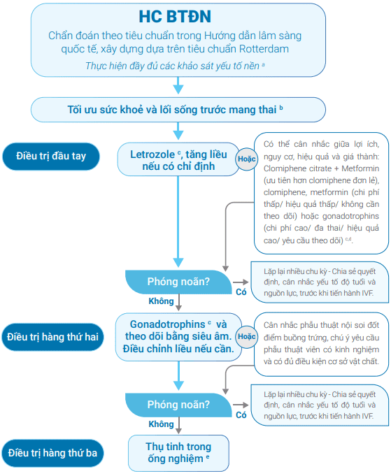

**Hội chứng buồng trứng đa nang (PCOS - Polycystic Ovary Syndrome)** là rối loạn nội tiết-chuyển hóa thường gặp (5-10% phụ nữ trong độ tuổi sinh sản) với 3 dấu ấn chính:

- Rối loạn phóng noãn (rong kinh, kinh thưa, vô kinh).
- Cường androgen (rậm lông, mụn, hói đầu, cường testosterone).
- Hình ảnh buồng trứng đa nang trên siêu âm.

## Chẩn đoán

:::note[Tiêu chuẩn chẩn đoán buồng trứng đa nang theo Rotterdam consensus 2003]
Chẩn đoán hội chứng buồng trứng đa nang khi có 2/3 tiêu chuẩn khi loại trừ bệnh lý gây cường androgen:

- Rối loạn phóng noãn hay không phóng noãn.
- Cường androgen.
- Hình ảnh buồng trứng đa nang trên siêu âm.

:::

**Loại trừ bệnh lý khác** bằng xét nghiệm TSH, prolactin, 17-OH progesterone, FSH hoặc khám lâm sàng tìm dấu hiệu hội chứng Cushing, u tuyến thượng thận. Suy hạ đồi - suy tuyến yên (do mỡ thấp, vận động quá mức) có thể loại trừ dựa trên lâm sàng và LH/FSH.

### Rối loạn kinh nguyệt

Định nghĩa:

- Dưới 3 năm sau khi có kinh: Chu kỳ < 21 ngày hoặc > 45 ngày.
- Trên 3 năm sau khi có kinh: Chu kỳ < 21 ngày hoặc > 35 ngày, hoặc < 8 chu kỳ/năm.
- Chu kỳ > 90 ngày, kéo dài trên 1 năm sau khi bắt đầu có kinh.

### Cường androgen

**Cường androgen sinh hóa**:

- Testosterone toàn phần ≥ 1.8 nmol/L và FAI (Free androgen index) ≥ 6 (theo dữ liệu dân số Việt Nam).
- Đánh giá khó khăn ở phụ nữ đang dùng COCs → cần ngưng thuốc ít nhất 3 tháng.
- Nếu androgen cao → cần loại trừ u buồng trứng, u thượng thận, tăng sản thượng thận bẩm sinh, Cushing, ovarian hyperthecosis, nguyên nhân iatrogenic, kháng insulin nặng.

**Lâm sàng**:

- Rậm lông. Thang điểm Ferriman–Gallwey (điểm ≥ 3 được coi là rậm lông).
- Hói đầu kiểu nam giới. Thang điểm Ludwig/Olsen (đánh giá hói đầu).
- Mụn trứng cá.
- Béo phì kiểu trung tâm.

### PCOM (Polycystic Ovary Morphology)

Đánh giá hình ảnh buồng trứng đa nang (PCOM) sử dụng số nang noãn trên mỗi buồng trứng (FNPO), số lượng nang noãn trên một mặt cắt nang (FNPS) và thể tích buồng trứng (OV):

- FNPO ≥ 20 nang/buồng trứng ở 1 bên hoặc cả 2 bên ở phụ nữ trưởng thành.
- OV ≥ 10 ml hoặc FNPS ≥ 10 ở 1 bên hoặc cả 2 bên ở phụ nữ trưởng thành.

Khi đánh giá cần chuẩn hóa: Chu kỳ, tần số đầu dò, kỹ thuật đo, đặc điểm nang, thể tích buồng trứng, nội mạc tử cung. Siêu âm đầu dò đánh giá chính xác hơn đường bụng.

**AMH huyết thanh** có thể thay thế chẩn đoán PCOM ở phụ nữ trưởng thành. Tuy nhiên bị ảnh hưởng bởi tuổi, BMI, phẫu thuật buồng trứng, thuốc tránh thai, dao động chu kỳ.

## Nguy cơ

### Rối loạn chuyển hóa đường

PCOS tăng nguy cơ: rối loạn đường huyết đói, rối loạn dung nạp glucose, đái tháo đường type 2.

Chẩn đoán hội chứng chuyển hóa khi có ≥ 3/5 tiêu chuẩn:

| Yếu tố nguy cơ | Ngưỡng bất thường                                    |
| -------------- | ---------------------------------------------------- |
| Vòng eo        | > 80 cm                                              |
| Triglycerides  | ≥ 150 mg/dL                                          |
| HDL-C          | < 50 mg/dL                                           |
| Huyết áp       | ≥ 130/85 mmHg                                        |
| Đường huyết    | 110–126 mg/dL (đói) hoặc 140–199 mg/dL (2h sau OGTT) |

Khuyến cáo OGTT 75 g đường để sàng lọc; HbA1c/đường đói chỉ mang tính tham khảo.

Ở phụ nữ mang thai: nên làm OGTT lần đầu, và lặp lại 24–28 tuần.

### Nguy cơ tim mạch

Nguy cơ tim mạch và tử vong do tim cao hơn. Xét nghiệm lipid (cholesterol, LDL-C, HDL-C và triglyceride) máu khi chẩn đoán PCOS.

Tầm soát huyết áp hằng năm hoặc khi có kế hoạch mang thai.

### Nguy cơ tăng sản và ung thư nội mạc tử cung

Vô kinh kéo dài, thừa cân, ĐTĐ type 2, nội mạc tử cung dày kéo dài → tăng nguy cơ ác tính.

BN nên được dự phòng bằng giảm cân, điều hòa kinh nguyệt, progesterone chu kỳ.

### Nguy cơ khi mang thai

PCOS tăng nguy cơ sảy thai, GDM, tiền sản giật, thai chậm tăng trưởng, sinh non, mổ lấy thai.

## Điều trị

### Nhóm không mong có thai

Mục tiêu: Kiểm soát kinh nguyệt, điều trị cường androgen, hội chứng chuyển hóa.

#### Thuốc tránh thai

**Progestogen đơn thuần**: Dùng ≥ 12 ngày/tháng để bảo vệ nội mạc tử cung.

**Viên kết hợp (EE + progestogen kháng androgen: cyproterone, drospirenone)**:

- Điều hòa kinh nguyệt, giảm nguy cơ tăng sản nội mạc tử cung.
- Liều EE thấp (20–30 µg) được ưu tiên.
- Không nên dùng liên tục; chu kỳ 3–4 tháng/lần.
- EE 35 µg + cyproterone acetate là lựa chọn hàng 2.

#### Metformin

Chỉ định khi BMI ≥ 25 hoặc rối loạn chuyển hóa. Liều tăng dần, tối đa 2.5 g (trưởng thành) hoặc 2 g (vị thành niên). Xem xét nguy cơ giảm B12 khi dùng lâu dài.

Kết hợp COCs nếu BMI > 30.

#### Thuốc điều trị béo phì

GLP-1 agonists (liraglutide, semaglutide) hoặc orlistat (nếu BMI ≥ 25).

#### Thuốc kháng androgen

Chỉ dùng khi sau ≥ 6 tháng COCs/thẩm mỹ chưa hiệu quả:

- Spironolactone 25–100 mg/ngày tương đối an toàn.
- Hạn chế cyproterone acetate (≥ 10 mg), finasteride, flutamide, bicalutamide (nguy cơ gan/u màng não).

#### Inositol, laser/ánh sáng

Có thể cân nhắc; Hiệu quả sinh hóa có nhưng lâm sàng còn hạn chế.

Laser/ánh sáng: Giảm rậm lông, cải thiện chất lượng sống.

### Nhóm mong có thai

**Mục tiêu**: Gây phóng noãn đơn nang, giảm đa thai, giảm quá kích buồng trứng.

_Hình ảnh "Lược đồ điều trị hiếm muộn cho phụ nữ buồng trứng đa nang" - HOREM._

#### Thay đổi lối sống

Ăn giảm năng lượng, tăng xơ, tập luyện. Giảm ≥ 5% cân nặng có thể khôi phục phóng noãn.

#### Letrozole (LE)

Letrozole (LE) là lựa chọn đầu tay:

- Đây là chất ức chế aromatase → ức chế tổng hợp androgen thành estrogen → giảm feedback âm tính → tăng FSH nội sinh → kích thích phát triển nang noãn.
- Liều: Femara 2.5–7.5 mg x 5 ngày (từ ngày 2–4 của chu kỳ), tối đa 7.5 mg.
- Nang đáp ứng > 10 mm, E2 < 70 pg/mL, P4 < 1 ng/mL. Dùng từ 2-3 chu kỳ kinh.
- Tỷ lệ đa thai thấp hơn clomiphene.

#### Clomiphene citrate (CC)

Clomiphene citrate điều hòa thụ thể estrogen chọn lọc:

- Gắn vào thụ thể estrogen vùng hạ đồi và tuyến yên → ức chế feedback âm tính → tăng GnRH → tăng FSH và LH → kích thích phát triển nang noãn.
- Liều: CC 50-150 mg x 5 ngày (ngày 2–5); tối đa 150 mg/ngày.
- Không > 6 chu kỳ liên tiếp, hoặc > 12 chu kỳ trọn đời.
- CC + metformin hiệu quả hơn CC đơn lẻ.

#### Metformin

PCOS đề kháng insulin → cường androgen tại buồng trứng gây không phóng noãn:

- Dùng metformin cải thiện kháng insulin, tăng nhạy cảm insulin, giảm sản xuất glucose gan → hỗ trợ phóng noãn, giảm cân, giảm androgen.
- Liều: Metformin 500 mg x 2–3 lần/ngày.

Dùng CC + Metformin nên ưu tiên với BN béo phì (BMI ≥ 30) hoặc có tình trạng đề kháng với CC.

#### Gonadotropins

Gonadotropin là nhóm hormone peptide điều hòa tuyến sinh dục (buồng trứng và tinh hoàn):

- FSH kích thích nang noãn, LH gây rụng trứng và hoàng thể hóa, hCG mô phỏng LH duy trì thai kỳ.
- Thường dùng khi kháng CC.
- Phác đồ step-up: FSH 37.5–50 IU/ngày x 14 ngày, tăng dần 25–37.5 IU tùy đáp ứng. Chỉ khởi động kích trứng khi có ≤ 2 nang trứng > 14 mm.
- Nguy cơ: Đa thai, chi phí cao.

#### Nội soi đốt điểm buồng trứng

Chỉ định khi kháng CC/gonadotropin. Đốt 4–10 điểm, sâu 4 mm, 40 W x 4 giây. Theo dõi hiệu quả 3-6 tháng; Không lặp lại nếu không hiệu quả.

#### IVF/ICSI

Khi thất bại với biện pháp khác hoặc có yếu tố vô sinh kèm theo:

- Ưu tiên phác đồ GnRH antagonist và khởi động rụng trứng bằng GnRH agonist để giảm quá kích buồng trứng (OHSS - Ovarian hyperstimulation syndrome).
- Có thể dụng FSH tái tổ hợp hoặc FSH từ nước tiểu, không cần bổ sung LH tái tổ hợp.

Có thể sử dụng metformin 1000–2500 mg/ngày trước 8 tuần và/hoặc trong kích thích có thể giảm nguy cơ quá kích.

#### In-Vitro Maturation (IVM)

Lấy noãn non, nuôi trưởng thành ngoài cơ thể → tránh kích thích buồng trứng mạnh. Giúp giảm nguy cơ quá kích nhưng tỷ lệ sống thấp hơn IVF, được ưu tiên khi nguy cơ quá kích cao.

## Tài liệu tham khảo

- HOSREM – [_Cẩm nang Hội chứng buồng trứng đa nang_](https://hosrem.org.vn/detailNews/hoatdong/te-bao-la-nuoi-phoi-trophectoderm-te-o-phoi-kham-cho-thay-muc-do-chet-theo-chuong-trinh-te-bao-tang-va-khiem-khuyet-kha-nang-biet-hoa-bang-chung-sinh-hoc-phan-tu-ve-tiem-nang-sinh-san-cua-phoi-kham-8303)
- HOSREM – [_Kéo dài thời gian điều trị letrozole ở PCOS kháng letrozole_](https://hosrem.org.vn/detailNews/thongtin/keo-dai-thoi-gian-dieu-tri-letrozole-co-hieu-qua-trong-viec-gay-rung-trung-o-phu-nu-mac-hoi-chung-buong-trung-da-nang-va-khang-letrozole-6668)
- Bệnh Viện Hùng Vương – [_Phác đồ Hiếm muộn cập nhật 2020_](https://bvhungvuong.vn/danh-cho-nhan-vien/phac-do-hiem-muon-cap-nhat-2020)
