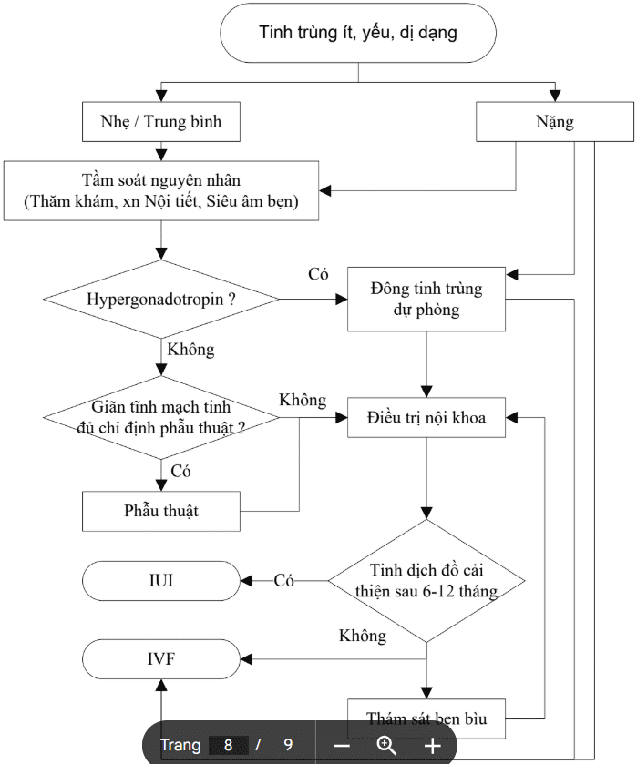
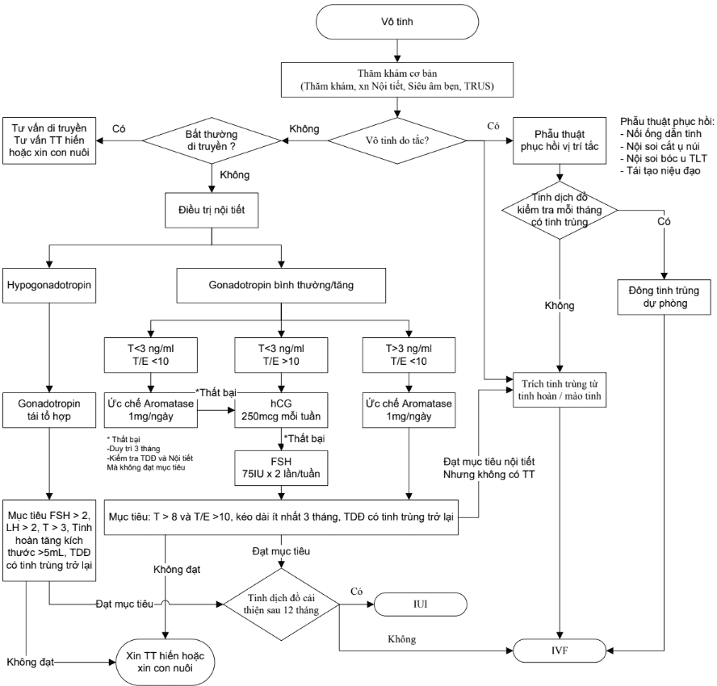

Mục đích của việc khảo sát vô sinh ở nam giới là nhằm xác định:

- Chức năng sinh sản của nam giới.
- Các tác nhân ảnh hưởng đến chức năng sinh sản. Từ đó lên kế hoạch điều trị thích hợp.
- Các bệnh lý có yếu tố di truyền hoặc yếu tố gia đình cần tư vấn cho bệnh nhân và thân nhân để có giải pháp tầm soát phù hợp.

## Chẩn đoán

_Bảng "Phân loại tổn thương chức năng tinh hoàn theo vùng tổn thương"._

| Vùng tổn thương                                   | Loại tổn thương                                             | Nguyên nhân                                                                                                |
| ------------------------------------------------- | ----------------------------------------------------------- | ---------------------------------------------------------------------------------------------------------- |
| **Hạ đồi và tuyến yên**                           |                                                             |                                                                                                            |
|                                                   | Hội chứng Kallmann, Suy giảm chức năng sinh sản nguyên phát | Rối loạn di truyền về chế tiết GnRH                                                                        |
|                                                   | Hội chứng Prader-Labhart-Willi                              | Rối loạn di truyền về chế tiết GnRH                                                                        |
|                                                   | Dậy thì muộn                                                | Rối loạn dậy thì                                                                                           |
|                                                   | Rối loạn chế tiết GnRH thứ phát                             | Khối u, nhiễm trùng, chấn thương, nhiễm xạ, rối loạn tuần hoàn, dinh dưỡng kém, bệnh hệ thống              |
|                                                   | Hội chứng Pasqualini                                        | Suy giảm LH đơn độc                                                                                        |
|                                                   | U tăng tiết Prolactin                                       | U dạng tuyến, thuốc                                                                                        |
| **Tinh hoàn**                                     |                                                             |                                                                                                            |
|                                                   | Thiếu tinh hoàn bẩm sinh                                    | Thiếu tinh hoàn trong giai đoạn bào thai                                                                   |
|                                                   | Thiếu tinh hoàn mắc phải                                    | Chấn thương, xoắn tinh hoàn, khối u, viêm nhiễm, phẫu thuật                                                |
|                                                   | Tinh hoàn lạc chỗ                                           | Suy giảm testosterone và/ hoặc AMH, bẩm sinh, do yếu tố cản trở giải phẫu học                              |
|                                                   | Giãn tĩnh mạch tinh                                         | Suy giảm chức năng tĩnh mạch                                                                               |
|                                                   | Viêm tinh hoàn                                              | Nhiễm trùng kèm theo sự phá hủy lớp biểu mô tế bào mầm sinh dục                                            |
|                                                   | Hội chứng một lớp tế bào Sertoli                            | Bẩm sinh, mắc phải                                                                                         |
|                                                   | Sinh tinh nửa chừng                                         | Bẩm sinh, mắc phải                                                                                         |
|                                                   | Tinh trùng đầu tròn                                         | Thiếu thành phần acrosome                                                                                  |
|                                                   | Hội chứng lông mao không chuyển động                        | Thiếu nhánh dynein                                                                                         |
|                                                   | Rối loạn phát triển sinh dục                                | Giảm biểu hiện ở vùng biệt hóa sinh dục                                                                    |
|                                                   | U tinh hoàn                                                 | Bẩm sinh / mắc phải                                                                                        |
|                                                   | Dấu tích ống dẫn trứng                                      | Đột biến thụ thể AMH                                                                                       |
|                                                   | Giảm sản tế bào Leydig                                      | Đột biến thụ thể LH                                                                                        |
|                                                   | Rối loạn tổng hợp steroid                                   | Khiếm khuyết men tổng hợp testosterone                                                                     |
|                                                   | Vô căn                                                      | N46                                                                                                        |
| **Trục hạ đồi - tuyến yên - tinh hoàn**           |                                                             |                                                                                                            |
|                                                   | Hội chứng suy sinh dục khởi phát muộn                       | Suy sinh dục nguyên phát hoặc thứ phát                                                                     |
| **Tổn thương ống dẫn tinh và tuyến phụ sinh dục** |                                                             |                                                                                                            |
|                                                   | Viêm nhiễm                                                  | Vi khuẩn, virus, Chlamydia                                                                                 |
|                                                   | Tắc nghẽn                                                   | Bất thường bẩm sinh, nhiễm trùng, tắc ống dẫn tinh. Hoặc do lỗi sau phẫu thuật cắt ruột thừa, ghép thận... |
|                                                   | Xơ nang                                                     | Đột biến gen CFTR                                                                                          |
|                                                   | Bất sản ống dẫn tinh                                        | Đột biến gen CFTR                                                                                          |
|                                                   | Vô sinh do miễn dịch                                        | Tự miễn                                                                                                    |
|                                                   | Rối loạn tiết dịch                                          | -                                                                                                          |
| **Rối loạn hình thành tinh dịch**                 |                                                             |                                                                                                            |
|                                                   | Bất thường lỗ niệu đạo                                      | Bẩm sinh                                                                                                   |
|                                                   | Dương vật dị dạng                                           | Bẩm sinh / mắc phải                                                                                        |
|                                                   | Rối loạn cương                                              | Do sự kết hợp của nhiều yếu tố gây ra                                                                      |
|                                                   | Rối loạn xuất tinh                                          | Bẩm sinh / mắc phải                                                                                        |
|                                                   | Hẹp bao da quy đầu                                          | Bẩm sinh                                                                                                   |
| **Cơ quan đích của Androgen**                     |                                                             |                                                                                                            |
|                                                   | Hội chứng giảm nhạy cảm với Androgen hoàn toàn              | Tổn thương thụ thể Androgen                                                                                |
|                                                   | Hội chứng Reifenstein                                       | Tổn thương thụ thể Androgen mức độ nhẹ                                                                     |
|                                                   | Bìu và quy đầu chẻ đôi hoặc lỗ tiểu đóng thấp               | Tổn thương thụ thể Androgen mức độ nhẹ                                                                     |
|                                                   | Teo cơ Bulbo                                                | Tổn thương thụ thể Androgen                                                                                |
|                                                   | Lỗ tiểu đóng thấp dưới bìu, âm đạo giả                      | Rối loạn 5α-reductase                                                                                      |
|                                                   | Kháng estrogen                                              | Tổn thương thụ thể Estrogen                                                                                |
|                                                   | Suy giảm estrogen                                           | Rối loạn aromatase                                                                                         |
| **Gen và biểu hiện gen**                          |                                                             |                                                                                                            |
|                                                   | Hội chứng Klinefelter, 47, XXY                              | Phân bào giảm nhiễm không phân ly                                                                          |
|                                                   | Hội chứng nam, 46, XX                                       | Chuyển đoạn của một phần thuộc NST Y                                                                       |
|                                                   | Hội chứng 47, XYY                                           | Phân bào giảm nhiễm không phân ly                                                                          |
|                                                   | Hội chứng Noonan                                            | Đột biến gen PTPN11, KRAS, SOS1, và RAF1                                                                   |
|                                                   | Biểu hiện exogenous                                         | Thuốc, chiếu xạ, nhiệt, môi trường, chất độc, xơ gan, suy thận                                             |

### Lâm sàng

#### Tiền sử

**Quá trình phát triển:**

- Tiền sử tinh hoàn ẩn.
- Độ tuổi dậy thì.
- Nữ hóa tuyến vú.
- Bất thường bẩm sinh của hệ niệu hay hệ thần kinh trung ương.

**Ngoại khoa:**

- Hạ tinh hoàn ẩn xuống bìu.
- Phẫu thuật vùng chậu, bẹn, bìu hay sau phúc mạc.
- Phẫu thuật khâu phục hồi thoát vị.
- Phẫu thuật cắt thần kinh giao cảm.
- Phẫu thuật tắc ống dẫn tinh.
- Chấn thương bìu.
- Chấn thương tủy sống.
- Xoắn tinh hoàn.

**Nội khoa:**

- Nhiễm trùng tiểu.
- Bệnh lây lan qua đường tình dục.
- Viêm tinh hoàn.
- Bệnh thận.
- Đái tháo đường.
- Xạ trị.
- Bệnh gây sốt cao gần đây.
- Viêm mào tinh hoàn.
- Bệnh lao và các bệnh mạn tính khác.
- Tình trạng mất khứu giác.
- Khuyết tật trên đường giữa cơ thể như tật hở hàm ếch.

**Thuốc đang dùng.**

**Nghề nghiệp và các thói quen:**

- Phơi nhiễm với hóa chất và nhiệt.
- Tắm nước nóng, xông hơi.
- Tiếp xúc tia xạ.
- Hút thuốc lá, uống rượu, dùng thuốc túy tiện.
- Thuốc làm căng phồng cơ bắp.
- Tiền sử từng có thai hay có con với người khác.
- Các đánh giá và điều trị vô sinh trước đó.

**Tiền sử gia đình:**

- Nhược năng tuyến sinh dục.
- Tinh hoàn ẩn.
- Các dị tật bẩm sinh trên đường giữa của cơ thể.
- Bệnh xơ nang.

#### Bệnh sử

**Khai thác thói quen sinh hoạt tình dục:**

- Khoảng thời gian giao hợp có và không có áp dụng tránh thai.
- Các phương pháp tránh thai đã dùng.
- Các phương pháp hỗ trợ trong giao hợp: chất bôi trơn (một số có tác dụng diệt tinh trùng).
- Thời điểm và mức độ thường xuyên trong giao hợp.

**Bệnh sử sinh sản của vợ:**

- Tiền sử từng có thai hay có con với người khác.
- Chức năng sinh sản của vợ: tuổi, dự trữ buồng trứng, chu kỳ kinh nguyệt.

#### Thực thể

**Khám tổng quát:**

- Thể trạng.
- Các cơ quan: tim mạch, hô hấp, tiêu hóa...
- Đặc điểm nam tính thứ phát: hệ lông tóc, kiểu hình hoạn quan, tuyến vú...
- Khám tâm thần (nếu có).

**Khám sinh dục:**

- Hệ thống lông mu.
- **Khám dương vật:** Kích thước; Da quy đầu; Lỗ tiểu đóng thấp; Cong dương vật quá mức.
- **Khám bìu:** Hệ thống cơ bám da bìu; Kích thước của tinh hoàn, mật độ; Sờ nắn cẩn thận mào tinh có thể xác định được đầu, thân và đuôi mào tinh. Có tắc hay không?; Sờ nắn ống dẫn tinh để đảm bảo là nó có tồn tại hay bị teo (bất sản); Thăm khám thừng tinh giúp xác định tình trạng giãn tĩnh mạch thừng tinh, đánh giá mức độ giãn.

- **Khám trực tràng:** Tiền liệt tuyến và túi tinh hai bên.

### Cận lâm sàng

#### Xét nghiệm cơ bản

**Tinh dịch đồ** với tất cả các bệnh nhân cần xét nghiệm ít nhất 2 lần tinh dịch đồ.

- Với kết quả tinh dịch đồ tốt, khám nam tạm thời hoàn tất.
- Với kết quả tinh dịch đồ bất thường → tìm nguyên nhân.

**Định lượng nội tiết:** FSH, LH, Prolactin, Estradiol, Testosterone, AMH.

Tùy theo kết quả thăm khám sẽ có những hình thức điều trị cụ thể.

#### Chẩn đoán hình ảnh

**Siêu âm:** tinh hoàn, ống dẫn tinh, túi tinh, tiền liệt tuyến, bụng tổng quát ...

## Điều trị

| Nhóm bệnh lý                                                  | Điều trị                                                                     |
| ------------------------------------------------------------- | ---------------------------------------------------------------------------- |
| **Điều trị theo nguyên nhân**                                 |                                                                              |
| Hội chứng Kallmann và suy giảm chức năng sinh sản nguyên phát | GnRH hoặc Gonadotropin                                                       |
| Suy tuyến yên                                                 | Gonadotropin                                                                 |
| U tăng tiết Prolactin                                         | Dopamine agonist                                                             |
| Nhiễm trùng                                                   | Kháng sinh                                                                   |
| Bệnh lý mãn tính (suy thận, đái tháo đường)                   | Điều trị bệnh lý nền                                                         |
| Thuốc, thuốc phiện, độc chất                                  | Điều trị hỗ trợ loại trừ hoặc tăng đào thải                                  |
| Vô tinh do tắc                                                | Nối ống dẫn tinh - mào tinh, nối ống dẫn tinh đầu - tận, TESE                |
| Rối loạn cương                                                | Tư vấn tâm lý tính dục, ức chế PDE-5, tiêm prostaglandin                     |
| Xuất tinh ngược dòng                                          | Imipramine, Midodrine                                                        |
| **Điều trị dự phòng**                                         |                                                                              |
| Tinh hoàn lạc chỗ                                             | Chuyển vị tinh hoàn (GnRH/hCG)                                               |
| Dậy thì muộn                                                  | Testosterone/GnRH/hCG                                                        |
| Yếu tố ngoại sinh (Xquang, thuốc, độc chất)                   | Hạn chế tiếp xúc                                                             |
| Bệnh lý ác tính                                               | Bảo tồn hoặc trữ đông mô tuyến sinh tinh                                     |
| **Điều trị không theo nguyên nhân**                           |                                                                              |
| Không tinh hoàn 2 bên                                         | (Testosterone thay thế)                                                      |
| Hội chứng một lớp tế bào Sertoli hoàn toàn                    | -                                                                            |
| Suy giảm phát triển mô tuyến sinh dục                         | (Testosterone thay thế)                                                      |
| **Điều trị theo kinh nghiệm**                                 |                                                                              |
| Vô sinh nguyên phát                                           | Điều trị nội khoa hỗ trợ                                                     |
| Vô sinh do yếu tố miễn dịch                                   | Giảm miễn dịch                                                               |
| Giãn tĩnh mạch tinh                                           | Tối ưu hóa chức năng sinh sản của vợ hoặc Phẫu thuật cột tĩnh mạch tinh giãn |
| **Điều trị triệu chứng**                                      |                                                                              |
| Suy giảm khả năng sinh sản                                    | Hỗ trợ sinh sản (IUI/IVF)                                                    |

### Thiểu tinh

_Hình ảnh "Lưu đồ xử trí tinh trùng yếu, ít, dị dạng"._

**Tinh dịch đồ** thực hiện ít nhất 2 lần, cách nhau 3 - 4 tuần: Phân loại mức độ nhẹ, trung bình, nặng để có hướng xử trí thích hợp.

- Nếu mức độ nặng xử trí trữ đông tinh trùng và tư vấn thụ tinh ống nghiệm.
- Thực hiện thăm khám tầm soát nguyên nhân cho cả 3 trường hợp.

**Định lượng nội tiết sinh sản:**

- Nếu **FSH > 12 IU/L và/hoặc LH > 12 IU/L** → Hypergonadotropin → Trữ đông tinh trùng và tư vấn thụ tinh ống nghiệm.
- Nếu **FSH < 12 IU/L và LH < 12 IU/L:** Điều trị nội khoa; Giãn tĩnh mạch thừng tinh đủ chỉ định phẫu thuật → phẫu thuật; Tinh dịch đồ kiểm tra mỗi tháng trong 6 - 12 tháng.

Chỉ định **bơm tinh trùng vào buồng tử cung (IUI)** hoặc **thụ tinh ống nghiệm (IVF)** tùy thuộc mức độ cải thiện tinh trùng sau điều trị.

### Vô tinh

_Hình ảnh "Lưu đồ xử trí vô tinh"._

**Tinh dịch đồ** thực hiện ít nhất 2 lần, cách nhau 3 - 4 tuần: xác định vô tinh.

**Phân loại vô tinh do tắc và vô tinh không do tắc:**

- **Vô tinh do tắc:** Tìm vị trí tắc nghẽn và lên kế hoạch phẫu thuật phục hồi.
- **Vô tinh không do tắc:** Tầm soát bất thường NST và gen (karyotype, tầm soát vi mất đoạn nhiễm sắc thể Y)... → Nếu có bất thường, tư vấn di truyền và hướng xin tinh trùng hiến hoặc xin con nuôi. Không có yếu tố di truyền, điều trị theo kết quả định lượng nội tiết.

**Định lượng nội tiết sinh sản:**

- **Hypogonadotropin:** Bổ sung Gonadotropin ngoại sinh, đánh giá điều trị bằng định lượng nội tiết, tinh dịch đồ, kích thước tinh hoàn mỗi tháng.
- **Gonadotropin bình thường hoặc tăng** điều trị theo chỉ số testosterone và tỉ lệ testosterone và Estradiol (T/E): Aromatase inhibitor 1mg/ngày trong 1-3 tháng, nếu thất bại đổi phác đồ; hCG 250 µg/tuần trong 3-6 tháng, nếu thất bại đổi phác đồ; FSH 75IU - 225 IU cách ngày trong 3-6 tháng, nếu thất bại đánh giá ngưng điều trị nội khoa, tư vấn xin tinh trùng hiến hoặc xin con nuôi.

**Mục tiêu điều trị** là T > 8 ng/mL, T/E > 10 kéo dài ít nhất 3 tháng, có tinh trùng trong mẫu xuất tinh.

- Nếu đạt mục tiêu nội tiết, vẫn không có tinh trùng trong tinh dịch → **MicroTESE**.
- Nếu đạt mục tiêu có tinh trùng, duy trì điều trị 6-12 tháng tiếp theo.

Chỉ định **IUI** hoặc **IVF** tùy thuộc mức độ cải thiện tinh trùng sau điều trị.

## Tài liệu tham khảo

- Bệnh viện Hùng Vương - [_Phác đồ Hiếm muộn cập nhật 2020_](https://bvhungvuong.vn/danh-cho-nhan-vien/phac-do-hiem-muon-cap-nhat-2020)
