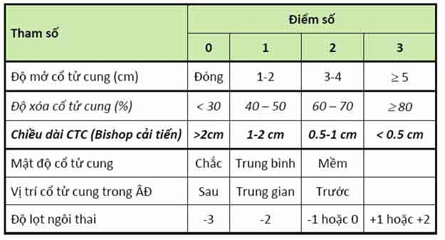

Chi tiết về một số chỉ số trong sản khoa.

## Chỉ số Bishop

Đánh giá:

- < 5 khả năng khởi phát chuyển dạ thất bại.
- 5-6 khởi phát chuyển dạ dè dặt.
- 7-9 khởi phát chuyển dạ trong vòng 8 giờ.
- &#62; 10 khởi phát chuyển dạ trong 2-3 giờ.

## Bề cao tử cung

Công thức tính bề cao tử cung: **Tuổi của thai nhi (tháng) = (Bề cao tử cung : 4 ) + 1**

## Cân nặng thai nhi

Công thức tính cân nặng thai nhi: **Trọng lượng thai nhi (g) =[(chiều cao tử cung (cm) + chu vi bụng (cm)] x 100) : 4**

## Nguồn tham khảo

- TEAM-BASED LEARNING - Trường Đại học Y Dược Thành phố Hồ Chí Minh 2020.
- [Chỉ số nước ối AFI là gì và có ý nghĩa như thế nào?](https://www.vinmec.com/vi/tin-tuc/thong-tin-suc-khoe/chi-so-nuoc-oi-afi-la-gi-va-co-y-nghia-nhu-the-nao/) - Vinmec.
