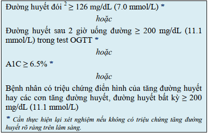
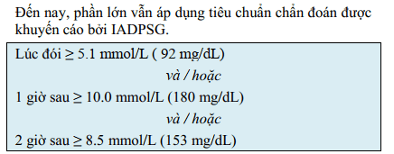
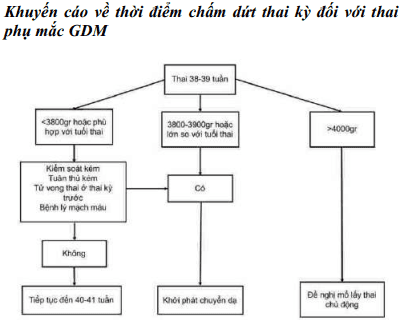

## Phân loại

HIP được chia làm 2 nhóm lớn:

1. Đái tháo đường trong thai kỳ (diabetes in pregnancy - DIP):

- Đái tháo đường lần đầu được chẩn đoán trong thai kỳ
   hoặc 
- Đường huyết cao được chẩn đoán lần đầu trong thai kỳ và **thoả các tiêu chuẩn chẩn đoán đái tháo đường ở người không mang thai của WHO**
- Có thể phát hiện ở bất kỳ thời điểm nào trong thai kỳ kể cả ở **tam cá nguyệt 1**

2. Đái tháo đường thai kỳ (gestational diabetes mellitus - GDM):

- Đường huyết cao trong thai kỳ nhưng **không phải là đái tháo đường thực sự**
- Đường huyết cao được chẩn đoán lần đầu trong thai kỳ
- Có thể phát hiện ở bất kỳ thời điểm nào trong thai kỳ nhưng hầu hết **sau 24 tuần**

## Tiêu chuẩn chẩn đoán đái tháo đường thực thụ

## Tầm soát đái tháo đường thai kỳ

Bằng nghiệm pháp dung nạp đường huyết, từ tuần 24-28 của thai kỳ (Các thời gian khác nhất là sau 28 tuần vẫn có thể làm nghiệm pháp). Điều kiện thai phụ phải nhịn ăn ít nhất 8-10 giờ, sau đó uống 75 g đường khan pha với nước, xét nghiệm đường huyết đói, sau 1 giờ và sau 2 giờ.

Theo FIGO 2018, kết quả được đánh giá như sau:

## Mục tiêu điều trị

## Phương pháp thay đổi đường huyết

### Liệu pháp dinh dưỡng nội khoa

Chế độ dinh dưỡng nội khoa (Medical Nutrition Treatment - MNT) cần đáp ứng được các mục tiêu sau:

1. Ổn định được đường huyết ở mức mục tiêu.
2. Cung cấp đủ năng lượng đảm bảo sức khoẻ cho mẹ và giúp thai phụ tăng cân hợp lý trong thai kỳ.
3. Đảm bảo được sức khoẻ của thai.
4. Ngăn ngừa tình trạng nhiễm cetone.

#### Chế độ ăn và theo dõi

Người đang thực hiện MNT nên ăn 5-7 bữa trong ngày. Các bữa ăn không hoàn toàn giống nhau.

Trong giai đoạn đầu khi thực hiện MNT, khuyến khích thai phụ tự theo dõi thường xuyên đường huyết đói cũng
như đường huyết 3-4 lần/ngày:

- Đường huyết đói: 1 lần/ ngày, sau khi nhịn đói ít nhất 8 giờ.
- Đường huyết sau ăn: sau ăn 1-2 giờ, 2-3 lần/ ngày, xoay vòng cho các bữa ăn khác nhau trong tuần.
- Ít nhất cũng cần theo dõi đường huyết 1 lần/ngày và phải ghi nhận tương quan với thời điểm bữa ăn.

Khi đã đảm bảo đạt được mục tiêu về đường huyết bằng MNT, việc theo dõi đường huyết có thể được nới lỏng hơn. Nếu thực hiện tốt MNT, rất nhiều thai phụ mắc GDM không cần thiết phải dùng thuốc hạ đường huyết và có kết cục chu sinh tốt.

#### Vận động thể lực

Ngoài thay đổi chế độ ăn, thai phụ mắc GDM nên có chế độ vận động phù hợp với từng cá nhân:

- Vận động khoảng 30 phút/ngày.
- Đi bộ nhanh hoặc tập thể dục vùng cánh tay khi ngồi ghế trong 10 phút sau mỗi bữa ăn.
- Những thai phụ vận động tích cực trước khi mang thai được khuyến khích duy trì chế độ vận động của họ trong thai kỳ.

Có thể tham khảo chi tiết [Hướng dẫn điều chỉnh lối sống](./huong-dan-dieu-chinh-loi-song-benh-nhan-dai-duong-thai-ky.docx) và [Phiếu theo dõi đường huyết](./phieu-theo-doi-duong-huyet.docx).

### Thuốc kiểm soát đường huyết

Thuốc hạ đường huyết được chỉ định khi MNT thất bại.

Liều insulin thay đổi tùy theo giai đoạn của thai kỳ. Insulin được dùng 2 lần trong ngày. Mỗi lần cần phối hợp NPH insulin (tác dụng kéo dài) và regular insulin (thường).

- Tam cá nguyệt 1: 0.7-0.8 U/kg/ngày
- Tam cá nguyệt 2: 0.8-1.0 U/kg/ngày
- Tam cá nguyệt 3: 0.9-1.2 U/kg/ngày

Tổng liều insulin sẽ được chia ra như sau: 2/3 buổi sáng và 1/3 buổi tối. **Tuy nhiên chỉnh liều insulin còn phụ thuộc vào từng bệnh nhân.**

**Bộ Y tế Việt Nam chưa cho phép việc dùng Metformin trong thai kỳ cho DIP/GDM.**

## Theo dõi trong thai kỳ

Cần lưu ý những điểm mốc trong chăm sóc thai kỳ với đái tháo đường:

- 10 tuần: Tư vấn cũng như đánh giá các biến chứng của đái tháo đường: **khám mắt và thận** nếu chưa được đánh giá cách 03 tháng. **Khám nội tiết cách 1-2 tuần** trong thai kỳ. **Đo HbA1C** để đánh giá nguy cơ. Hướng dẫn cách tự **theo dõi đường huyết cũng như thực hiện OGTT** đối với thai phụ có tiền căn đái tháo đường thai kỳ càng sớm càng tốt trong tam cá nguyệt 1. **Siêu âm thai** xác định tuổi thai và độ sinh tồn thai.
- 16 tuần: **Khám mắt**. **Tự theo dõi đường huyết và OGTT** nếu đến khám lần đầu lúc tam cá nguyệt 2.
- 20 tuần: **Siêu âm hình thái thai** đặc biệt **siêu âm tim**.
- 28 tuần: **Siêu âm** đánh giá **sự phát triển thai và AFI**. **Khám mắt** đối với các trường hợp đái tháo đường trước thai kỳ.
- 32 tuần: Tương tự như lúc khám thai 28 tuần.
- 36 tuần: **Siêu âm** đánh giá sự phát triển thai và AFI. Ngoài ra, sẽ cung cấp và thảo luận về thời điểm, cách thức, xử trí lúc sanh, phương pháp vô cảm, thay đổi điều trị tăng đường huyết trong và sau sinh, chăm sóc bé sau sinh, ngừa thai và theo dõi.
- 37-38 tuần: **Khởi phát chuyển dạ hay mổ lấy thai** nếu có chỉ định.
- 38 tuần: Thực hiện **test đánh giá sức khỏe thai**.
- 39 tuần: Thực hiện **test đánh giá sức khỏe thai**, lên kế hoạch chấm dứt thai kỳ. Phụ nữ có đái tháo đường thai kỳ **không nên kéo dài quá 40 tuần 6 ngày**.

## Theo dõi trong chuyển dạ

Mức đường huyết được cho là hợp lý trong quá trình chuyển dạ là tử > 70 và < 126 mg/dL (> 3.9 và <7 mmol/L), vì ngưỡng đường huyết này ghi nhận không đưa đến tình trạng hạ đường huyết sơ sinh ở những
thai phụ cần điều trị insulin.

Mức đường huyết trong chuyển dạ > 140 đến 180 mg/dL (7.8 đến 10 mmol/L) liên quan mật thiết đến tình trạng hạ đường huyết sơ sinh và làm tăng nguy cơ nhiễm cetone acid ở mẹ.

## Kết cục sản khoa

### Đối với mẹ

- Tiền sản giật.
- Đa ối dẫn tới rau bong non, chuyển dạ sinh non, đờ tử cung.
- Nhiễm trùng.
- Mổ lấy thai.
- Chuyển sang đái tháo đường thực thụ.

### Đối với con

- Tần suất thai to (thai >= 4000 g) tăng cao.
- Tỷ lệ đột tử của thai tăng.
- Thai có thể bị giới hạn tăng trưởng trong buồng tử cung.
- Chậm trưởng thành các cơ quan như phổi dẫn đến suy hô hấp.
- Hạ đường huyết ở trẻ sơ sinh.
- Nguy cơ trong chuyển dạ như kẹt vai.
- Lâu dài nguy cơ mắc đái tháo đường, thiểu năng tâm thần - thần kinh.

## Theo dõi hậu sản

**Kiểm tra lại đường huyết 6-12 tuần sau sinh.** Lặp lại tối thiểu mỗi 3 năm/lần. Nếu mắc đái tháo đường cần điều trị bằng thay đổi lỗi sống hoặc thuốc (Metformin).

Nhiều thai phụ đái tháo đường **không cần thiết điều trị insulin** trong 48 đến 72 giờ đầu sau sinh. Cần theo dõi đường huyết để có quyết định điều trị thích hợp. Cần dùng insulin trong trường hợp có đường huyết tăng với liều khởi đầu sẽ bằng **2/3 liều trước khi mang thai**.

## Nguồn tham khảo

- TEAM-BASED LEARNING. Trường Đại học Y Dược Thành phố Hồ Chí Minh 2020.
