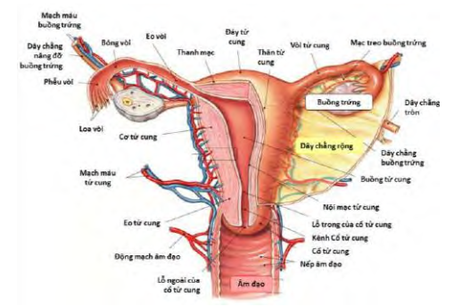
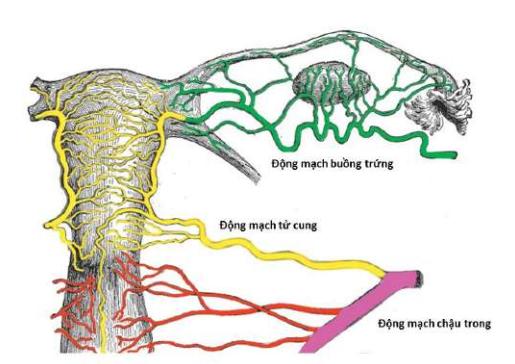

Buồng trứng là tuyến kép, đảm nhận đồng thời 2 vai trò nội tiết và ngoại tiết:

- Buồng trứng ngoại tiết đảm nhận chức năng tạo noãn bào cho quá trình thụ tinh.
- Buồng trứng nội tiết đảm nhận chức năng sản xuất các steroids sinh dục là estrogen và progesterone chuẩn bị cho quá trình làm tổ của trứng đã thụ tinh và duy trì thai kỳ.

## Giải phẫu tử cung và buồng trứng

Buồng trứng là cơ quan nằm trong ổ bụng và không được thanh mạc bao phủ.

Có 2 buồng trứng, 1 bên phải và 1 bên trái nằm áp vào thành bên của chậu hông, phía sau dây chằng rộng.

Buồng trứng có hình hạt đậu dẹt, nặng từ 4-8g, kích thước khoảng 2cm x 3cm x 3cm. Buồng trứng có
màu hồng nhạt, bề mặt buồng trứng thường nhẵn cho tới lúc dậy thì, sau đó càng ngày càng sần sùi vì hiện tượng phóng noãn tạo thành những vết sẹo trên bề mặt.

Buồng trứng có 2 mặt: mặt trong và mặt ngoài. Mặt trong lồi, tiếp xúc với các tua của phễu vòi tử cung và các quai ruột. Mặt ngoài áp vào phúc mạc của thành bên chậu hông nằm trong hố lõm gọi là hố buồng trứng.
Hố buồng trứng được giới hạn do các thành phần nằm ngoài phúc mạc đội lên. Phía trước dưới là dây chằng
rộng, phía trên là động mạch chậu ngoài, phía sau là động mạch chậu trong và niệu quản. Ở đáy hố là động mạch rốn, mạch và thần kinh bịt. Ở người sinh nhiều lần, buồng trứng có thể sa xuống thấp hơn, nằm trong hố Claudius.

Mặt ngoài buồng trứng có vết lõm gọi là rốn buồng trứng là nơi mạch máu và thần kinh đi vào buồng trứng.

Buồng trứng có 2 bờ: bờ tự do và bờ mạc treo buồng trứng. Bờ tự do quay ra phía sau và liên hệ với các quai
ruột, còn bờ mạc treo thì có mạc treo, mạc này treo buồng trứng vào mặt sau dây chằng rộng.

Buồng trứng có 2 đầu: đầu vòi và đầu tử cung. Đầu vòi hướng lên trên, là nơi bám của dây chằng treo buồng
trứng. Đầu tử cung nhỏ hơn, quay xuống dưới, hướng về phía tử cung, là nơi bám của dây chằng riêng buồng trứng. Buồng trứng được treo lơ lửng trong ổ phúc mạc nhờ hệ thống dây chằng và mạc treo buồng trứng.

Động mạch buồng trứng tách ra từ động mạch chủ bụng ở vùng thắt lưng đi trong dây chằng treo buồng trứng để vào buồng trứng ở đầu vòi, ngoài ra còn có nhánh buồng trứng của động mạch tử cung.

Tĩnh mạch đi theo động mạch và tạo thành đám rối tĩnh mạch hình dây leo ở gần rốn buồng trứng.

Bạch huyết theo các mạch và đổ vào các hạch bạch huyết ở vùng thắt lưng.

Thần kinh tách ra từ đám rối buồng trứng đi theo động mạch buồng trứng để vào buồng trứng.

_Động mạch chậu trong cấp máu cho tử cung, và qua các nhánh nối, cấp 1 phần máu cho buồng trứng. Tuy nhiên, động mạch tử cung không phải là nguồn cấp máu chính cho buồng trứng. Nguồn cấp máu chính của buồng trứng đến từ động mạch chủ bụng ở vùng thắt lưng đi trong dây chằng treo buồng trứng để vào buồng trứng ở đầu vòi._

## Nguồn tham khảo

- TEAM-BASED LEARNING - Trường Đại học Y Dược Thành phố Hồ Chí Minh 2020.
