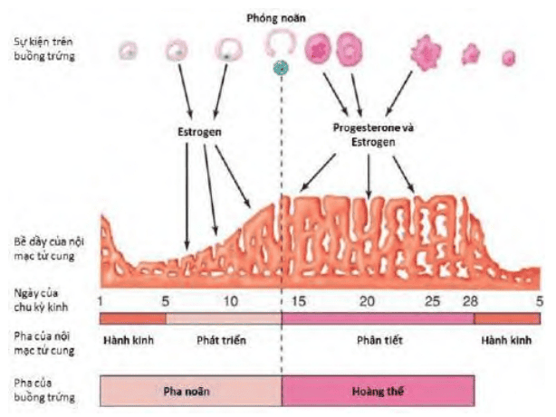

Steroid sinh dục là có nguồn gốc từ các tuyến sinh dục nam và nữ. Có 3 nhóm steroid sinh dục là progesterone (21 carbon), androgen (19 carbon), và estrogen (18 carbon).

Chúng cùng có chung nguồn gốc là cholesterol. Các nhánh bên của cholesterol được cắt bỏ, tạo pregnenolone. Quá trình sinh tổng hợp các steroid sinh dục chính là quá trình cắt ngắn dần phân tử pregnenolone có 21 carbon để tạo ra các steroid sinh dục có số nguyên tử carbon ít dần. Các phân tử steroid nhóm progesterone có 21 carbon, các phân tử steroid nhóm androgen có 19 carbon, và các phân tử steroid nhóm estrogen có 18 carbon.

## Steroid sinh dục

### Androgen

Androgen có nguồn gốc từ các nang noãn chưa lệ thuộc gonadotropin.

Sau khi được chiêu mộ, các nang noãn tiền hốc và nang hốc nhỏ là các nang noãn chưa lệ thuộc gonadotropin. DHEA và androstenedione là các sản phẩm chính của các nang noãn này.
Tại các nang noãn chưa lệ thuộc gonadotropin, androgen có vai trò chuẩn bị cho nang noãn có đủ khả năng để đi vào các giai đoạn phát triển sau đó. Ở giai đoạn này, androgen là 1 thành phần trong hệ thống androgen-AMH-FSH-estrogen. Mục tiêu là tạo ra các thụ thể gonadotropin trên tế bào tùy hành, đồng thời giữ cho nang noãn không trở nên lệ thuộc gonadotropin quá sớm.

### Estrogen

Estrogen có nguồn gốc chủ yếu từ tế bào hạt của các nang noãn đã được chiêu mộ và đang phát triển, và từ tế bào hoàng thể. Estrogen được lưu hành dưới 3 dạng chính: estrone (E1), estradiol (E2) và estriol (E3).

Các nang noãn dùng androgen để tổng hợp estrogen. Hiện tượng này xảy ra nhờ men aromatase P450:

- Tế bào vỏ của nang noãn sử dụng pregnenolone làm nguyên liệu để tổng hợp androstenedione qua phân tử trung gian là dehydroepiandrosterone (DHEA).
- Tại các nang hốc lớn, tế bào hạt của chúng sử dụng hầu hết lượng androstenedione từ tế bào vỏ cho hoạt động thơm hóa steroid, để tổng hợp estrone và estradiol. Vì thế, chúng phóng thích rất ít androgen vào máu ngoại vi.
- Estrone là sản phẩm trực tiếp của tiến trình thơm hóa tiền chất của nó là androstenedione. Tiến trình thơm hóa diễn ra tại tế bào hạt, với sự tham gia của aromatase P450. Hoạt động thơm hóa androstenedione để tạo ra estrone chịu ảnh hưởng gián tiếp của FSH. Estrone có là 1 estrogen yếu. Estrone sẽ được chuyển đổi thuận nghịch thành estradiol.
- Estradiol là 1 estrogen rất mạnh, quan trọng nhất trong các estrogen. Estradiol đảm nhận các chức năng trọng yếu của các cơ quan có nguồn gốc ống Müller.

Estriol là sản phẩn chuyển hóa (tại gan, rau thai) của cả estrone và estradiol.

### Progesterone

Progesterone có nguồn gốc từ tế bào hoàng thể.

Sau phóng noãn, các tế bào tùy hành của noãn nang được hoàng thể hóa, hình thành hoàng thể.

Các tế bào hoàng thể tiếp tục sản xuất estradiol, đồng thời cũng sản xuất progesterone từ pregnenolone. Progesterone cùng với estradiol đảm nhận các chức năng trọng yếu của các cơ quan có nguồn gốc ống Müller.

17α-hydroxy progesterone là sản phẩm chuyển hóa từ 17α-hydroxy pregnenolone. 17α-hydroxy progesterone có thể có nguồn gốc hoàng thể, nhưng nó được biết đến như là 1 progesterone có nguồn gốc thượng thận. Phân tử này là phân tử gốc của các glucocorticoids.

## Cơ chế tác động

Các steroid sinh dục tác động trên cơ quan đích của chúng thông qua các thụ thể nằm trong nhân (hoạt động bằng cách gắn lên DNA) hay ở màng tế bào (kiểu G Coupled Protein Receptor (GCPR)).

Steroids sinh dục có 2 kiểu tác động:

1. Tác động không qua gene (non-genomic) nếu steroid sinh dục đến gắn với thụ thể GPCR ở màng tế bào.
2. Tác động qua gene (genomic) nếu steroid sinh dục gắn đến với thụ thể nhân.

### Tác động không qua gene

Tác động không qua gene của steroid sinh dục có thể thấy trên các cơ quan đích có nguồn gốc Müller lẫn các cơ quan đích không có nguồn gốc Müller.

Trong kiểu tác động không qua gene, hormone gắn vào thụ thể kiểu GPCR trên màng bào tương. Hàng loạt các phản ứng dây chuyền, là các dòng thác tín hiệu thứ cấp của các phân tử trọng yếu như $Ca^{++}$, PI3K/Akt, MAPK, Protein Kinase C, AMP vòng... được kích hoạt tức khắc sau khi hormone tiếp xúc với thụ thể. Các dòng thác tín hiệu thứ cấp này sẽ tạo ra biểu hiện của tác động không qua gene của hormone: co cơ, phóng thích kisspeptin từ các KNDy neuron thuộc nhân cung...

Đặc điểm của kiểu tác động không qua gene là nhanh chóng, lệ thuộc liều, chuyên biệt thấp, có thể đảo ngược. Tác động không qua gene lệ thuộc mạnh vào nồng độ của hormone, và thường đòi hỏi các nồng độ tương đối cao (ở mức micromol) của hormone hay chất tương tự.

:::caution[Lưu ý]
Dù phức bộ ligand-thụ thể không trực tiếp gắn lên các đoạn gene chuyên biệt, nhưng các dòng thác tín hiệu thứ cấp vẫn có thể tạo ảnh hưởng đến tiến trình điều hòa biểu hiện gene.
:::

### Tác động qua gene

Tác động qua gene của steroid buồng trứng được thấy chủ yếu trên các cơ quan đích có nguồn gốc ống Müller.

Trong nhân tế bào, các thụ thể chuyên biệt của steroid sinh dục tế bào tồn tại ở trạng thái bất hoạt mặc định. Trạng thái bất hoạt này được duy trì bằng các Heat-Shock Protein (HSP) gắn vào thụ thể.

Trong kiểu tác động qua gien, thoạt tiên các steroid sinh dục được gắn với các thụ thể chuyên biệt của chúng trong nhân. Sự gắn kết này loại bỏ HSP, giải phóng thụ thể khỏi ức chế mặc định.

Phức bộ hormone-thụ thể sau đó sẽ được gắn vào DNA ở các vị trí cần chuyển mã RNA.

Phức bộ hormone-thụ thể không đơn độc gắn vào DNA. Yếu tố đồng kích hoạt (coactivator) hoặc đồng ức chế (corepressor) cũng đến gắn vào phức bộ hormone-thụ thể.

Phức bộ "hormone-coactivator" sẽ mở các gene tương ứng cho chuyển mã RNA.

Phức bộ "hormone-thụ thể-corepressor" sẽ không mở được các gene tương ứng cho chuyển mã RNA.

Tác động qua gene chỉ đòi hỏi sự hiện diện với nồng độ sinh lý, ở mức picomol, của hormone trong huyết tương. Do kết quả của tác động là là sự sinh tổng hợp protein, nên đặc điểm của kiểu tác động này là chậm.

#### Thụ thể nhân estrogen

Cả 2 thụ thể nhân của estrogen là các protein. ER-α được mã hóa bởi gene ESR1 thuộc nhiễm sắc thể 6. ER-β được mã hóa bởi gene ESR2 thuộc nhiễm sắc thể 14. Chúng được điều hòa độc lập với nhau.

Sau khi đã tách rời khỏi HSP, các ER sẽ gắn với estrogen tạo các đơn nguyên ER-estrogen. 2 đơn nguyên ER-estrogen sẽ gắn với nhau tạo thành nhị nguyên. Nhị nguyên ER-estrogen có thể là đồng dạng hay không đồng dạng.

Các ER-α và ER-β có vị trí gắn vào gene khác nhau, với các đoạn DNA downstream khác nhau, và do đó có chức năng rất khác nhau.

#### Thụ thể nhân progesterone

Progesterone có 2 thụ thể nhân chuyên biệt là PR-A và PR-B.

Cả 2 thụ thể nhân của progesterone là các protein. Cả PR-A và PR-B được mã hóa bởi cùng 1 gene PGR chung thuộc nhiễm sắc thể 11. Trên PGR, có 2 promoter khác nhau. Tùy theo tiến trình chuyển mã RNA bắng đầu bằng promoter nào mà ta sẽ có kết quả dịch mã là PR-A hay PR-B.

Khi progesterone gắn vào PR-B, gene sẽ được mở ra cho tiến trình chuyển mã.

PR-A ngắn hơn PR-B, do điểm khởi đầu chuyển mã là promoter gần. So với PR-B thì PR-A thiếu 1 vùng được gọi là AF3. Thiếu AF3 làm cho PR-A không gắn được với co-activator khi chuyển mã, mà chỉ gắn được với co-repressor. Gắn với co-repressor làm cho gene bị khoá. Nói cách khác, PR-A đảm nhận nhiệm vụ đối kháng với progesterone.

## Cơ quan đích

### Nội mạc tử cung

Tác động trên nội mạc tử cung của các steroid sinh dục là các hoạt động phân bào và chế tiết tại các tuyến nội mạc tử cung, là các tác động qua gene.

Nội mạc tử cung là cơ quan đích quan trọng nhất của các steroid sinh dục. Cấu trúc mô học của nội mạc tử cung thay đổi có tính chu kỳ, lệ thuộc chặt chẽ vào các biến đổi có tính chu kỳ của các steroid sinh dục, và do đó phản ánh trung thực hoạt động chế tiết các steroid của buồng trứng.

#### Estrogen phát triển tuyến nội mạc tử cung

Nội mạc tử cung là mô luôn được tạo mới sau mỗi lần bị phá hủy, nhờ có các tế bào nền dự trữ trong lớp căn bản. Các tế bào nền dự trữ của nội mạc tử cung được trang bị các thụ thể với estrogen (ER).

Ở thời điểm người phụ nữ đang hành kinh, chỉ còn có khoảng 10 nang noãn thứ cấp, hiện diện trên buồng trứng. Chúng chế tiết lượng ít ỏi estrogen. Lượng estrogen ít ỏi này đủ để gây tác động qua gene, thúc đẩy phát triển các tế bào nền dự trữ của nội mạc tử cung, làm chúng trở thành tế bào nội mạc tử cung hoạt động. Các tế bào nền dự trữ của nội mạc tử cung có rất ít thụ thể với progesterone (PR). Không có PR, tại tế bào nền, progesterone không thể gây ra tác động qua gene trên các tế bào dự trữ này của nội mạc tử cung.

Tuyến phát triển có ER và PR. Nồng độ của estrogen tăng dần trong quá trình phát triển noãn nang, làm tế bào tuyến nội mạc phân chia. Cũng dưới tác dụng qua gene của estrogen, các mạch máu của nội mạc tử cung cũng phát triển dần, dài ra và thẳng. Tuyến nội mạc tử cung phát triển sẽ tự tổng hợp các ER, giúp tuyến phát triển hơn nữa dưới estrogen. Đồng thời với việc tổng hợp các ER, tế bào nội mạc tử cung tổng hợp các thụ thể PR.

Số lượng noãn nang phát triển giảm dần trong quá trình chọn lọc noãn nang. Tuy nhiên, sự kiện này không ảnh hưởng đến sự phát triển của tuyến nội mạc tử cung lệ thuộc estrogen, do nang noãn được chọn lọc có khối lượng lớn tế bào hạt, đảm bảo chế tiết lượng lớn estrogen. Estrogen vẫn tăng nhanh đều trong giai đoạn chọn lọc noãn nang của chu kỳ buồng trứng.

Đến giữa chu kỳ kinh nguyệt, khi trên buồng trứng đã chọn lọc được 1 nang de Graaf, nồng độ estrogen đã lên cao đến cực điểm. Lúc này, các tuyến nội mạc tử cung đã phát triển đến mức tối đa, nội mạc dầy lên rõ rệt, chứa đầy các ống tuyến thẳng, dài được trang bị các ER và các PR, với hệ thống các mạch máu tùy hành phong phú.

#### Progesterone phân tiết tuyến nội mạc tử cung

Hiện tượng phóng noãn dẫn đến thành lập hoàng thể. Hoàng thể chế tiết progesterone. Progesterone sẽ tác động trên các tuyến nội mạc, lúc này đã sẵn sàng để tiếp nhận progesterone. Dưới tác động của progesterone, các tuyến nội mạc đã phát triển trước đó sẽ ngưng phân chia và phát triển. Chúng bắt đầu chuyển sang hoạt động chế tiết, tích lũy glycogen, với các mạch máu trở thành xoắn ốc, cung cấp máu tối đa cho nội mạc. Mô đệm nội mạc trở nên phù nề và sẵn sàng tiếp nhận noãn đã thụ tinh đến làm tổ. Như vậy, progesterone là hormone của "sự hoài thai".

Do PR chỉ được tổng hợp bởi estrogen, nên progesterone chỉ tác động được lên nội mạc đã được chuẩn bị trước với estrogen. Progesterone không thể tác động lên nội mạc không được chuẩn bị trước với estrogen. Trên nội mạc tử cung, estrogen và progesterone có vai trò nối tiếp và có tác dụng hiệp đồng.

#### Hành kinh

Hành kinh là kết quả của sự sụt giảm đột ngột của nồng độ của cả 2 steroid sinh dục lưu hành, gây sụp đổ hoàn toàn nội mạc tử cung.

Vào cuối chu kỳ buồng trứng, hoàng thể bị thoái triển do không còn LH. Sự thoái triển này dẫn đến việc sụt giảm đột ngột nồng độ của cả 2 steroid sinh dục lưu hành. Nội mạc tử cung không còn nhận được hormone, sẽ bị hoại tử, bong tróc và sụp đổ hoàn toàn, nhanh chóng, gây ra hiện tượng hành kinh.
Như vậy, hành kinh bình thường đòi hỏi đồng thời 2 điều kiện về nội tiết quan trọng là:

1. Nội mạc tử cung phải tiếp nhận tuần tự cả 2 loại steroid sinh dục.
2. Cả 2 steroid sinh dục này phải chấm dứt hoạt động cùng lúc.

_Phần trên của hình cho thấy các giai đoạn của phát triển noãn nang. Phần dưới của hình cho thấy 2 giai đoạn của nội mạc tử cung.  Trong pha nang noãn, dưới tác động của E2 từ các nang thứ cấp và nang de Graaf, tuyến nội mạc phát triển theo chiều dài làm nội mạc dầy lên. Trong pha hoàng thể, dưới tác động đồng thời của E2 và P4 từ hoàng thể, tuyến nội mạc tử cung trở nên ngoằn ngoèo, xoắn ốc và chứa đầy glycogen: Nội mạc ở giai đoạn phân tiết.  Vào cuối chu kỳ, tương ứng với giai đoạn của bạch thể, nồng độ E2 và P4 bị giảm sút đột ngột, gây ra sự bong tróc hoàn toàn của nội mạc tử cung._

Lệch lạc trong hiệp đồng giữa estrogen và progesterone sẽ ảnh hưởng đến chức năng "hoài thai" của nội mạc tử cung. Những điều kiện "phơi bày với steroid" bất thường sẽ làm thay đổi biểu hiện gene trên nội mạc tử cung.

Các bất thường trong phơi bày nội mạc tử cung với các steroids có thể dẫn đến các tác động qua gene hay không qua gene không mong muốn.

Sự xuất hiện không đúng thời điểm của progesterone ảnh hưởng bất lợi trên khả năng mang thai là ví dụ về bất thường do tác động qua gene của lệch lạc trong hiệp đồng. Sự có mặt quá sớm của progesterone, ngay trong giai đoạn phát triển noãn nang gây phân tiết hóa sớm nội mạc tử cung, làm đặc điểm mô học của nội mạc bị lệch pha so với thời điểm làm tổ của trứng thụ tinh, dẫn đến hệ quả là trứng thụ tinh không thể làm tổ được trên nội mạc tử cung đã bị lệch pha này. Nồng độ estrogen "siêu sinh lý" hệ quả của điều trị "kích thích buồng trứng" ảnh hưởng đến khả năng có thai là ví dụ về bất thường do tác động không qua gene của steroids sinh dục. Kích thích buồng trứng dẫn đến sự hiện diện của rất nhiều nang de Graaf, tạo nồng độ "siêu sinh lý" của estrogen. Nồng độ quá cao của estrogen dẫn đến các thay đổi trong điều hòa các gene chi phối nội mạc (bằng con đường MAPK), làm cho nhiều gene bị điều hòa lên hay điều hòa xuống bất thường. Tình trạng này ảnh
hưởng nghiêm trọng đến khả năng tiếp nhận progesterone của nội mạc và sự làm tổ của trứng đã thụ tinh. Cường estrogen cũng có thể gây điều hòa bất thường PR, làm cho tương quan PR-A:PR-B trở nên bất thường, làm cho nội mạc tử cung không còn khả năng tiếp nhận progesterone.

### Chất nhày cổ tử cung

Như các cơ quan nguồn gốc ống Müller khác, biểu mô tuyến của kênh cổ tử cung chịu tác động qua gene của cả 2 loại steroid sinh dục.

#### Estrogen tạo thuận lợi cho sự xâm nhập của tinh trùng

Estrogen tạo ra chất nhầy thuận lợi cho sự xâm nhập của tinh trùng.

Trong giai đoạn phát triển nang noãn, dưới tác dụng của estrogen, tuyến cổ tử cung chế tiết ra chất nhầy cổ tử cung. Nồng độ estrogen càng cao thì sự chế tiết chất nhầy càng nhiều. Vào giữa chu kỳ, nồng độ estrogen huyết tương rất cao do hoạt động của nang de Graaf làm cho chất nhầy cổ tử cung đạt mức tối đa. Chất nhầy trở nên trong, loãng, nhiều và dai, với matrix rất thưa, tạo điều kiện thuận lợi nhất cho sự xâm nhập lên trên của tinh trùng.

#### Progesterone ngăn cản tinh trùng và vi khuẩn xâm nhập

Progesterone làm đông đặc chất nhầy cổ tử cung, ngăn tinh trùng và vi khuẩn xâm nhập.

Sau khi phóng noãn, progesterone từ hoàng thể sẽ tạo ra tác động đối kháng với estrogen trên chất nhầy cổ tử cung.

Dưới tác động của progesterone, chất nhầy cổ tử cung trở nên đặc, đục, bở và ít. Tinh trùng và phần lớn các vi sinh khác sẽ không thể xâm nhập lên đường sinh dục trên qua ngả cổ tử cung. Đường sinh dục trên đã được bảo vệ cẩn mật sau khi đã có sự xâm nhập của tinh trùng.

### Cơ trơn tử cung và cơ trơn vòi Fallope

Tác động của steroid sinh dục trên cơ trơn của các cơ quan có nguồn gốc ống Muller là tác động không qua gene. Hormone gắn kết với thụ thể ở màng bào tương và khởi phát dòng thác phản ứng liên quan đến $Ca^{++}$, dẫn đến hiện tượng co thắt cơ trơn hay thư giãn cơ trơn xảy ra tức thời ngay sau đó.

#### Estrogen tăng co thắt cơ trơn vận chuyển hợp tử đi về phía buồng tử cung

Quanh và ngay sau phóng noãn, nồng độ estrogen rất cao. Nồng độ cao này làm các cơ trơn của ống dẫn trứng co thắt và tạo nên các nhu động vận chuyển trứng đã thụ tinh từ đoạn xa của ống dẫn trứng đi về phía tử cung. Cũng do tác động co thắt của các cơ vòng tại vị trí lỗ cắm của ống dẫn trứng vào buồng tử cung mà lối vào của tử cung từ phía ống dẫn trứng bị đóng lại, ngăn cản trứng đã thụ tinh vào buồng tử cung sớm, khi nội mạc tử cung chưa được chuẩn bị đúng mức với progesterone.

#### Progesterone mở rộng lối vào buồng tử cung và làm tử cung ngưng co thắt

Vào ngày thứ năm sau phóng noãn, nồng độ progesterone đã đủ cao để chuẩn bị cho sự làm tổ của trứng thụ tinh. Nồng độ cao progesterone làm ngưng các hoạt động co thắt cơ trơn, kể cả cơ vòng án ngữ lối vào buồng tử cung. Hợp tử dễ dàng lọt vào buồng tử cung và tiến hành tiến trình làm tổ. Cơ tử cung lúc này cũng đang ở trạng thái thư giãn dưới tác dụng của progesterone.

### Hạ đồi và tuyến yên

Các phản hồi âm và dương của steroid sinh dục trên bình diện hạ đồi-yên là ví dụ điển hình các tác động không qua gene của chúng.

Nồng độ cao progesterone trong pha hoàng thể khống chế hoạt động kisspeptin của các KNDy neuron, trong khi đó, nồng độ cao của estradiol giữa chu kỳ sẽ kích thích hoạt động này và tạo ra đỉnh LH tiền phóng noãn.

### Cơ quan đích khác

Tuyến vú là cơ quan không có nguồn gốc ống Muller nhưng chịu tác động của cả 2 steroids sinh dục bằng cơ chế qua gene.

Nhiều cơ quan không có nguồn gốc ống Muller bị chi phối bởi steroids sinh dục như sự tạo xương, chuyển hóa lipid... Chúng thường chỉ chịu ảnh hưởng của 1 trong 2 steroids sinh dục. Hầu hết các tác động này là tác động không qua gene, và thường xảy ra tức thời.

## Nguồn tham khảo

- TEAM-BASED LEARNING - Trường Đại học Y Dược Thành phố Hồ Chí Minh 2020.
