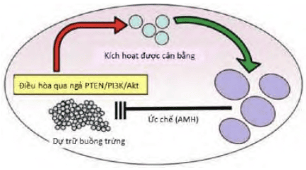
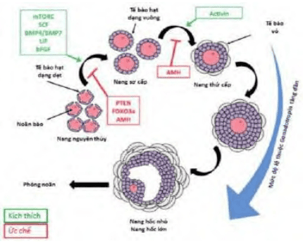
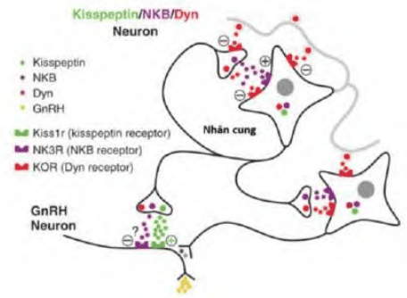
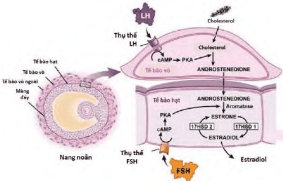
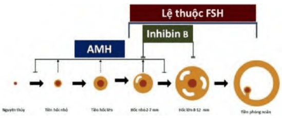
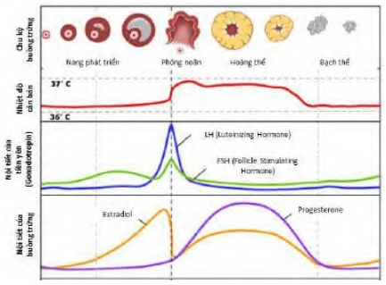
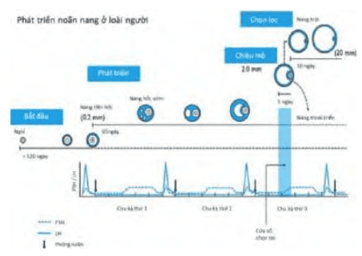

Các noãn nguyên bào là các tế bào sinh dục nguyên thủy có nguồn gốc từ túi noãn hoàng (là cấu trúc ngoài phôi). Buồng trứng của phôi được hình thành khi phôi được khoảng 7 tuần tuổi. Tại thời điểm đó, từ vị trí xuất phát nguyên thủy, các noãn nguyên bào di chuyển về phía ụ sinh dục nguyên thủy, trú đóng ở đó và tham gia tiến trình hình thành buồng trứng. Tại buồng trứng, các noãn nguyên bào thực hiện liên tiếp rất nhiều lần phân chia nguyên nhiễm để gia tăng nhanh chóng về số lượng. Trong suốt thời gian tồn tại của mình, mỗi noãn nguyên bào được bọc bởi 1 ít tế bào tùy hành. Các tế bào tùy hành này có nguồn gốc từ phúc mạc nguyên thủy và trung mô (tức dây giới bào). Phức bộ tạo bởi 1 tế bào sinh dục nguyên thủy và các tế bào tùy hành được gọi là các nang noãn nguyên thủy. Trong những tuần đầu tiên, khi vẫn còn ở giai đoạn phôi, số lượng của các nang noãn nguyên thủy tại buồng trứng sơ khai đã đạt được đến nhiều triệu.

Tại thời điểm nhất định, đột nhiên toàn bộ các tế bào nguồn dòng sinh dục đều ngưng phân chia nguyên nhiễm. Lúc đó, chúng đồng loạt đi vào lần phân bào I của tiến trình phân chia giảm nhiễm. Phân bào I giảm nhiễm diễn ra với tốc độ rất chậm. Đến giữa thai kỳ, phân bào giảm nhiễm tại tất cả các noãn nguyên bào lại bị đình chỉ đột ngột và đồng loạt. Toàn bộ các nang noãn nguyên thủy đồng loạt đi vào trạng thái nghỉ, cho đến khi được chiêu mộ lại sau này. Kể từ lúc này, hoạt động của buồng trứng bị đình trệ thời gian dài, cho đến khi bé gái bước vào tuổi dậy thì.

Chiêu mộ là hiện tượng mà trong đó các nang noãn nguyên thủy ở trạng thái nghỉ được gọi trở lại vào chu kỳ buồng trứng để tham gia vào tiến trình tạo giao tử cái. Tại buồng trứng, kể từ khi bé gái dậy thì cho đến khi người phụ nữ đi vào mãn kinh, diễn ra các làn sóng chiêu mộ nguyên khởi các noãn nang. Ở mỗi làn sóng chiêu mộ nguyên khởi, ước tính có 4x$10^2$ phức bộ noãn nguyên thủy được kêu gọi vào chu kỳ buồng trứng. Quá trình chiêu mộ nguyên khởi lệ thuộc vào các yếu tố nội tại của buồng trứng. Quá trình này độc lập với các hormone ngoại vi lưu hành. Đối thoại cận tiết giữa noãn bào với tế bào tùy hành của nó, cũng như đối thoại cận tiết giữa các phức bộ noãn nang nguyên thủy liền kề là những động lực chính của các làn sóng chiêu mộ nguyên khởi. Đối thoại cận tiết giữa noãn bào và tế bào tùy hành dẫn đến kết quả là phức bộ noãn nguyên thủy trở nên sẵn sàng để được chiêu mộ, đồng thời sẽ lôi kéo các phức bộ liền kề đi vào chiêu mộ. Trong khi đó, đối thoại cận tiết giữa các phức bộ noãn nang nguyên thủy được thực hiện thông qua con đường PTEN/PI3K/Akt. Tiến trình này được điều hòa bởi Anti-Mullerian Hormone (AMH).

AMH có nguồn gốc từ tế bào hạt của các phức bộ nang noãn đã được chiêu mộ, từ giai đoạn nang tiền hốc đến nang hốc nhỏ là mức cao nhất. Sau đó, chế tiết AMH sẽ giảm dần. Trong hoạt động chiêu mộ noãn nang, AMH đóng vai trò là yếu tố cận tiết. Từ nang noãn đã được chiêu mộ, AMH sẽ tác động trở lại những nang noãn nguyên thủy khác chưa được chiêu mộ. AMH can thiệp vào tiến trình chiêu mộ thông qua kiểm soát cân bằng PTEN/PI3K, nhờ vậy hạn chế được số nang noãn được chiêu mộ. AMH có vai trò như "người gác cổng", chỉ cho phép số lượng hạn chế nhất định các phức bộ noãn nguyên thủy đi vào chu kỳ buồng trứng.

_Con đường PTEN/PI3K/AKT. PTEN và PI3K có tác dụng trái ngược. PI3K chuyển đổi PIP2 thành PIP3, trong khi đó PTEN gây ra chuyển đổi ngược lại. PIP3 phosphoryl hóa AKT, dẫn đến phosphoryl hóa FOXO3. FOXO3 được phosphoryl hóa sẽ không còn phong tỏa DNA. Tế bào được kích hoạt Akt được phosphoryl hóa cũng phosphoryl hóa TSC1 và TSC2, kích hoạt mTOR và thúc đẩy dịch mã RNA._

Các phức bộ noãn nguyên thủy đã được chiêu mộ tái tục phân bào giảm nhiễm đã bị đình chỉ từ thời kỳ bào thai, để chuẩn bị tạo giao tử cái. Các nang noãn đã chiêu mộ sẽ lần lượt phát triển qua các giai đoạn noãn sơ cấp, rồi thứ cấp sớm và cuối cùng là thứ cấp muộn. AMH là yếu tố chuẩn bị cho nang noãn đã được chiêu mộ trở nên sẵn sàng để đón nhận gonadotropin. Trên những nang noãn đã được chiêu mộ, AMH có nhiệm vụ bảo vệ cho chúng thoát khỏi hiện tượng thoái triển.

_Điều hòa chiêu mộ noãn nang qua con đường PTEN/PI3K/Akt và Anti-Mullerian Hormone._

Trong các giai đoạn sớm sau chiêu mộ, AMH còn có nhiệm vụ kìm hãm tốc độ phát triển nang noãn, không cho chúng bước quá sớm vào giai đoạn lệ thuộc gonadotropin. Trong điều kiện bình thường, phần lớn các phức bộ nang noãn đã được chiêu mộ sẽ thoái triển. Sau 60-90 ngày, chỉ còn lại khoảng 10 trong số chúng là đến được giai đoạn kế tiếp. Lúc này, trên các tế bào tùy hành của nang thứ cấp muộn đã có đầy đủ các thụ thể với gonadotropin.

_Tổng quan về các autocrine và paracrine trong giai đoạn chiêu mộ noãn nang, chưa lệ thuộc gonadotropin._

Nhân cung của hạ đồi là cơ quan cao nhất của trục hạ đồi-yên-buồng trứng. Nhân này có chứa 2 loại neuron là KNDy neuron và GnRH neuron. KNDy neuron kiểm soát hoạt động của GnRH neuron thông qua peptide là kisspeptin. Kisspeptin có tác dụng dương tính trên GnRH neuron. Khi được kích thích bởi kisspeptin, GnRH neuron sẽ phóng thích Gonadotropin Releasing Hormone (GnRH) vào hệ thống mạch cửa nối hạ đồi và tuyến yên.
GnRH được phóng thích từ hạ đồi theo dạng xung, với nhịp độ thay đổi, theo hoạt động của KNDy neuron.

_Liên quan giữa các KNDy neuron và GnRH neuron của nhân cung hạ đồi trong kiểm soát chế tiết GnRH. Các KNDy neuron có thể kiểm soát chế tiết GnRH hạ đồi thông qua kisspeptin (kích thích) hay neurokinin/dynorphin (ức chế). Khi KNDy neuron phóng thích kisspeptin, thì GnRH neuron sẽ phóng thích GnRH. Hoạt động phóng thích kisspeptin của KNDy chịu sự chi phối của võ não lẫn các sex steroids từ tầng dưới của trục._

Dưới ảnh hưởng của các xung GnRH, tuyến yên đáp ứng bằng cách chế tiết 2 loại hormone protein khác nhau, cùng có tác dụng trên buồng trứng là Follicle Stimulating Hormone (FSH) và Luteinizing Hormone (LH). Tùy tần số của xung GnRH mà tuyến yên đáp ứng khác nhau. Tuyến yên sẽ đáp ứng ưu tiên bằng FSH nếu tần số xung GnRH thưa, và sẽ đáp ứng ưu tiên bằng LH nếu tần số xung GnRH dồn dập.

Lúc này, các noãn bào được bao bọc bởi, lần lượt từ ngoài vào trong, là các tế bào vỏ và các tế bào hạt. Các nang noãn ở giai đoạn này được gọi là các nang thứ cấp. Trên bề mặt của tế bào vỏ có thụ thể với LH, và trên bề mặt của tế bào hạt có thụ thể với FSH. Các tế bào này bắt giữ các gonadotropin để phát triển, tăng về số lượng để tạo nên sự phát triển của các nang thứ cấp. Tại các nang thứ cấp đang phát triển, dưới tác động của gonadotropin, các tế bào hạt tùy hành phân chia nguyên nhiễm, đồng thời tổng hợp thụ thể với gonadotropin, làm cho chúng ngày càng nhạy với gonadotropin hơn. Các gonadotropin tác động trên các nang noãn thứ cấp, và là động lực thúc đẩy sự phát triển các noãn nang thứ cấp. Trong khi đó, tại noãn bào, tiến trình phân bào giảm nhiễm vẫn diễn ra chậm rãi. Trên DNA của noãn bào, xảy ra tiến trình methyl hóa cytosine của đảo CpG. Tiến trình methyl hóa cytosine của đảo CpG sẽ đạt cực đại khi noãn bào đạt đến metaphase II của phân bào giảm nhiễm.

Tế bào vỏ tổng hợp androstenedione từ cholesterol, dưới tác dụng của LH. Androstenedione từ tế bào vỏ được chuyển đến các tế bào hạt ở phía trong của noãn nang. Tại tế bào hạt, dưới tác động của FSH, androstenedione được thơm hóa thành estrone (E1) nhờ men aromatase P450. Estrone sẽ chuyển đổi thành estradiol (E2). Estradiol từ tế bào hạt sẽ lưu hành trong máu ngoại vi và tác động lên cơ quan đích. Nang noãn càng phát triển thì tổng khối tế bào hạt càng tăng nhanh, làm nồng độ
estradiol huyết thanh tăng dần.

_Thuyết 2 tế bào, 2 hormone._

Do các nang thứ cấp khác nhau không sở hữu lượng thụ thể gonadotropin như nhau, nên khả năng bắt gonadotropin của chúng khác nhau, dẫn đến sự phát triển khác nhau. Nang thứ cấp nào sở hữu nhiều thụ thể với gonadotropin hơn sẽ bắt giữ gonadotropin dễ dàng hơn, phát triển tổng khối tế bào tùy hành tốt hơn và tự tổng hợp ra nhiều thụ thể với gonadotropin hơn, làm cho chúng càng có khả năng bắt giữ gonadotropin tốt hơn nữa. Trong khi đó, đa số các nang thứ cấp còn lại sở hữu ít thụ thể với gonadotropin hơn, do đó ít có cơ hội bắt giữ gonadotropin, gây hệ quả là chúng không phát triển được khối tế bào tùy hành, và không tổng hợp thêm được thụ thể mới với gonadotropin, làm cho chúng càng khó có cơ hội bắt thêm gonadotropin để tiếp tục phát triển. Phát triển của các nang thứ cấp tạo nên sự tăng của nồng độ estradiol trong máu ngoại vi.

Sự hiện diện của estradiol trong huyết tương sẽ có tác động ức chế hoạt động sản xuất FSH của tuyến yên. Đây chính là phản hồi âm của estradiol trên tuyến yên, còn được gọi là phản hồi thứ nhất của estradiol. Độ mạnh của phản hồi thứ nhất của estradiol tăng dần theo sự tăng của nồng độ huyết thanh của estradiol. Nồng độ estradiol càng cao thì phản hồi càng mạnh, FSH càng xuống thấp. Hệ quả của phản hồi này là nồng độ FSH lưu hành giảm dần, biến thiên theo chiều nghịch với sự tăng của estradiol.

Ngoài estradiol, các tế bào hạt của các nang noãn thứ cấp còn sản xuất hormone quan trọng nữa là Inhibin B. Inhibin B là hormone protein, thuộc nhóm các transforming growth factor β. Các nang noãn thứ cấp sớm không sản xuất Inhibin B. Inhibin B chỉ được sản xuất kể từ khi các nang noãn đạt đến giai đoạn nang thứ cấp muộn. Nồng độ Inhibin B biến thiên thuận với tổng khối tế bào hạt. Inhibin B từ nang noãn, đi vào máu ngoại vi, để tác động trên tuyến yên. Ở đó, Inhibin B ức chế hoạt động chế tiết gonadotropin (chủ yếu là ức chế trên FSH) của tuyến này. Như vậy, trong giai đoạn phát triển noãn nang, tuyến yên chịu sự "kiểm soát kép" bởi 2 hormone từ buồng trứng là estradiol và Inhibin B. Kiểm soát này gây nên tình trạng thiếu hụt FSH từ tuyến yên. Hệ quả của tình trạng giảm sản xuất FSH này là tất cả các nang noãn thứ cấp đang phát triển phải đối mặt với sự thiếu hụt FSH.

_Sản xuất AMH và Inhibin B từ tế bào hạt. Cả AMH lẫn Inhibin B đều có nguồn gốc từ tế bào hạt của nang noãn. AMH được sản xuất từ các nang tiền hốc và nang hốc nhỏ. Inhibin B được sản xuất từ các nang hốc nhỏ và nang hốc lớn. AMH có vai trò chuẩn bị cho nang noãn đi vào giai đoạn lệ thuộc gonadotropin. Trong khi đó, Inhibin B (cùng phối hợp với estradiol) có nhiệm vụ kiểm soát tình trạng chế tiết gonadotropin của tuyến yên._

Trong bối cảnh của sự thiếu hụt toàn thể về FSH, các nang noãn thứ cấp nào có sự phát triển tốt hơn, có nhiều tế bào hạt hơn, đồng nghĩa với có nhiều thụ thể và khả năng bắt giữ FSH tốt hơn sẽ thu gom dễ dàng các phân tử FSH hiếm hoi còn lưu hành để tiếp tục phát triển. Trong khi đó, với các nang thứ cấp còn lại, do chúng sở hữu rất ít tế bào hạt và rất ít thụ thể với FSH, nên chúng sẽ không thể cạnh tranh được về khả năng bắt giữ các phân tử FSH hiếm hoi còn lại. Như vậy tình trạng thiếu hụt FSH, kết quả của phản hồi âm của tăng estradiol và tăng Inhibin B, là động lực của sự chọn lọc noãn nang. Các nang thứ cấp nào đã phát triển tốt sẽ phát triển ngày càng tốt hơn. Các nang thứ cấp nào đã phát triển kém thì ngày càng kém hơn và đi vào thoái triển.

Sự cạnh tranh trở nên ngày càng khốc liệt, khi các nang thứ cấp lớn sản sinh càng nhiều estradiol, làm cho lượng FSH trở về mức cực thấp. Cuối cùng, chỉ có 1 nang noãn tốt nhất, sở hữu nhiều tế bào tùy hành nhất, có nhiều thụ thể với gonadotropin nhất, sản xuất được nhiều estradiol nhất mới có cơ hội phát triển đến tận cùng, gọi là nang trưởng thành (nang de Graaf).

Nang de Graaf gồm noãn bào và các tế bào hạt và các tế bào vỏ tùy hành. Lúc này, noãn bào trong nang de Graaf vẫn còn đang chậm chạp trong tiền kỳ của phân bào thứ nhất của phân bào giảm nhiễm. Trong nhân của noãn bào, tiến trình methyl hóa cytosine các đảo CpG của DNA vẫn đang tiếp diễn. Trong khi đó, các tế bào hạt của nang de Graaf vẫn đang phân chia mãnh liệt theo cấp số nhân dưới ảnh hưởng của lượng FSH dồi dào mà nang de Graaf đã tước đoạt được từ máu ngoại vi. Các tế bào vỏ phát triển mạnh và chứa đầy các thụ thể với LH, cung cấp androgen cho tế bào hạt. Tổng khối tế bào hạt dồi dào đảm bảo cho nang de Graaf tiếp tục sản xuất ra lượng lớn estradiol, đẩy nồng độ estradiol lên cao, vượt cao hơn nồng độ ngưỡng, trong thời gian đủ dài. Ở thời điểm này, Inhibin B giữ nhiệm vụ kiểm soát, tinh chỉnh đáp ứng của tuyến yên với nồng độ estradiol cao.

Nồng độ estradiol tiếp tục tăng cao và vượt nồng độ ngưỡng xác định. Ngưỡng này là ngưỡng nhạy của hạ đồi với estradiol. Khi nồng độ estradiol cao hơn ngưỡng này, các KNDy neuron của hạ đồi sẽ ở trạng thái sẵn sàng cho phản hồi dương với estradiol. Đáp ứng của tuyến yên với nồng độ cao của estradiol được tinh chỉnh bằng Inhibin B. Inhibin B chỉ cho phép tuyến yên trả lời với nồng độ cao estradiol khi nồng độ này được duy trì trên ngưỡng trong thời gian đủ dài. Nồng độ estradiol được duy trì trên ngưỡng trong thời gian đủ dài là điều kiện đủ để tuyến yên cho phản hồi dương với nồng độ cao estradiol. Nồng độ estradiol vượt ngưỡng và được duy trì trên ngưỡng trong thời gian đủ dài chứng minh rằng nang de Graaf hiện hành này là nang tốt nhất, đáp ứng đầy đủ các điều kiện cho quá trình phóng noãn, thụ tinh, làm tổ và mang thai. Khi thỏa cả 2 điều kiện trên, estradiol sẽ kích hoạt phản hồi thứ nhì của nó trên hệ thống các neuron hạ đồi. Đây là 1 phản hồi dương. Trong phản hồi này, tuyến yên sẽ đáp ứng bằng cách phóng thích lượng lớn LH, trong thời gian rất ngắn, tạo đỉnh LH trong máu ngoại vi.

Tại noãn bào, dưới ảnh hưởng của đỉnh LH, noãn bào nhanh chóng hoàn thành phân bào thứ nhất của phân bào giảm nhiễm, ngay sau đó đi vào phân bào thứ nhì của phần bào giảm nhiễm. 36h sau khi xuất hiện đỉnh LH, noãn bào đã đi đến tiến kỳ (metaphase) của phân bào thứ nhì của phân bào giảm nhiễm. Tiến trình trưởng thành cuối cùng của noãn bào đã hoàn tất. Tại nhân của noãn bào, ở cấp độ DNA, tiến trình methyl hóa cytosine các đảo CpG của DNA đạt đến cực đại. Phân bào giảm nhiễm của noãn bào dừng lại ở metaphase của phân bào II, cho đến khi nó được 1 tinh trùng xâm nhập. Sau đỉnh LH, tại khối các tế bào hạt nằm xa noãn bào, tiến trình phân bào nguyên nhiễm bị dừng lại. Cùng thời điểm này, cũng sau đỉnh LH, các tế bào hạt bao quanh noãn bào sẽ tăng cường phân chia, tạo ra khối tế bào có nhiệm vụ đi theo noãn bào sau khi phóng noãn. Chúng tách khỏi các tế bào hạt còn lại, và cùng với noãn bào tạo ra cấu trúc sẵn sàng rời khỏi buồng trứng,
được gọi là đám mây noãn bào. Bề mặt buồng trứng nơi có nang noãn cũng mỏng dần do chịu tác dụng của prostaglandin tại chỗ. Cuối cùng, nang noãn bị vỡ và phóng thích đám mây noãn bào. Như vậy, kết quả của phản hồi thứ nhì của estradiol là đỉnh LH tiền phóng noãn.

Sau khi đã vỡ và phóng thích đám mây noãn bào, phần còn lại của noãn nang co cụm lại. Các mạch máu xâm nhập vào các tế bào bên trong của cấu trúc nang noãn trước đây, cung cấp cholesterol cho chúng và biến chúng thành cấu trúc mới gọi là hoàng thể. Hoàng thể được tạo lập và được duy trì nhờ LH của tuyến yên. Về phương diện nội tiết, hoàng thể tiếp tục sản xuất estradiol, nhưng quan trọng nhất là steroid sinh dục
mới, đặc hữu của hoàng thể là progesterone. Hormone này là steroid sinh dục có vai trò quan trọng trong việc chuẩn bị tiếp nhận trứng đã được thụ tinh và duy trì thai kỳ.

Dưới tác dụng của LH, các tế bào hoàng thể chế tiết estradiol và progesterone. Sản xuất steroid sinh dục của hoàng thể đạt đỉnh vào khoảng 7 ngày sau phóng noãn. Nồng độ progesterone tăng cao trong máu ngoại vi sẽ tạo phản hồi lên tầng trên của trục, ức chế tầng trên. Trên hạ đồi, progesterone làm giảm nhịp điệu của các xung GnRH. Do không còn được kích thích bởi GnRH, sản xuất LH của tuyến yên bị sút giảm. Đó chính là phản hồi âm của progesterone. Do không còn được nuôi dưỡng bởi LH, hoàng thể sẽ dần dần đi vào thoái triển, để lại sẹo trên buồng trứng, gọi là bạch thể. Chu kỳ phát triển của nang noãn tại buồng trứng đã chấm dứt.

_Tiến trình phát triển noãn nang trong chu kỳ buồng trứng, từ noãn nguyên thủy đến bạch thể, được trình bày theo chiều kim đồng hồ._

Hoàng thể thoái triển không còn sản xuất steroid sinh dục nữa, tạo ra sự sút giảm của cả estradiol lẫn progesterone trong máu ngoại vi. Sự sút giảm của nồng độ các steroid sinh dục giải phóng trục hạ đồi-tuyến yên khỏi các ràng buộc của chu kỳ buồng trứng trước và sẵn sàng cho chu kỳ buồng trứng mới.

Mỗi chu kỳ buồng trứng có độ dài 90-120 ngày, kể từ khi 1 đoàn hệ nang noãn nguyên thủy được chiêu mộ cho đến thành viên còn lại cuối cùng của đoàn hệ này là hoàng thể bị thoái hóa thành bạch thể. Trong hơn 60 ngày đầu tiên kể từ khi được chiêu mộ, các nang noãn phát triển hoàn toàn độc lập với các hormone của trục hạ đồi-yên-buồng trứng.

Chỉ trong 4 tuần cuối cùng của chu kỳ buồng trứng thì các noãn nang mới chịu tác động của các hormone hạ đồi-yên, sản xuất các steroid sinh dục và Inhibin B, tác động ngược lại lên trục này qua các feed-back và cơ chế tinh chỉnh.

_Biến động của các hormone tuyến yên và của các hormone steroid sinh dục trong chu kỳ buồng trứng. Phần trên của hình cho thấy sự phát triển của noãn nang ở buồng trứng. Phần dưới của hình cho thấy biến động steroid sinh dục song hành với tiến trình phát triển của noãn nang trong chu kỳ buồng trứng. Phần thứ nhì của hình cho thấy biến động của các gonadotropin song hành với biến thiên của các steroid sinh dục và cho thấy rõ diễn biến của các phản hồi của steroid sinh dục trên trục hạ đồi-tuyến yên._

Như vậy, tại mỗi thời điểm nhất định, song song xảy ra 3-4 chu kỳ buồng trứng khác nhau. 1 chu kỳ gồm các noãn nang vừa được chiêu mộ, không có những thay đổi về hình thái và nội tiết nhìn thấy được. 1 hay 2 chu kỳ còn đang ở trong khoảng giữa của tiến trình, và sẽ được nhìn thấy ngay sau khi chu kỳ đang được thấy bị kết thúc. Chỉ có 1 chu kỳ là có thể quan sát được. Đó là chu kỳ đang ở trong 28 ngày cuối cùng, đang chịu tác động của các gonadotropin và đang sản xuất steroid sinh dục, với những thay đổi về hình thái và nội tiết. Chính các thay đổi về hình thái và nội tiết mà ta có thể quan sát được nó.

_Các chu kỳ buồng trứng nối tiếp nhau._

## Nguồn tham khảo

- TEAM-BASED LEARNING - Trường Đại học Y Dược Thành phố Hồ Chí Minh 2020.
