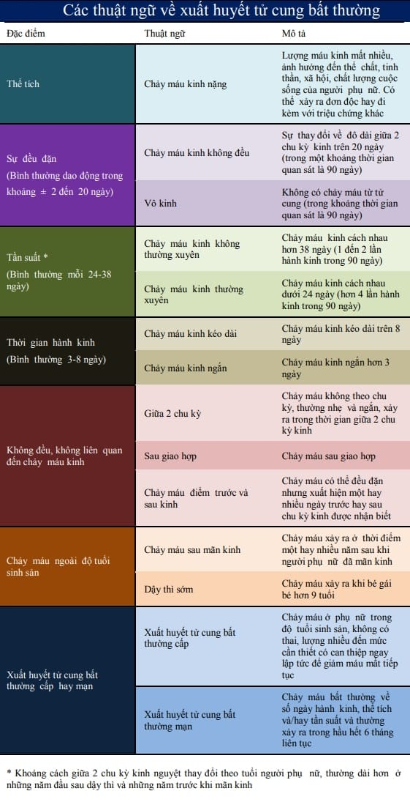
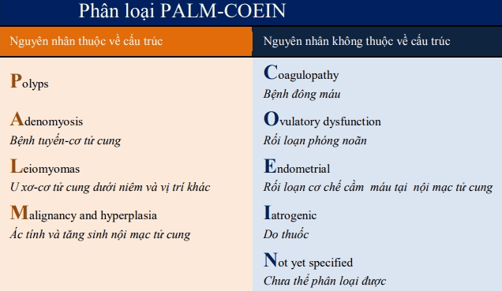
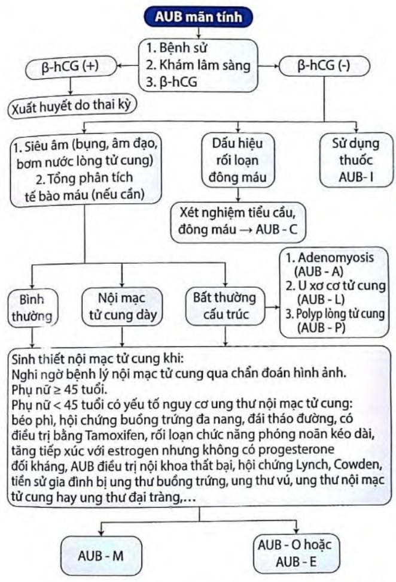
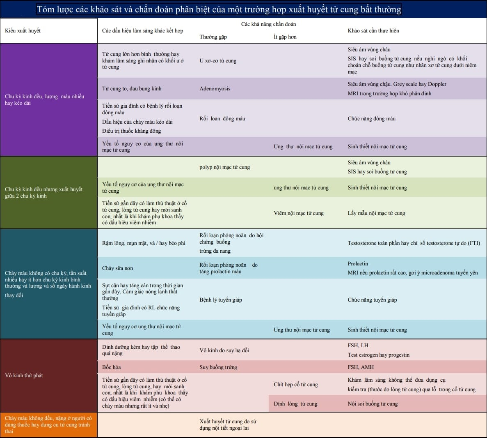

Xuất huyết tử cung bất thường (Abnormal uterine bleeding - AUB) hay gặp ở phụ nữ trong độ tuổi sinh sản.

Xuất huyết tử cung bất thường được định nghĩa là xuất huyết từ tử cung nhưng thay đổi so với chu kỳ kinh ở bất kỳ trong các hình thức sau: thay đổi về tính chu kỳ, số ngày hành kinh, lượng máu kinh và triệu chứng đi kèm.

## Phân loại AUB

Theo FIGO 2018 chia làm 2 hệ thống:

- Hệ thống 1: Theo định nghĩa xuất huyết tử cung bất thường.
- Hệ thống 2: Theo nguyên nhân gây xuất huyết (PALM - COEIN).

### Theo định nghĩa

AUB mạn tính: chảy máu trong lòng tử cung trong 6 tháng gần nhất với sự bất thường về số lượng, thời gian ra máu, tần suất và mất tính chu kỳ.

AUB cấp tính: chảy máu ở phụ nữ trong tuổi sinh sản, không có thai, mức độ nặng, cần can thiệp nhanh để hạn chế lượng máu mất.

_Các thuật ngữ về xuất huyết tử cung bất thường._

### Theo nguyên nhân (PALM - COEIN)

_Phân loại PALM-COEIN._

## Tiếp cận AUB

Hỏi bệnh sử và khám lâm sàng cẩn thận giúp tìm ra nguyên nhân của xuất huyết tử cung bất thường và định hướng cho các khảo sát tiếp theo và xử trí.

Khảo sát cận lâm sàng sơ cấp nhằm loại trừ xuất huyết tử cung bất thường liên quan đến 3 tháng đầu thai kỳ và đánh giá tình trạng thiếu máu:

- β-hCG để loại trừ có thai.
- Tổng phân tích tế bào máu được thực hiện cho các trường hợp xuất huyết tử cung nặng hay kéo dài.
- Nội tiết: tùy theo dấu hiệu và thăm khám gồm chức năng tuyến giáp (FT3, FT4, TSH), prolactin, testosterone, FSH hay LH, estrogen.
- Đông máu khuyến cáo cho các trường hợp AUB nặng tuổi dậy thì, bản thân và gia đình có tiền sử bất thường.
- Pap’s test để loại trừ chảy máu từ cổ tử cung, tầm soát ung thư cổ tử cung.
- Sinh thiết nội mạc tử cung được xem xét cho các phụ nữ bị xuất huyết tử cung bất thường trên 45 tuổi, hay phụ nữ trẻ dưới 45 tuổi có xuất huyết tử cung bất thường không đáp ứng điều trị nội, hay có nguy cơ ung thư nội mạc tử cung.
- Chẩn đoán hình ảnh và soi buồng tử cung cung cấp thêm thông tin để đánh giá và điều trị xuất huyết tử cung bất thường:
  - Siêu âm đường âm đạo là khảo sát hình ảnh đầu tay cho xuất huyết tử cung bất thường.
  - Siêu âm bơm nước buồng tử cung (SIS) hay nội soi buồng tử cung thường được sử dụng khi nghi ngờ có bất thường của lòng tử cung như nhân xơ tử cung dưới niêm mạc hay polyp nội mạc tử cung.
  - Cộng hưởng từ (MRI bụng-chậu) có thể có ích trong bệnh tuyến cơ tử cung và các chẩn đoán phân biệt của nó, hay trong trường hợp có khối u tuyến yên tiết prolactin (MRI sọ não).

_Sơ đồ tiếp cận AUB mạn tính theo Bệnh viện Từ Dũ._

_Tóm lược các khảo sát và chẩn đoán phân biệt của 1 trường hợp xuất huyết tử cung bất thường._

## Xử trí AUB

### Nguyên tắc

Nguyên tắc xử trí xuất huyết tử cung bất thường là:

1. Cầm máu.
2. Xử trí nguyên nhân.
3. Tái lập chu kỳ kinh nguyệt bình thường.

Chọn lựa biện pháp xử trí xuất huyết tử cung bất thường dựa trên nhiều yếu tố:

1. Nguyên nhân xuất huyết tử cung bất thường.
2. Tuổi người phụ nữ.
3. Mong muốn có thai.

### Điều trị cụ thể

#### Nội khoa

Các điều trị nội khoa chủ yếu cho mục đích cầm máu là điều trị bằng steroid sinh dục ngoại sinh. Điều trị bằng steroid ngoại sinh có thể được kết hợp với các thuốc cầm máu không chuyên biệt như kháng viêm không steroid (NSAID) hay các kháng ly giải fibrin. Steroid sinh dục ngoại sinh nhằm mục tiêu khôi phục lại tình trạng nội mạc tử cung bị sụp đổ:

- Estrogen gây phát triển nội mạc.
- Progestogen gây phân tiết nội mạc.

:::caution[Lưu ý]
Progestogen chỉ có thể có tác dụng nếu như nội mạc trước đó đã nhận được estrogen nội sinh hay ngoại sinh. Steroid sinh dục có thể được dùng đơn độc từng loại steroid hay phối hợp cả 2 steroid sinh dục. Chúng có thể dùng bằng nhiều đường khác nhau. Xem thêm tại [Xuất huyết tử cung do cơ năng](/phu-khoa/002-01_xuat-huyet-tu-cung-co-nang/).
:::

Các điều trị nội khoa cho mục đích điều trị nguyên nhân thường là các nội tiết có tác động chuyên biệt:

- GnRH đồng vận.
- SERM.
- SPRM.
- Các LASDS.

Đồng vận GnRH kéo dài gây tình trạng "cắt tuyến yên nội khoa". Thường được dùng cho điều trị u-xơ cơ tử cung hay bệnh tuyến-cơ tử cung, thông qua triệt nguồn cung cấp estrogen từ buồng trứng của nhân xơ hay của bệnh tuyến cơ tử cung.

Selective Estrogen Receptor Modulator (SERM) gây phóng noãn trong những hợp có rối loạn kiểu chu kỳ không phóng noãn (buồng trứng đa nang).

Selective Progesterone Receptor Modulator (SPRM) có tác động trên các u-xơ cơ tử cung, là các khối lệ thuộc progesterone.

Các hệ thống phóng thích steroid tác dụng dài, đặc biệt là dụng cụ tử cung phóng thích progestogen (LNG-IUD) có tác dụng trên các chảy máu nguồn gốc nội mạc tử cung.

#### Ngoại khoa

Điều trị ngoại khoa thường chủ yếu dùng cho các nguyên nhân thuộc bất thường cấu trúc mà không có chỉ định nội khoa hay thất bại với điều trị nội khoa đúng cách.

Nội soi buồng tử cung thường được dùng để cắt đốt polyp nội mạc tử cung hay nhân xơ dưới niêm mạc.

Trong trường hợp cần thiết và bệnh nhân không còn ý định sinh thêm con, các biện pháp mang tính phá hủy như đốt phá hủy nội mạc tử cung hay cắt nội mạc tử cung qua nội soi buồng tử cung, hay thuyên tắc động mạch tử cung để ngưng hay giảm xuất huyết tử cung lâu dài. Bệnh nhân phải được tư vấn rằng đây là các biện pháp không hồi phục.

Chỉ nên xem xét đến cắt tử cung trong trường hợp thất bại với tất cả các điều trị khác. Nhớ rằng thuyên tắc động mạch tử cung có ý nghĩa ngang với cắt tử cung.

## Nguồn tham khảo

- TEAM-BASED LEARNING - Trường Đại học Y Dược Thành phố Hồ Chí Minh 2020.
- PHÁC ĐỒ ĐIỀU TRỊ SẢN PHỤ KHOA - Bệnh viện Từ Dũ.
