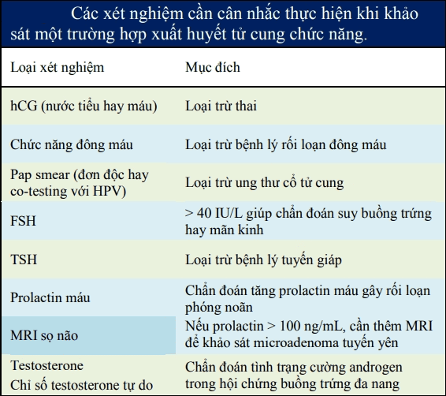
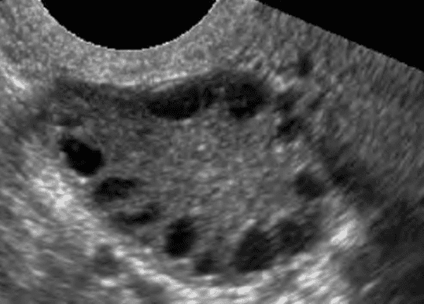
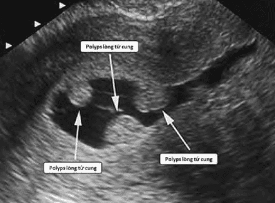

Xuất huyết tử cung chức năng là kiểu xuất huyết tử cung bất thường gây ra do các cơ chế liên quan đến hoạt động nội tiết buồng trứng hay sử dụng nội tiết ngoại lai. Thuật ngữ xuất huyết tử cung chức năng loại trừ tất cả các xuất huyết tử cung có liên quan đến các bệnh lý thực thể của vùng chậu, bệnh lý nội khoa hay do thai. Chẩn đoán của xuất huyết tử cung chức năng là 1 chẩn đoán loại trừ.

## Cơ chế

Xuất huyết tử cung chức năng thường do nội mạc tử cung mất đi sự kích thích của nội tiết có chu kỳ từ các chu kỳ có phóng noãn, estrogen trong nửa đầu của chu kỳ và progesterone kết hợp với estrogen ở trong nửa sau của chu kỳ. Nội mạc tử cung chịu tác động kích thích của estrogen đơn độc kéo dài, nội mạc tử cung tăng trưởng liên tục nhưng không bong ra có chu kỳ. Sự tăng trưởng liên tục của nội mạc tử cung làm cho các mạch máu nuôi không theo kịp để cung cấp máu cho nội mạc tử cung. Mô nội mạc tử cung bị thiếu máu, hoại tử không đồng đều, bong ra từng phần, gây xuất huyết tử cung. Nội mạc tử cung bong tróc không đều cũng dẫn đến hệ quả là quá trình tái tạo nội mạc tử cung cũng không đồng đều và cũng không đều đặn.

Sự kích thích liên tục của estrogen ở nồng độ thấp thường gây ra xuất huyết tử cung chức năng nhẹ, không thường xuyên. Sự kích thích liên tục của estrogen ở nồng độ cao sẽ dẫn đến những đợt xuất huyết tử cung nặng và thường xuyên.

## Nguyên nhân

Khoảng 20% số người bị xuất huyết tử cung chức năng là ở tuổi dậy thì. Trong vòng 18 tháng đầu sau lần đầu tiên có kinh, trục hạ đồi-tuyến yên-buồng trứng chưa trưởng thành hoàn toàn nên có thể không đáp ứng đầy đủ (thể hiện qua các feedback) với estrogen và progesterone, gây ra không phóng noãn.

Khoảng 50% ở tuổi 40-50. Ở phụ nữ lớn tuổi, tiền mãn kinh, cả số lượng và chất lượng của các nang noãn cùng bị giảm. Các nang noãn vẫn phát triển nhưng cơ chế tạo đỉnh LH gây phóng noãn bị hỗn loạn do nồng độ gonadotropin cơ bản tăng cao do giải phóng trục, hệ quả của tình trạng thiếu hụt hay vắng mặt của Inhibin B. Nang noãn không phóng noãn vẫn tiếp tục sản xuất estrogen lượng ít kéo dài, kèm theo đó là vắng mặt của progesterone làm dày nội mạc tử cung, gây ra xuất huyết tử cung do tiếp xúc estrogen kéo dài.

Ở các phụ nữ béo phì, estrone có nguồn gốc ngoài buồng trứng, chủ yếu từ mô mỡ ngoại vi tích lũy và làm dày nội mạc tử cung gây xuất huyết tử cung chức năng do tiếp xúc estrogen kéo dài.

Thiếu hụt giai đoạn hoàng thể cũng có thể gây ra xuất huyết tử cung chức năng do sự sản xuất progesterone bị giảm hay gây tác động không đầy đủ. Kích thích không đầy đủ của progesterone có thể kết hợp với nồng độ estrogen bình thường, cao hay thấp sẽ gây ra vấn đề giống như chu kỳ không phóng noãn.

Hội chứng buồng trứng đa nang và tăng prolactin máu là 2 trạng thái rối loạn nội tiết có thể gây ra xuất huyết tử cung chức năng thường gặp:

- Tăng prolactin máu ức chế hoạt động tuyến yên, và do đó gây rối loạn hoạt động của buồng trứng. Tăng prolactin máu có thể là do nguyên nhân thực thể là 1 microadenoma tuyến yên hay do nguyên nhân cơ năng do dùng các thuốc có tác động hướng thần kinh hay nhiều thuốc khác. Thuốc chống say tàu xe, thuốc kháng bơm proton trong điều trị loét dạ dày-tá tràng, các thuốc điều trị tâm thần... có thể gây ra các tình trạng tăng prolactin máu.
- Hội chứng buồng trứng đa nang là 1 hội chứng do rất nhiều nguyên nhân khác nhau, có chung đặc điểm là các nang noãn không phát triển được, không đi đến hình thành các nang vượt trội, và do đó không có phóng noãn. Các chu kỳ không phóng noãn là nguyên nhân của xuất huyết tử cung chức năng ở hội chứng buồng trứng đa nang.

Xuất huyết tử cung chức năng do sử dụng nội tiết ngoại lai là 1 tình trạng rất thường gặp:

- Thuốc viên tránh thai nội tiết kết hợp estrogen-progestogen với hàm lượng ethinyl estradiol thấp có thể gây xuất huyết tử cung chức năng nhẹ và kéo dài do nội mạc tử cung không được chuẩn bị đầy đủ với estrogen.
- Thuốc tránh thai khẩn cấp dùng progestin liều cao có thể gây xuất huyết tử cung chức năng do mất sự cân bằng giữa estrogen và progesterone, kiểu tương tự như sụp đổ nội mạc do ngưng steroid đột ngột.
- Thuốc tránh thai khẩn cấp dùng selective progesterone receptor modulator (SPRM) có thể xuất huyết tử cung chức năng do tác dụng ly giải hoàng thể sớm và tác dụng kháng progesterone trên nội mạc tử cung.
- Các hệ thống phóng thích steroid tác dụng dài (LASDS) như que cấy tránh thai phóng thích progestin, thuốc tiêm progestin liều cao cũng như các viên thuốc tránh thai chỉ có progestin đơn thuần (POP) gây xuất huyết tử cung bất thường do mất cân bằng estrogen và progesterone.

## Tiếp cận

Hỏi bệnh sử chi tiết về đặc điểm chảy máu và các yếu tố liên quan cho phép định hướng chẩn đoán. Hỏi bệnh sử cần chú ý các yếu tố quan trọng như tuổi, lần cuối cùng có kinh bình thường, lượng và số ngày chảy máu, chảy máu sau giao hợp, các loại thuốc sử dụng (nội tiết, NSAIDs, thuốc kháng đông hay các thuốc hướng thần kinh khác), tiền sử các bất thường nội tiết, dấu hiệu có thai, tiền sử dùng tránh thai nhất là bằng thuốc và chấn thương.

Khám lâm sàng cần chú ý đến các dấu hiệu của rối loạn nội tiết hệ thống (cường giáp hay nhược giáp), hay rối loạn nội tiết đặc thù của hội chứng buồng trứng đa nang (béo phì, tăng nội tiết tố nam)... Khám phụ khoa để loại trừ các bất thường cấu trúc của tử cung và buồng trứng.

_Acantosis nigricans, rậm lông và mụn trứng cá nặng. Đây là các dấu hiệu của cường androgen, quan sát thấy ở hội chứng buồng trứng đa nang, là các dấu hiệu chỉ báo nguyên nhân của xuất huyết tử cung bất thường._

Các xét nghiệm cận lâm sàng chủ yếu để loại trừ các nguyên nhân thực thể:

_Các xét nghiệm cần cân nhắc thực hiện khi khảo sát xuất huyết tử cung chức năng._

Siêu âm đầu dò âm đạo là chỉ định đầu tay. Siêu âm có thể được thực hiện với siêu âm quy ước. Siêu âm giúp khảo sát các đặc điểm của nội mạc tử cung gồm độ dầy, phản âm và các cấu trúc bất thường lòng tử cung. Cũng cần lưu ý đến các hình ảnh có thể giúp định hướng cho các tiếp cận sau đó như u xơ-cơ tử cung, buồng trứng đa nang... Siêu âm với bơm nước lòng tử cung (SIS) được chỉ định khi nghi ngờ có tổn thương trong buồng tử cung.

Sinh thiết nội mạc tử cung được sử dụng như là 1 test chẩn đoán của xuất huyết tử cung chức năng. Kết quả mô học của nội mạc tử cung cho biết tác động của estrogen kéo dài và thiếu tác động đối kháng của progesterone trong các trường hợp xuất huyết tử cung chức năng. Sinh thiết nội mạc tử cung có thể được quyết định sau khi đã có kết quả siêu âm gợi ý sự cần thiết của sinh thiết. Các trường hợp sau nên được chỉ định sinh thiết nội mạc tử cung do nguy cơ ác tính cao ở các nhóm này:

- Phụ nữ trên 35 tuổi bị xuất huyết tử cung chức năng.
- Phụ nữ vô kinh 1 năm hay nhiều hơn bị xuất huyết tử cung chức năng.

_Hình ảnh siêu âm của hội chứng buồng trứng đa nang. Hình chuỗi hạt kinh điển của buồng trứng đa nang. Các nang noãn nhỏ xếp thành chuỗi, phân bố ở ngoại vi buồng trứng._

_Hình ảnh siêu âm bơm nước của polyps buồng tử cung (SIS)._

Nội soi buồng tử cung cung cấp thêm thông tin và loại trừ các nguyên nhân thực thể tại tử cung và buồng trứng. Soi buồng tử cung chỉ thực hiện khi cần thiết, thường là khi nghi ngờ có tổn thương ở lòng tử cung.

## Xử trí

Mục tiêu của xử trí xuất huyết tử cung bất thường gồm cầm máu và tái lập chu kỳ kinh nguyệt bình thường.

Việc chọn lựa biện pháp xử trí xuất huyết tử cung bất thường dựa trên nhiều yếu tố:

1. Nguyên nhân xuất huyết tử cung chức năng.
2. Mức độ chảy máu.
3. Tuổi người phụ nữ.
4. Mong muốn có thai.

### Nội khoa

Sử dụng các thuốc tăng co hồi tử cung, cầm máu và kháng sinh là cần thiết:

- Oxytocin tiêm bắp hay truyền tĩnh mạch tăng co hồi tử cung.
- Ergometrin 0.2 mg 1-2 ống/ngày, tiêm bắp.
- Tranexamic và calci clorid tiêm tĩnh mạch cầm máu.

Thuốc viên tránh thai estrogen-progestogen phối hợp được dùng với mục đích làm giảm sự phát triển nội mạc tử cung, tái tạo lại chu kỳ kinh bình thường, giảm lượng máu kinh và giảm nguy cơ thiếu máu thiếu sắt. Lưu ý rằng chỉ có các loại thuốc tránh thai estrogen-progestogen phối hợp hàm lượng tiêu chuẩn mới được dùng cho mục đích này. Không dùng các thuốc có hàm lượng ethinyl estradiol dưới 20 µg cho mục đích này. Thường sử dụng 2-3 viên/ngày tối đa lên đến 4 viên/ngày đến khi hết ra máu 2 ngày thì giảm dần xuống 1 viên/ngày, duy trì trong 26 ngày từ khi bắt đầu uống thuốc. Khi giảm liều nếu ra máu phải tăng liều lại và giảm liều như cũ. Thường uống vào buổi tối vào 1 giờ cố định để tránh các tác dụng phụ như buồn nôn, hoa mắt, chóng mặt.

Nếu niêm mạc tử cung < 5mm, có thể sử dụng thuốc tránh thai kết hợp như trên và dùng estrogen 1-2 viên/ngày đến khi hết ra máu. Estrogen thường được dùng trong những trường hợp xuất huyết tử cung kéo dài làm nội mạc tử cung bị mỏng đi nhằm phục hồi nội mạc tử cung và cầm máu trước tiên, giúp tái tạo sự phát triển nội mạc tử cung nhanh chóng. Tuy nhiên, mọi nội mạc tử cung có được nhờ điều trị với estrogen đơn thuần phải được tiếp tục với progestogen.

Nếu niêm mạc tử cung > 10mm, có thể sử dụng progestins 2 viên/ngày trong vòng 10-15 ngày. Progestins có thể được dùng đơn độc trong điều trị lâu dài các xuất huyết tử cung chức năng cần nội mạc tử cung được tiếp xúc với progestins có chu kỳ và liên tục. Progestogen kéo dài đối kháng lại tác dụng của việc phơi bày dài ngày với estrogen, là liệu pháp chính trong các trường hợp có tăng sinh đơn giản điển hình của nội mạc tử cung.

Biệt dược trên thị trường:

- Estrogen: Progynova®, Valiera®, Provames®.
- Progesterone: Utrogestan®, Duphaston®.
- Thuốc tránh thai kết hợp: Marvelon®, Regulon®, Rigevidon®, Microgynon®.

### Ngoại khoa

Điều trị ngoại khoa là biện pháp chủ yếu cho xuất huyết tử cung bất thường do nguyên nhân thực thể. Với xuất huyết tử cung cơ năng, điều trị ngoại khoa chỉ được chỉ định trong trường hợp thất bại với điều trị nội khoa.

Nạo buồng tử cung là phương pháp cầm máu tốt nhất.

Đốt nội mạc tử cung để ngưng hay giảm xuất huyết tử cung lâu dài, tuy nhiên, đốt nội mạc cũng đồng nghĩa là chấm dứt khả năng mang thai, có ý nghĩa tương đương với phẫu thuật cắt tử cung. Cắt tử cung được xem xét khi thất bại với tất cả các điều trị khác.

## Nguồn tham khảo

- TEAM-BASED LEARNING - Trường Đại học Y Dược Thành phố Hồ Chí Minh 2020.
