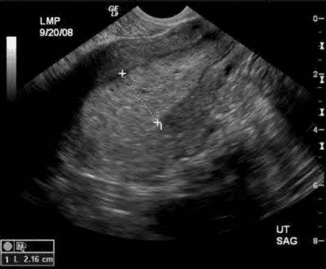
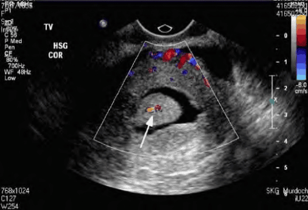
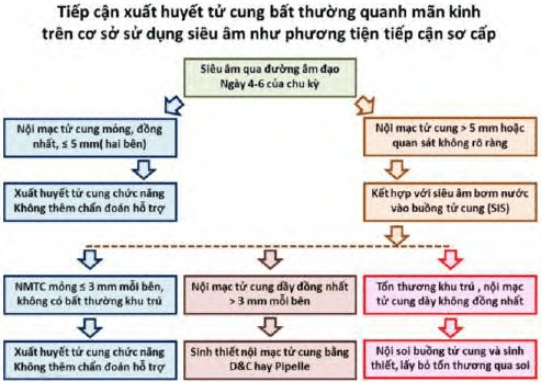

Xuất huyết tử cung bất thường ở độ tuổi quanh mãn kinh có thể là xuất huyết cơ năng nhưng cũng có thể là xuất huyết có nguyên nhân thực thể, hay biểu hiện của tình trạng ác tính. Cần quan tâm để giải quyết những vấn đề cốt yếu như cần loại trừ nguyên nhân ra huyết là do ung thư hay tăng sinh nội mạc tử cung, sau đó làm cho người bệnh nhân yên tâm không quá sợ hãi vì tình trạng ra huyết không mong đợi này.

## Đặc trưng hệ trục hạ đồi-yên-buồng trứng quanh mãn kinh

Đặc trưng hệ trục hạ đồi-yên-buồng trứng quanh mãn kinh là suy giảm ức chế tầng trên của trục.

Suy giảm trữ lượng buồng trứng khởi động các thay đổi nội tiết ở tuổi quanh mãn kinh. Trên buồng trứng, dự trữ noãn nang bị suy giảm nghiêm trong dẫn đến AMH thấp và inhibin B thấp. Do AMH thấp sẽ làm số lượng noãn nang được chiêu mộ và đi đến được đầu chu kỳ giảm rõ rệt. AMH thấp kèm theo số lượng nang noãn thứ cấp thấp là hình ảnh đặc trưng của giai đoạn này. Trữ lượng noãn nang suy giảm dẫn đến tổng khối tế bào hạt giảm, làm giảm inhibin B lưu hành. Do không còn bị ức chế bởi inhibin B, hoạt động phóng thích FSH của tuyến yên tăng mạnh. Tuy nhiên, FSH vẫn còn bị kiểm soát bởi phản hồi thứ nhất của estrogen.

Chu kỳ kinh nhanh với phóng noãn được bảo tồn là đặc điểm của giai đoạn sớm nhất của thời kỳ quanh mãn kinh. Thường thì các nang thứ cấp chỉ bắt đầu phát triển vào ngày 5 của kỳ kinh. Nồng độ cao của FSH dẫn đến sự phát triển sớm của các nang noãn thứ cấp. Ở người quanh mãn kinh, do FSH cao nên các nang thứ cấp bắt đầu tiến trình phát triển và chọn lọc noãn nang dưới gonadotropin từ ngay những ngày cuối của chu kỳ kinh nguyệt trước. Như vậy, chu kỳ kinh nguyệt bị chuyển dịch về phía trước, và chìm lẫn vào phần cuối của chu kỳ trước. Hệ quả là khoảng cách giữa 2 lần hành kinh liền kề sẽ bị rút ngắn. Tuy nhiên, khoảng cách thực sự từ lúc bắt đầu có phát
triển noãn nang đến phóng noãn và khoảng cách từ lúc phóng noãn đến khi có hành kinh vẫn còn bảo tồn. Chức năng phóng noãn và hoàng thể vẫn còn bảo tồn. Chu kỳ kinh nhanh với phóng noãn được bảo tồn là đặc điểm của giai đoạn sớm nhất của thời kỳ quanh mãn kinh.

Cùng với FSH, nồng độ LH căn bản cũng tăng dần. Biên độ đỉnh LH bị thu hẹp. Cuối cùng là sự biến mất của đỉnh LH. Các chu kỳ trở thành chu kỳ không phóng noãn với sự hiện diện đơn độc của estrogen và sự vắng mặt hoàn toàn của progesterone. Nồng độ rất cao của estrogen tại thời điểm xảy ra ly giải hoàng thể đã đủ để ngăn hoàn toàn sự sụp đổ của nội mạc do ly giải hoàng thể. Người phụ nữ không thấy có "kinh" cho dù vẫn có thể có hiện tượng phóng noãn. Khoảng cách giữa 2 lần ra máu
"kinh" bị giãn dài ra. Người phụ nữ chỉ "có kinh" khi thời điểm xuất hiện nang De Graaf bị lệch pha so với thời điểm ly giải hoàng thể. Thêm vào đó, nồng độ LH căn bản tăng dần, trong khi độ cao của đỉnh LH không đổi, làm cho biên độ hữu dụng của đỉnh LH bị thu hẹp. Đỉnh LH dẹt không còn đủ năng lực để gây phóng noãn. Bắt đầu xuất hiện các chu kỳ không phóng noãn. Các chu kỳ không phóng noãn càng làm cho rối loạn chu kỳ trở nên trầm trọng hơn và khó tiên báo được.

Nguyên nhân lớn nhất xuất huyết tử cung bất thường quanh mãn kinh gồm:

1. Nguyên nhân cơ năng do mất đồng bộ (lệch pha, hiện diện không đúng lúc) giữa estrogen và progesterone, xảy ra trong những giai đoạn trung gian của thời kỳ trước mãn kinh.
2. Nguyên nhân cơ năng do vắng mặt hoàn toàn của progesterone trong những giai đoạn muộn của kỳ kinh.
3. Nguyên nhân thực thể liên quan đến các hệ quả của trạng thái nội tiết chỉ có estrogen.
4. Nguyên nhân thực thể tồn tại song hành không liên quan đến các biến đổi của chu kỳ buồng trứng.

## Biểu hiện xuất huyết tử cung bất thường quanh mãn kinh

Thay đổi theo giai đoạn của tình trạng tiền mãn kinh.

Rối loạn độ dài của chu kỳ, với các chu kỳ ngắn lại là biểu hiện trước tiên của tình trạng suy giảm dự trữ buồng trứng. Chu kỳ ngắn lại là hệ quả của suy giảm ức chế Inhibin B trên tầng trên, gây tăng FSH, với hệ quả là đẩy nhanh pha noãn. Trong giai đoạn này, hoạt động phóng noãn và tính ổn định của hoàng thể vẫn còn bảo tồn. Do tương quan estrogen-progesterone không đổi, nên biểu hiện bên ngoài duy nhất là chu kỳ ngắn, không kèm thay đổi tính chất kinh.

Thay đổi tính chất của kinh, thường là lượng kinh ít đi hay chảy máu điểm (spotting) trên chu kỳ vẫn ngắn là biểu hiện của giai đoạn trung chuyển. Các chu kỳ chồng lấn lên nhau là hệ quả của việc giải phóng trục khỏi ức chế inhibin B. Dự trữ càng kém, chu kỳ chồng lấn càng nhiều. Chu kỳ sau càng bị lún sâu vào chu kỳ trước, đến nỗi khi hoàng thể bị ly giải gây tụt giảm steroid thì đã có estrogen từ nang noãn của chu kỳ mới làm cho sự tụt giảm này "được" (bị) bù đắp ngay. Hệ quả là nội mạc tử cung lẽ ra phải bong tróc hoàn toàn thì chỉ bong tróc nửa vời. Kinh nguyệt xuất hiện dưới dạng rất ít, thậm chí chỉ là chảy máu điểm thấm băng (spotting).

Kinh thưa, với các khoảng vô kinh xảy ra khi FSH đã khá cao, các chu kỳ buồng trứng trở nên rất ngắn, đến nỗi nang trưởng thành hiện diện ngay đầu chu kỳ, với hoạt động chế tiết estrogen ngăn cản hiện tượng sụp đổ của nội mạc. Điều kiện để hành kinh là phải có sự sụt giảm đột ngột và nhiều của steroids sinh dục. Trong bối cảnh này, do hoạt động nội tiết của nang trưởng thành đầu chu kỳ nên không còn xảy ra hiện tượng sụp đổ nội mạc được nữa. Người phụ nữ sẽ không có kinh, mặc dù vẫn có hiện tượng phóng noãn. Các chu kỳ liên tục nhau và lệch pha rất ít. Người phụ nữ chỉ có kinh khi nào không có sự hiện diện của nang noãn trưởng thành vào đầu chu kỳ. Điều này xảy ra khoảng 1 lần cho mỗi khoảng 3-4 chu kỳ buồng trứng. Tuy nhiên, do có sự lệch pha và chồng lấn, nên hiện tượng sụt giảm steroid có thể là chỉ tụt estrogen đơn thuần khi chưa có progesterone, hay tụt giảm đồng thời cả estrogen và progesterone. Tùy theo sự tụt giảm của 1 hay 2 steroid mà kinh nguyệt sẽ có đặc tính khác nhau. Tụt giảm của cả 2 steroids gây ra hành kinh với đặc điểm "tiêu chuẩn", còn tụt đơn thuần estrogen gây ra bong tróc không hoàn toàn nội mạc tử cung và gây ra rong kinh (ra kinh nhiều hoặc kéo dài hơn bình thường). Cũng trong thời kỳ này, có những lúc nồng độ steroid bị tụt ở khoảng giữa, khi nang noãn mới chưa đủ lớn và sự ly giải hoàng thể xảy ra, sẽ gây ra chảy máu ở thời điểm "bất ngờ" tức rong huyết (ra máu bất thường không có tính chu kỳ).

Rong huyết là đặc điểm của các chu kỳ hoàn toàn không phóng noãn, trong các giai đoạn rất muộn. Estrogen đơn độc không progesterone là nguyên nhân của rong huyết ở thời điểm này. Trong giai đoạn này, chảy máu không còn hẳn hòi là cơ năng. Nguy cơ tăng sinh nội mạc tử cung và ung thư nội mạc đã thực sự tăng cao. LH căn bản cao dần do không còn bị ức chế bởi Inhibin B. Đến lúc nào đó, biên độ của đỉnh LH sẽ không còn đủ
cao để khởi động phóng noãn. Chu kỳ không phóng noãn, với đặc trưng không có progesterone. Nội mạc bị bộc lộ với estrogen đơn độc, chỉ có phát triển mà không có phân tiết, dầy lên mãi rồi sụp đổ từng phần hay toàn phần ở các thời điểm bất kỳ, gây rong huyết. Nội mạc bị phơi bày liên tục với estrogen không progesterone đối kháng sẽ gây ra nguy cơ quá sản và tăng sinh nội mạc tử cung, là tổn thương tiền ung thư.

Xuất huyết tử cung bất thường ở phụ nữ quanh mãn kinh không chỉ liên quan đến hoạt động phóng noãn. U xơ-cơ tử cung hiện diện trước đó, bệnh tuyến cơ tử cung, ung thư đường sinh dục là những nguyên nhân gây rong huyết độc lập, cần phải được tìm hiểu. Các yếu tố toàn thân khác như tăng huyết áp, đái tháo đường, béo phì có thể có ảnh hưởng gián tiếp trên hoạt động chế tiết steroid buồng trứng (không phóng noãn) hay steroid ngoài buồng trứng (chuyển hóa thuận nghịch estrone-estradiol thiên về estradiol trong mô mỡ ngoại vi). Do đó, việc loại trừ bệnh lý tăng sinh và ung thư nội mạc tử cung là điều không được bỏ sót đi kèm với việc đánh giá chẩn đoán đúng căn nguyên xuất huyết sẽ giúp thiết lập được điều trị hiệu quả.

## Chiến lược tiếp cận

Trước khi thiết lập chẩn đoán xuất huyết tử cung cơ năng, cần loại trừ các nguyên nhân liên quan đến:

- Thai kỳ.
- Các nguyên nhân thực thể tại tử cung: u xơ-cơ tử cung, polyps lòng tử cung, viêm mạn nội mạc tử cung.
- Các nguyên nhân tại cổ tử cung-âm đạo.
- Các nguyên nhân từ các cơ quan lận cận.

Cần đặc biệt lưu tâm đến tăng sinh nội mạc tử cung và ung thư nội mạc tử cung trên những phụ nữ với xuất huyết tử cung bất thường quanh mãn kinh. tỷ lệ ung thư nội mạc tử cung tăng dần theo tuổi, với khoảng 2.3:100,000 phụ nữ trong độ tuổi 30-39, tăng lên tới 36.2:100,000 phụ nữ trong độ tuổi 40-49. Do đó Hiệp hội Sản Phụ khoa Hoa Kỳ (ACOG) khuyến cáo nên đánh giá nội mạc tử cung ở mọi phụ nữ trên 35 tuổi đến khám vì xuất huyết tử cung bất thường. Với phụ nữ dưới 35 tuổi nhưng kèm theo các yếu tố nguy cơ của ung thư nội mạc tử cung như tăng huyết áp, đái tháo đường, béo phì... cũng cần đánh giá để loại trừ bệnh lý ác tính này.

Siêu âm đường âm đạo là phương tiện rẻ tiền, không xâm lấn và tiện lợi trong việc khảo sát buồng tử cung. Siêu âm bơm nước (SIS) rất thích hợp cho các tổn thương khu trú, trong buồng tử cung.

:::caution[Lưu ý]
Hình ảnh trên siêu âm phụ thuộc vào thời điểm trong chu kỳ kinh nguyệt. Thời điểm được chọn để thực hiện siêu âm khảo sát bệnh lý nội mạc tử cung là ngay sau sạch kinh, lúc nội mạc tử cung là mỏng nhất. Lý do của lựa chọn này là để thu được hình ảnh khách quan về buồng tử cung. Việc thực hiện siêu âm trễ trong pha noãn, lúc nội mạc tử cung đã phát triển nhiều dưới estrogen đôi khi sẽ gây nhầm lẫn với những hình ảnh như polyps hay tăng sinh nội mạc tử cung khu trú, dẫn đến các can thiệp không cần thiết.
:::

_Tăng sinh nội mạc tử cung.  Nội mạc tử cung có bề dầy 21.6 mm đầu chu kỳ là bất thường. Không thể thiết lập chẩn đoán xuất huyết tử cung cơ năng khi có hình ảnh này._

_Siêu âm bơm nước buồng tử cung (SIS).  Hình ảnh polyps lòng tử cung. Không thể thiết lập chẩn đoán xuất huyết tử cung cơ năng khi có hình ảnh này._

Sinh thiết nội mạc tử cung sẽ cung cấp thông tin giải phẫu bệnh về tình trạng của nội mạc tử cung, qua đó giúp chẩn đoán được nguyên nhân thật sự của xuất huyết tử cung bất thường. Sinh thiết mù có thể được thực hiện qua nong và nạo (D&C). Ngày nay, D&C dần được thay thế bằng những thủ thuật đơn giản, rẻ tiền và tiện lợi hơn cho người bệnh. Pipelle® là catheter nhựa, nhỏ, không gây đau, cho phép thực hiện sinh thiết ở tại ngoại trú với gây tê tại chổ hoặc thậm chí không biện pháp vô cảm nào được sử dụng. Các trường hợp âm tính giả thường gặp là do tổn thương nằm khu trú như polyps hoặc tăng sinh khu trú nội mạc tử cung. Khả năng bỏ sót tổn thương lên đến 33% khi bề mặt tổn thương khu trú dưới 5% diện tích buồng tử cung.

Nội soi buồng tử cung cung cấp hình ảnh trực tiếp của nội mạc tử cung và giúp sinh thiết (hoặc phẫu thuật lấy bỏ) đúng vùng tổn thương cần khảo sát. Soi buồng tử cung đặc biệt có giá trị trong các trường hợp sinh thiết mù không cho kết quả phù hợp với chẩn đoán lâm sàng. Tuy nhiên, soi buồng tử cung là thủ thuật cần dụng cụ chuyên dùng, thực hiện tại phòng mổ với nhân lực được huấn luyện thành thạo. Do đó, cần lựa chọn đúng bệnh nhân để tránh những can thiệp quá mức không cần thiết.

_Lưu đồ tiếp cận xuất huyết tử cung bất thường quanh mãn kinh. Trong lưu đồ, độ dầy nội mạc tử cung qua siêu âm thực hiện qua đường âm đạo vào N4-6 của chu kỳ là thông tin sơ cấp, giúp định hướng các thăm dò thứ cấp, có thể là D&C hay soi buồng tử cung._

## Nguyên tắc điều trị

Việc quyết định có hay không tiến hành các điều trị cầm máu cho xuất huyết tử cung cơ năng quanh mãn kinh tùy thuộc vào nhiều yếu tố:

- Tình trạng ảnh hưởng của xuất huyết bất thường có nghiêm trọng hay không?
- Tình trạng hoạt động của buồng trứng ở thời điểm hiện tại.
- Các yếu tố tùy hành khác.

Nếu xuất huyết nghiêm trọng, liệu pháp cầm máu nhanh và hiệu quả nhất là nạo buồng tử cung. Xuất huyết nghiêm trọng phần lớn là do sự sụp đổ của nội mạc tử cung sau thời gian dài phơi nhiễm với estrogen. Nạo buồng tử cung giúp cầm máu, và đồng thời cung cấp thêm thông tin mô bệnh học cho xử trí theo sau.

Nếu xuất huyết ảnh hưởng đến chất lượng cuộc sống, và ác tính đã được loại trừ, thì liệu pháp trên nền tảng progestogen có thể được dùng. Progestogen được chọn là các progestogen có hoạt tính kháng estrogen mạnh, thường là dẫn xuất của nor-19 testosterone. Progestogen có thể được dùng bằng nhiều đường khác nhau. Đường uống, dụng cụ tử cung phóng thích levonorgestrel có thể là các lựa chọn thích hợp.

Nội soi buồng tử cung cắt đốt nội mạc cắt bỏ hẳn lớp nội mạc tử cung hoạt động, về bản chất không khác cắt tử cung, là giải pháp xâm lấn tối thiểu. Cắt đốt bỏ nội mạc tử cung nhằm giải quyết xuất huyết tử cung cơ năng bất thường được chỉ định ở người không còn có nhu cầu sử dụng tử cung trong mục tiêu sinh con.

Xem thêm tại điều trị [Xuất huyết tử cung do cơ năng](/phu-khoa/002-01_xuat-huyet-tu-cung-co-nang/).

## Nguồn tham khảo

- TEAM-BASED LEARNING - Trường Đại học Y Dược Thành phố Hồ Chí Minh 2020.
