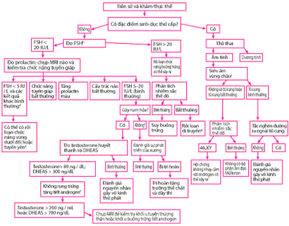
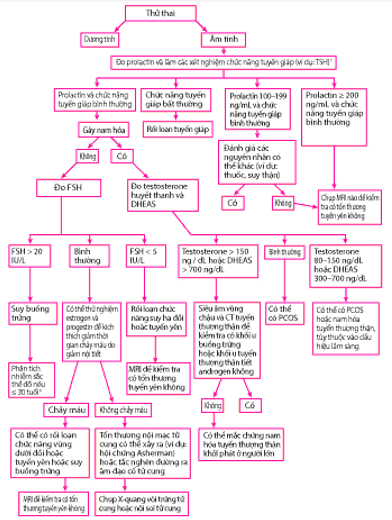

Vô kinh là hiện tượng không hành kinh qua 1 thời gian quy định. Thời gian ấy là 18 tuổi đối với vô kinh nguyên phát, là 3 tháng nếu đã từng hành kinh đều, hoặc 6 tháng nếu đã từng hành kinh không đều trong tiền sử, đối với vô kinh thứ phát.

## Sinh lý bệnh

Khi 1 phần của trục hạ đồi-yên-buồng trứng gặp trục trặc, rối loạn chức năng rụng trứng sẽ xảy ra; chu kỳ sản sinh estrogen do gonadotropin kích thích và thay đổi nội mạc tử cung theo chu kỳ bị gián đoạn, dẫn đến không phóng noãn và kinh nguyệt có thể không xảy ra. Rối loạn chức năng phóng noãn là nguyên nhân phổ biến nhất của vô kinh, đặc biệt là vô kinh thứ phát.

Tuy nhiên, vô kinh có thể xảy ra khi sự phóng noãn bình thường, xảy ra khi bất thường giải phẫu bộ phận sinh dục (ví dụ dị tật bẩm sinh gây tắc nghẽn dòng chảy, dính buồng tử cung [hội chứng Asherman]) ngăn không cho dòng chảy kinh nguyệt bình thường bất chấp kích thích nội tiết bình thường.

## Nguyên nhân

Vô kinh có thể được phân loại dựa trên 1 số tiêu chí khác nhau, như:

- Nguyên phát hoặc thứ phát.

- Rối loạn sinh dục, giải phẫu, hoặc nội tiết.

### Vô kinh do rối loạn chức năng rụng trứng

Vô kinh do rối loạn chức năng rụng trứng thường là thứ phát nhưng có thể là nguyên phát nếu quá trình rụng trứng không baoh bắt đầu – ví dụ: do rối loạn di truyền. Nếu sự rụng trứng không baoh bắt đầu, thường dẫn đến dậy thì muộn và sự phát triển của các đặc tính sinh dục thứ phát là bất thường. Các rối loạn di truyền liên quan nhiễm sắc thể Y làm tăng nguy cơ ung thư tế bào mầm của buồng trứng.

Các nguyên nhân phổ biến nhất của rối loạn chức năng rụng trứng liên quan đến sự gián đoạn của trục hạ đồi-tuyến yên-buồng trứng. Do đó, nguyên nhân bao gồm:

- Rối loạn chức năng vùng dưới đồi (đặc biệt là vô kinh vùng dưới đồi cơ năng).
- Rối loạn chức năng tuyến yên.
- Suy buồng trứng nguyên phát (suy buồng trứng sớm).
- Rối loạn nội tiết gây ra dư thừa nội tiết tố nam (đặc biệt là Hội chứng buồng trứng đa nang).

Rối loạn chức năng vùng dưới đồi có thể dẫn đến giảm sản sinh GnRH, do đó có thể làm giảm sản sinh gonadotropin. nguyên nhân phổ biến là không đủ năng lượng do chế độ ăn kiêng hạn chế hoặc tập thể dục nặng. Phụ nữ bị vô kinh do rối loạn chức năng vùng dưới đồi có nồng độ leptin huyết thanh thấp hơn (hormone chán ăn do các tế bào mỡ sản sinh ra); nồng độ thấp hơn có thể góp phần làm giảm sản sinh gonadotropin.

| Nguyên nhân                                  | Ví dụ                                                                                                                                                                                                                                                                                                                                                                                                                                                                                                                                                                                                                                                                                                                                                                                                                                     |
| -------------------------------------------- | ----------------------------------------------------------------------------------------------------------------------------------------------------------------------------------------------------------------------------------------------------------------------------------------------------------------------------------------------------------------------------------------------------------------------------------------------------------------------------------------------------------------------------------------------------------------------------------------------------------------------------------------------------------------------------------------------------------------------------------------------------------------------------------------------------------------------------------------- |
| Rối loạn chức năng và cấu trúc vùng dưới đồi | Các rối loạn di truyền (ví dụ, thiếu hụt hormone phóng thích gonadotropin bẩm sinh, đột biến gen thụ thể GnRH dẫn đến nồng độ FSH và estradiol thấp và mức LH cao, hội chứng Prader-Willi) Các rối loạn xâm lấn của vùng dưới đồi (ví dụ, Nhiễm mô bào Langerhans, lymphoma, Lao) Chiếu xạ vùng dưới đồi Chấn thương sọ não Các khối u của vùng dưới đồi                                                                                                                                                                                                                                                                                                                                                                                                                                                                      |
| Rối loạn chức năng vùng dưới đồi, chức năng  | Chứng suy mòn thể chất và tinh thần Rối loạn mạn tính, đặc biệt là các rối loạn hô hấp, tiêu hóa, huyết học, thận hoặc gan (ví dụ: bệnh Crohn, xơ nang, bệnh hồng cầu hình liềm, thalassemia thể nặng, xơ gan, bệnh thận mạn tính cần chạy thận nhân tạo), rối loạn co giật Ăn kiêng Lạm dụng ma túy (ví dụ, rượu, cocaine, cần sa, hoặc là opioid) Rối loạn ăn uống (ví dụ chán ăn, chứng ăn vô độ, rối loạn ăn uống lành mạnh) Tập thể dục, nếu năng lượng cần phải có vượt quá năng lượng nạp vào Nhiễm trùng (ví dụ: nhiễm HIV, lao, viêm não, giang mai) Suy giảm miễn dịch Thụ thai giả (mang thai giả) Rối loạn tâm thần (ví dụ, căng thẳng, trầm cảm, rối loạn ám ảnh béo phì, tâm thần phân liệt) Thuốc thần kinh Thiếu dinh dưỡng                                                              |
| Rối loạn chức năng tuyến yên                 | Phình mạch tuyến yên Tăng prolactin máu Suy sinh dục do suy vùng dưới đồi vô căn Các thương tổn thực thể của tuyến yên (ví dụ, bệnh thừa sắt, Bệnh bạch cầu u hạt langerhans, sarcoidosis, lao) Thiếu hụt gonadotropin đơn độc Hội chứng Kallmann (suy giảm tuyến sinh dục đích với mất khứu giác) Hoại tử tuyến yên sau đẻ (hội chứng Sheehan) Chấn thương sọ não Các khối u não (ví dụ, u màng não, u sọ hầu, u đệm thần kinh) Các khối u của tuyến yên (ví dụ: u tuyến nhỏ, ung thư biểu mô di căn, khối u xoang nội bì, các khối u tuyến yên khác tiết ra hormone [ví dụ: ACTH, hormone kích thích tuyến giáp, hormone tăng trưởng, FSH, LH]) Tổn thương chiếm không gian (ví dụ, hố yên rỗng, phình động mạch não)                                                                                     |
| Rối loạn chức năng buồng trứng               | Các rối loạn tự miễn dịch (ví dụ, viêm buồng trứng tự miễn dịch có thể xảy ra trong nhược cơ, viêm tuyến giáp, hoặc bạch biến) Hóa trị (ví dụ: các thuốc alkyl hóa liều cao) Các bất thường di truyền, bao gồm bất thường về nhiễm sắc thể (ví dụ, bất sản tuyến ức bẩm sinh, Hội chứng xương thủy tinh, Hội chứng Turner [45,X], thoái hoá nang noãn nhanh tự phát) Rối loạn thoái hoá tuyến sinh dục (sự phát triển buồng trứng không hoàn chỉnh, đôi khi rối loạn thứ phát do rối loạn di truyền) Chiếu xạ vào vùng chậu Rối loạn chuyển hóa (ví dụ: bệnh Addison, đái tháo đường, galactoza huyết) Các khối u buồng trứng (ví dụ: khối u lớp hạt tế bào theca, khối u Brenner, u quái, u tuyến nang nhầy hoặc u tuyến nang huyết thanh, khối u Krukenberg, ung thư biểu mô di căn) Nhiễm vi rút (ví dụ, quai bị) |
| Rối loạn nội tiết khác                       | Hội chứng không nhậy cảm Androgen (nữ tính hoá tinh hoàn) Nam hóa tuyến thượng thận bẩm sinh (tăng sản thượng thận bẩm sinh – ví dụ: do thiếu hụt 17-hydroxylase hoặc thiếu hụt 17,20-lyase) hoặc nam hóa tuyến thượng thận khởi phát ở người trưởng thành Hội chứng Cushing Nam hóa do thuốc (ví dụ: do androgen, thuốc chống trầm cảm, danazol hoặc progestin liều cao) Cường giáp Suy giáp Béo phì (gây ra nhiều tuyến sản xuất quá nhiều estrogen) Hội chứng buồng trứng đa nang Lưỡng tính thực sự Các khối u sản sinh androgen (thường là buồng trứng hoặc tuyến thượng thận) Các khối u sản xuất estrogen hoặc các khối u sản sinh ra gonadotropin màng nuôi ở người (bệnh nguyên bào nuôi)                                                                                                          |

_1 số nguyên nhân gây rối loạn rụng trứng._

### Vô kinh do các bất thường đường sinh sản

Vô kinh cũng có thể xảy ra nếu bệnh nhân có những bất thường ảnh hưởng đến chức năng kinh nguyệt hoặc cản trở dòng chảy của kinh nguyệt. Nhiều bệnh nhân mắc các bệnh này có chức năng nội tiết sinh sản bình thường và có thể có chu kỳ kinh nguyệt có rụng trứng. Các nguyên nhân phổ biến nhất của vô kinh do các bất thường ở đường sinh sản bao gồm:

- Các bất thường bộ phận sinh dục bẩm sinh gây tắc nghẽn đường chảy ra của máu kinh.
- Những bất thường mắc phải ở đường sinh sản nữ (ví dụ: hội chứng Asherman, hẹp cổ tử cung).

Tắc nghẽn bất thường gây vô kinh nguyên phát và thường đi kèm với chức năng nội tiết tố bình thường. Sự tắc nghẽn như vậy có thể dẫn đến:

- Bế kinh (ứ máu kinh trong âm đạo) làm cho âm đạo phồng lên.
- Tích huyết tử cung (tích tụ máu trong tử cung), có thể gây phình tử cung có thể bị ghi nhận là khối vùng chậu hoặc phình cổ tử cung.

Vì chức năng buồng trứng bình thường nên các cơ quan sinh dục ngoài và các đặc điểm tình dục thứ phát khác phát triển bình thường. Rối loạn bẩm sinh (ví dụ, những bệnh kèm theo dị tật âm đạo hay bất sản âm đạo hoặc vách âm đạo) cũng gây ra các chứng tiểu tiện và các rối loạn về khung chậu.

Bất thường mắc phải về giải phẫu, chẳng hạn như sẹo nội mạc tử cung sau khi đặt dụng cụ tử cung (hội chứng Asherman), gây vô kinh thứ phát do rụng trứng.

| Nguyên nhân                     | Ví dụ                                                                                                                                                          |
| ------------------------------- | -------------------------------------------------------------------------------------------------------------------------------------------------------------- |
| Bất thường sinh dục bẩm sinh    | Màng trinh không thủng Bệnh lưỡng tính giả Vách ngăn âm đạo Không có âm đạo, cổ tử cung hoặc tử cung hoặc bất sản (ví dụ, không có bộ phận Müllerian) |
| Các bất thường tử cung mắc phải | Hội chứng Asherman Hẹp cổ tử cung U xơ tắc nghẽn và polyp Lao nội mạc tử cung                                                                         |

_1 số nguyên nhân gây vô kinh do các bất thường ở đường sinh sản._

## Đánh giá

### Bệnh sử và tiền sử

Các bé gái được đánh giá vô kinh nguyên phát nếu không có kinh nguyệt và đạt 1 trong các mốc sau:

- 13 tuổi và không có dấu hiệu dậy thì (ví dụ: ngực phát triển, tăng trưởng nhanh).
- 3 năm sau khi nhú núm vú (bắt đầu phát triển vú).
- 15 tuổi (ở những bệnh nhân có tăng trưởng và phát triển bình thường các đặc tính sinh dục phụ).

Các bé gái và phụ nữ trong độ tuổi sinh đẻ nên được đánh giá về tình trạng vô kinh thứ phát nếu trước đó họ có kinh nguyệt và có:

- Mất chu kỳ kinh nguyệt ≥3 tháng nếu trước đây họ có chu kỳ kinh nguyệt đều hoặc ≥6 tháng nếu trước đó họ có chu kỳ kinh nguyệt không đều.
-<9 kỳ kinh/năm hoặc chu kỳ dài>38 ngày (thiểu kinh).
- Thay đổi kiểu kinh nguyệt mới và liên tục (tần suất, khối lượng, thời lượng).

Tiền sử bệnh hiện tại bao gồm các câu hỏi về chức năng kinh nguyệt:

- Ngày đầu tiên của kỳ kinh nguyệt cuối cùng.
- Tần số chu kỳ (bình thường ≥24 đến ≤38 ngày).
- Chu kỳ đều đặn trong 3 đến 12 tháng qua và liệu các chu kỳ có đều đặn không (bình thường ≤7 đến 9 ngày).
- Thời gian chảy máu (bình thường ≤8 ngày ra máu mỗi chu kỳ).
- Lượng máu ra. Về mặt lâm sàng, việc đo lường chính xác lượng máu ra là không khả thi. Đánh giá lượng máu ra dựa trên mô tả của bệnh nhân (nhẹ, bình thường, nặng). Đôi khi ước tính bằng cách hỏi xem có bao nhiêu miếng băng vệ sinh hoặc nút vệ sinh thấm đẫm theo thời gian (có khả năng là ra máu nhiều nếu bệnh nhân thấm đẫm 1 miếng băng vệ sinh hoặc nút vệ sinh trong vòng từ 3 tiếng trở xuống và/hoặc nếu họ ra cục máu đông có đường kính lớn hơn 2.5 cm).

Các câu hỏi về các triệu chứng hoặc yếu tố liên quan bao gồm:

- Kinh nguyệt có kèm theo cảm giác khó chịu đáng kể không? (Hiếm khi, cảm giác khó chịu cho thấy các bất thường về cấu trúc.)
- Bệnh nhân có đau vú theo chu kỳ và thay đổi tâm trạng (các triệu chứng của giai đoạn hoàng thể), nếu không có, có thể cho thấy ra máu tử cung bất thường chứ không phải chu kỳ kinh nguyệt?
- Thói quen ăn kiêng và tập thể dục của bệnh nhân là gì?

Thăm khám toàn thân nên bao gồm các triệu chứng gợi ý về nguyên nhân có thể gây ra, bao gồm những biểu hiện sau:

- Tiết sữa bất thường, nhức đầu, mất thính lực, bất thường về thị giác: Rối loạn tuyến yên.
- Mệt mỏi, tăng cân, và sợ lạnh: Suy giáp.
- Đánh trống ngực, lo lắng, run, và sợ nóng: Cường giáp.
- Palpitations: Chán ăn tâm thần kèm theo các bất thường điện giải (ví dụ: hạ kali máu, hạ magie máu).
- Mụn trứng cá, rậm lông, và thay đổi giọng nói: tăng quá mức nội tiết tố nam.
- Đối với bệnh nhân vô kinh thứ phát, bốc hỏa, khô âm đạo, rối loạn giấc ngủ, dễ gãy xương và giảm ham muốn: Suy chức năng buồng trứng.

Tiền sử y khoa cần quan tâm đến những yếu tố nguy cơ sau:

- Vô kinh vùng dưới đồi chức năng, chẳng hạn như căng thẳng; bệnh mạn tính; thuốc mới; thay đổi gần đây về cân nặng, chế độ ăn uống hoặc cường độ tập thể dục; và tiền sử hoặc các triệu chứng rối loạn ăn uống hiện tại.
- Sẹo nội mạc tử cung (hội chứng Asherman), có thể xảy ra ở những bệnh nhân có tiền sử nong và nạo (đặc biệt là nếu họ cũng bị nhiễm trùng tử cung), triệt đốt nội mạc tử cung, viêm nội mạc tử cung, chấn thương sản khoa, phẫu thuật tử cung.

Tiền sử dùng thuốc cần phải bao gồm các câu hỏi cụ thể về các loại thuốc hiện tại hoặc trước đây dùng, chẳng hạn như sau:

- Các loại thuốc ảnh hưởng đến dopamine (ví dụ: thuốc hạ huyết áp, thuốc chống loạn thần, thuốc phiện, thuốc chống trầm cảm ba vòng, thuốc chống động kinh).
- Hóa trị ung thư (ví dụ: các thuốc alkyl hóa như bendamustine, cyclophosphamide và ifosfamide; busulfan; chlorambucil)
- Các nội tiết tố có thể gây nam hóa (ví dụ: các androgen, các progestin có tính androgen liều cao, steroid đồng hóa không kê đơn [OTC]).
- Thuốc tránh thai nội tiết.
- Corticosteroid hệ thống.
- Các sản phẩm và thực phẩm chức năng OTC, trong đó có chứa nội tiết tố bò.
- Lạm dụng chất gây nghiện, bao gồm lạm dụng thuốc phiện, có thể ảnh hưởng đến việc tiết hormone tuyến yên và dẫn đến thiểu kinh hoặc vô kinh.

Tiền sử gia đình cần phải bao gồm bất kỳ trường hợp dậy thì muộn hoặc rối loạn di truyền, bao gồm hội chứng Fragile X.

### Thăm khám

Quan tâm các sinh hiệu và tính toán chỉ số khối cơ thể (BMI).

Nếu phát triển tuổi dậy thì có thể bất thường, các đặc điểm sinh dục thứ phát sẽ được đánh giá; phát triển vú và lông mu được phân giai đoạn bằng phương pháp Tanner (xem Sự trưởng thành về giới tính). Nếu có lông nách và lông mu, tăng hormone tuyến thượng thận có thể xảy ra.

Khám vú cần phải được thực hiện để kiểm tra chứng tiết sữa (tình trạng tiết sữa của vú không liên quan tạm thời đến việc sinh con); nó có thể được phân biệt với các loại dịch tiết núm vú khác bằng cách tìm các hạt mỡ trong dịch đó bằng kính hiển vi năng lượng thấp.

Khám vùng chậu được thực hiện để kiểm tra mức độ phì đại của tử cung (có thể là do mang thai hoặc khối u), buồng trứng và âm vật (âm vật to). Khám khung chậu cũng giúp xác định xem có thiếu hụt estrogen hay không. Ở phụ nữ trong độ tuổi sinh sản, sự hiện diện của chất nhầy cổ tử cung với chất nhầy spinnbarkeit (chất lượng dai, giống như sợi dây) thường cho thấy đủ lượng estrogen; niêm mạc âm đạo mỏng, nhợt nhạt, không có vảy và pH>6.0 chứng tỏ thiếu hụt estrogen. Ở bé gái hoặc phụ nữ trẻ, khám có thể phát hiện các bất thường về giải phẫu của cơ quan sinh dục (ví dụ: màng trinh không lỗ, vách ngăn âm đạo, bất sản âm đạo, bất sản cổ tử cung hoặc bất sản tử cung). Màng trinh căng phồng có thể do tích kinh nguyệt âm đạo, gợi ý tắc nghẽn đường sinh dục.

Khám tổng quát tập trung vào bằng chứng nam hóa, bao gồm rậm lông, hói tạm thời, mụn trứng cá, giọng trầm, tăng khối lượng cơ và khử nữ tính (giảm các đặc điểm sinh dục thứ phát bình thường trước đây, chẳng hạn như giảm kích thước vú và teo âm đạo). Nam hóa là do tuyến thượng thận hoặc buồng trứng tăng sản sinh androgen. Chứng tăng lông tóc (lông mọc quá mức ở tứ chi, đầu và lưng), phổ biến ở 1 số gia đình, được phân biệt với chứng rậm lông thực sự, được đặc trưng bởi lông quá mức ở môi trên, cằm và giữa 2 vú.

Có các mảng đen trên da do bệnh gai đen có thể là dấu hiệu của hội chứng buồng trứng đa nang (PCOS) hoặc của bệnh tiểu đường.

Các bác sĩ lâm sàng nên kiểm tra tình trạng hạ thân nhiệt, nhịp tim chậm, hạ huyết áp và giảm mỡ dưới da, những dấu hiệu gợi ý chứng chán ăn tâm thần và tình trạng mòn răng, tổn thương vòm miệng, giảm phản xạ ọe của miệng, xuất huyết dưới kết mạc và những thay đổi khó thấy ở bàn tay kèm theo vết chai trên mu bàn tay (do nôn thường xuyên), gợi ý chứng cuồng ăn.

### Xét nghiệm

Nếu bệnh nhân bị vô kinh nguyên phát và các đặc điểm sinh dục thứ phát bình thường thì nên bắt đầu siêu âm vùng chậu để phát hiện tắc nghẽn đường sinh dục bẩm sinh. Có thể cần chụp MRI nếu xác định được các bất thường.

Cần phải xét nghiệm thử thai, ngay cả trước khi bắt đầu lần hành kinh đầu tiên, nếu có khả năng là quá trình rụng trứng đã bắt đầu. Không nên loại trừ khả năng mang thai dựa trên tiền sử tình dục hoặc tiền sử kinh nguyệt.

Xét nghiệm các hormon nội tiết như:

- DHEAS: 250-300 ng/dL (0.7-0.8 mcmol/L).
- FSH: 5‒20 IU/L.
- LH: 5‒40 IU/L.
- Karyotype (nữ): 46, XX.
- Prolactin: 50 ng/mL. Prolactin 50–100 ng/mL được coi là tăng nhẹ và thường là do sử dụng thuốc. Prolactin>100 ng/mL được coi là cao và có nhiều khả năng là do khối u.
- Testosterone: 20-80 ng/dL (0,7-2,8 nmol/L).

Vô kinh với nồng độ hormone kích thích nang trứng (FSH) cao (hypergonadotropic hypogonadism) gợi ý rối loạn chức năng buồng trứng. Vô kinh với nồng độ FSH thấp (giảm năng tuyến sinh dục thiểu năng sinh dục) gợi ý rối loạn chức năng vùng dưới đồi hoặc rối loạn chức năng tuyến yên.

Nồng độ testosterone hoặc DHEAS tăng nhẹ gợi ý PCOS, nhưng nồng độ có thể tăng ở phụ nữ bị rối loạn chức năng vùng dưới đồi hoặc rối loạn chức năng tuyến yên và đôi khi bình thường ở phụ nữ rậm lông mắc PCOS. Nguyên nhân của tăng nồng độ đôi khi có thể được xác định bằng cách đo nồng độ LH huyết thanh. Trong hội chứng buồng trứng đa nang, nồng độ LH huyết thanh thường tăng lên, làm tăng tỉ số LH trên FSH.

Nếu các triệu chứng hoặc dấu hiệu gợi ý bệnh nền, có thể chỉ định các xét nghiệm cụ thể. Ví dụ, những bệnh nhân với bụng trắng bóng, mặt tròn, cổ trâu, thân béo tròn, và các chi gầy nên được làm xét nghiệm về Hội chứng Cushing. Bệnh nhân bị nhức đầu và giảm thị lực hoặc bằng chứng về rối loạn tuyến yên cần chụp MRI não. Nếu đánh giá lâm sàng cho thấy bệnh mạn tính, xét nghiệm chức năng gan, thận và tốc độ máu lắng được thực hiện.

_Đánh giá vô kinh nguyên phát._

_Đánh giá vô kinh thứ phát._

### Nghiệm pháp thử nghiệm progestin

Nếu bệnh nhân bị vô kinh thứ phát với nồng độ prolactin và FSH bình thường, chức năng tuyến giáp bình thường và không có nam hóa, có thể dùng thử progestin để đánh giá tình trạng estrogen. Nếu nồng độ estrogen đủ, 1 liệu trình progestin sẽ kích thích chảy máu do cai sau khi ngừng progestin (thử thách progestin; còn được gọi là nghiệm pháp cai progestin).

Nghiệm pháp thử nghiệm progestin bắt đầu bằng cách cho medroxyprogesterone 5 đến 10 mg đường uống x 1 lần/ngày hoặc 1 loại progestogen khác trong 7 đến 10 ngày. Sau liều cuối cùng:

- Nếu ra máu trong vài ngày thì lượng estrogen đủ và vô kinh có thể do rối loạn chức năng vùng dưới đồi-tuyến yên, suy buồng trứng hoặc thừa estrogen.
- Nếu không có ra máu, nghiệm pháp thử nghiệm estrogen/progestin sẽ được thực hiện.

### Nghiệm pháp thử nghiệm estrogen/progestin

Nghiệm pháp thử nghiệm estrogen/progestin được thực hiện bằng cách cho uống 1 loại estrogen (ví dụ: estrogen liên hợp của ngựa 1.25 mg, estradiol 2 mg) 1 lần/ngày trong 21 ngày, sau đó là medroxyprogesterone 10 mg uống 1 lần/ngày hoặc 1 loại progestogen khác trong 7 đến 10 ngày. Sau liều progestin cuối cùng, nếu không có ra máu, bệnh nhân có thể bị tổn thương nội mạc tử cung (ví dụ: hội chứng Asherman) hoặc tắc nghẽn đường ra (ví dụ: hẹp cổ tử cung).

Tuy nhiên, ra máu có thể không xảy ra ở những bệnh nhân không có những bất thường này vì tử cung không nhạy cảm với estrogen do sử dụng thuốc tránh thai estrogen/progestin kéo dài hoặc rối loạn nội tiết hiếm gặp (hội chứng không nhạy cảm với estrogen, kháng estrogen). Do đó, thử nghiệm sử dụng estrogen và progestin có thể được lặp lại để xác nhận.

Do thử nghiệm này mất nhiều tuần và kết quả có thể không chính xác, chẩn đoán 1 số rối loạn nghiêm trọng có thể bị trì hoãn đáng kể; do đó, chụp MRI não nên được xem xét thực hiện trước hoặc trong quá trình thử nghiệm nếu nghi ngờ có tổn thương khác ở tuyến yên hoặc tổn thương khác ở não.

### Nghiệm pháp thử nghiệm honnon hướng sinh dục

Nạo niêm mạc tử cung, thử tế vào học âm đạo nội tiết, định lượng estrogen, progesteron trước và sau khi tiêm hormon hướng sinh dục. Nếu sau khi tiêm thấy các kết quả đều tăng lên: suy vùng dưới đồi hoặc tuyến yên. Nếu không tăng, suy buồng trứng hoặc buồng trứng teo.

### Nghiệm pháp thử nghiệm clomiJen

Cho uống 5 ngày liền, mồi ngày 100mg clomifen citrat nhằm ức chế các thụ cảm của vùng dưới đồi và làm tăng tiết các honnon giải phóng. Định lượng lại FSH, LH. Nếu so vơi trước khi tiêm có thấy tăng lên: vùng dưới đồi kém hoạt dộng. Nếu không tăng: tuyến yên kém hoạt động, cũng có thể là vùng dươi đồi không hoạt động.

## Điều trị

Các vấn đề phổ biến liên quan đến vô kinh cũng có thể cần điều trị, bao gồm:

- Đối với vô sinh nếu muốn mang thai, gây rụng trứng.
- Điều trị các triệu chứng và tác động lâu dài của thiếu hụt (estrogen ví dụ, loãng xương, rối loạn tim mạch, teo âm đạo).
- Điều trị triệu chứng và quản lý hiệu quả lâu dài của estrogen quá mức (ví dụ, chảy máu kéo dài, căng đau vú dai dẳng hoặc chói, nguy cơ quá sản nội mạc tử cung và ung thư).
- Giảm thiểu sự rậm lông và ảnh hưởng lâu dài của thừa nội tiết tố nam (ví dụ rối loạn tim mạch, cao huyết áp).

### Vòng kinh nhân tạo

Vòng kinh nhân tạo là phương pháp dùng estrogen và progesterone theo trình tự trong giai đoạn đầu chỉ có estrogen và giai đoạn sau có cá estrogen và progesterone giống như vòng kinh tự nhiên. Sau khi ngừng thuốc, kinh nguyệt sẽ xảy ra. Mục đích của dùng vòng kinh nhân tạo nhằm thay thế hormone sinh dục nữ dang bị thiêu hụt, giúp cho niêm mạc tử cung phát triển giống như sinh lý bình thường, có thể chuẩn bị cho trứng làm tổ trong những vòng kinh sau. Cũng còn có mục đích gây chảy huyết kinh để kiểm tra sự toàn vẹn của tử cung, nhất là của buồng tử cung. Vòng kinh nhân tạo gồm estriol (biệt dược Ovestin®) 1 mg/ ngày × 14 ngày, sau đó dùng thuốc tránh thai viên kết hợp Regulon (hoặc Marvelon®) mỗi ngày 1 viên × 12 ngày. Sau khi uống hết 26 ngày thuốc, ngừng thuốc được 2 ngày người bệnh sẽ hành kinh, vòng kinh như vậy sẽ là 28 ngày.Nếu cần cho vòng kinh nhân tạo thứ hai thì chờ bệnh nhân sạch kinh mới bắt đầu cho thuốc lại. Nếu người bệnh hành kinh 3 ngày mới sạch mà tạo vòng kinh như trên thì vòng kinh thứ hai sẽ dài 28 + 3 = 31 ngày. Sự thay đổi chu kỳ từ 28 đến 31 ngày không có gì đáng quan ngại, mà ngược lại, còn có lợi là chờ cho niêm mạc tử cung mọc chồng lên nhau, gây nên quá sản niêm mạc tử cung nếu phải điều trị lâu dài.

## Nguồn tham khảo

- Bài giảng vô kinh không hành kinh - https://www.dieutri.vn/bgsanphukhoa/bai-giang-vo-kinh-khong-hanh-kinh

- Vô kinh - https://www.msdmanuals.com/professional/gynecology-and-obstetrics/menstrual-abnormalities/amenorrhea
