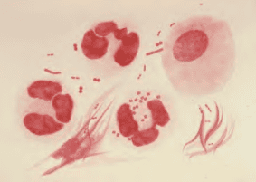
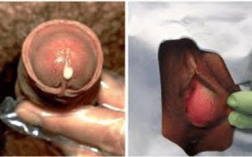
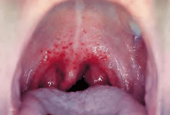

Bệnh lậu là bệnh lây truyền qua đường tình dục hay gặp, do song cầu khuẩn Gram âm Neisseria gonorrhoeae gây ra.

Bệnh lây truyền chủ yếu qua quan hệ tình dục đường âm đạo, đường miệng và đường hậu môn. Ở nam giới, nhiễm lậu cầu thường gây ra viêm niệu đạo, nếu không được điều trị có thể dẫn đến viêm mào tinh hoàn, hẹp niệu đạo và vô sinh. Ở nữ giới, nhiễm lậu cầu nếu không điều trị có thể dẫn đến viêm tiểu khung, tắc vòi trứng, chửa ngoài tử cung và vô sinh. Trẻ sơ sinh có mẹ bị bệnh lậu có thể bị lây nhiễm trong quá trình chuyển dạ, dẫn đến viêm kết mạc mắt.

Theo ước tính của Tổ chức Y tế thế giới (WHO), trong năm 2020, thế giới có khoảng 82.4 triệu trường hợp lậu mới mắc, trong đó khu vực Tây Thái Bình Dương có 23.2 triệu ca. Đồng nhiễm Chlamydia trachomatis được phát hiện ở 10-40% số người mắc bệnh lậu.

_N. gonorrhoeae là các song cầu Gram âm, hình hạt cà phê, nằm ở trong tế bào._

## Đặc điểm bệnh lậu

### Triệu chứng lâm sàng

Thời gian ủ bệnh ở nam giới trung bình từ 3-5 ngày. Ở nữ giới thời gian ủ bệnh thường kéo dài hơn, trung bình 5-7 ngày. Thời gian này người bệnh không có triệu chứng nhưng vẫn có khả năng lây lan cho người khác.

#### Nhiễm lậu cầu không biến chứng

Nam giới thường có biểu hiện tiết dịch niệu đạo và tiểu buốt. Khám thấy dịch tiết niệu đạo có thể ít hoặc nhiều, nhầy hoặc mủ.

Nữ giới thường không có triệu chứng cơ năng, dưới 50% bệnh nhân có tiết dịch âm đạo bất thường, tiểu buốt, đau vùng bụng dưới và đau khi quan hệ tình dục. Khám thấy dịch âm đạo và viêm cổ tử cung, có thể có mủ. Phần lớn bệnh nhân không có triệu chứng rõ ràng nên không được phát hiện và điều trị.

Lậu trực tràng phần lớn không có triệu chứng ở cả 2 giới; đôi khi có đau hoặc tiết dịch ở hậu môn, trực tràng.

Lậu hầu họng chủ yếu không có triệu chứng, có thể đau họng nhẹ và viêm họng.

#### Nhiễm lậu cầu có biến chứng

Ở nam giới, nhiễm lậu cầu không được điều trị có thể dẫn đến viêm mào tinh hoàn, hẹp niệu đạo và vô sinh. Nguy cơ biến chứng tăng lên khi bị tái nhiễm nhiều lần.

Ở nữ giới, nhiễm lậu cầu không được điều trị có thể dẫn đến các biến chứng nghiêm trọng như viêm tiểu khung, viêm nội mạc tử cung, viêm vòi trứng và áp xe vòi trứng, chửa ngoài tử cung và vô sinh.

Ở trẻ sơ sinh, viêm kết mạc mắt do lậu có biểu hiện chảy mủ ở mắt và sưng mí mắt, nếu không được điều trị có thể dẫn đến loét, sẹo giác mạc và mù.

_Triệu chứng "giọt buổi sáng", đặc trưng của viêm mủ niệu đạo do lậu ở nam, xuất hiện vài ngày sau nhiễm bệnh, kèm theo tiểu buốt, gắt, tiểu mủ và áp-xe tuyến Bartholin bên trái viêm cấp, sưng, nóng, đau._

_Lậu hầu họng._

### Cận lâm sàng

#### Nhuộm Gram

Nhuộm Gram thấy song cầu Gram âm hình hạt cà phê nằm trong và ngoài bạch cầu đa nhân trung tính.

Là xét nghiệm dễ làm, ít tốn kém và có giá trị giúp chẩn đoán sơ bộ bệnh lậu, đặc biệt là ở bệnh nhân nam có triệu chứng. Tuy nhiên, chỉ 50-70% trường hợp lậu không triệu chứng ở nam giới là dương tính với nhuộm Gram, do đó nhuộm Gram âm tính không đủ để loại trừ bệnh.

Xét nghiệm nhuộm Gram ít tin cậy hơn đối với bệnh phẩm cổ tử cung và trực tràng do độ nhạy thấp (độ nhạy khi soi bệnh phẩm cổ tử cung là 30-50%).

#### Nuôi cấy

Nuôi cấy phân lập lậu cầu trên môi trường Thayer-Martin chứa vancomycin là tiêu chuẩn vàng trong chẩn đoán bệnh (độ nhạy đối với lậu niệu đạo và cổ tử cung là 85-95%), đồng thời xác định được sự nhạy cảm của vi khuẩn lậu với kháng sinh qua kháng sinh đồ.

Việc phân lập N. gonorrhoeae tối ưu đòi hỏi phải lấy bệnh phẩm tốt, cấy kịp thời vào môi trường nuôi cấy thích hợp, vận chuyển đúng cách và ủ trong môi trường thích hợp.

Vị trí lấy bệnh phẩm có tỷ lệ dương tính cao nhất ở nam giới là niệu đạo, ở nữ giới là cổ tử cung.

#### Xét nghiệm khuếch đại axit nucleic (Nucleic acid amplification tests-NAATs)

Xét nghiệm khuếch đại axit nucleic (hay còn gọi là xét nghiệm khuếch đại gen, trong đó có xét nghiệm PCR) để phát hiện axit nucleic của vi khuẩn lậu.

Độ đặc hiệu và độ nhạy cao (độ nhạy trên 90%), cao hơn so với nuôi cấy, có thể sử dụng nhiều loại bệnh phẩm như nước tiểu, dịch âm đạo, cổ tử cung và dịch niệu đạo. Các kĩ thuật NAATs khác nhau có độ nhạy khác nhau, bệnh phẩm trực tràng và hầu họng thường có độ nhạy thấp.

Xét nghiệm NAATs phổ biến nhất hiện nay là Real time PCR đa mồi, thường kết hợp chẩn đoán cùng lúc 2 bệnh lậu và Chlamydia.

Hạn chế là không cung cấp được thông tin về tính nhạy cảm của vi khuẩn với kháng sinh.

### Chẩn đoán xác định

:::note[Chẩn đoán xác định bệnh lậu]

Lâm sàng:

- Tiết dịch hoặc mủ ở niệu đạo/âm đạo, kèm tiểu buốt.
- Có tiền sử quan hệ tình dục không an toàn.

Cận lâm sàng:

- Nhuộm Gram (bệnh phẩm dịch niệu đạo hoặc cổ tử cung) thấy song cầu Gram âm nằm trong và ngoài bạch cầu đa nhân trung tính. Nếu nhuộm Gram âm tính cần thêm ít nhất 1 trong 2 xét nghiệm nuôi cấy hoặc xét nghiệm khuếch đại axit nucleic để khẳng định chẩn đoán.
- Nuôi cấy là tiêu chuẩn vàng để chẩn đoán lậu.
- Xét nghiệm khuếch đại axit nucleic.

Tại cơ sở không có đủ điều kiện xét nghiệm, chẩn đoán và điều trị có thể dựa vào lâm sàng. Tại cơ sở có điều kiện, chẩn đoán dựa vào lâm sàng và các xét nghiệm.

:::

### Chẩn đoán phân biệt

#### Lậu sinh dục

Nhiễm Chlamydia trachomatis.

Trùng roi âm đạo (Trichomonas vaginalis).

Nấm Candida âm hộ-âm đạo.

Viêm niệu đạo-sinh dục do Ureaplasma, Mycoplasma.

Viêm niệu đạo, âm đạo do các căn nguyên khác: nhiễm khuẩn (E. coli, liên cầu nhóm A, Proteus,...) hoặc không do nhiễm khuẩn (chấn thương, viêm da tiếp xúc kích ứng, các bệnh viêm hệ thống như Behcet,...).

#### Lậu hậu môn trực tràng

Chẩn đoán phân biệt với viêm trực tràng do các nguyên nhân khác như Chlamydia trachomatis, Herpes simplex, nấm... và các viêm trực tràng hậu môn không do nhiễm trùng.

#### Lậu hầu họng

Chẩn đoán phân biệt với viêm họng do nguyên nhân khác như liên cầu nhóm A, Mycoplasma, Chlamydia trachomatis, viêm họng do virus...

#### Viêm kết mạc mắt do lậu ở trẻ sơ sinh

Chẩn đoán phân biệt với viêm kết mạc sơ sinh do nguyên nhân khác như tụ cầu, phế cầu, Haemophilus influenzae...

## Điều trị

### Nguyên tắc điều trị

Điều trị sớm.

Điều trị đúng phác đồ.

Điều trị đồng nhiễm Chlamydia.

Điều trị cả bạn tình. Tất cả bạn tình có quan hệ tình dục với bệnh nhân trong vòng 60 ngày cần được khám và điều trị. Nếu lần quan hệ tình dục gần nhất trên 60 ngày thì điều trị bạn tình của lần quan hệ gần nhất.

Không quan hệ tình dục, không làm thủ thuật tiết niệu trong thời gian điều trị và trong vòng 7 ngày sau khi kết thúc điều trị.

Xét nghiệm huyết thanh giang mai và HIV trước và sau khi điều trị.

Chủ yếu điều trị ngoại trú, chỉ điều trị nội trú trong trường hợp có biến chứng.

### Điều trị cụ thể

Các khuyến cáo dưới đây áp dụng cho người lớn, trẻ vị thành niên (10-19 tuổi), người nhiễm HIV và các quần thể nguy cơ cao (phụ nữ mại dâm, nam quan hệ tình dục đồng giới, người chuyển giới). Ngoài ra, hướng dẫn này bao gồm cả phác đồ điều trị và dự phòng lậu mắt ở trẻ sơ sinh.

#### Nhiễm lậu sinh dục và hậu môn trực tràng

Tốt nhất là dựa vào kháng sinh đồ.

Nếu không có kháng sinh đồ, chọn 1 trong các phác đồ sau:

- Ceftriaxon 250mg, tiêm bắp, liều duy nhất.
- Spectinomycin 2g, tiêm bắp liều duy nhất.
- Cefixim 400mg, uống liều duy nhất.

Kết hợp azithromycin 1g uống liều duy nhất để điều trị đồng nhiễm Chlamydia.

Phác đồ này được áp dụng cho cả phụ nữ mang thai, nhưng cần được theo dõi chặt chẽ.

#### Nhiễm lậu hầu họng

Tốt nhất là dựa vào kháng sinh đồ.

Nếu không có kháng sinh đồ, chọn 1 trong các phác đồ sau:

- Ceftriaxon 250mg, tiêm bắp, liều duy nhất.
- Cefixim 400mg, uống liều duy nhất.

Kết hợp azithromycin 1g uống liều duy nhất để điều trị đồng nhiễm Chlamydia.

Phác đồ này được áp dụng cho cả phụ nữ mang thai, nhưng cần được theo dõi chặt chẽ.

#### Quản lý

Để giảm thiểu lây truyền bệnh, những người đang điều trị bệnh lậu nên được hướng dẫn kiêng quan hệ tình dục trong 7 ngày sau khi điều trị và cho đến khi tất cả bạn tình được điều trị (7 ngày sau khi được điều trị và giải quyết các triệu chứng, nếu có).

Tất cả những người được chẩn đoán mắc bệnh lậu nên được xét nghiệm các bệnh lây truyền qua đường tình dục khác, bao gồm Chlamydia, giang mai và HIV. Những người có kết quả xét nghiệm HIV âm tính nên được cung cấp thuốc dự phòng trước lây nhiễm HIV (PrEP: Pre-Exposure Prophylaxis).

Bạn tình gần đây (tức là những người có quan hệ tình dục với bệnh nhân bị nhiễm bệnh <60 ngày trước khi xuất hiện triệu chứng hoặc chẩn đoán bệnh lậu) nên được đưa đến khám, xét nghiệm và điều trị. Nếu lần quan hệ tình dục gần đây nhất của bệnh nhân có nguy cơ tiềm ẩn là >60 ngày trước khi xuất hiện các triệu chứng hoặc chẩn đoán là bệnh lậu, thì bạn tình gần đây nhất nên được điều trị.

Khuyến cáo điều trị bạn tình Cefixime 800mg liều duy nhất, nếu đã loại trừ nhiễm Chlamydia đồng thời với lậu. Nếu xét nghiệm Chlamydia chưa có, thì bạn tình điều trị Cefixime 800mg uống liều duy nhất và thêm Doxycycline 100mg uống 2 lần/ngày x 7 ngày.

#### Theo dõi

Xét nghiệm lại sau khi hoàn thành phác đồ điều trị là không cần thiết đối với những người được chẩn đoán bệnh lậu niệu sinh dục hoặc trực tràng không biến chứng được điều trị bằng bất kỳ phác đồ được khuyến cáo hoặc thay thế nào.

Bất kỳ người nào mắc bệnh lậu hầu họng nên quay lại 7–14 ngày sau lần điều trị ban đầu để kiểm tra khả năng khỏi bệnh bằng phương pháp nuôi cấy hoặc xét nghiệm sinh học phân tử bằng xét nghiệm khuyết đại axit nucleic. Tuy nhiên, xét nghiệm sau 7 ngày có thể làm tăng khả năng xét nghiệm dương tính giả.

Nếu NAAT dương tính, thì thực hiện nuôi cấy khẳng định trước khi điều trị lại, đặc biệt nếu mẫu cấy chưa được thu thập. Tất cả các mẫu cấy dương tính được làm kháng sinh đồ. Các triệu chứng vẫn tồn tại sau khi điều trị nên làm xét nghiệm lại bằng phương pháp nuôi cấy lậu cầu (đồng thời có hoặc không có làm xét nghiệm NAAT) và làm kháng sinh đồ để đánh giá độ nhạy của kháng sinh.

Viêm niệu đạo dai dẳng, viêm cổ tử cung hoặc viêm trực tràng cũng có thể do các sinh vật khác gây ra. Tỷ lệ nhiễm lậu cầu cao thường thấy ở nam giới và phụ nữ trước đây đã được điều trị bệnh lậu. Phần lớn các trường hợp nhiễm trùng này là do tái nhiễm của bạn tình không được điều trị hoặc bắt đầu quan hệ với bạn tình mới bị nhiễm bệnh, do đó cần phải điều trị cho bệnh nhân và đồng thời điều trị cả cho bạn tình.

Nam giới hoặc phụ nữ đã được điều trị bệnh lậu nên được xét nghiệm lại 3 tháng sau khi điều trị bất kể họ có tin rằng bạn tình của mình đã được điều trị hay không. Khuyến khích lên lịch tái khám tại thời điểm điều trị. Nếu không thể xét nghiệm lại sau 3 tháng, bác sĩ lâm sàng nên xét nghiệm lại bất cứ khi nào bệnh nhân tìm kiếm sự chăm sóc y tế lần tiếp theo <12 tháng sau lần điều trị ban đầu.

#### Thất bại điều trị

Cần phân biệt thất bại điều trị với tái nhiễm. Xác định thất bại điều trị khi có 1 trong các tiêu chuẩn sau:

- Không giảm triệu chứng sau 3-5 ngày điều trị mặc dù không quan hệ tình dục.
- Nuôi cấy dương tính sau ≥3 ngày điều trị hoặc PCR dương tính sau ≥7 ngày điều trị mặc dù không quan hệ tình dục.
- Nuôi cấy dương tính và có giảm nhạy cảm các kháng sinh cephalosporin trên kháng sinh đồ, bất kể có quan hệ tình dục lại hay không.

Khi xác định thất bại điều trị, sử dụng phác đồ sau:

- Nếu đã được điều trị theo phác đồ được quy định trong hướng dẫn thì chọn 1 trong các phác đồ sau:
    - Ceftriaxon 500mg, tiêm bắp liều duy nhất và azithromycin 2g, uống liều duy nhất.
    - Cefixim 800mg, uống liều duy nhất và azithromycin 2 g, uống liều duy nhất.
    - Gentamicin 240mg, tiêm bắp liều duy nhất và azithromycin 2g, uống liều duy nhất.
    - Spectinomycin 2g, tiêm bắp liều duy nhất (nếu không phải là nhiễm trùng hầu họng) và azithromycin 2g, uống liều duy nhất.
- Nếu đã điều trị nhưng không theo phác đồ được quy định trong hướng dẫn thì điều trị lại theo hướng dẫn.
- Nếu thất bại điều trị và có kháng sinh đồ, điều trị lại dựa vào kết quả kháng sinh đồ.
- Nếu nghi ngờ tái nhiễm, điều trị lại theo phác đồ và điều trị cho bạn tình.

#### Lậu mắt ở trẻ sơ sinh

Điều trị viêm kết mạc mắt do lậu cầu ở trẻ sơ sinh, lựa chọn 1 trong các phác đồ sau và chú ý theo dõi các tác dụng không mong muốn của thuốc:

- Ceftriaxon 50mg/kg (tối đa 150mg), tiêm bắp liều duy nhất.
- Kanamycin 25mg/kg (tối đa 75mg), tiêm bắp liều duy nhất.
- Spectinomycin 25mg/kg (tối đa 75mg), tiêm bắp liều duy nhất.

Điều trị dự phòng viêm kết mạc mắt do lậu và Chlamydia cho tất cả trẻ sơ sinh ngay sau sinh và cho cả 2 mắt. Lựa chọn 1 trong các phác đồ sau:

- Mỡ tra mắt Tetracyclin hydrochlorid 1%.
- Mỡ tra mắt Erythromycin 0.5%.
- Dung dịch Povidon Iod 2.5% (dung môi nước).
- Dung dịch bạc nitrat 1%.
- Mỡ Chloramphenicol 1%.

Cần tránh chạm vào mắt trong khi tra thuốc. Không khuyến cáo sử dụng dung dịch povidon iod dung môi cồn.

:::caution[Lưu ý]

Nguy cơ phản ứng dị ứng chéo của kháng sinh nhóm Penicillin với Cephalosporin thế hệ thứ nhất là cao nhất nhưng hiếm gặp (<1%) với Cephalosporin thế hệ thứ ba (ví dụ Ceftriaxone và cefixime). Trước tiên, nên đánh giá kỹ lưỡng tiền sử dị ứng của bệnh nhân, bao gồm loại phản ứng, các loại thuốc liên quan và hồ sơ kê đơn trước đó. Nếu nghi ngờ dị ứng Penicillin qua trung gian IgE hay còn gọi là quá mẫn type I (sốc phản vệ) , có thể điều trị kép bằng liều đơn Gentamicin tiêm bắp 240mg cộng với Azithromycin đường uống 2g. Nếu bệnh nhân không có triệu chứng và cơ sở điều trị có thể thực hiện xét nghiệm gyrase A (gyrA) (Xét nghiệm sinh học phân tử phát hiện gen đột biến gyrase A) để xác định độ nhạy của Ciprofloxacin, có thể dùng Ciprofloxacin 500mg uống 1 liều duy nhất.

Phụ nữ mang thai bị nhiễm lậu cầu nên được điều trị bằng Ceftriaxone 500mg liều tiêm bắp duy nhất cộng với điều trị bệnh Chlamydia nếu chưa loại trừ được nhiễm Chlamydia. Sử dụng Gentamicin nên thận trọng trong thời kỳ mang thai vì nguy cơ dị tật bẩm sinh ở trẻ sơ sinh, độc tính trên thận hoặc độc tính trên tai.

Những người mắc bệnh lậu và nhiễm HIV nên được điều trị giống như những người không nhiễm HIV.
:::

## Phòng bệnh

Truyền thông, giáo dục cho cộng đồng đặc biệt là các quần thể có nguy cơ cao mắc các bệnh lây truyền qua đường tình dục về nguyên nhân, đường lây truyền, các biến chứng hay gặp và cách phòng bệnh.

Tập huấn chuyên môn cho các bác sĩ đa khoa, chuyên khoa da liễu và sản phụ khoa để hạn chế tối đa lậu có biến chứng.

Thực hành tình dục an toàn.

Khám sàng lọc định kỳ các nhiễm trùng lây truyền qua đường tình dục cho các quần thể có nguy cơ cao.

## Nguồn tham khảo

- HÀNH HƯỚNG DẪN CHẨN ĐOÁN VÀ ĐIỀU TRỊ BỆNH LẬU - BỘ Y TẾ 2021.
- TEAM-BASED LEARNING - Trường Đại học Y Dược Thành phố Hồ Chí Minh 2020.