Lộ tuyến cổ tử cung (endocervical ectropion) là hiện tượng biểu mô trụ nằm ở trong kênh cổ tử cung bị lộn ra trên cổ ngoài cổ tử cung.

## Giải phẫu và mô học cổ tử cung

### Giải phẫu

Tử cung được chia ra 2 phần: phần trên là thân tử cung và phần dưới là cổ tử cung, nối với rau bằng eo tử cung. Cổ tử cung lại được chia làm 2 phần, ở phía trên âm đạo và tiếp xúc với âm đạo. Nhìn từ phía âm đạo, cổ tử cung có đường kính khoảng 2.5-3cm.

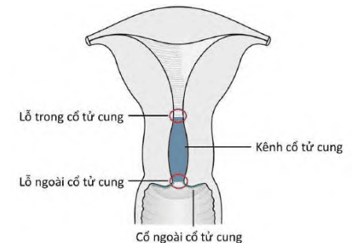

Từ ngoài vào trong, cổ tử cung lần lượt gồm:

- Cổ ngoài cổ tử cung (ectocervix hoặc exocervix) là phần thấp nhất của cổ tử cung tiếp xúc với âm đạo. Cổ ngoài được giới hạn bởi vòm âm đạo trước và sau. Cổ ngoài có hình dạng lồi hoặc dạng ellipse và được chia thành mép trước và mép sau cổ tử cung.
- Lỗ ngoài cổ tử cung (external os) là phần mở của cổ tử cung vào trong âm đạo. Lỗ ngoài này nằm ở trung tâm của cổ tử cung, có hình tròn (ở người chưa sinh con) và hình dẹt (ở phụ nữ đã sinh con).
- Kênh cổ tử cung (cervical canal) là kênh nằm bên trong cổ tử cung, nối từ lỗ ngoài cổ tử cung đến lỗ trong cổ tử cung. Kênh cổ tử cung có những gờ và rãnh, các nếp này xếp giống dạng bật lửa nên có thể giữ cho kênh cổ tử cung đóng kín.
- Lỗ trong cổ tử cung (internal os) là phần mở của cổ tử cung vào khoang tử cung (buồng tử cung).

### Mô học

Cổ tử cung được tạo thành bởi biểu mô và mô đệm. Mô đệm cổ tử cung là cấu trúc phức hợp của mô cơ trơn, mô sợi và mô đàn hồi.

#### Cổ ngoài

Cổ ngoài cổ tử cung được bao phủ bởi biểu mô lát tầng không sừng hóa, được chia thành từng lớp tế bào từ dưới (sâu) lên trên (bề mặt) gồm lớp tế bào đáy, lớp tế bào cận đáy, lớp tế bào trung gian và lớp tế bào bề mặt:

- Lớp tế bào đáy có hàng tế bào và nằm ngay trên lớp màng đáy. Hoạt động phân bào của biểu mô cổ tử cung chủ yếu xảy ra tại lớp này.
- Lớp tế bào cận đáy và trung gian cùng nhau tạo thành lớp gai (prickle cell layer).
- Lớp tế bào bề mặt có chiều dầy thay đổi, tùy thuộc vào nồng độ estrogen.

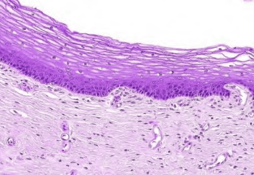
_Biểu mô lát tầng không sừng hóa cổ tử cung._

#### Cổ trong

Cổ trong cổ tử cung được bao phủ bởi biểu mô trụ đơn tiết nhầy. Biểu mô tuyến cổ trong gồm những tế bào hình trụ đơn lót trong niêm mạc các ống tuyến. Tế bào này cũng được gọi là các tế bào tuyến nhưng không phải là các ống tuyến thật sự.

#### Ranh giới lát trụ

Vùng ranh giới nằm giữa biểu mô lát tầng của cổ ngoài và biểu mô trụ của cổ trong gọi là ranh giới lát trụ (squamocolumnar junction) (SCJ). Ranh giới lát trụ là đường mảnh được cấu thành do sự khác nhau về độ cao của tế bào lát và tế bào trụ. Phần lớn các thay đổi sinh-bệnh lý cổ tử cung đều xuất phát từ vùng ranh giới này.

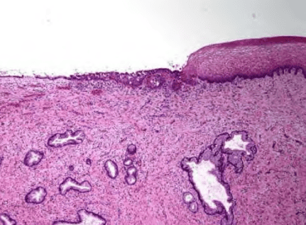
_Ranh giới lát trụ._

Vị trí của ranh giới lát trụ so với lỗ ngoài cổ tử cung thay đổi theo suốt cuộc sống người phụ nữ, phụ thuộc vào các yếu tố như tuổi, số lần sinh con, tình trạng hormone sinh lý liên quan đến hoạt động chu kỳ buồng trứng hay mang thai, hay ngoại lai (dùng thuốc ngừa thai uống),...

SCJ mà ta quan sát thấy ở các bé gái mới sinh, sau khi dậy thì, giai đoạn đầu tuổi hoạt động sinh sản, tuổi quanh mãn kinh, gọi là SCJ nguyên thủy (original SCJ). SCJ nguyên thủy là đường nối giữa biểu mô trụ và biểu mô lát nguyên thủy xuất hiện từ giai đoạn phôi thai trong tử cung. SCJ nguyên thủy nằm sát lỗ ngoài cổ tử cung.

Sau khi dậy thì và vào tuổi hoạt động sinh sản, cơ quan sinh dục của người phụ nữ phát triển dưới ảnh hưởng của estrogen, làm cho cổ tử cung to lên và kênh cổ tử cung kéo dài ra. Quá trình này dẫn tới việc biểu mô trụ nằm ở phần dưới của kênh cổ tử cung bị kéo ngược ra về phía ngoài cổ tử cung và gọi là lộ tuyến cổ tử cung.

Với lộ tuyến cổ tử cung, SCJ nguyên thủy nằm ở cổ ngoài cổ tử cung và cách xa lỗ ngoài cổ tử cung. Hiện tượng lộ tuyến cổ tử cung thường gặp trong quá trình mang thai.

## Chuyển sản và lộ tuyến cổ tử cung

Lộ tuyến cổ tử cung (endocervical ectropion) là hiện tượng biểu mô trụ nằm ở trong kênh cổ tử cung bị lộn ra trên cổ ngoài cổ tử cung.

Khi tử cung phát triển, ranh giới lát trụ nguyên thủy lộn ra từ vị trí ban đầu và nằm trên cổ ngoài cổ tử cung. Hệ quả là biểu mô trụ nguyên thủy trong kênh cổ tử cung nằm phía bên trên SCJ cũng bị lộn ra, tiếp xúc với môi trường acid của âm đạo. Mô tuyến cổ trong cổ tử cung có màu đỏ và giống như mô bị xói mòn nên thường được gọi không chính xác là "xói mòn cổ tử cung" (cervical erosion).

Ở thời kỳ mãn kinh, thiếu hụt estrogen làm tử cung teo nhỏ lại. Tiến trình lộ tuyến bị đảo ngược lại. SCJ chạy ngược vào nằm trên lỗ ngoài cổ tử cung, cách biệt so với âm đạo.

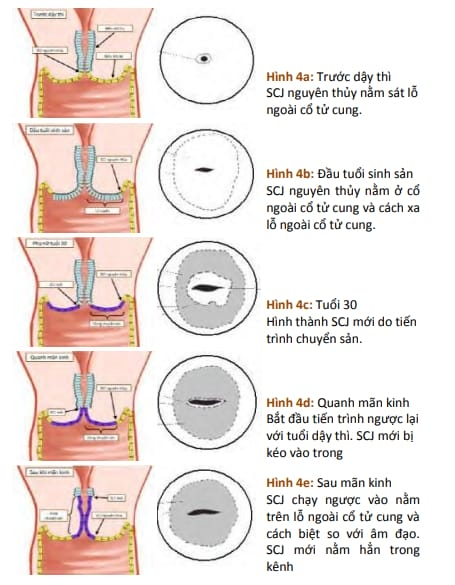
_Dịch chuyển SCJ nguyên thủy và SCJ mới._

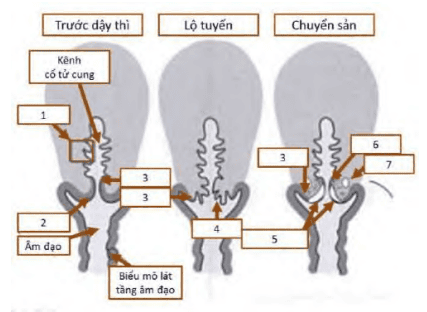
_Các ranh giới lát trụ nguyên thủy và mới: 1. Biểu mô trụ bao phủ kênh cổ tử cung 2. Biểu mô lát nguyên thủy 3. Ranh giới lát trụ nguyên thủy (original SCJ) 4. Biểu mô trụ tiếp xúc với âm đạo (lộ tuyến) 5. Vùng chuyển tiếp (transformation zone) 6. Ranh giới lát trụ mới (new SCJ hay functional SCJ) 7. Nang Naboth_

Lộ tuyến là tình trạng sinh lý bình thường, thường gặp ở những phụ nữ có tình trạng tăng estrogen trong cơ thể, như phụ nữ trong độ tuổi sinh sản, phụ nữ mang thai, phụ nữ dùng viên thuốc ngừa thai uống. Lộ tuyến cổ tử cung cũng có thể là bất thưởng bẩm sinh do ranh giới lát trụ hiện diện xuyên suốt ở cổ ngoài cổ tử cung từ lúc sinh.

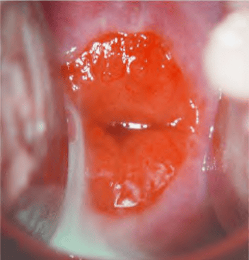
_Quan sát rõ ranh giới lát-trụ._

Trong môi trường acid của âm đạo và do đáp ứng với thay đổi hormone, tại biểu mô trụ sẽ diễn ra sự chuyển sản lát. Khi cổ tử cung bị lộ tuyến, vùng chuyển sản lát (transformation) nằm sát và tiếp xúc với biểu mô trụ của kênh cổ tử cung, hình thành ranh giới lát trụ mới (new SCJ) nằm ở phía trong của cổ trong cổ tử cung hơn so với ranh giới lát trụ nguyên thủy (original SCJ). Vùng biểu mô lát chuyển sản, nằm giữa SCJ nguyên thủy và SCJ mới gọi là vùng chuyển sản (transformation zone) hay vùng chuyển tiếp (transition zone). Ở cổ tử cung lộ tuyến, hoạt động tiết chất nhầy của biểu mô trụ cổ tử cung bị cản trở bởi sự tiếp xúc của biểu mô trụ vào môi trường acid của âm đạo. Việc này dẫn đến sự phá hủy biểu mô trụ và thay thế dần dần biểu mô trụ bằng biểu mô chuyển sản lát non mới hình thành. Phần lớn, quá trình chuyển sản bắt đầu từ vùng SCJ nguyên thủy và tiến triển vào trung tâm hướng về phía lỗ ngoài cổ tử cung.

Vùng SCJ mới được hình thành giữa biểu mô chuyển sản lát non mới và biểu mô trụ bị đẩy dần về phía cổ ngoài cổ tử cung. Ở những phụ nữ từ tuổi sinh sản đến quanh mãn kinh, vị trí của SCJ mới tiến triển hướng về cổ ngoài cổ tử cung. Do vậy, SCJ mới có nhiều vị trí khác nhau trên cổ ngoài cổ tử cung. Vị trí này lệ thuộc vào kết quả của tiến triển của biểu mô lát non trên vùng biểu mô trụ nằm ở cổ ngoài cổ tử cung. Tiến trình xảy ra từ giai đoạn tuổi sinh sản đến tuổi quanh mãn kinh của người phụ nữ. Vùng ranh giới lát trụ mới cũng như vùng chuyển sản có thể được quan sát thấy khi đặt mỏ vịt. Tuy nhiên, có 15% phụ nữ có vùng chuyển tiếp nằm sâu trong kênh cổ tử cung và không quan sất được khi đặt mỏ vịt.

_Trên hình, ta quan sát được trọn vẹn toàn bộ các điểm mốc quan trọng. Biểu mô lát nguyên thủy màu hồng sậm ở ngoài cùng, kế tiếp bằng vùng chuyển sản màu hồng tái. Giữa 2 vùng này là SCJ nguyên thủy. Phía ngay lỗ ngoài cổ tử cung giải phẫu là vùng SCJ mới. Có thể thấy được vài cửa tuyến trên vùng chuyển sản._

Khi vào giai đoạn quanh mãn kinh và bắt đầu mãn kinh, do thiếu hụt estrogen, cổ tử cung thu nhỏ lại làm cho SCJ mới di chuyển vào trong kênh cổ tử cung. Đến giai đoạn mãn kinh, SCJ mới không quan sát được qua khám mỏ vịt nữa.

Hiện tượng thay đổi sinh lý của biểu mô trụ bị lộ ra cổ ngoài cổ tử cung bởi biểu mô chuyển sản lát non gọi là chuyển sản tế bào lát. Môi trường âm đạo có tính acid trong suốt tuổi hoạt động sinh sản và mang thai. Tính acid này giữ vai trò quan trọng trong chuyển sản tế bào lát. Khi các tế bào trụ bị phá hủy bởi pH acid âm đạo ở vùng lộ tuyến, các tế bào này sẽ được thay thế bằng biểu mô chuyển sản non. Sự kích thích của môi trường acid âm đạo làm cho các tế bào dự trữ cận trụ (sub-columnar) xuất hiện. Các tế bào dự trữ cận trụ này sẽ tăng sinh và dần dần hình thành biểu mô lát chuyển sản giúp cho vùng lộ tuyến cổ tử cung được chữa lành.

Dấu hiệu đầu tiên của chuyển sản lát là sự xuất hiện và phát triển của tế bào dự trữ. Các tế bào này là lớp tế bào đơn độc, hình tròn, có nhân to và nằm sát nhân của tế bào trụ. Các tế bào này tăng sinh sẽ tạo ra nhiều tế bào dự trữ. Về mặt hình thể, các tế bào dự trữ có hình ảnh tương tự tế bào đáy của biểu mô lát, với nhân to tròn và ít bào tương. Khi tiến trình chuyển sản tiến triển, có sự tăng sinh và biệt hóa các tế bào dự trữ này thành dạng biểu mô lát non mỏng, nhiều tế bào và không phân tầng. Gọi là biểu mô chuyển sản lát non khi có ít hoặc không cỏ sự phân tầng trên biểu mô lát mới tạo thành. Các tế bào của biểu mô lát non không sản xuất glycogen và không bắt màu lugol. Nhóm các tế bào trụ tiết nhầy cũng có thể cắm vào biểu mô lát non ở giai đoạn này. Trong quá trình chuyển sản lát, nhiều nhóm tế bào lát non xuất hiện liên tục và ở nhiều vị trí khác nhau. Màng đáy của tế bào lát nguyên thủy cũng sắp xếp lại giữa vùng tăng sinh và biệt hóa các tế bào dự trữ và mô đệm cổ tử cung. Sự chuyển sản lát đa phần bắt đầu từ ranh giới lát trụ nguyên thủy, nhưng cũng có thể diễn ra ở biểu mô trụ gần đường ranh giới hoặc ở các đảo của tế bào trụ rời rạc lộ ra trên cổ ngoài cổ tử cung.

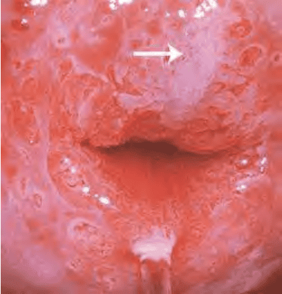
_Tái tạo với biểu mô lát non (mũi tên)._

Khi quá trình chuyển sản tiếp tục, biểu mô lát non biệt hóa thành biểu mô trưởng thành và phân tầng. Vài tế bào trụ dự trữ hoặc tiết nhầy cũng có thể được quan sát thấy trên biểu mô lát tầng chuyển sản trưởng thành. Các tế bào này có chứa glycogen từ tế bào ở lớp trung gian, giúp cho bắt màu lugol. Vài nang, gọi là nang Naboth cũng có thể được quan sát trên vùng biểu mô lát chuyển sản trưởng thành.

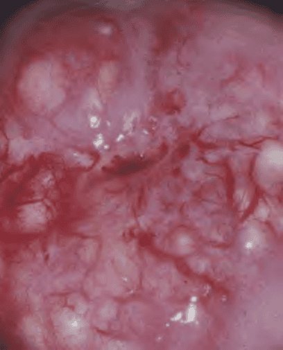
_Quan sát thấy trên vùng chuyển sản cổ tử cung. Nang Naboth là các tuyến bị biểu mô chuyển sản bít lối ra._

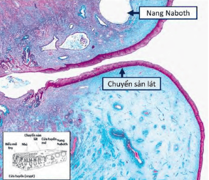
_Nang Naboth là tuyến bị biểu mô chuyển sản lát bít lối ra. Lòng nang Naboth được lót bởi 1 lớp tế bào biểu mô trụ có nguồn gốc từ lộ tuyến._

Biểu mô trụ trên thành nang Naboth phẳng và có thể bị phá vỡ bởi áp lực của dịch nhầy nằm trong nang. Vùng lỗ thoát dịch nhầy của biểu mô trụ không được phủ bởi biểu mô lát chuyển sản tạo ra cửa tuyến mở (crypt openings).

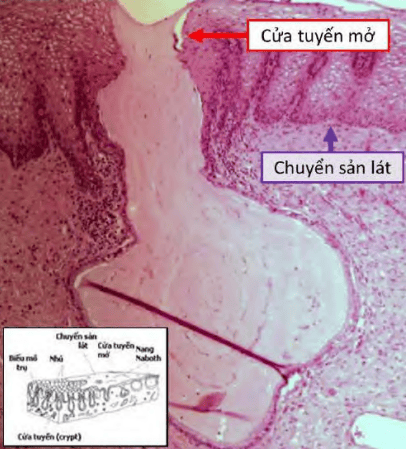
_Cửa tuyến mở trên vi thể là các nang Naboth với bề mặt nang bị vỡ. Hiện tượng này tạo ra hình ảnh "cửa tuyến" không biểu mô lát._

Tiến trình chuyển sản đôi khi không hoàn hảo. Trong trường hợp này, các tế bào trụ không chuyển dạng thành tế bào lát, và bị thay thế bởi tăng sinh tế bào dự trữ cận trụ. Tiến trình chuyển sản có thể có những mức độ tiến triển khác nhau ở các vị trí khác nhau. Trên cổ tử cung có thể quan sát nhiều vùng biểu mô lát chuyển sản trưởng thành trên cổ tử cung có hoặc không có đảo của biểu mô trụ.

## Điều trị viêm lộ tuyến

Do là tiến trình sinh lý, nên thông thường, không có chỉ định điều trị lộ tuyến cổ tử cung không có triệu chứng lâm sàng.

Trong 1 số trường hợp, có thể cần can thiệp nhằm kiểm soát sự lan rộng của mô lộ tuyến. Can thiệp có thể là trên hoạt động nội tiết nội sinh hay ngoại lai (như ngưng dùng thuốc ngừa thai nội tiết), cũng có thể là điều trị phá hủy mô lộ tuyến bằng đốt điện hoặc áp.

Về mặt nguyên tắc, không can thiệp trong những giai đoạn mà hoạt động nội tiết là không ổn định (như trong giai đoạn hậu sản). Trong những tình huống này, cần chờ đợi sự ổn định về hoạt động nội tiết của buồng trứng mới có thể đánh giá được đúng mức tiến trình lành tự nhiên của lộ tuyến cổ tử cung.

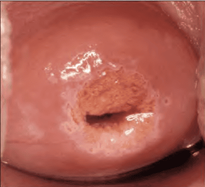
_Phía ngoài cùng, biểu mô lát nguyên thủy có màu hồng sậm. SCJ nguyên thủy nằm ở ranh giới giữa biểu mô chuyển sản và biểu mô lát nguyên thủy. Biểu mô lát chuyển sản có màu hồng sáng hơn. SCJ mới và biểu mô tuyến phía trong lỗ ngoài cô tử cung. Trên vùng chuyển sản, thấy có các đảo tuyến với cửa tuyến viền._

Tại vùng chuyển sản, sự non nớt của biểu mô làm vùng này trở thành vùng dễ bi tác động bởi các yếu tố sinh ung như HPV, là điều kiện cần để dẫn đến dị sản cổ tử cung. Tuy nhiên, HPV chỉ mới là điều kiện cần, nhưng chưa phải là điều kiện đủ để gây ung thư cổ tử cung.

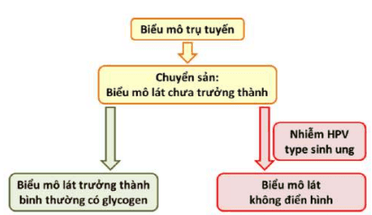

## Nguồn tham khảo

- TEAM-BASED LEARNING - Trường Đại học Y Dược Thành phố Hồ Chí Minh 2020.
