Cổ tử cung có thể tổn thương ở nhiều mức độ khác nhau.

## Các luận điểm về diễn biến của tân sinh biểu mô cổ tử cung

### Luận điểm cổ điển

Tân sinh trong biểu mô cổ tử cung bắt đầu từ các thay đổi rất nhẹ của biểu mô lát, tiến triển dần thành các tổn thương trong biểu mô có mức độ cao hơn, cuối cùng là ung thư.

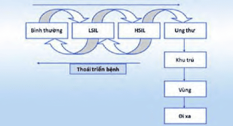
_Luận điểm cổ điển về tiến triển tự nhiên của tổn thương biểu mô cổ tử cung._

Cổ điển, dựa trên các biến đổi mô bệnh học quan sát thấy trên bệnh phẩm sinh thiết, người ta phân biệt 3 mức độ tổn thương của tân sinh trong biểu mô cổ tử cung CIN 1, 2, 3:

- CIN 1: tổn thương với các tế bào bất thường chiếm 1/3 dưới của biểu mô lát.
- CIN 2: tổn thương với các tế bào bất thường đã đạt đến 2/3 độ dầy của toàn lớp biểu mô lát.
- CIN 3: khi toàn bộ bề dầy của biểu mô lát bị phá vỡ cấu trúc và thay bằng các tế bào bất thường.

Về mặt mô học, CIN 1 thể hiện bởi các biến đổi bất thường của các tế bào thuộc các lớp dưới cùng của biểu mô lát tầng. Hơn 2/3 (CIN 2) cho đến toàn bộ (CIN 3) bề dầy biểu mô lát là các tế bào bất thường về tương quan giữa nhân:tế bào chất.

Cổ điển, căn cứ vào tính chất bất thường của các tế bào bề mặt, người ta phân biệt các tổn thương trong biểu mô ra:

- Tổn thương mức độ thấp (LSIL).
- Tổn thương mức độ cao (HSIL).

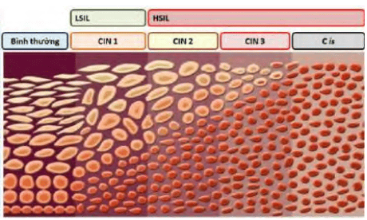
_Phân chia cổ điển. CIN mô tả theo bệnh học của mô lát. Tế bào học quan tâm đến các tế bào bề mặt. Ghi nhận sự biến đổi song hành của tổn thương tế bào bề mặt và tế bào đáy. Khi tế bào dưới đáy bị thay đổi thì sẽ kéo theo các thay đổi thấy được trên bề mặt._

### Luận điểm hiện đại

Luận điểm cổ điển về diễn biến tự nhiên của tân sinh trong biểu mô cổ tử cung cho rằng những tổn thương trong biểu mô diễn biến tuần tự từ các tổn thương mức độ thấp đến các tổn thương mức độ cao và có thể tiến triển ung thư cổ tử cung xâm lấn. Tuy nhiên, phải đối mặt với các báo cáo chỉ ra rằng có những trường hợp CIN 2 hoặc CIN 3 mà không có tổn thương CIN 1 trước đó.

Luận điểm hiện đại bao gồm các nội dung:

1. Khả năng sinh ung lệ thuộc vào genotype của HPV.
2. Khả năng thanh thải virus qua đáp ứng miễn dịch.
3. Tiến trình tích hợp vốn gene của virus vào tế bào.
4. Tân sinh trong biểu mô mức độ cao có thể xuất hiện không thông qua giai đoạn tổn thương mức độ thấp.

Tùy theo khả năng sinh ung mà các Human Papilloma Virus được chia làm 2 loại: (1) các genotypes có nguy cơ cao sinh ung thư (oncogenic), và (2) các genotypes có nguy cơ thấp sinh ung thư (non-oncogenic).

Nhiễm HPV genotype nguy cơ cao sinh ung thư là điều kiện cần nhưng không phải điều kiện đủ để phát triển thành ung thư cổ tử cung. HPV type 16 có khả năng gây ung thư cao nhất, chịu trách nhiệm trong khoảng 55-60% tất cả những ca ung thư cổ tử cung trên toàn thế giới. HPV type 18 là genotype sinh ung thư cao thứ nhì, chiếm 10-15% ung thư cổ tử cung. Khoảng 12 genotype khác có nguy cơ cao gây ung thư cổ tử cung.

Genotype của HPV và đáp ứng miễn dịch để thanh thải HPV đóng vai trò quan trọng trong bệnh sinh của ung thư cổ tử cung sau khi nhiễm HPV. Hầu hết các trường hợp nhiễm HPV thoáng qua và ít nguy cơ tiến triển tiếp tục thành ung thư. Chỉ số ít nhiễm HPV kéo dài, từ 1 đến 2 năm sau lần nhiễm đầu tiên, mới dẫn đến tăng nguy cơ phát triển thành tân sinh trong biểu mô cổ tử cung hoặc ung thư cổ tử cung sau này, bất kể tuổi của người phụ nữ. Các yếu tố thuận lợi khác được biết đến là hút thuốc lá, suy giảm miễn dịch, và nhiễm virus HIV. Chúng có điểm chung là làm suy yếu khả năng thanh thải HPV.

Nhiễm HPV thường gặp nhất ở trẻ gái tuổi vị thành niên và phụ nữ ở tuổi 20. Tỷ lệ mắc giảm dần theo tuổi. Tuy nhiên, hầu hết các phụ nữ trẻ, đặc biệt là trước 21 tuổi, có đáp ứng miễn dịch mạnh mẽ. Các đối tượng này có khả năng thanh thải HPV trong thời gian khoảng 8 tháng, ở khoảng 85-90% trong số họ, tải lượng virus có thể đạt đến mức không còn phát hiện được sau 8-24 tháng. Cùng với việc giải quyết thải HPV, hầu hết tân sinh cổ tử cung cũng được thoái triển tự nhiên ở nhóm dân số này. Tiến trình nhiễm tự nhiên HPV không thay đổi ở nhóm dân số từ 30-65 tuổi, do nhiễm HPV ở phụ nữ trên 30 tuổi thường tồn tại lâu, nên cùng với độ tuổi, tỷ lệ HSIL sẽ cao hơn.

Các trường hợp nhiễm HPV cấp thường biểu hiện bằng tân sinh trong biểu mô mức độ thấp (CIN 1). Trong giai đoạn này, không có sự tích hợp gene của virus vào genome của tế bào. Virus có khả năng bị thanh thải. CIN 1 có tỷ lệ cao sẽ thoái triển trở về bình thường. Vì thế, với CIN 1, các khuyến cáo thường đề nghị tiếp tục theo dõi hơn là can thiệp điều trị. Trong CIN 2, bắt đầu có hiện tượng tích hợp của virus vào genome của tế bào. Tiên lượng CIN 2 là sự hỗn hợp giữa tổn thương mức độ thấp và tổn thương mức độ cao, không dễ dàng phân biệt được bằng mô học. Trong CIN 3, vốn gene của virus đã hoàn thành việc tích hợp vào genome của tế bào. Vì thế, khả năng thoái triển trở về các độ tổn thương thấp hơn là rất thấp. Nguy cơ diễn tiến thành ung thư cổ tử cung là rất có ý nghĩa ở nhóm CIN 3. Theo 1 nghiên cứu đoàn hệ, đối với bệnh nhân bị CIN 3, nguy cơ diễn tiến thành ung thư xâm lấn cộng dồn sau 30 năm là 30.1%.

Có thể xem CIN 1 được xem là biểu hiện cấp tính của nhiễm HPV thoáng qua. Phần lớn CIN 1 có thể tự thoái triển. Chỉ khoảng 10% CIN 1 tiến triển thành CIN 2 và CIN 3 sau 2 năm. CIN 3 được coi là tổn thương tiền ung thư thực sự việc phát triển thành tổn thương mức độ cao phụ thuộc vào type HPV. Type 16 gây CIN 2, 3 ở độ tuổi sớm hơn so với các type HPV gây ung thư khác. Việc định type HPV có vai trò quan trọng trong việc tiên liệu tổn thương sẽ thoái triển hay tiến triển.

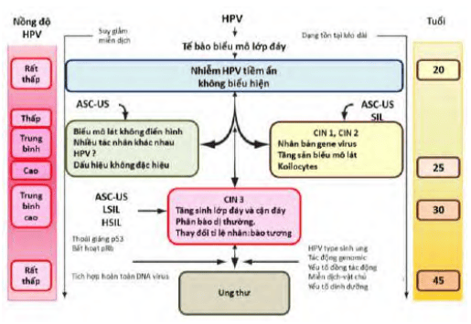
_Mọi trường hợp nhiễm HPV đều có thể thoái triển hay tiến triển. Sự tiến triển có thể là trực tiếp mà không thông qua các mức độ trung gian. Vì thế, chiến lược quản lý tổn thương trong biểu mô cổ tử cung phải tập trung vào các đặc điểm sinh học hơn là chỉ tập trung vào phân loại tổn thương._

## Dị sản cổ tử cung

### Quá trình dị sản

Chuyển sản (metaplasia) được định nghĩa là sự chuyển đổi từ dạng tế bào đã trưởng thành thành các dạng tế bào trưởng thành khác nhau. Tại cổ tử cung, chuyển sản lát thay thế biểu mô tuyến của lộ tuyến cổ tử cung bằng biểu mô lát tầng không sừng hóa. Hiểu hơn về quá trình này có thể tham khảo [Viêm lộ tuyến cổ tử cung](/phu-khoa/005-01_viem-lo-tuyen-co-tu-cung/).

Dị sản là kết quả của tác động bên ngoài vào các tế bào non nớt của quá trình chuyển sản sinh lý, chẳng hạn hóa chất, tia xạ, virus (đặc biệt là HPV) sẽ gây ra dị sản (dysplasia) tức tân sinh trong biểu mô cổ tử cung (CIN).

HPV ức chế các hoạt động apoptosis của tế bào chuyển sản và can thiệp trên điều hòa tăng trưởng của các tế bào này. Như vậy, HPV là điều cần để gây dị sản và ung thư. HPV xâm nhập thành công vào tế bào chủ sẽ giải mã các đoạn gene E6 và E7. E6 của HPV sẽ bất hoạt p53, còn E7 của HPV sẽ bất hoạt pRb.

- p53 là protein có tính năng ngăn chặn ung thư của tế bào. p53 hoạt động bằng cơ chế ức chế hiện tượng kích hoạt DNA, giữ cho tế bào ở G1-G2, và đảm nhận nhiệm vụ điều hòa cái chết chương trình của tế bào (apoptosis). E6 của HPV sẽ kết hợp với p53 và gây ra thoái giáng của p53. Tế bào mất khả năng ức chế phát triển, không còn tuân theo cái chết chương
  trình và trở thành tế bào bất tử.
- Protein Rb là protein ức chế sinh ung. Ở tế bào lành mạnh, pRb gắn với yếu tố giải mã E2F1 và ngăn không cho yếu tố này tương tác với hệ thống sao mã tế bào. Khi vắng mặt pRb, E2F1 kích hoạt E2F1 gene và chuyển đổi tế bào từ G1 thành S. E7 của HPV sẽ gắn với pRb và làm bất hoạt pRb, giải phóng E2F1 và biến tế bào thành tế bào bị kích hoạt.

Các tế bào thoát khỏi apoptosis (do E6) và bị kích hoạt tăng trưởng không kiểm soát (do E7) sẽ trở thành tế bào dị sản ở các mức độ khác nhau, tùy theo mức độ bị chi phối.

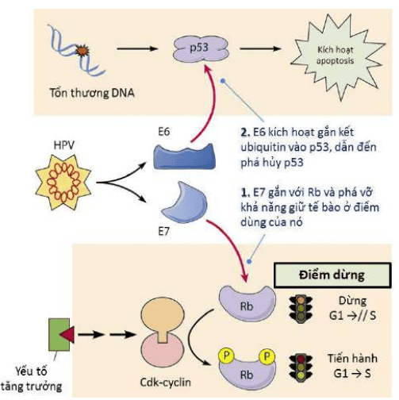
_E6 và E7 trong cơ chế sinh ung của HPV type 16. Các tế bào thoát khỏi apoptosis (do E6 bất hoạt p53) và bị kích hoạt tăng trưởng không kiểm soát (do E7 gắn với pRb giải phóng E2F) sẽ trở thành tế bào dị sản ở các mức độ khác nhau, tùy theo mức độ bị chi phối._

Tuy là điều kiện cần, nhưng nếu chỉ có nhiễm HPV thì chưa phải là điều kiện đủ để gây dị sản và ung thư. Các đáp ứng miễn dịch, đặc biệt là miễn dịch thích nghi qua tế bào (CMI) có vai trò quan trọng trong việc điều chỉnh tải lượng HPV và có thể làm đảo ngược quá trình. Sự đảo ngược tiến trình dị sản có thể xảy ra trong 80% các trường hợp. Tuy nhiên, trong 1 số trường hợp khác, khoảng 10%, diễn tiến của tế bào dị sản là đi đến ung thư.

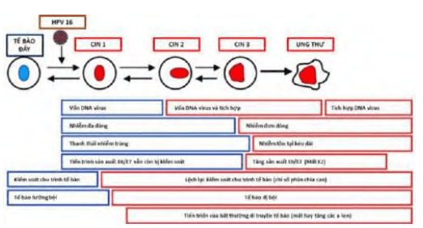
_Sự khác biệt về sinh học tế bào giữa CIN 1, CIN 2 và CIN 3, cũng như chiều hướng tiến triển của chúng. Sơ đồ về tiềm năng sinh học của các tế bào này căn cứ vào khả năng kết hợp của DNA virus vào tế bào chủ, khả năng tẩy sạch virus, khả năng điều hòa chu trình tế bào... cho thấy vì sao CIN 1 được xem như biểu hiện cấp tính của nhiễm HPV thoáng qua. Ngược lại, CIN 3 thường được coi là tiền ung thư thực sự._

### Các yếu tố nguy cơ

Các yếu tố nguy cơ, đã được xác định, tác động lên sự hình thành dị sản cổ tử cung gồm:

- Có nhiều hơn 1 bạn tình hoặc có quan hệ với người đàn ông mà người này có nhiều hơn 1 bạn tình.
- Lần quan hệ tình dục đầu tiên dưới 18 tuổi.
- Bạn tình nam có bạn tình bị ung thư cổ tử cung.
- Hút thuốc lá.
- Nhiễm Human Immunodeficiency Virus (HIV).
- Ghép cơ quan (đặc biệt là ghép thận).
- Nhiễm tác nhân lây truyền qua tình dục (STD).
- Tiếp xúc với diethylstilbestrol (DES).
- Tiền sử ung thư cổ tử cung hoặc CIN mức độ cao.
- PAP test không thường xuyên hoặc không làm PAP.

## Quản lý bất thường tế bào cổ tử cung

### ASC-US

#### Định nghĩa và tiến triển

ASC-US (Atypical squamous cells of undetermined significance) là thuật ngữ dùng để chỉ các bất thường của tế bào biểu mô lát với ý nghĩa không xác định.

Trong ASC-US, các tế bào biểu mô gai kém trưởng thành hơn bình thường, với nhân to trong các tế bào hồng rộng. Nhiều tế bào trong số này có nhân đôi bất thường. Các nhân rộng với bờ kém rõ. ASC-US không thỏa các tiêu chuẩn của tân sinh, nhưng đồng thời cũng không thỏa các tiêu chuẩn đảm bảo lành tính.

Thường thì ASC-US là những thay đổi của tế bào do phản ứng với biến động của môi trường cổ tử cung-âm đạo hơn là tổn thương do tân sinh trong biểu mô cổ tử cung. Phần lớn các ASC-US sẽ thoái triển về bình thường. Nguy cơ ASC-US dẫn đến ung thư là rất thấp (0.1-0.2%). Tương tự, nguy cơ ASC-US dẫn đến CIN 2-3 hay cao hơn là thấp (6.4-11.9%).

Diễn tiến tự nhiên của ASC-US sau 24 tháng:

- Thoái lui về bình thường: 65%.
- Tiến triển thành HSIL: 7%.
- Tiến triển thành ung thư xâm lấn: 0.25%.

#### Quản lý ASC-US

Nguyên tắc của quản lý ASC-US là thiên về theo dõi hơn là điều trị, tránh xử trí quá mức có thể gây hại.

Trong quản lý ASC-US xét nghiệm HPV có ý nghĩa trong phân tầng nguy cơ và giúp định hướng xử trí. Ở các đối tượng có ASC-US kèm theo HPV (-), nguy cơ tiến triển thành CIN 2, CIN 3 là dưới 2%. Ở các đối tượng có ASC-US kèm theo HPV (+), nguy cơ tiến triển thành CIN 2, CIN 3 tăng lên rõ rệt. Nguy cơ này là khoảng 15-27%.

Các bệnh nhân có kết quả tế bào học cổ tử cung là ASCUS nên được làm test HPV:

- Nếu HPV âm tính, thực hiện co-testing sau 3 năm.
- Nếu HPV dương tính, thực hiện soi cổ tử cung ngay hoặc làm lại tế bào học sau 1 năm.

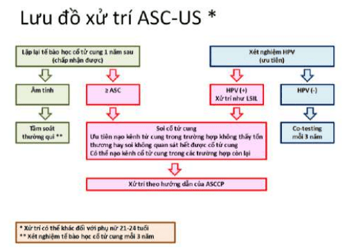
_Quản lý ASC-US theo hướng dẫn của ASCCP 2012 ở dân số chung._

Phụ nữ trẻ dưới 24 tuổi với ASC-US, cần có quản lý riêng, do đối với trẻ vị thành niên, nguy cơ tiến triển thành ung thư xâm lấn gần như là 0% và tỷ lệ thanh thải virus HPV cao. Có thể thực hiện xét nghiệm tế bào học lại sau 1 năm:

- Nếu kết quả tế bào học sau 1 năm là ASC-H, AGC, hoặc HSIL, thực hiện soi cổ tử cung.
- Nếu kết quả tế bào học bình thường, thực hiện lại tế bào học sau 1 năm.
- Nếu tế bào sau 2 năm bình thường, có thể cho bệnh nhân quay lại tầm soát thường quy, nếu bất thường thì soi cổ tử cung.

hoặc có thể làm test HPV ngay:

- Nếu HPV dương tính, làm lại tế bào học sau 12 và 24 tháng như trên.
- Nếu HPV âm tính, cho bệnh nhân tầm soát thường quy định kỳ theo lịch.

Phụ nữ trẻ ≤20 tuổi, ngẫu nhiên có thực hiện Pap’s test, và có kết quả ASC-US thì nên được theo dõi giống như ở độ tuổi từ 21- 24 tuổi.
Phụ nữ trẻ ≤20 tuổi, ngẫu nhiên có thực hiện Pap’s test, và có kết quả ASC-US thì nên được theo dõi giống như ở độ tuổi từ 21- 24 tuổi.

Quản lý ASC-US ở phụ nữ có thai giống như quản lý ở phụ nữ không có thai.

:::caution[Lưu ý]
Ghi nhớ 2 điểm sau:

- Chống chỉ định nạo kênh cổ tử cung ở phụ nữ có thai.
- Có thể chấp nhận trì hoãn soi cổ tử cung cho đến hết 6 tuần hậu sản.
:::

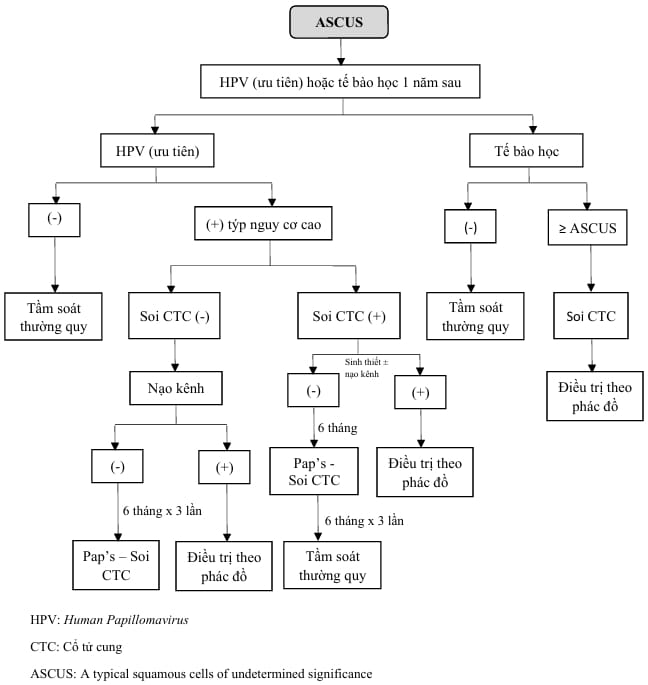
_Quản lý ASC-US theo Bệnh viện Từ Dũ._

### LSIL

#### Định nghĩa và tiến triển

Thuật ngữ LSIL (Low-grade squamous intraepithelial lesions) thể hiện các tổn thương trong biểu mô mức độ thấp.

LSIL bao gồm các tổn thương dị sản mức độ nhẹ hoặc nghi ngờ tổn thương CIN 1 trên mô học hoặc nhiễm HPV type nguy cơ cao.

Tế bào trong LSIL có nhân to hơn ≥3 lần so với nhân của tế bào trung gian bình thường. Tỷ lệ nhân:bào tương ≤ 1/3. Đa nhân không phải là dấu hiệu hiếm. Nhân đậm với phân bố nhiễm sắc chất đều. Ở các tổn thương LSIL, hoạt động của HPV còn rất rõ ràng. Có sự liên quan mật thiết giữa tổn thương LSIL và kết quả HPV-DNA dương tính.

Về tiến triển của LSIL, các nghiên cứu cho thấy:

- 47% thoái triển về bình thường.
- 20% tiến triển thành HSIL.
- 0.15% tiến triển thành ung thư xâm lấn sau 24 tháng.

Dù rằng nhiễm HPV cũng là yếu tố ảnh hưởng đến thời gian thoái triển của LSIL, tuy nhiên do có hơn 90% tổn thương LSIL có HPV (+), nên việc dùng test HPV để phân tầng theo dõi đối với tổn thương LSIL là ít có giá trị.

#### Quản lý LSIL

Các bệnh nhân có LSIL cần được soi cổ tử cung và xử lý theo kết quả soi và sinh thiết cổ tử cung.

Bệnh nhân được thực hiện co-testing và cho kết quả HPV âm tính, thực hiện lại co-testing sau 1 năm.

LSIL trên dân số đặc biệt:

- Phụ nữ 21-24 tuổi với LSIL, do cơ hội thoái triển cao, nên chọn làm lại tế bào học sau 12 và 24 tháng giống như quản lý ASC-US.
- Phụ nữ trẻ ≤20 tuổi với LSIL, cũng do tỷ lệ thoái triển về bình thường cao ở nhóm này nên các bệnh nhân này nên được theo dõi giống như ở độ tuổi từ 21-24.
- Phụ nữ trẻ ≤20 tuổi với LSIL, cũng do tỷ lệ thoái triển về bình thường cao ở nhóm này nên các bệnh nhân này nên được theo dõi giống như ở độ tuổi từ 21-24.
- Phụ nữ có thai giống như quản lý ở phụ nữ không có thai. Tương tự ASC-US, 2 điểm chống chỉ định nạo kênh tử cung ở phụ nữ có thai và có thể chấp nhận trì hoãn soi cổ tử cung cho đến hết 6 tuần hậu sản.
- Phụ nữ mãn kinh có thể có nhiều lựa chọn khác nhau: làm test HPV, hoặc làm lại tế bào học sau 6 tháng và 12 tháng, hoặc soi cổ tử cung ngay:
  - Nếu HPV âm tính hoặc không có tổn thương CIN khi soi cổ tử cung, làm lại tế bào học sau 12 tháng.
  - Nếu HPV dương tính hoặc tế bào học làm lại ≥ASC, thì phải thực hiện soi cổ tử cung.
  - Nếu HPV dương tính hoặc tế bào học làm lại ≥ASC, thì phải thực hiện soi cổ tử cung.
  - Có thể quay lại tầm soát thường quy nếu có xét nghiệm tế bào học âm tính 2 lần liên tiếp.

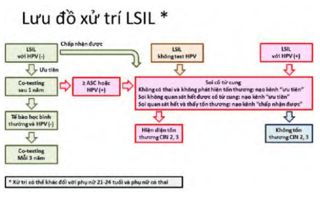
_Quản lý LSIL theo hướng dẫn của ASCCP 2012._

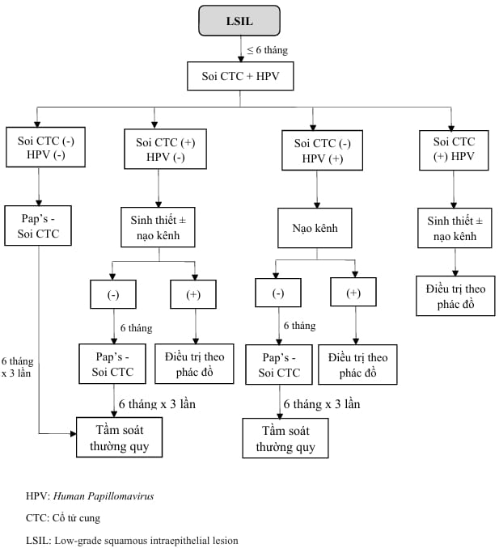
_Quản lý LSIL theo Bệnh viện Từ Dũ._

### HSIL

#### Định nghĩa và tiến triển

HSIL (High-grade squamous intraepithelial lesions) dị sản mức độ cao được đặc trưng bởi sự biến đổi tế bào biểu mô chưa trưởng thành như tế bào đáy, cận đáy và tế bào chuyển sản. Bao gồm dị sản ở mức độ vừa và nặng, CIN 2, CIN 3 hay ung thư tại chỗ trên mô học.

CIN 2 có những tế bào với đặc tính nhân tế bào như tổn thương biểu mô lát mức độ thấp. Tuy nhiên kích thước tế bào tương đương tế bào biểu mô chuyển sản chưa trưởng thành. Nhân có thể chiếm 1/2 kích thước tế bào. Do sự giảm bào tương, tỷ lệ nhân:bào tương giảm. Các tế bào sắp xếp đơn độc hoặc tập hợp lại như hợp bào.

CIN 3 chứa những tế bào có kích thước giống tế bào cận đáy hoặc tế bào dự trữ. Mặc dù nhân tế bào giống LSIL như không đều, màng nhân nhăn, có thể đa nhân, nhân sinh chất thoái hóa nhưng kích thước nhân nhỏ. Vì kích thước tế bào nhỏ và nhân tương đối lớn so với bào tương nên tỷ lệ nhân:bào tương tăng rõ rệt. Các tế bào có thể cô lập hoặc xếp thành lớp.

Diễn tiến của HSIL sau 24 tháng:

- Thoái lui về bình thường: 35%.
- Tồn tại HSIL: 23%.
- Tiến triển thành ung thư xâm lấn: 1.44%.

Trong các kết quả tế bào học là HSIL, có gần 70% các trường hợp được báo cáo là có CIN 2 hoặc CIN 3, và 1-2% trường hợp có ung thư xâm lấn. Vì vậy, tổn thương HSIL nên được soi cổ tử cung ngay và sinh thiết thương tổn nhìn thấy được. Nạo kênh cổ tử cung ở các bệnh nhân không đang mang thai. Nên khám toàn bộ âm đạo, nhất là khi tổn thương không tương ứng với kết quả tế bào học. Cắt bằng vòng điện (LEEP) có thể thực hiện ngay cùng lúc với soi cổ tử cung, sinh thiết cổ tử cung có thể bỏ qua và có thể đánh giá kênh cổ tử cung sau khi làm LEEP.

#### Quản lý HSIL

Soi cổ tử cung ở bất cứ độ tuổi nào của bệnh nhân. 
hoặc 
Khoét chóp ngay (ngoại trừ bệnh nhân còn trẻ dưới 25 tuổi hoặc phụ nữ có thai).
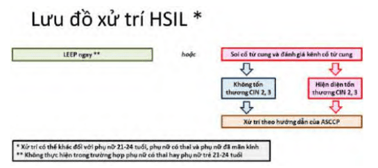
_Quản lý HSIL theo hướng dẫn của ASCCP 2012._

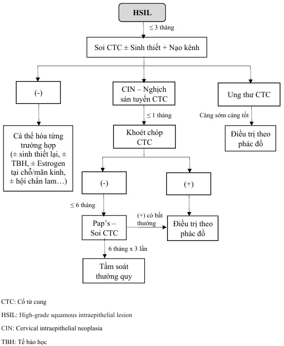
_Quản lý HSIL theo Bệnh viện Từ Dũ._

### ASC-H

#### Đặc điểm

ASC-H (Atypical squamous cells - cannot exclude high grade squamous intraepithelial lesion) tế bào vảy không điển hình, không thể loại trừ HSIL. Kết quả giáp biên, nhưng thực sự có thể bao gồm các tổn thương mức độ cao.

#### Quản lý ASC-H

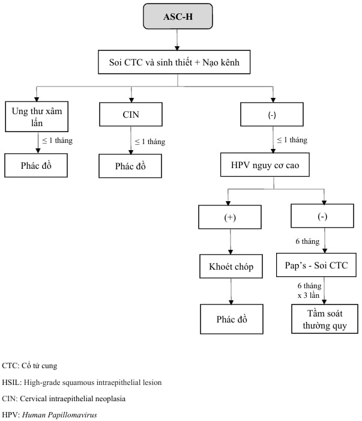
_Quản lý ASC-H theo Bệnh viện Từ Dũ._

### AGC hoặc AG-US

#### Đặc điểm

AGC (Atypical glandular cells) tế bào tuyến không điển hình hoặc AGUS (Atypical glandular cells of undetermined significance) tế bào tuyến không điển hình có ý nghĩa chưa xác định. Chẩn đoán có nghĩa rằng cần cân nhắc sự thay đổi ở những tế bào tuyến này ở mức độ tổn thương tiền ung thư và ung thư.

#### Quản lý AGC hoặc AGUS

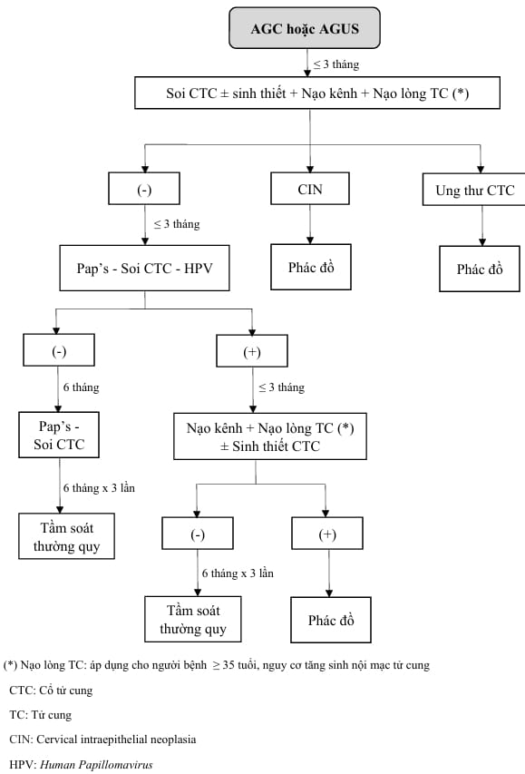
_Quản lý AGC hoặc AGUS theo Bệnh viện Từ Dũ._

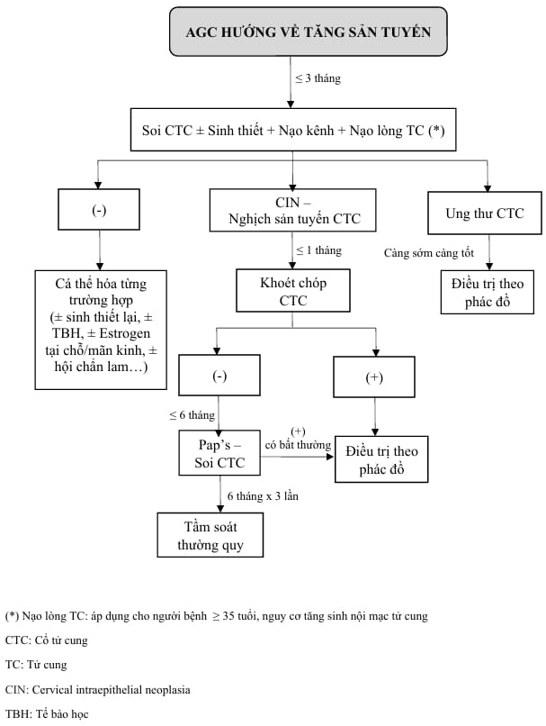
_Quản lý AGC hướng về tăng sản tuyến theo Bệnh viện Từ Dũ._

### CIN 1

#### Đặc điểm

Đa số các trường hợp CIN 1 hầu hết sẽ thoái triển tự nhiên sau đó. Tỷ lệ CIN 1 không điều trị tiến triển thành CIN 2 hoặc CIN 3 sau 2 năm là 13%. Do đó, quyết định điều trị hay theo dõi là tuỳ thuộc vào thảo luận với bệnh nhân. Theo dõi là biện pháp tốt nhất giúp cân bằng giữa lợi ích và nguy cơ.

#### Quản lý CIN 1

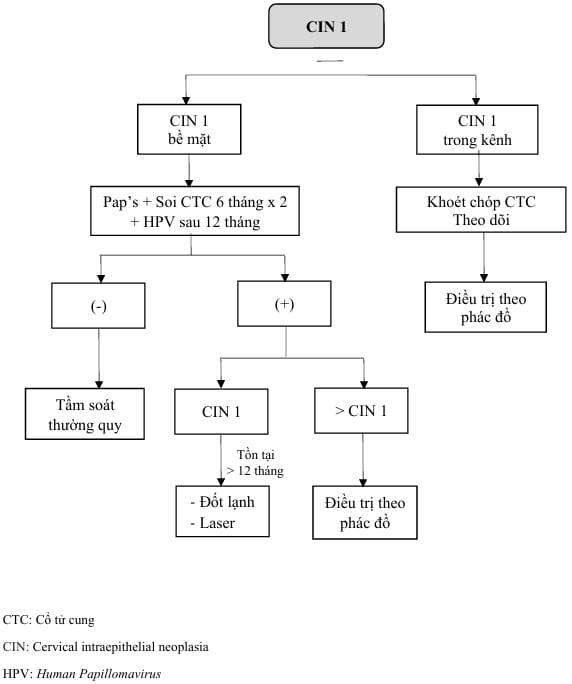
_Quản lý CIN 1 theo Bệnh viện Từ Dũ._

### CIN 2 và CIN 3

#### Đặc điểm

CIN 2, CIN 3 được xem là các tổn thương tiền ung thư. Phương pháp cắt mô hoặc hủy mô được khuyến nghị ở phụ nữ không đang mang thai, trừ 1 số trường hợp đặc biệt.

Có gần 40% các CIN 2 thoái triển tự nhiên về bình thường sau 2 năm. Ngược lại, rất hiếm khi CIN 3 tự thoái triển.

#### Quản lý

_Quản lý CIN 2, 3 theo Bệnh viện Từ Dũ._

### AIS

#### Đặc điểm

AIS (Adenocarcinoma in situ) tổn thương tại chỗ cổ tử cung nhưng có tần suất chiều hướng tăng. HPV được tìm thấy trong hơn 95% các trường hợp AIS.

Các thương tổn trên soi cổ tử cung đối với AIS có thể rất nhỏ và AIS thường lan vào trong kênh cổ tử cung, vì vậy để xác định giới hạn của sang thương có thể gặp khó khăn, quyết định lựa chọn độ rộng và độ sâu phù hợp khi thực hiện thủ thuật cắt bỏ mô bệnh khi điều trị khó chính xác. Hơn nữa, tổn thương AIS có thể đa ổ và không liên tục, do đó bờ phẫu thuật dù không còn tế bào bất thường cũng không đảm bảo chắc chắn là mô bệnh đã được loại bỏ hoàn toàn.

#### Quản lý AIS

Cắt tử cung được lựa chọn đối với bệnh nhân đủ con. Điều trị bảo tồn tử cung là lựa chọn có thể chấp nhận ở bệnh nhân còn mong con, với các điều kiện theo dõi nghiêm ngặt và dài hạn sau đó.

Do các đặc điểm bệnh học trên: nằm sâu, đa ổ và không thể loại trừ hoàn toàn ung thư xâm lấn nên cắt tử cung toàn phần là lựa chọn điều trị tốt nếu bệnh nhân đã đủ con. Đối với bệnh nhân còn mong con, điều trị bảo tồn là lựa chọn có thể chấp nhận, tuy nhiên nguy cơ AIS còn tồn tại là 10% và có nguy cơ nhỏ sẽ diễn tiến thành nguy cơ ung thư xâm lấn ngay cả khi bờ phẫu thuật âm tính. Cũng giống như bờ phẫu thuật, nạo kênh trong lúc thực hiện thủ thuật cắt bỏ mô bệnh ở cổ tử cung và test HPV sau điều trị có ý nghĩa trong tiên đoán khả năng tồn tại của AIS.

Đối với AIS, khoét chóp bằng dao lạnh được ưa dùng hơn LEEP vì cắt bằng dao lạnh có thể đánh giá tốt bờ phẫu thuật tốt, giúp cho việc lên kế hoạch điều trị tiếp theo. Nếu bờ phẫu thuật còn tế bào bất thường hoặc mô nạo kênh có CIN hoặc AIS, có thể cắt lại (ưu tiên) hoặc theo dõi đánh giá lại sau 6 tháng (chấp nhận).

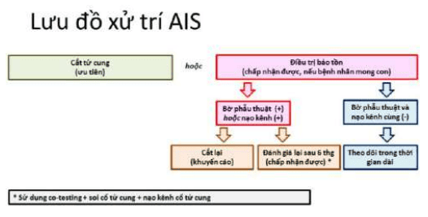
_Quản lý AIS theo hướng dẫn của ASCCP 2012._

### Nghi ngờ ung thư cổ tử cung trong thai kỳ

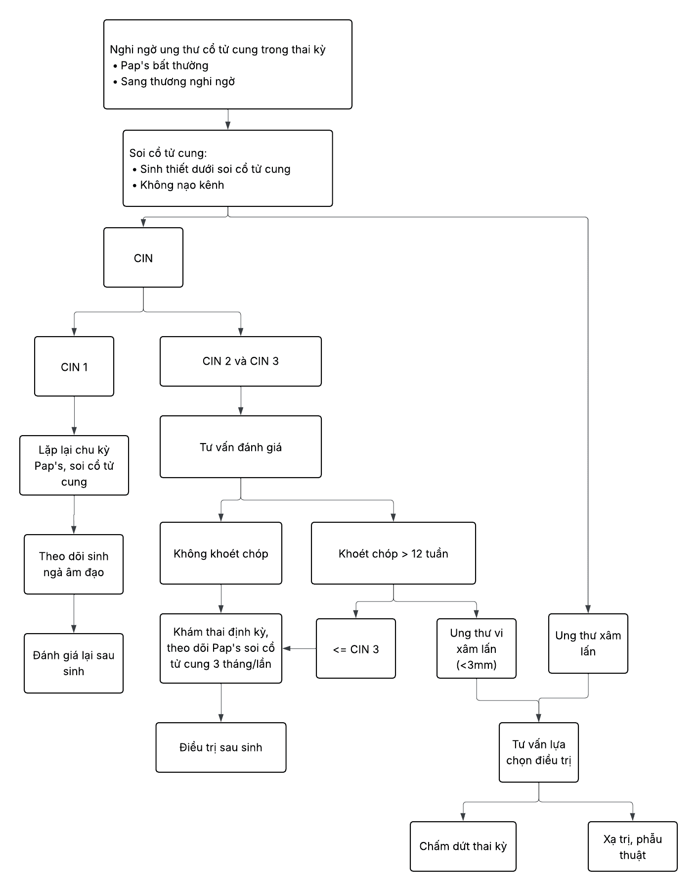
_Quản lý nghi ngờ ung thư cổ tử cung ở phụ nữ có thai theo Bệnh viện Từ Dũ._

## Điều trị trong tân sinh biểu mô cổ tử cung

CIN 1 theo dõi là biện pháp tốt nhất giúp cân bằng giữa lợi ích và nguy cơ.

Nếu không có chỉ định khác thì cắt tử cung không phải là điều trị đầu tay được lựa chọn đối với CIN 2, CIN 3. Cắt tử cung có thể được xem xét đối với CIN 2 hay CIN 3 tồn tại hoặc tái phát, hoặc khi biện pháp cắt lặp lại không thực hiện được.

Nếu cắt tử cung, nên thực hiện kỹ thuật loại bỏ mô trước để loại trừ khả năng đã có ung thư xâm lấn. Các kỹ thuật loại bỏ mô thường dùng là hủy mô (áp lạnh, đốt laser) và cắt bỏ mô tổn thương (LEEP/LLETZ, khoét chóp bằng dao lạnh). Kỹ thuật cắt mô vừa là biện pháp điều trị vừa là phương tiện chẩn đoán.

Hủy mô chỉ thích hợp cho tổn thương thỏa các điều kiện:

1. Có giới hạn rõ.
2. Kết quả sinh thiết qua soi cổ tử cung là tiền xâm lấn, không có tổn thương nghi ngờ ung thư xâm lấn.

### Huỷ mô bằng áp lạnh (cryotherapy)

Áp lạnh là phương pháp sử dụng nhiệt độ cực thấp để phá huỷ biểu mô bất thường.

Có thể sử dụng nitrogen hoặc carbon dioxide để làm lạnh. Đầu áp lạnh có nhiều loại khác nhau để phù hợp với hình dạng và kích thước của tổn thương. Dù là phương pháp ra đời từ lâu, nhưng hiện nay vẫn còn phổ biến vì tính đơn giản, dễ thực hiện, ít gây khó chịu cho bệnh nhân, và có thể thực hiện đối với bệnh nhân ngoại trú hoặc ở phòng tiểu phẫu. Có thể dùng lidocaine tê tại chỗ để giảm đau cho bệnh nhân trong khi làm thủ thuật.

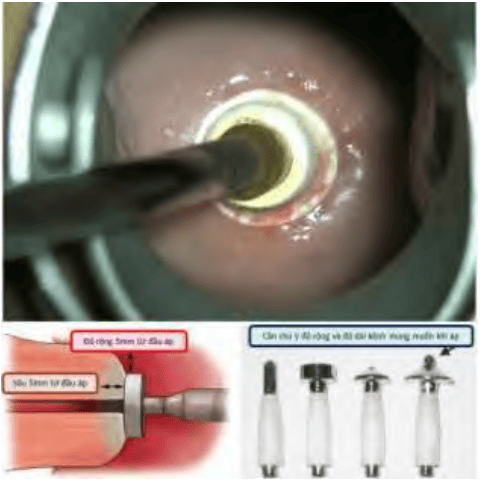
_Áp lạnh cổ tử cung với đầu áp lạnh được nối với nguồn nitrogen lỏng hay CO2 lỏng, áp vào cổ tử cung. Lựa chọn đầu áp tùy theo tổn thương (dưới, phải). Áp lạnh không cho phép điều chỉnh độ sâu của điều trị. Áp lạnh cũng không cho phép phá hủy chính xác tổn thương (dưới, trái)._

### Huỷ mô bằng đốt laser (laser vaporization)

Đốt laser (laser vaporization) là phương pháp dùng nhiệt năng của laser để phá hủy tế bào.

Đây cũng là phương pháp dễ thực hiện, có thể thực hiện cho bệnh nhân ngoại trú. Mức độ mô bị phá huỷ phụ thuộc vào nhiều yếu tố: cách cài đặt các mức năng lượng, kích thước của chùm tia laser và thời gian tiếp xúc mô.

Ưu điểm của đốt laser là phá huỷ mô rất chính xác. Có thể lấy hết toàn bộ tổn thương với độ sâu phù hợp. Có thể điều trị các tổn thương tiền xâm lấn ở âm hộ-âm đạo hiện diện đồng thời. Bất lợi của phương pháp laser là chi phí cao, gây nhiều
khó chịu cho bệnh nhân và nguy cơ chảy máu.

### Nạo kênh cổ tử cung

Thủ thuật trong đó niêm mạc ống cổ tử cung được nạo bằng dụng cụ hình thìa gọi là curette. Có thể thực hiện tại phòng khám và không cần gây mê. Có thể có 1 số ít trường hợp đau bụng có thắt và chảy máu sau khi làm thủ thuật.

### Khoét chóp bằng dao lạnh

Khoét chóp bằng dao lạnh (cold knife conization) là kỹ thuật kinh điển, cho phép đánh giá đầy đủ tổn thương.

Khoét chóp cổ tử cung bằng dao lạnh là lấy đi toàn bộ phần hình nón chứa vùng bị bệnh của cổ tử cung, với phần mô lành. Bệnh phẩm có hình nón này sẽ được đánh dấu vị trí. Khảo sát mô học chi tiết sau đó sẽ được thực hiện nhằm đánh giá tổn thương, sự xâm nhập của tổn thương và dương tính bờ phẫu thuật. Khó khăn của khoét chóp là cầm máu đúng kỹ thuật mà không gây hẹp kênh cổ tử cung về sau.

Khoét chóp bằng dao điện có ưu điểm là nhanh, kiểm soát chảy máu dễ dàng, kỹ thuật cầm máu cổ tử cung đơn giản. Nhược điểm lớn nhất của khoét chóp bằng dao điện là rất khó đánh giá dương tính tế bào ở bờ phẫu thuật, do mô bị cháy bởi dòng điện cao tần. Ưu điểm của khoét chóp là có thể chủ động cắt mô với nhiều hình dạng và kích thước khác nhau. Ưu điểm quan trọng nhất của khoét chóp bằng dao lạnh là khả năng khảo sát tình trạng dương tính hay âm tính ở bờ phẫu thuật, do phương pháp này không làm cháy mô ở bờ phẫu thuật.

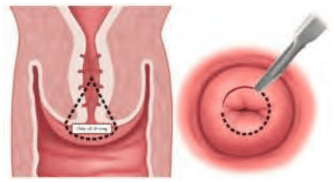
_Khoét chóp bằng dao lạnh._

### Cắt bỏ mô tổn thương với vòng điện LEEP và LLETZ

Cắt bằng vòng điện (loop electrosurgical excision procedure) (LEEP) hay vòng cắt rộng (large loop excision of the transformation zone) (LLETZ) là các kỹ thuật cắt vùng chuyển tiếp bằng vòng điện. Kĩ thuật này đã trở thành sự lựa chọn của nhiều nhà lâm sàng do đơn giản. Nhược điểm lớn nhất của phương pháp này là không được các nhà khảo sát mô học ưa chuộng, vì rất khó đánh giá dương tính bờ phẫu thuật. Cắt bằng dao laser (laser conization) đang dần bị thay thế vì chi phí cao và vì tính ứng dụng ngày càng rộng của LEEP.

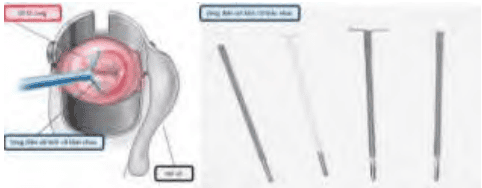
_LEEP và các vòng cắt khác nhau._

## Nguồn tham khảo

- TEAM-BASED LEARNING - Trường Đại học Y Dược Thành phố Hồ Chí Minh 2020.
- PHÁC ĐỒ ĐIỀU TRỊ SẢN PHỤ KHOA - Bệnh viện Từ Dũ.
