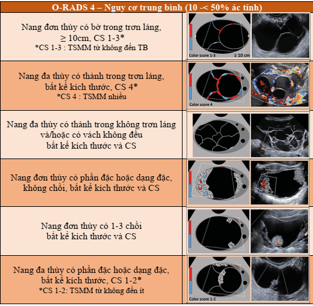

Phương tiện tiếp cận khối u buồng trứng gồm siêu âm, cộng hưởng từ, chỉ báo sinh học khối u.

## Khảo sát hình ảnh học

Các phương pháp hình ảnh được dùng cho khảo sát và đánh giá khối u buồng trứng gồm:

- Siêu âm grey-scale.
- Siêu âm Doppler.
- Cộng hưởng từ-hạt nhân.
- CT scan và các phương tiện tương tự.

### Siêu âm thang xám và hệ thống Tokyo

Siêu âm thang xám có thể được thực hiện qua ngả bụng hay qua đường âm đạo.

Siêu âm thang xám thực hiện qua ngả bụng sử dụng sóng âm có tần số thấp nên có tầm quan sát rộng, cho phép có được nhận định tổng quát về vùng chậu, đánh giá được các khối u rất to, và đánh giá sự lan tràn của ung thư trong khoang phúc mạc. Hạn chế của siêu âm thang xám đường bụng là chất lượng chi tiết hình ảnh không cao do tần số sóng âm thấp.

Siêu âm thang xám thực hiện qua đường âm đạo sử dụng sóng âm tần số cao, cung cấp hình ảnh có độ phân giải cao, cho phép đánh giá chi tiết cấu trúc u và giúp đánh giá khả năng lành tính của khối u là cao hay thấp. Hạn chế của siêu âm thang xám đường âm đạo là phạm vi quan sát bị giới hạn. Trong phần lớn các trường hợp với kích thước u nhỏ hay trung bình, người ta dùng siêu âm qua đường âm đạo để khảo sát và phân loại hình ảnh học chi tiết.

Việc mô tả chi tiết các đặc điểm hình ảnh học của khối u đóng vai trò quan trọng trong việc phân định khả năng lành tính cao và ít có khả năng là lành tính. Các đặc điểm có ý nghĩa, và thường được dùng là:

1. Cấu trúc dạng nang hay dạng đặc.
2. Tính chất của phản âm bên trong.
3. Các cấu trúc vách và chồi.

_Phân loại hình ảnh khối u buồng trứng theo đại học Tokyo_

Những cấu trúc u dạng nang của buồng trứng kiểu I đa số là những u nang thanh dịch hay các nang cơ năng.

Những cấu trúc u dạng nang của buồng trứng kiểu II đa phần là những nang lạc nội mạc tử cung ở buồng trứng, u nang thanh dịch hay u nang dịch nhầy.

Đa số những cấu trúc u dạng nang hay đặc của buồng trứng kiểu III, với đặc điểm có khối phản âm sáng hay đường phản âm sáng bên trong là những u nang dạng bì.

Đa số những u có phân loại hình ảnh siêu âm thang xám từ kiểu I đến kiểu III có tỷ lệ ung thư rất thấp, gần bằng 0.

Các khối u có phân loại hình ảnh siêu âm thang xám các kiểu IV, V, VI có liên quan đến khả năng có ung thư, nhưng giá trị dự báo dương (PPV) không đủ cao. Chỉ có các hình ảnh siêu âm kiểu VI mới có có giá trị dự đoán ung thư buồng trứng với độ đặc hiệu đủ cao, tức trên 90%.

Hệ thống phân loại Tokyo cho phép đánh giá được đáng tin cậy về triển vọng lành tính của khối u buồng trứng. Giá trị dự báo âm (negative predictive value) (NPV) của ung thư buồng trứng khi được khảo sát bằng siêu âm thang xám qua đường âm đạo gần tuyệt đối, khoảng 91-100%. Trái lại, giá trị dự báo dương (positive predictive value) (PPV) của của ung thư buồng trứng khi được khảo sát bằng siêu âm thang xám qua đường âm đạo chỉ từ 35-75%.

### O-RADS (Ovarian-Adnexal Reporting và Data System Committee)

O- RADS, hệ thống phân loại và xử trí các khối u buồng trứng dựa trên siêu âm đồng thuận hướng dẫn của American College of Radiology (ACR) Ovarian Adnexal Reporting và Data System Committee. Đối với phân tầng nguy cơ, O-RADS US chia thành 6 nhóm (ORADS 0-5), từ bình thường đến nguy cơ ác tính cao nhất:

- O-RADS 0: Đánh giá không đầy đủ do các yếu tố kỹ thuật như hơi ruột, sang thương kích thước lớn, vị trí của phần phụ, hoặc không thể chịu được siêu âm đường âm đạo.
- O-RADS 1: Nhóm sang thương sinh lý liên quan đến độ tuổi sinh sản, bao gồm nang noãn và nang hoàng thể.
  
- O-RADS 2: Nhóm gần như chắc chắn lành (<1% nguy cơ ác), gồm phần lớn các nang đơn thùy dưới 10 cm. Nhóm này bao gồm nang đơn giản, nang đơn thùy loại không đơn giản thành trơn láng, và các nang được mô tả như những sang thương lành kinh điển mà có đường kính lớn nhất dưới 10 cm. Những sang thương lành kinh điển là những sang thương có thể được chẩn đoán chính xác khi có ít nhất 1 đặc điểm nhận diện đặc hiệu theo O-RADS US mà không có đặc điểm đáng nghi ngờ nào khác. Chúng bao gồm nang xuất huyết điển hình, nang bì, u lạc nội mạc, nang cạnh buồng trứng, nang vùi phúc mạc, và ứ dịch tai vòi. Khi có thể, chẩn đoán sang thương lành kinh điển sử dụng các mô tả đặc trưng liên quan của chúng nên luôn ưu tiên hơn việc dùng các-mô tả sử dụng các đặc điểm chung cho mọi khối u.
  
  
- O-RADS 3: Nhóm nguy cơ thấp (1% đến < 10% nguy cơ ác), bao gồm các sang thương trong phân nhóm gần như chắc chắn lành nhưng kích thước lớn hơn, và các sang thương khác biểu thị nguy cơ ác tính có chút tăng nhẹ. Các sang thương này bao gồm nang đơn giản, nang đơn thùy trơn láng không đơn giản, và các sang thương có đặc điểm mô tả lành kinh điển mà có đường kính lớn hơn hoặc bằng 10 cm. Điểm cắt 10 cm được xem xét là mốc tăng nguy cơ ác dựa vào bộ dữ liệu IOTA 1-3, và cũng được ghi nhận trong y văn. Cũng bao gồm trong nhóm này là các nang đơn thùy với thành không đều, nang đa thùy dưới 10 cm không có thành phần đặc và thang điểm dưới 4, và sang thương đặc hoặc dạng đặc không tăng sinh mạch với bờ ngoài trơn láng bất kể kích thước. Sự hiện diện dòng Doppler giúp chẩn đoán xác định thành phần đặ. Bắt đầu từ nhóm O-RADS 3, thang màu có vai trò trong hệ thống phân tầng nguy cơ.
  
- O-RADS 4: Đề cập đến nhóm nguy cơ ác tính trung gian (10% đến <50% nguy cơ ác) bao gồm các mô tả có mức ước đoán ác tính cao. Nhóm gồm các nang đa thùy ≥ 10 cm, hoặc có thành trong hoặc vách không đều (phần đặc< 3mm chiều cao), nang đơn thùy và đa thùy bất kể kích thước có thành phần đặc hoặc CS 4, và sang thương đặc bờ trơn láng (>80% đặc) với CS 2-3. Cần chú ý rằng nhú là 1 dạng của thành phần đặc với chiều cao từ 3mm trở lên xuất phát từ thành nang hoặc vách và nhô vào trong nang.
  
  
- O-RADS 5: Nhóm nguy cơ ác tính cao (≥ 50% ác tính), bao gồm các mô tả mà độ ước đoán ác tính cao như sang thương đặc bờ không đều và nang đa thùy với thành phần đặc và có CS cao. Sự hiện diện của báng bụng và/hoặc nốt phúc mạc được xem là O-RADS 5 trừ khi có báng bụng liên quan với nang chức năng hoặc hầu như sang thương chắc chắn lành (xem O-RADS 2), khi đó các nguyên nhân khác gây báng bụng cần được xem xét.
  

_Phác đồ xử trí và phân loại O-RADS._

### Siêu âm Doppler và hệ thống IOTA 2010

Cũng như mọi tân sinh ác tính khác, các cấu trúc tân lập ác tính của buồng trứng có hiện tượng tân tạo mạch. Tân tạo mạch làm giảm trở kháng các dòng chảy, và trở thành 1 đặc điểm bổ sung quan trọng nhằm mục tiêu cải thiện dự báo dương có ác tính của khối tân lập. So với siêu âm thang xám đơn độc, việc kết hợp của siêu âm Doppler và siêu âm thang xám cải thiện rõ rệt độ chuyện biệt cũng như giá trị dự báo dương có ung thư buồng trứng, với Pooled Specificity lên đến 0.78.

Hệ thống phân tích IOTA (International Ovarian Tumor Analysis) được Timmerman 2010 trình bày vào năm 2010, sử dụng thêm các đặc điểm siêu âm Doppler. Các kết quả báo cáo cho thấy độ nhạy với ung thư buồng trứng là 91% và độ chuyên biệt lên đến 95%. Do đạt được 1 độ chuyên biệt chấp nhận được nên hệ thống IOTA cho phép việc phân chia hình ảnh thành các quy tắc lành tính (B1-B5) và các quy tắc ác tính (M1-M5):

- Các quy tắc của lành tính (B-rules) gồm:
  - B1: U chỉ gồm 1 thùy đơn độc.
  - B2: Hiện diện của thành phần rắn, kích thước tối đa không vượt quá 7 mm.
  - B3: Hiện diện bóng âm.
  - B4: Khối u nhiều thùy, trơn láng, kích thước tối đa không vượt quá 100 mm.
  - B5: Không có dòng chảy (điểm màu 1).
- Các quy tắc của ác tính (M-rules) gồm:
  - M1: Khối u đặc không thuần nhất.
  - M2: Có dịch báng bụng.
  - M3: Có ít nhất 4 cấu trúc chồi nhú.
  - M4: U đặc đa thùy không thuần nhất, kích thước tối và vượt quá 100 mm.
  - M5: Dòng chảy rất mạnh (điểm màu 4).

### Chụp X-quang điện toán cắt lớp CT-scan

So với siêu âm, giá trị dự báo ung thư của X-quang thấp hơn. X-quang điện toán cắt lớp là 1 khảo sát không bắt buộc, được chỉ định khi muốn đánh giá các yếu tố: (1) tổn thương trong bối cảnh của 1 tình trạng đã lan tràn ở vùng chậu và (2) cấu trúc tổn thương và mối liên quan với cơ quan vùng chậu.

X-quang điện toán cắt lớp cũng có thể có hữu ích khi được chụp có thuốc cản quang.

### Cộng hưởng từ-hạt nhân (MRI)

Tương tự như X-quang, MRI là 1 khảo sát không bắt buộc, được chỉ định khi muốn đánh giá các yếu tố: (1) tổn thương trong bối cảnh của 1 bệnh lý đã lan tràn ở vùng chậu, và (2) khảo sát cấu trúc tổn thương và mối liên quan với cơ quan vùng chậu.

MRI có hiệu quả trong mục tiêu (1) mô tả các các khối u vùng bụng rất nhỏ, (2) giúp xác định vị trí khối u, cũng như khả năng dính vào các cơ quan xung quanh, và (3) các tổn thương di căn hoặc chèn ép.

## Các chỉ báo sinh học khối u

Giá trị của các chỉ báo khối u trước mổ vẫn chưa được khẳng định. Vị trí quan trọng nhất của các chỉ báo khối u vẫn là theo dõi sau phẫu thuật ung thư buồng trứng.

### CA125

CA125 (carcinoma antigen 125) (hay MUC16) là 1 glycoprotein giống mucin. Trong thời kỳ bào thai, CA125 có nguồn gốc từ thượng mô phúc mạc nguyên thủy (fetal coelomic epithelia) là nguồn gốc của màng lót hệ Mullerian và biểu mô sơ khai bề mặt ụ sinh dục nguyên thủy. Tương tự, ở người trưởng thành, CA125 có nguồn gốc từ các biểu mô có nguồn gốc trung bì như màng bụng, màng phổi, màng ngoài tim, và các biểu mô của các cơ quan nguồn gốc Mullerian: vòi trứng, nội mạc tử cung và cổ trong cổ tử cung.

CA125 cao thấy trong các bệnh lý ác tính khác như ung thư buồng trứng, vú, phổi, tụy, đại tràng và tiêu hóa khác. Tuy nhiên, nhiều tình trạng không tân sinh, nhưng có kích thích các biểu mô này cũng gây nên tình trạng tăng của nồng độ CA125. CA125 tăng trong 1 số trạng thái sinh lý như thai kỳ, lạc nội mạc tử cung, khi hành kinh. CA125 cũng tăng trong 1 số bệnh lý lành tính như tràn dịch màng bụng và/hoặc màng phổi do lao, suy tim, hội chứng thận hư...

Hiện nay, trị số 35 IU/mL thường được dùng là giá trị ngưỡng phân biệt (cut-off point) bình thường với bất thường. Tuy nhiên, đối với những người đã mãn kinh hoặc đã cắt tử cung kèm 2 buồng trứng thì nên chọn giá trị ngưỡng thấp hơn. Ngưỡng cắt được đặt ở 20-26 IU/mL.

Trong các ung thư buồng trứng có nguồn gốc biểu mô nguyên thủy, CA125 thường tăng trong u thanh dịch hơn là trong u nhầy, tế bào sáng hoặc bướu giáp biên ác.

CA125 thay đổi tùy theo giai đoạn của ung thư. Vì thế CA125 không được dùng để chẩn đoán và tầm soát sơ cấp các giai đoạn sớm của ung thư buồng trứng. Độ nhạy của CA125 cho tầm soát ung thư buồng trứng không triệu chứng chỉ là 10%, với độ đặc hiệu là 30%. Độ nhạy của tầm soát ung thư buồng trứng bằng CA125 không cao hơn 50% trong ung thư buồng trứng giai đoạn sớm. Độ nhạy của tầm soát ung thư buồng trứng bằng CA125 có tăng lên, đạt đến 85% khi ung thư đã tiến triển xa. Tuy nhiên, điều này không giúp nâng cao vị trí của CA125, do khi ung thư đã tiến triển xa thì các phương tiện hình ảnh vẫn có 1 giá trị cao hơn CA125 rất nhiều.

CA125 là chỉ báo cho mục đích phát hiện sớm tái phát của các loại ung thư buồng trứng có nguồn gốc biểu mô. Trong mục đích phát hiện sớm tái phát, độ nhạy của CA125 lên đến 60%. Độ nhạy cao là ưu thế của CA125 trong theo dõi, bất chấp độ chuyên biệt của test rất thấp trong mục đích này, chỉ có 20%.

### HE4

HE4 (Human Epididymal Secretory Protein 4) là chỉ báo cho mục đích phát hiện sớm tái phát và tiến triển của các ung thư buồng trứng có nguồn gốc biểu mô.

HE4 được nhận biết tại biểu mô phần xa mào tinh và được cho là chất ức chế protease giúp tinh trùng trưởng thành. Tuy nhiên chức năng cụ thể của HE4 vẫn chưa được xác định.

HE4 tăng cao trong 93% u tuyến dịch trong, 100% u dạng nội mạc tử cung và 50% u tế bào sáng của buồng trứng. Trái lại, HE4 tăng ít trong u tuyến dịch nhầy.

Tương tự CA125, HE4 cũng thay đổi theo tuổi và nhiều tình trạng khác. Độ nhạy của HE4 cho mục tiêu chẩn đoán ung thư buồng trứng khoảng 67%. Độ chuyên biệt cho mục tiêu chẩn đoán ung thư buồng trứng của HE4 có thể lên đến trên 90%. Do các tính chất này, FDA công nhận HE4 là chỉ báo sinh học dùng để theo dõi sự tái phát, phát triển của các loại ung thư buồng trứng có nguồn gốc biểu mô.

HE4 thường được thực hiện chung với CA125, với kết quả diễn giải nguy cơ có được nhờ 1 toán đồ gọi là ROMA test.

### ROMA test

ROMA test là 1 toán đồ sử dụng cùng 1 lúc 2 chỉ báo khối u là CA125 và HE4, kết hợp với đặc điểm cá nhân và tiền sử bệnh nhân.

ROMA test cho phép phân tầng các bệnh nhân có khối u vùng chậu ra 2 nhóm: (1) nhóm bệnh nhân có nguy cơ cao và (2) nhóm bệnh nhân có nguy cơ thấp của ung thư có nguồn gốc biểu mô của buồng trứng. Có sự khác biệt về điểm cắt (cut-off) ở 2 dân số khác nhau: (1) nhóm trước mãn kinh và (2) nhóm sau mãn kinh.

ROMA test có giá trị dự báo âm rất cao, lên đến 99%. 94% trong tổng số các ung thư biểu mô buồng trứng đã được nhận diện vào nhóm nguy cơ cao khi sử dụng ROMA test.

:::caution[Lưu ý]
ROMA test không được dùng cho mục đích tầm soát ung thư biểu mô buồng trứng.
:::

### Alpha-fetoprotein (AFP)

AFP là protein chính trong thời kỳ phôi thai, được tổng hợp tại gan thai nhi, bản chất là glycoprotein giống mucin.

Giá trị bình thường của AFP < 5.4 ng/mL. AFP thường tăng trong các u tế bào mầm, ngoài ra còn tăng cao trong trong 1 số bệnh lý như carcinoma tế bào gan, bệnh lý ác tính dạ dày, đường mật, tụy.

### Human Chorionic Gonadotropin (hCG)

hCG là 1 glycoprotein được sản xuất chủ yếu bởi các hợp bào nuôi do rau thai tiết ra. Nồng độ hCG tăng cao khi có thai hoặc các bệnh lý tân sinh nguyên bào nuôi hoặc các bệnh lý ác tính không liên quan đến nguyên bào nuôi như trường hợp bướu tế bào mầm.

### Các chỉ báo khối u khác

LDH, steroid... được thực hiện chọn lọc.

## Khảo sát các đột biến gene

95% các ung thư buồng trứng không liên quan đến di truyền. Tuy nhiên, 5% ung thư buồng trứng còn lại có liên quan đến các đột biến gene.

### Đột biến gene BRCA

Đột biến gene BRCA1, BRCA2 làm mất khả năng sản xuất các protein bảo vệ và sửa chữa DNA. Đột biến các gene BRCA1, BRCA2 là khảo sát được khuyến cáo cho các đối tượng có nguy cơ có liên quan đến ung thư vú, ung thư buồng trứng. Không phải mọi người đều phải khảo sát đột biến BRCA. Khảo sát đột biến BRCA thường được chỉ định khi có tiền căn gia đình gợi ý:

- Có ≥ 3 người trong gia đình được chẩn đoán ung thư vú hoặc ung thư buồng trứng, trong đó có 1 người dưới 50 tuổi.
- Có 2 người trong gia đình thế hệ thứ nhất hoặc thế hệ thứ hai bị ung thư vú hoặc ung thư buồng trứng.
- Có người trong gia đình bị ung thư vú nam giới.
- Bệnh nhân được chẩn đoán ung thư trước 50 tuổi.
- Có người trong gia đình cùng lúc mắc ung thư vú và ung thư buồng trứng.

### Các đột biến gene khác

1 số đột biến gene khác cũng được đề cập:

- Đột biến gene TP53 là 1 đột biến sinh dưỡng, và được cho là có mối liên quan với nhiều ung thư khác nhau. Đối với 1 số ung thư như ung thư vú, đột biến gene TP53 có giá trị như 1 chỉ báo tiên lượng xấu. Tại buồng trứng, đột biến này có liên quan đến các trường hợp ung thư buồng trứng thanh dịch grade cao.
- Đột biến gene PICK3CA cũng là 1 đột biến sinh dưỡng, và cũng được cho là có mối liên quan với nhiều ung thư khác nhau. Tại buồng trứng, đột biến này có liên quan đến u tế bào sáng, u tuyến dịch nhầy và u dạng nội mạc.
- Đột biến gene CTNNB1 exon 3 được tìm thấy ở bệnh nhân có u dạng nội mạc ác tính grade thấp và ở giai đoạn sớm.
- Đột biến gen KRAS và BRAF thường thấy ở ung thư grade thấp.

## Nguồn tham khảo

- TEAM-BASED LEARNING - Trường Đại học Y Dược Thành phố Hồ Chí Minh 2020.
