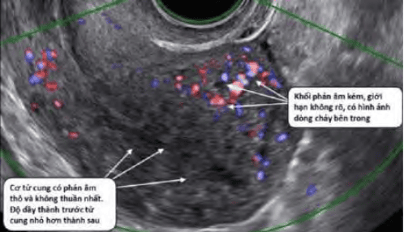

U xơ cơ tử cung (Leiomyoma), thường được gọi là u xơ tử cung là khối u lành tính không rõ nguyên nhân do sự phát triển quá mức cơ trơn và mô liên kết ở tử cung.

_Các nhân xơ là các khối u có vỏ bọc giả, gồm mô cơ-sợi, mật độ mô chắc, mặt cắt màu trắng ngà, phồng. Với các nhân xơ lớn, có thể quan sát thấy thoái hóa bên trong nhân xơ._

## Bệnh học u xơ tử cung

Các tế bào của u xơ-cơ là các tế bào chịu ảnh hưởng của các steroids sinh dục. U xơ-cơ tử cung sở hữu những đặc tính sinh học quan trọng. Các thụ thể của estrogen (ER) và của progesterone (PR) được tìm thấy trên các tế bào của u xơ-cơ tử cung. Dưới ảnh hưởng của steroid sinh dục, chúng phát triển với 1 tốc độ chậm. Khi bị cắt nguồn cung cấp steroid, hầu hết các u xơ-cơ tử cung sẽ có chiều hướng thoái triển.

Estrogen tác động thông qua thụ thể ER-α để tạo ra PR. PR đóng vai trò cốt lõi trong phát triển của u xơ-cơ tử cung. Progesterone là yếu tố thiết yếu cho phát triển của u xơ-cơ tử cung. Progesterone thúc đẩy phân bào nguyên nhiễm tại khối u, đồng thời đảm bảo thiết lập và duy trì thể khối của cấu trúc matrix ngoại bào. Khi vắng mặt thụ thể PR, 1 mình ER-α không đủ khả năng để gây ra sự phát triển của u xơ-cơ tử cung.

Các yếu tố tăng trưởng (growth factor) với hoạt tính thúc đẩy phân bào nguyên nhiễm như epidermal growth factor (EGF), và insulin-like growth factor-I (ILGF-1)... đều tăng trong u xơ-cơ tử cung.

## Yếu tố nguy cơ và phân loại

### Yếu tố nguy cơ

Tuổi ở phụ nữ: Tần suất xuất hiện tăng theo tuổi, giảm ở phụ nữ tuổi mãn kinh.

Tiền sử gia đình có người bị u xơ tử cung.

Yếu tố di truyền như 1 số gen (MED12, HMGA2, CYP1A1 và CYP1B1) và các bất thường nhiễm sắc thể (trisomy 12, đảo đoạn 12q, 6p, 10q, 13q và mất đoạn 7q, 3q, 1p).

Khoảng cách giữa 2 lần sinh con ≥ 5 năm.

Giai đoạn tiền mãn kinh có nguy cơ ư xơ cao hơn 10 lần mãn kinh.

Rối loạn chuyển hóa như béo phì, kháng insulin, hội chứng buồng trứng đa nang, tăng lipid máu, tăng huyết áp,...

### Yếu tố bảo vệ

Mang thai và sinh con nhiều lần.

Hoạt động thể chất thường xuyên.

Ăn nhiều cá và rau xanh, trái cây, vitamin A có nguồn gốc động vật.

### Phân loại (FIGO 2011)

## Chẩn đoán xác định

### Lâm sàng

#### Triệu chứng cơ năng

Bụng to lên, sờ thấy khối u trên bụng.

Xuất huyết tử cung bất thường tùy theo vị trí, thường gặp cường kinh, rong kinh.

Triệu chứng chèn ép cảm giác khó chịu hay đau bụng vùng chậu, thận ứ nước (chèn ép niệu quản), bí tiểu hoặc đi tiểu khó (chèn ép bàng quang hay cổ bàng quang), táo bón (chèn ép trực tràng), chèn ép tĩnh mạch chủ dưới và tăng nguy cơ huyết khối.

Triệu chứng trằn nặng, đau vùng chậu âm ỉ thường gặp trong u xơ to.

Thống kinh.

Đau khi giao hợp thường gặp u xơ ơ thành trước, ở cổ tử cung và vùng đáy tử cung.

Đau lưng.

#### Triệu chứng thực thể

Thiếu máu do xuất huyết tử cung bất thường.

Sốt gặp khi u xơ thoái hóa, nhiễm trùng.

Khám thấy kích thước, vị trí, độ di động của khối u.

Khám mỏ vịt thấy khối ở ngoài cổ tử cung hoặc thấy u xơ dưới niêm mạc lòi ra ngoài lỗ cổ tử cung.

U xơ thoái hóa hoặc xoắn gây đau vùng chậu xuất hiện kèm sốt nhẹ, tử cung đau khi chạm vào, bạch cầu tăng và cảm ứng phúc mạc.

### Chẩn đoán hình ảnh

#### Siêu âm thang xám (grey-scale)

Siêu âm đường âm đạo, siêu âm ngả bụng đánh giá tổng quát vùng chậu, biến chứng chèn ép niệu quản, bàng quang, trực tràng. Đối với u xơ-cơ tử cung, siêu âm thang xám (grey-scale) có giá trị chẩn đoán rất cao, với độ nhạy 95-100%.

Hình ảnh điển hình của u xơ-cơ tử cung trên siêu âm thang xám là ổ hồi âm kém hoặc không đồng nhất, có giảm âm phía sau, giới hạn rõ, phân biệt rõ với mô chung quanh.

_U xơ-cơ tử cung thể hiện bằng hình ảnh 1 khối phản âm kém, có giới hạn rõ. Độ hồi âm độ không giống với độ hồi âm của tử cung, có bóng giảm âm phía sau._

Trong u xơ-cơ tử cung, chẩn đoán phân biệt khó khăn nhất về mặt hình ảnh học khi sử dụng siêu âm thang xám là với adenomyosis và với leiomyosarcoma. Cấu trúc âm của adenomyosis kém đồng nhất, giới hạn không rõ. Do cấu trúc kém đồng nhất, nên vùng giảm âm phía sau có dạng sọc dưa. Leiomyosarcoma có các tính chất âm học hầu như không thể phân biệt với u xơ-cơ tử cung.

_Khối phản âm kém không thuần nhất, giới hạn không rõ, với phản âm kém phía sau hình sọc dưa._

_Khối phản âm kém không thuần nhất, hầu như có tất cả các đặc tính âm học của u xơ-cơ tử cung._

#### Siêu âm Doppler

Siêu âm Doppler đánh giá phân bố mạch máu trong u xơ.

U xơ-cơ tử cung được cấp máu bằng mạch máu quanh u.

_Khối phản âm kém khá thuần nhất, mạch máu ít, phân bố ở ngoại vi u._

Ngược lại, trong adenomyosis, hình ảnh mạch máu có thể thấy bên trong lòng khối u. Khảo sát adenomyosis bằng Doppler có giá trị rất cao, tương đương với cộng hưởng từ.

_Trong adenomyosis, phân bố mạch máu dồi dào, phân bố khắp khối u._

Siêu âm Doppler cũng có thể khảo sát được vùng kết nối (JZ) nhưng không rõ như cộng hưởng từ.

#### Siêu âm bơm nước

Siêu âm với bơm nước lòng tử cung (SIS) đặc biệt có giá trị trong khảo sát các u xơ-cơ tử cung dưới niêm mạc.

Trong các u xơ-cơ dưới niêm mạc, phân loại vị trí có vai trò quan trọng trong quyết định cách can thiệp. U xơ-cơ tử cung dưới niêm mạc loại FIGO 0-1 là chỉ định rất tốt của các can thiệp qua soi buồng tử cung, trong khi đó, can thiệp qua soi buồng tử cung cho các u xơ-cơ tử cung loại FIGO 2 sẽ khó khăn hơn.

_U nằm hẳn trong buồng tử cung FIGO 0._

_FIGO 1 trên 50% khối u ở trong lòng tử cung. Chỉ định can thiệp qua nội soi buồng tử cung là khả thi._

Khi có cấu trúc trong lòng tử cung trên SIS, cần phân biệt:

1. Giữa u xơ-cơ tử cung FIGO 0 với polyps lòng tử cung.
2. Giữa polyps chân rộng với u xơ-cơ tử cung FIGO 1.

Đôi khi các u xơ-cơ dưới niêm mạc có cuống (FIGO 0) có thể bị nhầm với polyp nội mạc tử cung, và ngược lại polyp nội mạc tử cung chân rộng sẽ dễ lầm với u xơ-cơ. Do 2 bệnh lý này có ý nghĩa cũng như cách xử lý khác nhau nên cần phải nhờ vào Doppler để phân định. Trong u xơ-cơ dưới niêm mạc, Doppler cho thấy có hình ảnh tưới máu quanh u. Trong khi đó, do polyp nội mạc xuất phát hoàn toàn từ nội mạc, nên chỉ có 1 mạch máu duy nhất đi vào trung tâm của polyp.

_1 mạch máu duy nhất đi thẳng từ nội mạc vào trung tâm của polyp._

#### Siêu âm 4D

So với siêu âm grey-scale hay siêu âm Doppler, siêu âm 4D có 2 ưu thế quan trọng:

1. Khả năng xây dựng hình ảnh 3 chiều động làm cho việc lập bản đồ tổn thương dễ dàng hơn.
2. Độ phân giải hình ảnh cao, cho phép “nhập khẩu” khái niệm khảo sát vùng kết nối (JZ).

_Hình trái cho phép nhận diện được JZ (đường viện tối màu quanh nội mạc tử cung). Hình phải cho phép thiết lập bản đồ phân bố của các cấu trúc cần khảo sát._

#### Siêu âm đàn hồi

Siêu âm đàn hồi giúp khảo sát mức độ đàn hồi mô. Trước đây, khảo sát này đã được ứng dụng cho khảo sát các khối u khác như u gan...

U xơ-cơ tử cung được cấu tạo chỉ bằng mô cơ-sợi. Adenomyosis được cấu tạo từ các tổ chức tuyến nội mạc tử cung lạc vị nằm trong lớp cơ, kèm theo là cấu trúc sợi cơ tăng dưỡng và tăng sản.

Tính cứng, kém đàn hồi là các đặc tính quan trọng của adenomyosis.

_Cấu trúc adenomyosis là các cấu trúc cứng, kém đàn hồi (đỏ). Các vùng có độ đàn hồi cao là các vùng cơ tử cung có cấu trúc mô học bình thường._

#### Cộng hưởng tử (MRI)

Trường hợp u xơ không điển hình, không thể chẩn đoán xác định hoặc cần chẩn đoán phân biệt với bệnh tuyến cơ tử cung có thể sử dụng cộng hưởng từ (MRI). MRI có ưu điểm đánh giá tổng quát cơ quan vùng chậu và phát hiện bất thường đi kèm hoặc biến chứng.

Điểm mạnh nhất của MRI so với siêu âm trong khảo sát các bệnh lý lành tính của thân tử cung là khả năng phân biệt giữa adenomyosis với u xơ-cơ tử cung. MRI phân biệt được 2 bệnh lý này là nhờ vào khảo sát vùng kết nối (JZ) và đặc tính cấu trúc mô học khác biệt giữa adenomyosis với u xơ-cơ tử cung. Cấu trúc của u xơ-cơ tử cung là mô cơ sợi, thuần nhất, trong khi cấu trúc của adenomyosis là mô tuyến nội mạc, vì thế sẽ có hình ảnh các thành phần cấu trúc khác nhau.

_Trong adenomyosis, trên T2W, các ổ xuất huyết nhỏ thể hiện bằng các điểm tăng tín hiệu. Các u xơ-cơ tử cung có biểu hiện trên MRI như các vùng có tín hiệu kém._

JZ dầy là đặc trưng của adenomyosis. Bình thường, độ dầy của JZ không vượt quá 40% độ dầy của thành tử cung. JZ dầy trên 40% là 1 dấu hiệu gợi ý của adenomyosis.

_JZ thể hiện trên T2W là vùng tín hiệu kém nằm giữa nội mạc ử cung chức năng có tín hiệu mạnh và cơ tử cung có tín hiệu yếu._

Nhờ thiết lập được bản đồ tổn thương, MRI còn dùng để lên kế hoạch điều trị cho những trường hợp phức tạp, hoặc trước khi làm thuyên tắc động mạch tử cung.

Phân định leiomyosarcoma và u xơ-cơ tử cung là rất khó khăn bằng cách phương tiện khảo sát hình ảnh thông thường. Chúng chỉ khác nhau về tế bào. Dị biệt về tính chất tế bào tạo ra các dị biệt về đậm độ tín hiệu trên MRI.

_Hình ảnh dị thường của khối u tạo ra do đậm độ tín hiệu rất dị biệt, đến từ sự dị biệt của đậm độ proton của thành phần u._

## Chẩn đoán phân biệt

Bệnh tuyến cơ tử cung (Adenomyosis).

Tử cung to do có thai.

Polyp nội mạc tử cung (u xơ dưới niêm mạc).

Khối u buồng trứng (u xơ dưới thanh mạc có cuống).

Leiomyosarcoma: sarcoma tử cung được chẩn đoán xác định dựa trên giải phẫu bệnh...

## Biến chứng

### Xuất huyết tử cung bất thường

Chảy máu lượng nhiều (cường kinh) và có kinh kéo dài (rong kinh) là biểu hiện phổ biến của u xơ-cơ tử cung. Cường kinh chiếm 30% tổng số các chỉ định can thiệp có liên quan đến u xơ-cơ tử cung.

Cơ chế của chảy máu lượng nhiều vẫn chưa được giải thích hoàn toàn thỏa đáng. Các giải thích được chấp nhận nhiều nhất là tăng qua đáng diện tích bề mặt niêm mạc, bất thường cấu trúc mạch máu tử cung cả về vi thể lẫn đại thể, và suy yếu hệ thống cầm máu tại chỗ của nội mạc tử cung.

Mức độ xuất huyết phụ thuộc vào vị trí hơn là kích thước u xơ-cơ. U xơ-cơ tử cung dưới niêm mạc dù nhỏ nhưng vẫn có thể gây cường kinh nhiều. U xơ-cơ tử cung hiếm khi gây chảy máu bất chợt, và càng không baoh gây chảy máu hậu mãn kinh. Do đó, bắt buộc phải đi tìm các nguyên nhân khác, không phải là u xơ-cơ tử cung, để lý giải các chảy máu này, nhất là xuất huyết tử cung bất thường hậu mãn kinh. Cường kinh và rong kinh có thể dẫn đến thiếu máu, giảm năng suất làm việc, giảm chất lượng cuộc sống.

### Chèn ép

Chèn ép niệu quản gây thận ứ nước là triệu chứng nguy hiểm nhất, nhưng may thay lại là tình trạng hiếm gặp.

Chèn ép bàng quang là triệu chứng phổ biến, gây biểu hiện là rối loạn đi tiểu. Bàng quang bị kích thích, gây tiểu nhiều lần, tiểu không hết, tiểu gấp.

U xơ-cơ mặt sau có thể chèn ép đại tràng gây táo bón.

U xơ-cơ rất to chèn ép mạnh tĩnh mạch chủ dưới, gây ra phù và nguy cơ huyết khối do hồi lưu tĩnh mạch suy giảm.

### Thoái hóa và đau

Đau trong u xơ-cơ tử cung trước tiên liên quan đến sự thoái hóa của u xơ-cơ tử cung. Đau cũng có thể do xoắn 1 u xơ-cơ tử cung có cuống. Đau của u xơ-cơ tử cung không đáp ứng với điều trị là 1 chỉ định của phẫu thuật cho u xơ-cơ tử cung.

Thoái hóa của u xơ-cơ có thể do u xơ-cơ phát triển nhanh và không được cấp máu đầy đủ. Đau vùng hạ vị, kèm sốt nhẹ, tăng bạch cầu, đau tử cung khi chạm, và có thể có dấu hiệu cảm ứng phúc mạc. Các triệu chứng này đáp ứng tốt với các thuốc giảm đau không steroid (NSAIDs), và thường tự giới hạn. Chẩn đoán thoái hóa có thể được xác lập nhờ vào MRI.

Đau bụng cấp và đột ngột có thể do xoắn 1 u xơ-cơ tử cung có cuống.

Mặc dù thống kinh không phải là hiếm gặp trên phụ nữ có u xơ-cơ tử cung, nhưng thống kinh trên 1 tử cung to có thể có nguyên nhân là adenomyosis. Adenomyosis là chẩn đoán phân biệt quan trọng nhất của thống kinh trên bệnh nhân có u xơ-cơ tử cung.

Đau của u xơ-cơ tử cung không đáp ứng với điều trị là 1 chỉ định của phẫu thuật cho u xơ-cơ tử cung. Trước khi có chỉ định phẫu thuật, buộc phải loại trừ nguyên nhân của đau là do các bệnh lý khác gồm adenomyosis, lạc nội mạc tử cung thâm nhiễm sâu (deeply infiltrating endometriosis) (DIE), sỏi tiết niệu hoặc các bệnh lý ngoại khoa khác.

U xơ-cơ tử cung có gây giao hợp đau hay không vẫn là điều còn tranh cãi. 1 điều chắc chắn rằng gần 1/2 số phụ nữ biết có u xơ-cơ tử cung than phiền về chất lượng của cuộc sống tình
dục. Kích thước, số lượng của u xơ-cơ tử cung có vẻ không ảnh hưởng đến xuất độ và cường độ của giao hợp đau. Tuy nhiên, trong số những phụ nữ có u xơ-cơ tử cung và đồng thời có giao hợp đau thì u xơ-cơ tử cung ở mặt trước và ở đáy tử cung liên quan đến đau khi giao hợp nhiều hơn so với u xơ-cơ tử cung ở các vị trí khác.

### Hiếm muộn

U xơ-cơ tử cung dưới niêm mạc làm giảm khả năng có thai, tăng nguy cơ sẩy thai. Ảnh hưởng có thể không rõ ràng như các trường gợp u xơ- cơ tử cung trong cơ. Các u xơ-cơ tử cung trong cơ gây biến dạng lòng tử cung sẽ làm giảm khả năng thụ thai cũng như tăng nguy cơ sảy thai.

### Biến chứng liên quan thai kỳ

U xơ cơ tử cung có thể tăng kích thước khi mang thai.

Làm tăng nguy cơ ngôi bất thường, mổ lấy thai, nguy cơ rau tiền đạo, rau bong nong, vỡ ối sớm, sinh non, thai lưu. Sau khi sinh hoặc mổ lấy thai có nguy cơ thoái hóa, nhiễm trùng do thiếu máu, băng huyết sau sinh.

## Chưa có chỉ định can thiệp nội - ngoại khoa

Chỉ định điều trị nội khoa hoặc ngoại khoa đặt ra khi u xơ tử cung có biến chứng gây nên các triệu chứng ảnh hưởng đến chất lượng cuộc sống và khả năng sinh sản của phụ nữ.

### Phụ nữ trong độ tuổi sinh sản

Theo dõi các triệu chứng liên quan biến chứng, khai thác bệnh sử, thăm khám mỗi 6-12 tháng.

Theo dõi sự phát triển của kích thước khối u qua siêu âm mỗi 6-12 tháng tùy vị trí, kích thước khối u.

### Phụ nữ đã mãn kinh

Theo dõi sự phát triển về kích thước, tính chất của khối u qua siêu âm mỗi 3-6 tháng. Chú ý khả năng hóa ác khi khối u to nhanh, hình ảnh hoại tử trong lòng khối u.

Do khả năng u sẽ thoái triển khi vào mãn kinh, nên có thể căn cứ vào mức độ biểu hiện của vấn đề chủ mà người phụ nữ có thể chọn lựa chờ đợi đến thời điểm bắt đầu mãn kinh để quyết định có điều trị hay không. 3-7% các u xơ-cơ tử cung quan sát thấy ở độ tuổi tiền mãn kinh sẽ thoái triển sau 6 tháng đến 3 năm.

## Điều trị nội khoa

### Tranexamic acid

Đây là thuốc điều trị triệu chứng. Sử dụng trong trường hợp cường kinh, kiếm soát chảy máu phẫu thuật.

Không sử dụng các trường hợp có bệnh lý động máu bẩm sinh hoặc tiền căn huyết khối.

Liều dùng Tranexamic 250 mg hoặc 500 mg, 1 viên x 3 lần/ngày đến khi ngưng xuất huyết. Tối đa 750-2000 mg/ngày hoặc 250-500 mg/ngày tiêm bắp hoặc tiêm tĩnh mạch.

Nếu xuất huyết trong hay sau phẫu thuật 500-100 mg/lần tiêm tĩnh mạch hoặc 500-2500 mg pha trong 50 mL Glucose 5% hay dung dịch điện giải, truyền nhỏ giọt tĩnh mạch 24h.

Tác dụng phụ thống kinh, nôn ói, buồn nôn.

### Viên tránh thai nội tiết kết hợp

Trong pha noãn, estrogen có tác dụng điều hòa lên (upregulation) trên cả thụ thể estrogen (ER) lẫn thụ thể progesterone (PR). Điều này dẫn đến hệ quả là thúc đẩy phân chia nguyên nhiễm của các tế bào nhạy cảm với steroid sinh dục trong pha hoàng thể. Trên cơ sở đó, tất cả mọi liệu pháp nội tiết đều nhắm vào 2 steroids sinh dục này.

Không có bằng chứng để nói rằng các thuốc tránh thai nội tiết estrogen-progestogen đường uống (COC) thúc đẩy u xơ-cơ tử cung phát triển thêm. Hiện diện của u xơ-cơ tử cung không phải là chống chỉ định của COC. Hơn nữa, COC có thể tạm thời giúp làm giảm lượng máu hành kinh, với 1 điều trị ngắn hạn, và có thể trì hoãn sự phát triển của u xơ-cơ tử cung nhờ vào sự có mặt của progestin trong công thức.

Chỉ định điều trị xuất huyết tử cung nặng liên quan đến u xơ tử cung.

Chống chỉ định khi người bệnh có nguy cơ thuyên tắc tĩnh mạch, béo phì, tăng huyết áp, hút thuốc.

### Progestins

Progestin điều hòa giảm cả thụ thể estrogen (ER) lẫn thụ thể progesterone (PR) trong u xơ-cơ tử cung.

Progesterone và progestin không tác dụng như nhau trên u xơ-cơ tử cung. Cả progesterone tự nhiên lẫn progestin đều có thể gây teo nội mạc, và vì thế có tác dụng giảm chảy máu khi có u xơ-cơ tử cung. Tuy nhiên, progesterone tự nhiên làm tăng epidermal growth factor (EGF), là chất có tác dụng thức đẩy u xơ-cơ tử cung phát triển, đồng thời ức chế insulin-like growth factor-1 (ILGF1) là chất có tác dụng ức chế phát triển u xơ-cơ tử cung. Trong khi đó, progestin (progestogen) điều hòa giảm cả ER lẫn PR trong u xơ-cơ tử cung. Điều hòa giảm trên ER và PR này của progestogen cho phép nó có điều hòa sinh học trong u và có tác dụng ức chế tăng trưởng các u xơ-cơ tử cung.

Chỉ định u xơ tử cung gây cường kinh.

Gồm dụng cụ tử cung chứa Levonorgestrel (LNG-IUS), que cấy chứa Etonogestrel.

LNG-IUS được chỉ định điều trị triệu chứng cường kinh và cụ thể là biện pháp thay thế để tránh nguy cơ phẫu thuật trong trường hợp cường kinh là triệu chứng chính. LNG-IUS không làm giảm thể tích của khối u-xơ tử cung.

LNG-IUS không khuyến cáo cho bệnh nhân xuất huyết âm đạo bất thường chưa xác định nguyên nhân.

LNG-IUS giảm 80% lượng máu kinh trong 4 tháng đầu tiên, có thể vo kinh trong vòng 2 năm.

### GnRH đồng vận

Cơ sở của sử dụng Gonadotropin-Releasing
Hormone (GnRHa) cho điều trị u xơ-cơ tử cung là việc dùng GnRHa liên tục sẽ gây ra hiện tượng nội hóa các thụ thể của GnRH tại tuyến yên, dẫn đến việc giải mẫn cảm kéo dài của tuyến yên với GnRH. Tuyến yên bị giải mẫn cảm không còn khả năng phóng thích FSH, dẫn đến hệ quả là không còn gây ra được phát triển noãn nang tại buồng trứng và do đó triệt tiêu nguồn estrogen nội sinh.

_Sơ đồ giải thích hiện tượng nội hóa các thụ thể màng kiểu GCPR của GnRH khi chịu tác động kéo dài của GnRH đồng vận. Thụ thể bị nội hóa không còn đáp ứng với hormone GnRH._

Chỉ định khi có thể làm giảm tạm thời kích thước khối u xơ và tử cung, có thể sử dụng trước phẫu thuật 1-3 tháng để giảm lượng máu mất và mổ dễ hơn (sau 3 tháng điều trị với GnRHa, thể khối của các u xơ-cơ tử cung sẽ giảm đến 50%); ngưng thuốc trong 2 tuần trước phẫu thuật. Giảm tình trạng chảy máu liên quan đến u xơ tử cung.

Tác dụng phụ gây giảm mật độ xương không hồi phục, bốc hỏa, viêm teo âm đạo, vì vậy chỉ nên chỉ định ngắn hạn (< 6 tháng) trước phẫu thuật. Việc điều trị kéo dài GnRHa gây ra tình trạng thiếu hụt kéo dài estrogen và progesterone, dẫn đến các hệ quả nghiêm trọng về dự trữ calcium xương và nguy cơ tim mạch. Do các tác dụng phụ này của tình trạng không có estrogen gây bởi GnRHa, điều trị GnRHa bị giới hạn về thời gian, với các khoảng nghỉ bắt buộc.

U xơ tử cung có thể tái phát nhanh chóng kèm theo triệu chứng liên quan khi ngừng điều trị GnRH đồng vận. Khoảng thời gian đủ để u xơ-cơ tử cung phát triển trở lại không dài hơn 12 tuần.

Hỗ trợ bằng estrogen (estrogen add-back) nhằm có thể kéo dài hơn thời gian điều trị bằng GnRHa chưa được chứng minh là có lợi. Hỗ trợ bằng progestin (progestin add-back) nhằm có thể kéo dài hơn thời gian điều trị bằng GnRHa cho thấy có những tác dụng bất lợi trên thể khối của u xơ-cơ tử cung.

Các chế phẩm đồng vận của GnRH hiện có gồm xịt mũi, tiêm dưới da và dạng phóng thích dài. Biệt dược trên thị trường có thể kể đoán Diphereline.

### GnRH đối vận

Đối vận của GnRH đường tiêm cũng gây tình trạng thiếu hụt estrogen, nhưng với thời gian bắt đầu có hiệu quả nhanh hơn.

Đối vận của Gonadotropin-Releasing Hormone (GnRH antagonist) tác dụng bằng cách cạnh tranh với GnRH trên thụ thể của nó tại tuyến yên. Sự cạnh tranh này làm cho thụ thể không còn tiếp nhận GnRH hạ đồi. Hệ quả là 1 tình trạng tê liệt trong phóng thích cả 2 loại gonadotropin tuyến yên (FSH và LH). Không có FSH, buồng trứng không thể sản xuất được estrogen từ các noãn nang.

Ưu điểm quan trọng nhất của điều trị u xơ-cơ tử cung với GnRH anta đường tiêm cổ điển là tránh được hiệu ứng dội flare-up (GnRHa gây đáp ứng tăng tiết FSH và LH ngay sau tiêm các liều đầu, trước khi làm cho các thụ thể của nó ở tế bào tuyến yên rơi vào tình trạng nội hóa. Tiến trình giải mẫn cảm tuyến yên bằng GnRHa chỉ có thể hoàn tất sau khoảng 10-14 ngày GnRHa) xảy ra khi bắt đầu GnRH a. Do tránh được thời gian hiệu ứng dội, về mặt lý thuyết, điều trị bằng GnRH anta sẽ bắt đầu có tác dụng sớm hơn nếu so với GnRHa. Ngoài khác biệt về thời điểm bắt đầu có hiệu quả, mọi vấn đề khác liên quan đến việc điều trị u xơ-cơ tử cung bằng GnRH anta đường tiêm cổ điển không khác biệt so với điều trị bằng GnRHa.

Khác biệt quan trọng nhất giữa GnRH đồng vận và đối vận là hiện tượng giải mẫn cảm tuyến yên dưới GnRH đồng vận. GnRH đối vận phong bế các thụ thể GCPR, nhưng bằng cách chiếm dụng có thời hạn. Khi không còn chiếm dụng nữa, thì ngay sau đó, tế bào tuyến yên sẽ nhạy cảm trở lại với GnRH tuyến yên. Tùy theo hàm lượng GnRH đối vận mà các thụ thể GCPR màng sẽ bị chiếm dụng khác nhau. Tỷ lệ thụ thể GCPR bị chiếm dụng quyết định khả năng còn nhạy hay không với kích thích bằng GnRH từ hạ đồi. Phân tử GnRH anta mới cho phép dùng qua đường uống, với liều lượng thay đổi, thỏa được các mục tiêu là khống chế ở mức mong muốn chế tiết FSH tuyến yên, qua đó là khống chế ở mức mong muốn hoạt động chế tiết estrogen của buồng trứng. Như vậy, khi dùng GnRH anta thế hệ mới, các vấn đề liên quan đến thiếu estrogen sẽ được khắc phục.

### Triệt tiêu Estrogen bằng chất ức chế Aromatase

Aromatase P450 là 1 enzyme quan trọng trong chu trình sinh tổng hợp steroid tại nang noãn. Dưới tác dụng của FSH, tại tế bào hạt, aromatase P450 xúc tiến quá trình thơm hóa dihydroepiandrostenedione (đến từ tế bào vỏ ở lớp ngoài nang noãn) thành estrone. Estrone sau đó sẽ được chuyển đổi thuận nghịch thành estradiol, 1 estrogen chủ lực.

Buồng trứng là nguồn cung cấp chủ yếu estrogen. Ức chế hoạt động chuyển đổi tổng hợp estrogen tại buồng trứng sẽ làm cho estrogen lưu hành gần như bị triệt tiêu. Nghiên cứu trên chính các tế bào cơ trơn tử cung còn cho thấy rằng tự thân các tế bào cơ trơn cũng sản xuất estrogen thông qua hoạt động của aromatase P450 để đảm cho sự tăng trưởng của chúng.

Cơ sở để dùng các chất ức chế Aromatase trong điều trị u xơ-cơ tử cung là triệt tiêu estrogen ngoại vi cũng như triệt tiêu estrogen tại chỗ. Qua đó, làm cho u xơ-cơ tử cung không thể phát triển. Như vậy, cơ sở để sử dụng chất ức chế aromatase là tương tự với GnRHa hay GnRH anta.

Chất ức chế Aromatase thường dùng nhất là Letrozole.

So sánh với liệu trình điều trị 3 tháng bằng GnRHa, liệu trình điều trị 12 tuần bằng letrozole cho cùng hiệu quả trên thông số giảm kích thước u xơ-cơ tử cung, nhưng ít tác dụng phụ khó chịu liên quan đến tình trạng thiếu hụt estrogen hơn.

### Thuốc điều hòa chọn lọc thụ thể Progesterone (Selective progesterone receptor modulators - SPRMS)

Khối u xơ-cơ tử cung tăng trưởng nhiều nhất trong giai đoạn phân tiết của chu kỳ kinh nguyệt, và cũng cho biết rằng progesterone ngoại sinh làm gia tăng phân chia nguyên nhiễm tại tế bào u xơ-cơ tử cung. Các nghiên cứu sử dụng steroid để add-back cho điều trị với GnRHa cũng cho thấy rằng khi add-back bằng progestogen sẽ vô hiệu hóa hiệu quả của điều trị GnRHa.

Các chất điều hòa thụ thể progesterone (SPRMs) có khả năng gắn kết rất mạnh trên PR và có thể mang lại các tác dụng đồng vận, đối kháng, hay hỗn hợp trên các mô đích khác nhau của progesterone.

SPRMs được nghiên cứu rất nhiều cho điều trị u xơ-cơ tử cung là Mifepristone và Ulipristal acetate (UPA). Mifepristone hầu như sở hữu đơn thuần hoạt tính kháng progesterone, thì trái lại các SPRMs khác như UPA lại sở hữu 1 hoạt tính hỗn hợp giữa đồng vận và đối kháng với progesterone.

#### Ulipristal acetate (UPA)

Trong điều trị u xơ-cơ tử cung với triệu chứng chủ là chảy máu, khi so với GnRHa, UPA có khả năng kiểm soát chảy máu tương đương, làm giảm thể khối u xơ-cơ kém hơn, và không phát triển trở lại trong vòng 6 tháng sau khi ngưng liệu trình UPA.

Chỉ định:

- Giảm kích thước khối u, cải thiện khả năng có thai ở phụ nữ hiếm muộn.
- Cải thiện triệu chứng gây ra bởi u xơ cho phụ nữ gần tuổi mãn kinh.
- Tránh phẫu thuật cho người bệnh u xơ tử cung có triệu chứng, do 1 số u xơ sẽ giảm kích thước khi điều trị với UPA.
- Tránh phẫu thuật cho người bệnh không muốn phẫu thuật.
- Kiểm soát triệu chứng ở phụ nữ không đủ điều kiện phẫu thuật.
- Ngừa tái phát u xơ ở phụ nữ đã bóc u xơ.
- Có thể chỉ định trước phẫu thuật để giảm kích thước khối u và tử cung, cải thiện tình trạng thiếu máu.

Liều dùng UPA 5 mg x 1 viên/ngày trong 3 tháng. Nếu muốn dùng lại phải ngưng 2 tháng rồi dùng đợt thứ 2 trong 3 tháng. CÓ thể dùng tối đa 8 đợt.

Chổng chỉ định khi có thai, xuất huyết âm đạo bất thường chưa rõ nguyên nhân và bệnh lý ác tính.

UPA cũng có thể gây ra các biến đổi trên nội mạc tử cung làm cho các nhà giải phẫu bệnh học nhầm lẫn với tăng sinh không điển hình tuyến nội mạc tử cung. Các biến đổi này có thể hồi phục hoàn toàn sau liệu trình.

So với GnRHa, liệu pháp với UPA ít tác dụng phụ hơn như đau đầu, căng ngực, đau bụng, dày nội mạc tử cung, bốc hỏa,... và mang lại 1 hiệu quả kéo dài hơn.

:::caution[Lưu ý]
Thực hiện xét nghiệm chức năng gan:

- Trước khi điều trị, nếu AST và ALT tăng > 2 lần giá trị bình thường, không chỉ định UPA.
- Trong 2 đợt điều trị đầu, xét nghiệm 1 lần/tháng.
- Trước khi điều trị đợt tiếp hoặc khi có triệu chứng lâm sàng.
- Sau 2-4 tuần kết thúc mỗi đợt điều trị.
- Ngưng UPA và khám chuyên khoa gan nếu men gan tăng 3 lần giới hạn trên.

Nội mạc tử cung dày liên quan đến UPA được ghi nhận có thể do dày nang tuyến, ít liên quan đến tăng sinh nội mạc tử cung. Điều trị UPA thời gian dài cần theo dõi dày niêm mạc trên siêu âm, đặc biệt giữa các đợt điều trị.
:::

#### Mifepristone

Mifepristone là 1 SPRM có tác dụng đơn thuần đối vận với progesterone. Mifepristone làm giảm số lượng PR tại mô cơ trơn tử cung và u xơ-cơ tử cung. Cơ chế chính xác vì sao mifepristone làm giảm thể khối của u xơ-cơ tử cung vẫn còn chưa sáng tỏ.

Khuyến cáo khi u xơ tử cung có xuất huyết tử cung bất thường, trần nặng hạ vị, thiếu máu và thống kinh.

Chống chỉ định sử dụng trong thai kỳ và người đang điều trị steroids trong 3 tháng trước đó.

Phân tích gộp (2013) trên 11 RCT cho phép khuyến nghị 1 liệu trình từ 3 đến 6 tháng với liều dùng hàng ngày 2.5 mg mifepristone.

Có nhận định cho rằng mifepristone có thể gây tăng sinh không điển hình của tuyến nội mạc tử cung (atypical endometrial hyperplasia). Tuy nhiên, các biến đổi này có thể hồi phục hoàn toàn sau liệu trình.

:::caution[Lưu ý]
Mifepristone không được đăng ký chính thức điều trị u xơ.
:::

### Thuốc có hiệu quả nhưng không nên dùng

#### Danazol

Danazol là 1 androgen, dẫn xuất của 17-α ethinyl testosterone. Danazol cạnh tranh với các steroid sinh dục và không sinh dục trên các thụ thể của chúng ở các mức độ khác nhau thuộc trục.

Tương tự như COC, danazol làm giảm sản xuất estrogen từ buồng trứng bằng cách làm giảm gonadotropin tuyến yên. Danazol có thể làm giảm thể khối u đến 20-25%. Tác dụng dài hạn của danazol cũng chỉ ở mức trung bình, và không vượt trội hơn so với các điều trị khác. Tuy nhiên, vấn đề quan trọng nhất của danazol là tác dụng phụ. Tác dụng nam hóa của danazol là rất nhiều, trong đó có khàn giọng không hồi phục.

#### Chất điều hòa chọn lọc thụ thể với estrogen (Selective Estrogen Receptor Modulators - SERM)

SERM là các phân tử không steroid gắn vào ER, gây tác dụng đồng vận hay đối vận với estrogen, có tính chuyên biệt mô. Vì thế, SERM được kỳ vọng có tác dụng trên u xơ-cơ tử cung.

Trong các SERM, raloxifene là phân tử được khảo sát nhiều nhất do ái lực trên cơ tử cung. Các nghiên cứu đã không chứng minh được rằng raloxifene đơn độc có khả năng làm giảm thể khối của u xơ-cơ tử cung.

## Điều trị ngoại khoa

### Chỉ định

U xơ tử cung to, gây cảm giác khó chịu cho người bệnh.

U xơ tử cung gây biến chứng nặng như xuất huyết tử cung bất thường nặng, sảy thai liên tiếp,...

Điều trị nội khoa thất bại (ít gặp).

### Chuẩn bị bệnh nhân

Xét nghiệm thường quy.

Loại trừ các tổn thương ung thư nội mạc tử cung hay cổ tử cung trước phẫu thuật (nạo sinh thiết từng phần, soi cổ tử cung, phết tế bào cổ tử cung, bấm sinh thiết cổ tử cung nếu có chỉ định).

Cân nhắc làm giảm kích thước khối u trước phẫu thuật GnRH đồng vận (SPRMs), cá thể hóa điều trị.

Cân nhắc đặt sonde JJ đối với u gây biến chứng chèn ép niệu quản, thận ứ nước.

### Các phương pháp điều trị ngoại khoa

#### Bóc u xơ tử cung

Chỉ định:

- U xơ có biến chứng nhưng người bệnh muốn bảo tồn tử cung để có thai.
- Người bệnh trẻ có xuất huyết tử cung nặng gây thiếu máu, u xơ làm biến dạng tử cung (L0, L1, L2).
- Người bệnh trẻ đau vùng chậu.
- U xơ gây hiến muộn hoặc sảy thai liên tiếp.
- Người bệnh không muốn cắt tử cung.

Phương pháp bóc:

- Phẫu thuật nội soi buồng tử cung các trường hợp u xơ dưới niêm mạc L0, L1, L2 có biến chứng gây xuất huyết nặng, vô sinh, sảy thai liên tiếp và kích thước < 5 cm.
- Phẫu thuật nội soi ổ bụng bóc u xơ tử cung với u xơ dưới thanh mạc, trong cơ có biến chứng, kích thước < 10 cm (tùy kinh nghiệm phẫu thuật viên).
- Phẫu thuật mở bụng bóc u xơ.

#### Cắt tử cung

Chỉ định:

- Nghi ngờ u xơ thoái hóa ác tính.
- Đa nhân xơ, không còn mô lành, không thể bóc được.
- Trong khi bóc mà không kiểm soát được chảy máu.
- Phụ nữ lớn tuổi và đủ con.
- Bệnh lý kèm theo như bệnh tuyến cơ tử cung hoặc bệnh lý cổ tử cung.
- Nên cắt 2 buồng trứng nếu bệnh nhân > 50 tuổi (cần tư vấn cho bệnh nhân).

Phương pháp:

- Phẫu thuật nội soi ổ bụng cắt tử cung khi kích thước ≤ 16 tuần.
- Phẫu thuật mở bụng cắt u xơ khi u xơ quá lớn, lan tỏa, nhiều nhân xơ hoặc chống chỉ định cắt tử cung đường âm đạo hoặc nội soi.
- Phẫu thuật cắt tử cung đường âm đạo, hiện nay được chỉ định hạn chế cần cân nhắc nguy cơ và biến chứng.

Thuốc cầm máu trong phẫu thuật:

- Tranexamic acid với liều 1g tiêm/truyền tĩnh mạch làm giảm lượng máu mất trong phẫu thuật.
- Xem xét sử dụng Vasopressin, Misoprostol,...

#### Thủ thuật xâm lấn tối thiểu

Thuyên tắc động mạch tử cung (uterine artery embolization - UAE).

Tiêu hủy u xơ bằng nhiệt (High-Intensity Focused Ultrasound - HIFU).

Tiêu hủy u xơ bằng sóng cao tần (Radiofrequency Myolysis).

## U xơ tử cung và thai kỳ

### Điều trị đau

Phụ nữ có thai và có u xơ mà có triệu chứng đau cần nhập viện điều trị:

- Ban đầu: Hỗ trợ và giảm đau bằng Acetaminophen.
- Những thuốc giảm đau bằng Opioid liều chuẩn hoặc giảm đau Non-steroids kéo dài trong 48h có thể dùng nếu như các biện pháp khác không hiệu quả.
- Giảm đau với Ibuprofen, Indomethacin chỉ nên dùng với thai nhỏ hơn 32 tuần do nguy cơ gây đóng ống động mạch sớm, tăng áp phổi sơ sinh, đa ối và thậm chí rối loạn chức năng tiểu cầu thai nhi.
- Mổ lấy thai trên thai phụ có u xơ chỉ nên thực hiện khi có chỉ định sản khoa (u xơ tiền đạo) hoặc chỉ định liên quan đến thai (ngôi bất thường, chuyển dạ ngưng tiến triển, suy thai cấp).

### Lựa chọn bóc u xơ trong mổ lấy thai

Không nên phẫu thuật bóc u xơ trong mổ lấy thai thường quy.

Cần đánh giá nguy cơ và lợi ích cũng như cân nhắc kỹ năng và kinh nghiệm của phẫu thuật viên, lượng máu dự trù, số lượng, vị trí và kích thước của u xơ tử cung.

Cân nhắc bóc trong trường hợp:

- U nằm đoạn dưới có khả năng gây bế sản dịch sau mổ dẫn đến viêm nội mạc tử cung.
- U nằm vị trí rạch cơ tử cung.
- Bóc u ở vị trí trước đoạn dưới tử cung. U có cuống, dưới thanh mạc (L5-6-7) trong mổ lấy thai không liên quan đến các yếu tố bất lợi phẫu thuật.

Những người đã từng bóc u xơ đoạn dưới tử cung có thể sinh thử đường âm đạo ở những lần thai tiếp, phải theo dõi rất sát.

### U xơ tử cung và hiếm muộn

Quyết định can thiệp tùy theo vị trí, kích thước và qus trình điều trị trước đó:

- U dưới niêm mạc (FIGO L0-1-2) gây biến dạng lòng tử cung làm giảm khả năng có thai:
  - FIGO L0-1-2 nội soi buồng tử cung bóc u xơ dưới niêm mạc trước khi điều trị hỗ trợ sinh sản.
  - FIGO L2, nếu kích thước > 3 cm, nội soi buồng bóc u xơ.
  - Cần tư vấn cho bệnh nhân nguy cơ tổn thường tử cung, dính lòng tử cung trước khi phẫu thuật.
- U xơ trong cơ tử cung (FIGO L3-5) nếu có:
  - Thất bại chuyển phôi nhiều chu kỳ thụ tinh ống nghiệm mặc dù phôi tốt hay kết cục thai kỳ xấu (sảy thai, sinh non): bóc u xơ (nội soi hay mổ mở).
  - U xơ có kích thước to, vị trí cản trở quá trình chọc hút thụ tinh ống nghiệm có thể được xem xét bóc u xơ trước khi điều trị. Nếu vị trí không cản trở chọc hút trưng và người bệnh > 35 tuổi, cân nhắc kích thích buồng trứng, tạo phôi, trữ phôi rồi bóc u xơ, chờ 1 năm chuyển phôi.

## Bệnh lý ác tính thân tử cung

### Sarcoma cơ trơn thân tử cung (leiomyosarcomas)

Sarcoma cơ trơn thân tử cung là 1 tình trạng hiếm gặp.

Thử thách nan giải nhất là thực tế về việc không thể phân định rạch ròi và đáng tin cậy 1 u xơ-cơ tử cung với sarcoma cơ trơn thân tử cung bởi bất cứ kỹ thuật hình ảnh nào.

Hơn nữa, cho đến nay, người ta vẫn không thể biết được là liệu sarcoma thân tử cung là 1 bệnh lý phát triển từ 1 u xơ-cơ tử cung hay là 1 bệnh lý độc lập.

Khối u xơ-cơ tử cung đã biết từ trước đột ngột phát triển gia tăng kích thước trên người phụ nữ đã mãn kinh, hay u mới xuất hiện khi đã mãn kinh là 1 chỉ báo rất mạnh của ác tính.

### Các u cơ trơn với khuynh hướng ác tính không xác định (smooth muscle tumours of uncertain malignant potential - STUMP)

Các u cơ trơn với khuynh hướng ác tính không xác định (STUMP) là 1 khái niệm được Tổ chức Y tế Thế giới đưa vào hệ thống phân loại vào năm 2003.

Khái niệm này thể hiện, về mặt hình thái mô-bệnh học, 1 phổ các khối u cơ trơn tử cung nằm giữa các tiêu chuẩn của u xơ-cơ tử cung lành tính có tiên lượng tốt và các sarcoma cơ trơn thân tử cung có tiên lượng xấu.

## Nguồn tham khảo

- TEAM-BASED LEARNING - Trường Đại học Y Dược Thành phố Hồ Chí Minh 2020.
- PHÁC ĐỒ ĐIỀU TRỊ SẢN PHỤ KHOA - Bệnh viện Từ Dũ.
