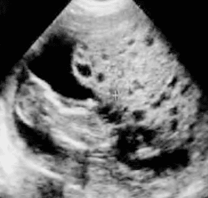

_Hình ảnh đại thể của thai trứng.  Đại thể của thai trứng là mô nhau bị thoái hóa thành các túi nước nhỏ hình chùm nho._

_Hình ảnh vi thể của thai trứng.  Về mặt vi thể, các túi nước này là những lông nhau thoái hóa nước, bên ngoài được bọc bởi các nguyên bào nuôi tăng sinh._

_Hình ảnh siêu âm của thai trứng toàn phần.  Hình ảnh điển hình của thai trứng trên siêu âm là hình ảnh tổ ong. Trong thai trứng toàn phần, hình ảnh này là điển hình._

_Hình ảnh siêu âm của thai trứng bán phần.  Chẩn đoán sẽ khó khăn hơn trong trường hợp thai trứng bán phần, do hình ảnh không còn điển hình lại kèm với hình ảnh của một thai, có thể là thai sống và tiến triển._

_Diễn biến hCG bình thường. Giá trị thật sự của định lượng hCG lại là trong theo dõi diễn biến sau hút nạo. Bình thường thì logarithm thập phân của nồng độ hCG giảm đi 1 bậc mỗi tuần._

_Diễn biến hCG bất thường. Sự chững lại, ở dạng bình nguyên, hay tăng lại của nồng độ hCG gợi ý 1 diễn biến bất lợi của GTD._

_Di căn phổi. Di căn phổi được phát hiện bằng X-quang với hình ảnh bóng bay._

_Di căn não. Bệnh phẩm tử thiết cho thấy nhân di căn gây xuất huyết ở bán cầu trái._

_Phân loại theo FIGO (2010) có kết hợp với bảng yếu tố nguy cơ của WHO._

## Nguồn tham khảo

- TEAM-BASED LEARNING - Trường Đại học Y Dược Thành phố Hồ Chí Minh 2020.
