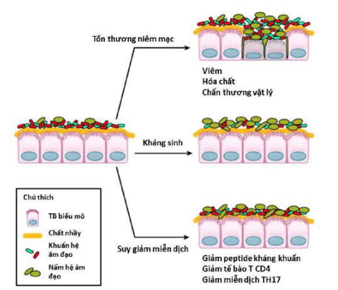
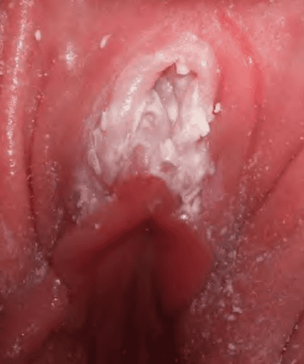
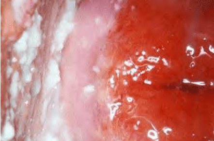
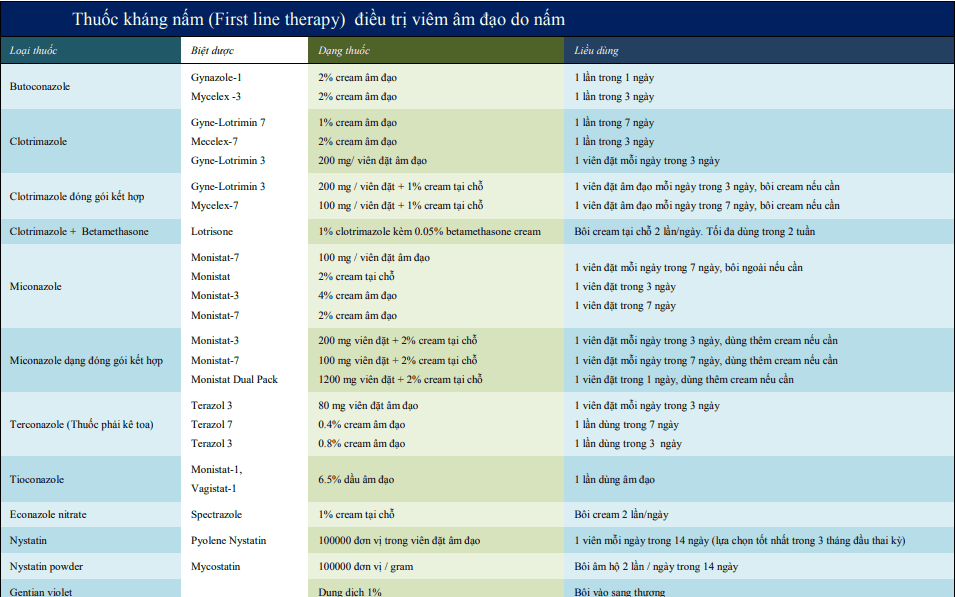

Khoảng 10% dân số phụ nữ trên 18 tuổi xác nhận rằng đã trải nghiệm ít nhất 2 đợt cấp viêm âm hộ-âm đạo do Candida sp (Vulvo-Vaginal Candidiasis - VVC) trong thời gian 1 năm gần nhất. 10% bạn tình nam có nhiễm nấm ở dương vật. VVC không được xem như bệnh lây truyền qua đường tình dục.

## Nguyên nhân

Candida sp là vi nấm hạt men, gồm có nhiều chủng khác nhau. Trong các chủng Candida sp, Candida albicans là chủng phổ biến nhất. Các chủng khác có thể thấy là Candida glabrata, Candida tropicalis, hoặc Torulopsis glabrata. Candida albicans có hiện diện trong khuẩn hệ, và được biết đến như là 1 thành phần của khuẩn hệ âm đạo bình thường.

Glucose và sucrose là điều kiện cần cho sự phát triển của
Candida albicans. Chỉ trong trường hợp mà Candida albicans phát triển quá mức thì người phụ nữ mới có các biểu hiện lâm sàng của nhiễm Candida. Cơ chế mà Candida albicans từ trong điều kiện cộng sinh bình thường trong âm đạo chuyển đổi thành tác nhân gây bệnh vẫn chưa được biết rõ.

## Yếu tố nguy cơ

3 tác nhân ảnh hưởng rõ nét nhất đến việc hình thành sự
sụp đổ của môi trường khuẩn hệ âm đạo lành mạnh là:

1. Tổn thương niêm mạc âm đạo.
2. Sử dụng kháng sinh.
3. Bất thường miễn dịch. Gia tăng glycogen âm đạo: thai kỳ, đái tháo đường, thuốc ngừa thai chứa estrogen liều cao, suy giảm miễn dịch, môi trường âm đạo ẩm ướt, dùng corticosteroids.

_3 yếu tố dẫn đến mất cân bằng giữa khuẩn hệ (microbiome) và nấm hệ (fungal microbiome) (mycobiome): tổn thương niêm mạc, kháng sinh và rối loạn miễn dịch._

## Đặc điểm lâm sàng và chẩn đoán

### Lâm sàng

_Âm hộ viêm đỏ rực, với các mảng trắng dầy, kèm theo là triệu chứng khô rát âm hộ, giao hợp đau và cảm giác rất khó chịu khi đi tiểu._

Khí hư của nhiễm C.albicans rất đặc trưng, có dạng "phô mai sữa" không mùi, đặc, dính với pH từ 4-5.

_Tiết dịch âm đạo đặc trưng. Các mảng trắng bám trên thành âm đạo. Âm đạo viêm đỏ, khô._

### Cận lâm sàng

Soi dịch âm đạo được thực hiện bằng cách hòa bệnh phẩm lấy trên thành bên âm đạo với NaCl 0.9% và nhuộm màu với xanh methylene, sau đó quan sát dưới kính hiển vi. Nhuộm Gram cũng thường được dùng.

Hiếm khi phải dùng đến cấy nấm trên môi trường chuyên dụng. Cấy trên môi trường chuyên dụng được chỉ định trong những trường hợp thất bại với điều trị kháng nấm, nhằm định danh các chủng không phải là Candida albicans hoặc trong trường hợp VVC được xếp vào loại VVC có biến chứng (theo CDC).

Các xét nghiệm kết tụ latex (latex agglutination tests) có thể được dùng cho các trường hợp nhiễm chủng không Candida albicans, vì chúng không biểu hiện sợi tơ nấm giả trên mẫu thử.

### Chẩn đoán

:::note[Tiêu chuẩn chẩn đoán]
Lâm sàng:

- Ngứa âm đạo, âm hộ.
- Đôi khi cảm giác nóng, tiểu rát, giao hợp đau.
- Âm hộ và niêm mạc âm đạo viêm đỏ và tróc ra.
- Huyết trắng đục, đặc, lợn cợn thành mảng giống như sữa đông, vôi vữa.

Cận lâm sàng nhuộm soi thấy sợi tơ nấm hoặc bào tử nấm.
:::

Theo CDC 2010, VVC được chia làm 2 dạng không biến chứng và có biến chứng:

- VVC được xếp vào nhóm không biến chứng khi nhiễm Candida thỏa các yếu tố:
  - Nhiễm đơn thuần hoặc thỉnh thoảng.
  - Triệu chứng từ nhẹ tới trung bình.
  - Nghi ngờ nhiễm Candida albicans.
  - Phụ nữ không suy giảm miễn dịch.
- VVC được xếp vào nhóm có biến chứng khi rơi vào 1 trong các tình huống sau:
  - Tái phát ≥ 4 lần/năm.
  - Triệu chứng mức độ nặng.
  - Nghi ngờ hoặc có bằng chứng nhiễm nấm không phải Candida albicans.
  - Phụ nữ bị đái tháo đường, bệnh lý nội khoa nặng hoặc suy giảm miễn dịch.

## Điều trị

### Nguyên tắc điều trị

Việc tự điều trị bằng thuốc không cần kê toa (tự điều trị) đối với phụ nữ có VVC có thể an toàn và hiệu quả. Tuy nhiên bất kỳ sự không đáp ứng với thuốc hoặc bị tái phát sớm sau điều trị cần phải được khám xét bởi bác sĩ lâm sàng để cho 1 chẩn đoán đáng tin cậy. Những bệnh nhân tự điều trị được khuyên ngưng thuốc 3 ngày trước khi khám lại.

Điều trị VVC tùy thuộc trước tiên vào nhóm nhiễm nào có hay không có biến chứng.

Các điều trị đa giá kết hợp nhiều tác nhân như kháng nấm và kháng sinh có thể có tác động tiêu cực trên mối quan hệ giữa khuẩn hệ và nấm hệ, làm cho vấn đề không những không cải thiện mà có thể còn phức tạp hơn. Kháng viêm có thể cải thiện triệu chứng của viêm, nhưng
lại ảnh hưởng tiêu cực đến cân bằng microbiome.

#### VVC không biến chứng

Điều trị khá đơn giản với VVC không biến chứng. Có 2 nhóm thuốc dùng là cho VVC không biến chứng là:

- Các -imidazole.
- Nystatin.

Điều trị chính đối với VVC là 1 trong các loại Imidazoles tổng hợp như miconazole, clotrimazole, butoconazole, tioconazole và terconazole dạng cream hoặc viên dùng qua đường đặt âm đạo. Cụ thể:

- Các nhóm thuốc azole đường uống có liên quan đến nguy cơ tăng men gan.
- Liệu pháp đơn liều với 150 mg fluconazole cũng được sử dụng rộng rãi.
- Liều thấp của fluconazole là an toàn trong thai kỳ. Ghi nhận liều cao hàng ngày của fluconazole (400-800 mg mỗi ngày) có liên quan đến khuyết tật lúc sinh.
- Nystatin cũng được sử dụng trong thai kỳ.

Mặc dù các loại kháng nấm thông dụng cho 1 tỷ lệ khỏi bệnh cao, khoảng 20-30% bệnh nhân sẽ bị tái phát sau 1 tháng điều trị. Lúc này, liệu pháp uống fluconazole mỗi tuần 1 lần trong 6 tháng có hiệu quả trong ngăn ngừa tái phát ở 50% phụ nữ. Liệu pháp thuốc đặt âm đạo mỗi tuần hoặc 2 lần 1 tuần cũng được sử dụng để phòng ngừa.

Nếu bạn tình không có triệu chứng lâm sàng thì không có chỉ định điều trị cho bạn tình. Ngoại trừ điều trị theo kinh nghiệm cho bạn tình của người bị VVC tái phát nhiều lần mà không có bất cứ yếu tố nào khác được nhận diện.

Candida glabrata đề kháng với tất cả các -imidazoles. Khi đó có thể dùng liệu pháp viên bao boric acid hoặc tím gentian (gentian violet).

#### VVC có biến chứng

VVC tái phát nhiều lần, cần tìm yếu tố nguy cơ. Trong trường hợp cần thiết, nên cấy định danh loại Candida và làm kháng sinh đồ nấm. Bệnh nhân bị tái phát thường xuyên nên cẩn thận đánh giá các yếu tố nguy cơ như đái tháo đường hoặc suy giảm
miễn dịch.

Liệu pháp dự phòng tại chỗ với 1 thuốc kháng nấm nên được xem xét khi bệnh nhân đang dùng kháng sinh toàn thân. Việc điều trị phòng ngừa với fluconazole 150 mg 1 viên mỗi tuần trong 6 tháng có thể giúp đỡ hạn chế tái phát.

#### Điều trị hệ vi khuẩn âm đạo

Tác dụng của điều trị Probiotics không được chứng minh. Các điều trị với probiotics chỉ được dùng theo kinh nghiệm cho những trường hợp VVC có biến chứng.

Tuy nhiên, 1 trong các nguyên nhân của VVC có biến chứng là suy yếu hệ thống miễn dịch, mà vấn đề này lại là 1 chống chỉ định của điều trị với probiotics.

### Phác đồ Bệnh viện Từ Dũ

Thuốc đặt âm đạo:

- Nystatin 100.000 đơn vị đặt âm đạo 1 viên/ngày x 14 ngày, hoặc
- Metronidazole hay Clotrimazole 100mg đặt âm đạo 1 viên/ngày x 7 ngày, hoặc
- Metronidazole hay Clotrimazole 200mg đặt âm đạo 1 viên/ngày x 3 ngày, hoặc
- Clotrimazole 500mg đặt âm đạo 1 viên duy nhất, hoặc
- Econazole 150mg đặt âm đạo 1 viên/ngày x 3 ngày, hoặc
- Econazole nitrate 150mg (vi hạt) đặt âm đạo 1 viên/12h x 1 ngày, hoặc
- Metronidazole 1200mg đặt âm đạo 1 viên duy nhất.

Thuốc uống:

- Fluconazole 150mg uống 1 viên duy nhất, hoặc
- Itraconazole 100mg uống 2 viên/ngày x 3 ngày.

Thuốc bôi:

Bôi thuốc kháng nấm ngoài da (vùng âm hộ) 7 ngày Clotrimazole.

Vệ sinh tại chỗ:

- Povidon iodin 10%.
- Natri hydrocarbonat 5g pha rửa âm hộ.

:::caution[Lưu ý]
Chỉ điều trị cho bạn tình khi có 1 trong các triệu chứng sau:

- Viêm ngứa quy đầu.
- Có nấm trong nước tiểu.
- Phụ nữ tái phát nhiều lần.

Metronidazole không dùng trong 3 tháng đầu thai kỳ.
:::

## Nguồn tham khảo

- TEAM-BASED LEARNING - Trường Đại học Y Dược Thành phố Hồ Chí Minh 2020.
- PHÁC ĐỒ ĐIỀU TRỊ SẢN PHỤ KHOA 2022 - Bệnh viện Từ Dũ.
