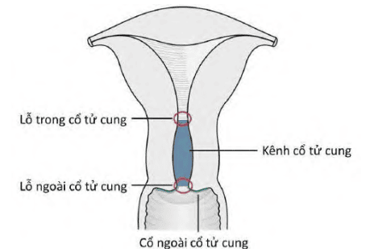

Lộ tuyến cổ tử cung (endocervical ectropion) là hiện tượng biểu mô trụ nằm ở trong kênh cổ tử cung bị lộn ra trên cổ ngoài cổ tử cung.

## Giải phẫu và mô học cổ tử cung

### Giải phẫu

Tử cung được chia ra 2 phần: phần trên là thân tử cung và phần dưới là cổ tử cung, nối với nhau bằng eo tử cung. Cổ tử cung lại được chia làm 2 phần, 1 ở phía trên âm đạo và 1 tiếp xúc với âm đạo. Nhìn từ phía âm đạo, cổ tử cung có đường kính khoảng 2.5-3 cm.

Từ ngoài vào trong, cổ tử cung lần lượt gồm:

- Cổ ngoài cổ tử cung (ectocervix hoặc exocervix) là phần thấp nhất của cổ tử cung tiếp xúc với âm đạo. Cổ ngoài được giới hạn bởi vòm âm đạo trước và sau. Cổ ngoài có hình dạng lồi hoặc dạng ellipse và được chia thành mép trước và mép sau cổ tử cung.
- Lỗ ngoài cổ tử cung (external os) là phần mở của cổ tử cung vào trong âm đạo. Lỗ ngoài này nằm ở trung tâm của cổ tử cung, có hình tròn (ở người chưa sanh con) và hình dẹt (ở phụ nữ đã sanh con).
- Kênh cổ tử cung (cervical canal) là 1 kênh nằm bên trong cổ tử cung, nối từ lỗ ngoài cổ tử cung đến lỗ trong cổ tử cung. Kênh cổ tử cung có những gờ và rãnh, các nếp này xếp giống dạng bật lửa nên có thể giữ cho kênh cổ tử cung đóng kín.
- Lỗ trong cổ tử cung (internal os) là phần mở của cổ tử cung vào khoang tử cung (buồng tử cung).

### Mô học

Cổ tử cung được tạo thành bởi biểu mô và mô đệm. Mô đệm cổ tử cung là 1 cấu trúc phức hợp của mô cơ trơn, mô sợi và mô đàn hồi.

#### Cổ ngoài

Cổ ngoài cổ tử cung được bao phủ bởi biểu mô lát tầng không sừng hóa, được chia thành từng lớp tế bào từ dưới (sâu) lên trên (bề mặt) gồm lớp tế bào đáy, lớp tế bào cận đáy, lớp tế bào trung gian và lớp tế bào bề mặt:

- Lớp tế bào đáy có 1 hàng tế bào và nằm ngay trên lớp màng đáy. Hoạt động phân bào của biểu mô cổ tử cung chủ yếu xảy ra tại lớp này.
- Lớp tế bào cận đáy và trung gian cùng nhau tạo thành lớp gai (prickle cell layer).
- Lớp tế bào bề mặt có chiều dầy thay đổi, tùy thuộc vào nồng độ estrogen.

_Biểu mô lát tầng không sừng hóa cổ tử cung._

#### Cổ trong

Cổ trong cổ tử cung được bao phủ bởi biểu mô trụ đơn tiết nhầy. Biểu mô tuyến cổ trong gồm những tế bào hình trụ đơn lót trong niêm mạc các ống tuyến. Tế bào này cũng được gọi là các tế bào tuyến nhưng không phải là các ống tuyến thật sự.

#### Ranh giới lát trụ

Vùng ranh giới nằm giữa biểu mô lát tầng của cổ ngoài và biểu mô trụ của cổ trong gọi là ranh giới lát trụ (squamocolumnar junction) (SCJ). Ranh giới lát trụ là 1 đường mảnh được cấu thành do sự khác nhau về độ cao của tế bào lát và tế bào trụ. Phần lớn các thay đổi sinh-bệnh lý cổ tử cung đều xuất phát từ vùng ranh giới này.

_Ranh giới lát trụ._

Vị trí của ranh giới lát trụ so với lỗ ngoài cổ tử cung thay đổi theo suốt cuộc sống người phụ nữ, phụ thuộc vào các yếu tố như tuổi, số lần sanh con, tình trạng hormone sinh lý liên quan đến hoạt động chu kỳ buồng trứng hay mang thai, hay ngoại lai (dùng thuốc ngừa thai uống),...

SCJ mà ta quan sát thấy ở các bé gái mới sinh, sau khi dậy thì, giai đoạn đầu tuổi hoạt động sinh sản, tuổi quanh mãn kinh, gọi là SCJ nguyên thủy (original SCJ). SCJ nguyên thủy là 1 đường nối giữa biểu mô trụ và biểu mô lát nguyên thủy xuất hiện từ giai đoạn phôi thai trong tử cung. SCJ nguyên thủy nằm sát lỗ ngoài cổ tử cung.

Sau khi dậy thì và vào tuổi hoạt động sinh sản, cơ quan sinh dục của người phụ nữ phát triển dưới ảnh hưởng của estrogen, làm cho cổ tử cung to lên và kênh cổ tử cung kéo dài ra. Quá trình này dẫn tới việc biểu mô trụ nằm ở phần dưới của kênh cổ tử cung bị kéo ngược ra về phía ngoài cổ tử cung và gọi là lộ tuyến cổ tử cung.

Với lộ tuyến cổ tử cung, SCJ nguyên thủy nằm ở cổ ngoài cổ tử cung và cách xa lỗ ngoài cổ tử cung. Hiện tượng lộ tuyến cổ tử cung thường gặp trong quá trình mang thai.

## Nguồn tham khảo

- TEAM-BASED LEARNING - Trường Đại học Y Dược Thành phố Hồ Chí Minh 2020.
- PHÁC ĐỒ ĐIỀU TRỊ SẢN PHỤ KHOA 2022 - Bệnh viện Từ Dũ.
