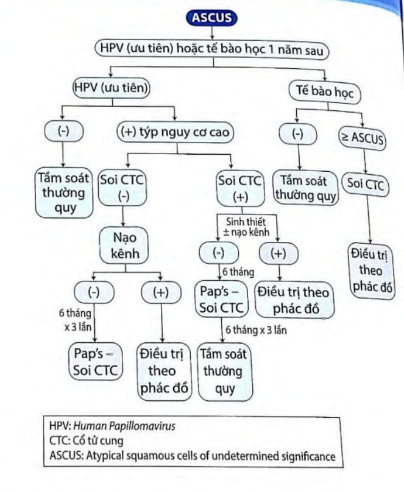
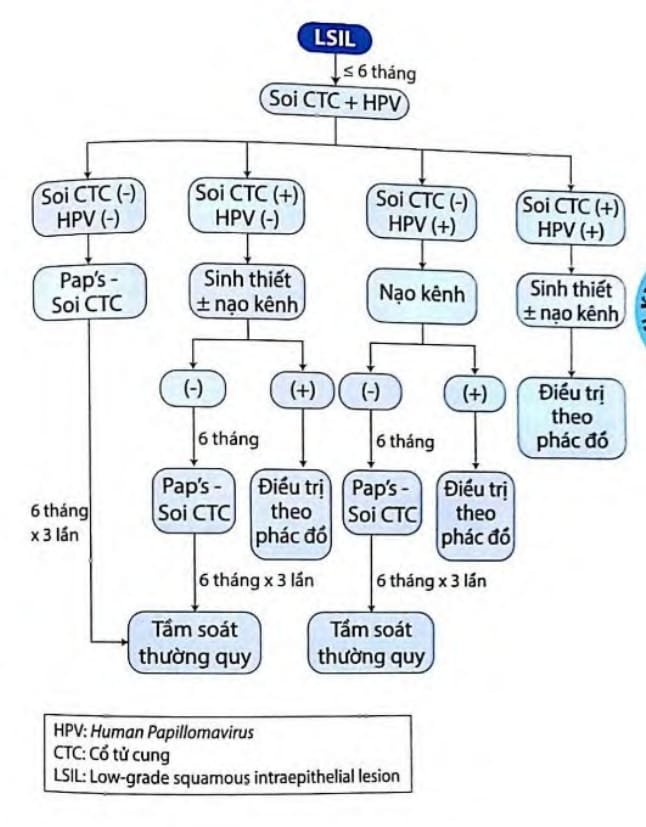
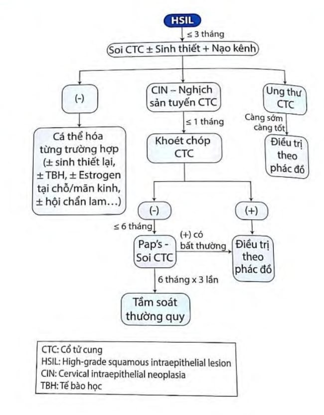
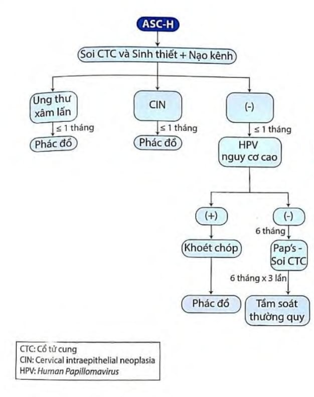
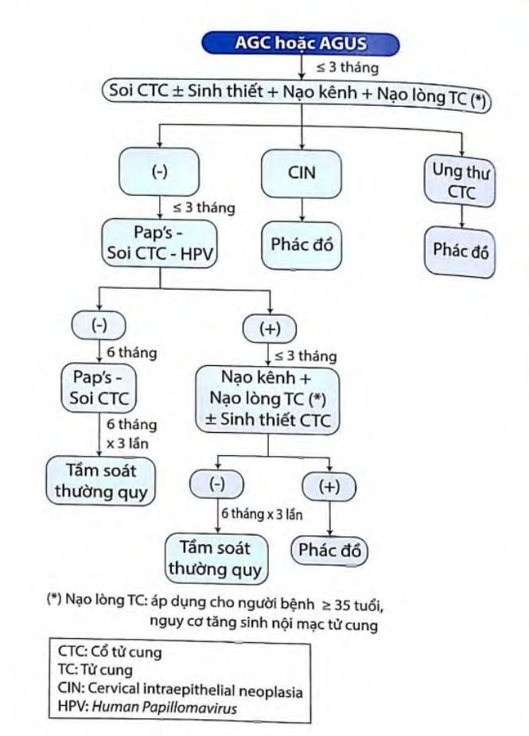
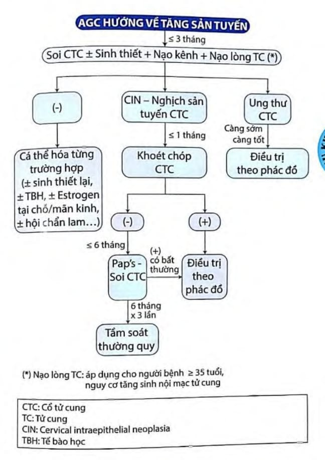
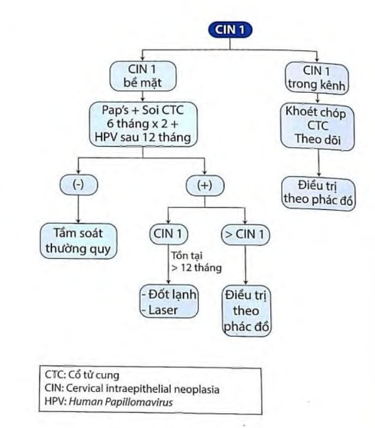
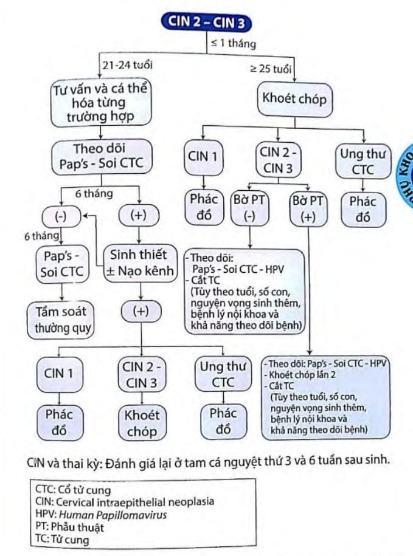
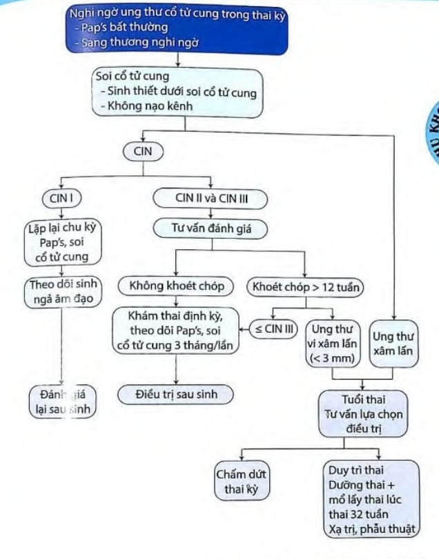

Ung thư cổ tử cung là ung thư phổ biến thứ 4 ở phụ nữ và phổ biến thứ 2 ở phụ nữ trong độ tuổi sinh sản, sau ung thư vú.

Nhiễm Human Papillomavirus (HPV) là nguyên nhân chính gây ưng thư cổ tử cung bởi các type nguy cơ cao bao gồm 16, 18, 31, 33, 35, 39, 45, 51, 52, 56, 58, 59, 66, 68. Trong đó type 16, 18 gây nên > 70% các trường hợp ung thư cổ tử cung.

## Đối tượng tầm soát

Phụ nữ &ge; 21 tuổi đã có quan hệ tình dục và mong muốn được tầm soát.

## Thời gian ngưng tầm soát

&ge; 65 tuổi nếu người phụ nữ có 3 lần Pap's hoặc 2 lần Co-testing âm tính.

## Phương pháp tầm soát

### Tế bào học

Xét nghiệm ung thư cổ tử cung cổ điển hoặc nhúng dịch.

### Xét nghiệm HPV

#### Quan sát cổ tử cung

VIA (Visual Inspection using Acetic acid): quan sát cổ tử cung với acid acetic.

VILI (Visual Inspection using Lugol's iodine): quan sát cổ tử cung với Lugol.

## Các phác đồ tầm soát

### Phác đồ với phụ nữ &ge; 21 tuổi

_Phác đồ 1 sàng lọc dựa vào xét nghiệm tế bào cổ tử cung._

### Phác đồ đối với phụ nữ &ge; 25 tuổi

_Phác đồ 2a sàng lọc dựa vào xét nghiệm HPV đơn thuần._

_Phác đồ 2b sàng lọc dựa vào xét nghiệm HPV đơn thuần (định tính)._

### Phác đồ đối với phụ nữ &ge; 30 tuổi (Co-testing)

_Phác đồ 3 sàng lọc dựa vào bộ đôi HPV và tế bào học (Co-testing)._

### Phác đồ dựa vào nghiệm pháp VIA

Có thể lấy mẫu bệnh phẩm tế bào học/HPV và gửi đến nơi có thể xét nghiệm, hoặc sàng lọc dựa vào quan sát cổ tử cung với Acid acetic (VIA)

_Phác đồ 4 sàng lọc dựa vào nghiệm pháp VIA._

### Sàng lọc ung thư cổ tử cung với đối tượng nhiễm HIV

Tương tự phụ nữ không nhiễm HIV nhưng lưu ý:

- Tuổi bắt đầu sàng lọc là 1 năm sau lần giao hợp đầu tiên và không trễ hơn 21 tuổi.
- Không xác định tuổi kết thúc sàng lọc.
- Sàng lọc bằng xét nghiệm tế bào học cho phụ nữ < 30 tuổi.
- Sàng lọc co-testing cho phụ nữ &ge; 30 tuổi.
- Xét nghiệm HPV đơn thuần không được khuyến cáo.
- Pap's ASCUS phụ nữ < 30 tuổi làm tiếp HPV, phụ nữ &ge; 30 tuổi soi cổ tử cung ngay.

## Xử trí Pap's bất thương và tân sinh trong biểu mô cổ tử cung

### ASCUS

### LSIL

### HSIL

### ASC-H

### AGC hoặc AGUS

### AGC hướng về tăng sản tuyến

### CIN 1

### CIN 2 và CIN 3

## Ung thư cổ tử cung và thai kỳ

## Nguồn tham khảo

- PHÁC ĐỒ ĐIỀU TRỊ SẢN PHỤ KHOA 2022 - Bệnh viện Từ Dũ.
