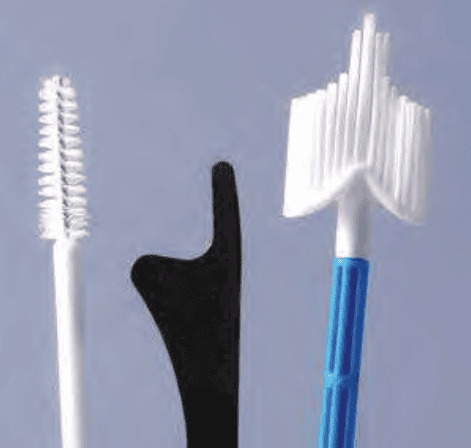

Pap's test và soi cổ tử cung là 2 phương pháp sàng lọc bất thường cổ tử cung.

## Pap's test

Pap's test hay phết mỏng tế bào cổ tử cung là công cụ tầm soát sơ cấp ung thư cổ tử cung.

### Các phương pháp lấy Pap's test

Việc lấy mẫu Pap’s test được chấp nhận trong tầm soát ung thư cổ tử cung gồm cả xét nghiệm tế bào học quy ước (conventional method) và xét nghiệm tế bào học nhúng dịch (liquid-based method).

Pap’s test quy ước rẻ hơn, nhưng cả Se và Sp đều thấp. Pap’s test nhúng dịch đắt tiền hơn, nhưng do không bị mất tế bào và chất lượng cũng phết tốt hơn nên cả Se và Sp đều cao hơn.

### Chiến lược tầm soát ung thư cổ tử cung

_\* Các khuyến cáo dựa theo: American Cancer Society (ACS), The American Society for Colposcopy and Cervical Pathology (ASCCP), và The American Society for Clinical Pathology (ASCP). A: khuyến cáo mạnh, chứng cứ rõ ràng, hằng định. B: khuyến cáo trung bình, chứng cứ không hằng định. C: theo kinh nghiệm. ** Ưu tiên. \*** Chấp nhận được nhưng không phải là lựa chọn tối ưu. \*\*\*\* Kết quả tầm soát âm tính đầy đủ được định nghĩa là có 3 kết quả tầm soát tế bào học âm tính chính thức hoặc có 2 kết quả co-testing chính thức âm tính trong vòng 10 năm trước, kết quả gần nhất phải được thực hiện trong 5 năm trước._

### Điều kiện thực hiện

Để đảm bảo test đủ tiêu chuẩn, Pap’s test phải được thực hiện khi đảm bảo những điều kiện cần thiết để lấy đủ và đúng tế bào:

1. Không đang ra huyết âm đạo.
2. Không có tình trạng viêm âm đạo-cổ tử cung cấp tính.
3. Không đặt thuốc ở âm đạo trong vòng 3 ngày gần đây.
4. Không giao hợp, không thụt rửa âm đạo trong vòng 48 giờ trước thực hiện phết tế bào.
5. Không khám âm đạo bằng tay trước đó, không dùng dầu bôi trơn trước đó.

Phụ nữ mãn kinh nên được dùng estrogen tại chỗ vài ngày trước khi lấy mẫu.

Các điều kiện này nhằm vào 2 mục đích:

1. Đảm bảo lấy được đúng các tế bào muốn quan sát với chất lượng tốt nhất.
2. Đảm bảo lấy đủ lượng tế bào muốn khảo sát.

### Quy trình thực hiện

Phải cung cấp đủ thông tin cần thiết cho người đọc tế bào cổ tử cung bằng cách điền vào phiếu:

1. Họ và tên, tuổi, PARA.
2. Ngày kinh chót / có thai / mãn kinh.
3. Lý do làm Pap’s test: tầm soát / theo dõi CIN.
4. Phương pháp ngừa thai: thuốc / vòng.
5. Kết quả tầm soát lần trước.

Pap’s test quy ước: thực hiện 2 lame phết tế bào cổ ngoài và cổ trong. Trên lame có ghi bằng bút chì đầy đủ tên, tuổi, và vị trí lấy bệnh phẩm là cổ tử cung ngoài hay cổ tử cung trong) bằng viết chì. Pap’s test Thin Prep, làm tương tự với lọ đựng mẫu tế bào thu thập được.

Tế bào lấy ra được cố định bằng dung dịch cồn $95^o$ hoặc keo phun (Pap’s test qui ước) hoặc bằng môi trường của Thin Prep (Pap’s test nhúng dịch).

_Dụng cụ để làm Pap’s test (từ trái sang): 1. Cytobrush dùng cho kênh cổ tử cung. 2. Que Ayre dùng cho Pap’s test quy ước. 3. Chổi lớn thường dùng cho Pap’s test Thin Prep._

_Cách lấy mẫu (từ trái sang) 1. Cytobrush: Lấy ở kênh tử cung, tại vùng SCJ bị rút vào trong kênh, không đưa chổi lên quá sâu trong kênh cổ tử cung. 2. Que Ayre: Lấy 2 lần, với đầu to và đầu nhọn. Cả 2 lần đều phải áp vào vùng chuyển sản, và lấy được SCJ. 3. Chổi lớn: Áp vào SCJ và vùng chuyển sản._

_Cách trải lame: 1. Chổi lớn: kéo để trải. 2. Cytobrush: lăn tròn để trải. 3. Que Ayre: kéo để trải._

### Phân loại tế bào học theo Bethesda 2014

Các phân nhóm chung có 2 phân nhóm lớn:

1. Âm tính với tổn thương trong biểu mô hay ác tính.
2. Khác: xem diễn giải / kết quả (tế bào nội mạc tử cung ở phụ nữ từ 45 tuổi trở lên).
3. Bất thường tế bào biểu mô: xem diễn giải / kết quả (phù hợp "tế bào vảy" hay phù hợp "tế bào tuyến").

## Soi cổ tử cung

## Nguồn tham khảo

- TEAM-BASED LEARNING - Trường Đại học Y Dược Thành phố Hồ Chí Minh 2020.
