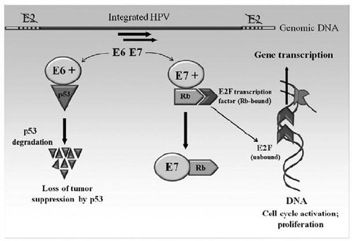

HPV là 1 trong những tác nhân phổ biến của bệnh lây truyền qua tình dục ở nam và nữ.

## Human Papilloma Virus (HPV)

### Cấu tạo

Các papillomavirus thuộc họ Papovaviridae. HPV có đường kính 55 nm và không có vỏ (màng bọc lipid). Capsid gồm 72 capsome hình sao 5 cánh, được tạo bởi protein L1. Protein L2 hiện diện trong virus với số lượng ít hơn và nâng đỡ cho bộ khung protein L1.

_Sơ đồ HPV._

_Mô hình 3D Human Papilloma Virus dưới kính hiển vi điện tử. Capsid được tạo bởi 72 capsome hình sao, bởi protein L1. Protein L2 tạo ra khung nâng đỡ. Bên trong là DNA của HPV._

Bên trong capsid là cấu trúc DNA của HPV, là 1 chuỗi DNA kép, 7904 bp, khép vòng, gồm:

- E1 và E2: phụ trách nhân bản.
- E4 và E5: tái tổ hợp.
- L1 và L2: phụ trách capsid protein.
- E6 và E7: mã hóa cho những protein đa chức năng. Các protein mã hóa bởi E6 và E7 là các protein sẽ gắn với các thành tố p53 và pRb, có vai trò quyết định trong khả năng sinh ung của HPV.

_Sơ đồ DNA 7904 bp của HPV type 16._

### Các type

Có hơn 200 type virus HPV được xác nhận dựa trên chuỗi DNA quy định hệ gene khác biệt, trong đó 85 cấu trúc gene đã được mô tả đặc tính đầy đủ và phân lập hơn 120 cấu trúc gene mới tiềm năng, được mô tả 1 phần các đặc tính. Có hơn 40 type HPV có thể lây truyền dễ dàng qua hoạt động tình dục trực tiếp, từ da và niêm mạc người bị nhiễm sang da và niêm mạc của bạn tình. Ngoài ra, do đặc điểm cấu trúc chỉ có capsid, nên HPV khá bền, do đó có thể có cơ chế lây truyền ngoài hoạt động tình dục như tiếp xúc với đồ vật có nhiễm HPV (quần áo chung), hay qua sex toys...

Tùy theo cơ quan đích, có 2 nhóm HPV:

1. Nhóm HPV trên da có cơ quan đích là da bàn tay và bàn chân
2. Nhóm HPV niêm mạc xâm nhiễm lớp tế bào trong cùng của niêm mạc môi, miệng, đường hô hấp và biểu mô sinh dục.

Nhóm nguy cơ thấp gồm các type 6,11, 42, 43 và 44.
Nhóm nguy cơ cao gồm các HPV type: 16, 18, 31, 33, 34, 35, 39, 45, 51, 52, 56, 58, 59, 66, 68 và 70.

### Yếu tố nguy cơ lây nhiễm

Gồm các yếu tố nguy cơ gây lấy nhiễm HPV như sau:

1. Có nhiều bạn tình, quan hệ tình dục sớm, tiền căn bệnh lý lây truyền qua tình dục làm tăng nguy cơ nhiễm HPV.
2. Lưu ý là bao cao su không đủ ngăn ngừa nhiễm HPV.
3. Nguy cơ nhiễm HPV thay đổi theo tuổi. Sự lây nhiễm HPV tường xảy ra ở tuổi hoạt động tình dục từ 18-30 tuổi, sau đó giảm nhanh. Điều này liên quan với cơ chế hình thành hiện tượng chuyển sản của cổ tử cung lộ tuyến, chỉ xảy ra mạnh nhất trong thời kỳ trước 30 tuổi, tức vào tuổi dậy thì và lần mang thai đầu tiên. HPV tấn công vào các tế bào chuyển sản non, từ đó gây nhiễm HPV trên các tế bào này.

### HPV và ung thư

Phần lớn nhiễm HPV là lành tính. Nhiễm HPV có thể tự khỏi nếu cơ thể có đáp ứng miễn dịch tốt.

Gọi là nhiễm HIV kéo dài (hay tồn tại) (persistent) khi HPV tồn tại trên 2 năm:

- HPV gây những vùng da phì đại chứa keratin gọi là mụn cóc ở bàn tay và bàn chân. Các mụn cóc có thể tự thoái triển sau từ 1 đến 5 năm.
- Bệnh Heck’s là các tăng sinh biểu mô cục bộ trong khoang miệng, phần lớn do HPV 13 có thể tự thoái triển.
- U nhú thanh quản có thể thấy ở trẻ khoảng 3 tuổi, nhưng cũng có thể xảy ra ở người lớn. Bệnh được xem là mắc phải khi sinh ngả âm đạo có nhiễm HPV do type HPV tương đồng giữa mụn cóc sinh dục và u nhú đường hô hấp.

HPV là nguyên nhân quan trọng gây ung thư cổ tử cung. Hiện đã xác định có khoảng 30 chủng virus HPV lây truyền qua tiếp xúc tình dục gây nhiễm HPV ở cổ tử cung, âm hộ, âm đạo, dương vật, hậu môn.

Tùy thuộc chủng HPV bị nhiễm qua đường sinh dục, có thể xảy ra 3 tình huống:

1. Condyloma accuminatum / condylomata accuminata.
2. Nhiễm HPV không hoạt động. Tế bào học cổ tử cung bình thường.
3. Nhiễm HPV dẫn đến thay đổi tế bào gây tân sinh.

Mụn cóc sinh dục (Condyloma accuminatum hay condylomata accuminata) do virus HPV-6 và HPV-11. Không triệu chứng, tự thoái triển sau 3-4 tháng, không hóa ác. Có thể điều trị bằng cắt bỏ hoặc thuốc tại chỗ như 0.5% podophyllin hay 5% imiquimod. Nếu mụn cóc âm hộ có sắc tố nâu đỏ, thì cần sinh thiết loại trừ sẩn dạng Bowenoid do HPV-16 và HPV-18.

_Condyloma accuminatum ở cổ tử cung. Là tổn thương do HPV type nguy cơ thấp. Ngay bên trên đó lại là 1 vùng có tân sinh. Bệnh nhân này nhiễm cùng lúc nhiều type HPV._

Bệnh nhân nhiễm HPV tiềm ẩn, không hoạt động với tế bào học biểu mô cổ tử cung bình thường, thường do HPV 6,11 và các nhóm khác.

Virus HPV type 16, 18, 31 và 45 thường gặp trong các tế bào ác tính của ung thư cổ tử cung 1. HPV cũng liên quan đến ung thư tế bào tuyến cổ tử cung nhưng mức độ liên quan phụ thuộc tuổi.

_Cơ chế hình thành tế bào bất tử khi nhiễm HPV.  p53 là 1 protein có tính năng ngăn chận ung thư của tế bào. p53 hoạt động bằng cơ chế ức chế hiện tượng kích hoạt DNA, giữ cho tế bào ở G1-G2, và đảm nhận nhiệm vụ điều hòa chết chương trình của tế bào (apoptosis). E6 của HPV sẽ kết hợp với p53 và gây ra thoái giáng của p53. Tế bào mất khả năng ức chế phát triển, không còn tuân theo cái chết chương trình và trở thành tế bào bất tử.  Protein Rb là 1 protein ức chế sinh ung. Ở tế bào lành mạnh, pRb gắn với yếu tố giải mã E2F1 và ngăn không cho yếu tố này tương tác với hệ thống sao mã tế bào. Khi vắng mặt pRb, E2F1 kích hoạt E2F1 gene và chuyển đổi tế bào từ G1 thành S. E77 của HPV sẽ gắn với pRb và làm bất hoạt pRb, giải phóng E2F1 và biến tế bào thành tế bào bị kích hoạt._

Các gene E6 và E7 trong các type HPV nguy cơ cao là điều kiện cần nhưng chưa phải là điều kiện đủ để phát triển ung thư cổ tử cung. Đáp ứng miễn dịch đầu tiên đối với nhiễm HPV là qua trung gian tế bào, vì thế những tình trạng suy giảm miễn dịch qua trung gian tế bào sẽ gia tăng sự tiến triển của virus HPV.

_Các thành phần của miễn dịch bẩm sinh và miễn dịch thích nghi qua trung gian tế bào (CMI) trong bảo vệ chống sự xâm nhập của HPV.  Sự tham gia của đại thực bào, bạch cầu đa nhân, DC, NKc của miễn dịch bẩm sinh. Sự tham gia của CD4+, CD8+ và các tế bào khác của miễn dịch thích nghi.  Vai trò của CMI là tăng cường TLR, TNF-α, tăng đáp ứng Th1, xâm nhập của cả CD4+ và CD8+._

## Vaccine HPV

### Cơ chế của vaccine

Vaccine ngừa HPV hoạt động trên cơ chế kích hoạt miễn dịch tế bào sản xuất kháng thể chuyên biệt type với protein capsid L1 của HPV (tổng hợp bằng công nghệ VLP).

Protein L1 là thành phần chính của capsid, có khả năng gây đáp ứng miễn dịch mạnh. Protein L2 là thành phần thứ yếu của capsid nên không được chọn để chế tạo vaccine.

Vaccine phòng HPV không dùng virus sống, mà chỉ dùng capsid. Hoàn toàn không sử dụng HPV trong quá trình sản xuất vaccine (noninfectious virus-like particles) (VLP).

_Qui trình tổng hợp noninfectious virus-like particles phòng HPV._

Sau khi được tiêm vaccine, VLP được nhận diện bởi các tế bào B, và với sự hỗ trợ của các tế bào T, sẽ kích hoạt các tương bào tạo IgG chuyên biệt cho VLP được đưa vào.

Ký ức miễn dịch tạo bởi con đường tế bào B-tế bào T tương bào là 1 ký ức miễn dịch bền vững, chuyên biệt. Ký ức miễn dịch này tạo ra cho các vaccine phòng HPV 2 đặc điểm:

1. Miễn dịch dài hạn.
2. Chuyên biệt cho type HPV. Tổng quát, vaccine HPV không tạo ra hiệu quả bảo vệ chéo giữa các type HPV khác nhau.

_Cơ chế sản xuất Immunoglobulin G chống lại protein capsid L1 VLP theo con đường "tế bào B-tế bào T-tương bào"._

### Các loại vaccine

Hiện nay lưu hành 3 nhóm vaccine thương mại là:

- Các vaccine nhị giá với các kháng nguyên L1 capsid của HPV type 16 và 18. Tìm thấy trong 66% các ung thư cổ tử cung.
- Các vaccine tứ giá với các kháng nguyên L1 capsid của HPV type 6, 11, 16 và 18.
- Các vaccine cửu giá với các kháng nguyên L1 capsid của HPV type 6, 11, 16, 18, 31, 33, 45, 52 và 58. Các genotypes mới thêm vào này chịu trách nhiệm trong khoảng 15% tổng số các ung thư cổ tử cung.

_Phổ bảo vệ của vaccine HPV nhị giá, tứ giá và 9 type HPV._

Vaccine HPV giúp ngăn ngừa nhiễm qua tiếp xúc đường sinh dục và ngoài sinh dục các type HPV chuyên biệt. Có khác biệt giữa các vaccine nhị giá và tứ giá.

_So sánh vaccine HPV nhị giá và tứ giá._

### Sử dụng vaccine theo ACIP

#### Khuyến cáo của ACIP

CDC's Advisory Committee on Immunization Practices (ACIP) đề nghị các đối tượng cần được tiêm phòng thường qui HPV vaccine như sau:

- Tiêm phòng thường qui (mức khuyến cáo: mạnh, mức chứng cứ: trung bình):
  - Trẻ gái 11-12 tuổi: có thể bắt đầu từ năm 9 tuổi. Có thể dùng 2vHPV, 4vHPV hoặc 9vHPV.
  - Trẻ trai 11-12 tuổi: có thể bắt đầu từ năm 9 tuổi. Vaccine chọn dùng là 4vHPV.
- Nếu chưa được tiêm phòng thường qui:
  - Phụ nữ được khuyến cáo tiêm phòng đến 26 tuổi.
  - Nam giới được khuyến cáo tiêm phòng đến 21 tuổi. Có thể đến 26 tuổi.
  - Nam giới có quan hệ tình dục đồng tính, người chuyển giới: nên tiêm đến 26 tuổi, nếu chưa được tiêm đầy đủ trước đó.
  - Trẻ em bị tấn công hay lạm dụng tình dục nên bắt đầu tiêm từ 9 tuổi.

Theo ACIP, không cần thiết phải thực hiện các tầm soát yếu tố nguy cơ như Pap’s test, HPV DNA hay kháng thể HPV trước khi tiêm.

Các đối tượng không thường qui là trên phụ nữ đã phơi nhiễm với HPV:

- Vaccine HPV có thể ít hiệu quả trên những phụ nữ đã phơi nhiễm với virus HPV.
- Những phụ nữ đã quan hệ tình dục, tiền căn tế bào học cổ tử cung bất thường hay mụn cóc vẫn có thể có lợi từ việc tiêm phòng HPV.
- Những phụ nữ đã nhiễm virus HPV trước đó nếu tiêm vaccine HPV có thể tạo kháng thể bảo vệ đối với những type HPV mà họ chưa nhiễm.

Các loại vaccine đều được tiêm bằng đường tiêm bắp, vào cơ delta.

#### Lịch tiêm HPV

Lịch tiêm HPV phụ thuộc vào độ tuổi bắt đầu, không thay đổi theo loại vaccine dùng.

Nếu vaccine được tiêm trước 15 tuổi thì lịch tiêm theo phác đồ 2 mũi. Liều 1 là ngày bắt đầu, liều 2 là 6-12 tháng sau liều đầu.

Nếu vaccine được tiêm sau 15 tuổi thì lịch tiêm theo phác đồ 3 mũi. Liều 1 là ngày bắt đầu, liều 2 là 1-2 tháng sau liều đầu và liều 3 là 6 tháng sau liều đầu. Nếu liều thứ 3rd đến vào tuổi 26 thì người dùng vẫn nên hoàn tất liệu trình 3 mũi, dù đang ở tuổi 27.

Phải tuân thủ lịch tiêm. Không được tiêm sớm hơn khoảng cách tối thiểu giữa 2 mũi tiêm:

- Khoảng cách tối thiểu phải tuân thủ giữa liều 1st và liều 2nd là 4 tuần (1 tháng).
- Khoảng cách tối thiểu phải tuân thủ giữa liều 2nd và liều 3rd là 12 tuần (3 tháng).
- Khoảng cách tối thiểu phải tuân thủ giữa liều 1st và liều 3rd là 40 tuần (6 tháng).

Xử lý tiêm vaccine trễ hạn:

- Nếu tiêm thuốc bị gián đoạn (tiêm trễ hạn), bất chấp loại vaccine dùng là 2vHPV, 4vHPV hay 9vHPV.
- Không phải lặp lại từ đầu, mà chỉ tiếp tục liệu trình.
- Nếu mũi 2nd bị tiêm trễ thì phải tiêm mũi 2nd, và lưu ý rằng mũi 3rd phải cách mũi 2nd ít nhất là 12 tuần (3 tháng).
- Số mũi tiếp tục phụ thuộc vào tuổi lúc bắt đầu tiêm chủng.

#### Lưu ý khác

- Chỉ có 4vHPV và 9vHPV được FDA dán nhãn sử dụng (labelled) cho bé trai. 2vHPV không được FDA dán nhãn điều trị (labelled) cho bé trai.
- Nên tiêm với cùng 1 loại vaccine. Trong trường hợp bất khả kháng, vẫn phải tiếp tục tiêm vaccine thay cho loại đã dùng trước đó.
- Có thể tiêm vaccine cùng lúc với các vaccine khác như: uốn ván, bạch hầu, ho gà, vaccine màng não tứ giá. Chỉ cần tuân thủ rằng không được hòa chung vào 1 ống tiêm.
- Lưu ý tình trạng ngất (do phản ứng dây X) có thể xảy ra sau tiêm. Cần theo dõi sau tiêm 15 phút.
- Chống chỉ định của tiêm phòng HPV là dị ứng với thuốc. 4vHPV và 9vHPV được sản xuất từ nấm Saccharomyces cerevisiae (men bột nổi làm bánh). Dị ứng với nấm men là chống chỉ định của 4vHPV và 9vHPV.
- Vaccine HPV không được khuyến cáo cho phụ nữ có thai. Nếu có thai xảy ra sau khi tiêm, lịch tiêm sẽ được hoãn lại và hoàn thành sau khi sanh. Nếu vaccine được tiêm trong thai kì, không có can thiệp nào được khuyến cáo.
- Không nên tiêm HPV khi đang có 1 tình trạng không khỏe. Nếu đến lúc phải tiêm lặp lại, thì nên tiêm trễ hơn. Tuy nhiên, các tình trạng bệnh nhẹ như viêm hô hấp trên không phải là lý do để trì hoãn tiêm.
- ACIP khuyến cáo rằng liệu trình 3 liều vaccine HPV (0, 1-2, 6 tháng) cho nam và nữ từ 9 đến 26 tuổi với tình trạng suy giảm miễn dịch nguyên phát hay thứ phát có thể làm giảm đáp ứng miễn dịch qua tế bào trung gian hay miễn dịch thể dịch như: giảm kháng thể lympho B, giảm 1 phần hay toàn phần lympho T, nhiễm HIV, tân sinh ác tính, chuyển sản, bệnh tự miễn, liệu pháp ức chế miễn dịch, bởi vì đáp ứng miễn dịch với vaccine sẽ giảm.
- Hiện tại FDA chỉ dán nhãn cho vaccine 9vHPV vì hiệu quả và chi phí quản lý ít hơn 2 loại trước đó.
- Vaccine 9vHPV có thể được dùng tiếp tục hay kết thúc liệu trình của bất kì loại vaccine nào. Có nghĩa là dù đã tiêm khởi đầu với 2vHPV vaccine hoặc 4vHPV vaccine, lịch trình vẫn có thể tiếp tục hoặc kết thúc bằng 9vHPV. Lịch trình này vẫn đảm bảo kháng thể chống lại 9 type HPV đã đề cập và không làm tăng chi phí.
- Những trường hợp đã hoàn thành lịch tiêm của 2vHPV hay 4vHPV không có khuyến cáo sử dụng thêm 9vHPV.
- Theo khuyến cáo của ACOG và ASCCP, chương trình tầm soát ung thư cổ tử cung không thay đổi trên những phụ nữ đã chích ngừa vaccine HPV.

## HPV testing

HPV testing thường được thực hiện cùng lúc với phết tế bào học cổ tử cung, gọi là co-testing.

Ưu điểm của HPV testing là: nếu so với sử dụng xét nghiệm tế bào học đơn thuần để tầm soát với cùng khoảng cách giữa 2 lần tầm soát, thì 1 kết quả HPV test cho kết quả âm tính sẽ cho phép đảm bảo rằng nguy cơ có CIN 3+ sẽ thấp hơn.

Chỉ định HPV testing gồm:

1. Xác định sự cần thiết phải soi cổ tử cung ở phụ nữ có kết quả tế bào học là ASC-US (reflex testing).
2. Sử dụng như xét nghiệm thêm vào cùng với xét nghiệm tế bào học trong tầm soát ung thư cổ tử cung cho phụ nữ từ 30-65 tuổi hoặc lớn hơn (co-testing).
3. Sau khi có kết quả kết quả tế bào học là ASCUS, LSIL và sau điều trị HSIL.
4. Gần đây, xuất hiện khuynh hướng tầm soát dùng HPV testing như test đầu tay (tiếp cận sơ cấp) cho phụ nữ từ 25 tuổi trở lên.

Chiến lược tầm soát sơ cấp bằng HPV test hiệu quả hơn chiến lược tầm soát bằng tế bào học, và có hiệu quả tương đương như chiến lược tầm soát bằng co-testing:

- Các phụ nữ có HPV test âm tính không nên thực hiện lại test tầm soát trong vòng 3 năm.
- Nếu HPV (+) với type 16, 18 nên được soi cổ tử cung.
- HPV (+) với type nguy cơ cao khác với type 16, 18 nên làm tế bào học. Tế bào học bình thường, sẽ làm lại test tầm soát 1 năm sau. Nếu kết quả tế bào học bất thường với tổn thương cao hơn là ASC-US bệnh nhân nên được soi cổ tử cung.

_Quản lý HPV testing theo ACOG. Lưu đồ tầm soát HPV đầu tay cho phụ nữ từ trên 25 tuổi mỗi 3 năm._

_Lựa chọn 1. Quản lý phụ nữ 30 tuổi với kết quả tế bào học âm tính và HPV dương tính theo (ASCCP 2014)._

Lựa chọn 2.

_Lựa chọn 2. Quản lý phụ nữ 30 tuổi với kết quả tế bào học âm tính và HPV dương tính theo (ASCCP 2014)._

## Nguồn tham khảo

- TEAM-BASED LEARNING - Trường Đại học Y Dược Thành phố Hồ Chí Minh 2020.
