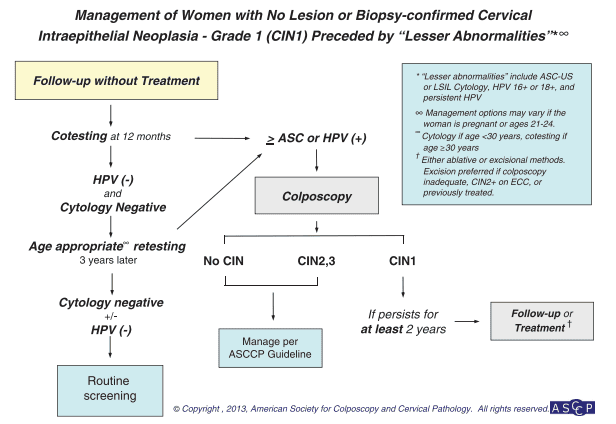
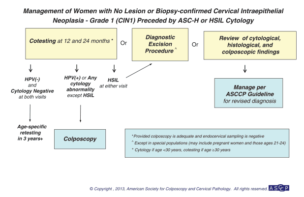
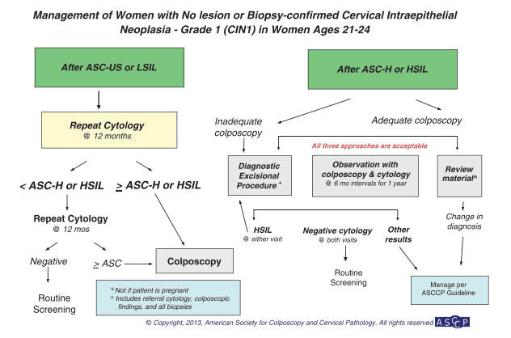
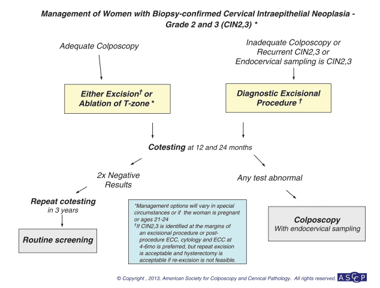
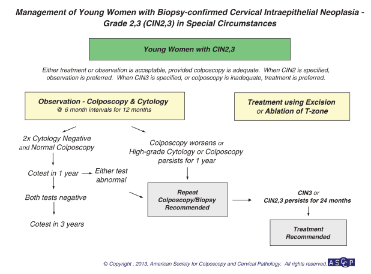

Ung thư cổ tử cung là ung thư phổ biến thứ 4 ở phụ nữ và phổ biến thứ 2 ở phụ nữ trong độ tuổi sinh sản, sau ung thư vú.

Nhiễm Human Papillomavirus (HPV) là nguyên nhân chính gây ưng thư cổ tử cung bởi các type nguy cơ cao bao gồm 16, 18, 31, 33, 35, 39, 45, 51, 52, 56, 58, 59, 66, 68. Trong đó type 16, 18 gây nên > 70% các trường hợp ung thư cổ tử cung.

## Chiến lược tầm soát ung thư cổ tử cung

_\* Các khuyến cáo dựa theo: American Cancer Society (ACS), The American Society for Colposcopy and Cervical Pathology (ASCCP), và The American Society for Clinical Pathology (ASCP). A: khuyến cáo mạnh, chứng cứ rõ ràng, hằng định. B: khuyến cáo trung bình, chứng cứ không hằng định. C: theo kinh nghiệm. ** Ưu tiên. \*** Chấp nhận được nhưng không phải là lựa chọn tối ưu. \*\*\*\* Kết quả tầm soát âm tính đầy đủ được định nghĩa là có 3 kết quả tầm soát tế bào học âm tính chính thức hoặc có 2 kết quả co-testing chính thức âm tính trong vòng 10 năm trước, kết quả gần nhất phải được thực hiện trong 5 năm trước._

## Chiến lược quản lý tân sinh trong biểu mô cổ tử cung

### CIN 1

Đa số các trường hợp CIN 1 hầu hết sẽ thoái triển tự nhiên sau đó. Tỉ lệ CIN 1 không điều trị tiến triển thành CIN 2 hoặc CIN 3 sau 2 năm là 13%. Do đó, quyết định điều trị hay theo dõi là tuỳ thuộc vào thảo luận với bệnh nhân. Theo dõi là biện pháp tốt nhất giúp cân bằng giữa lợi ích và nguy cơ.

_Lưu đồ CIN 1a: Trích lưu đồ của ASCCP 2013, quản lý CIN 1, trước đó có các kết quả "bất thường nhẹ". Quan trọng nhất là theo dõi, không điều trị. Các phương tiện theo dõi là co-testing và soi cổ tử cung._

_Lưu đồ CIN 1b: Trích lưu đồ của ASCCP 2013, quản lý CIN 1, trước đó từng có kết quả ASC-H hay HSIL. Theo dõi với co-testing, đánh giá lại, và can thiệp lấy bỏ-chẩn đoán là các lựa chọn tương đồng._

_Lưu đồ CIN 1c: Trích lưu đồ của ASCCP 2013, quản lý CIN 1 ở phụ nữ trẻ Theo dõi là động thái chủ yếu, do khả năng thanh thải HPV cao._

### CIN 2, 3

CIN 2, CIN 3 được xem là các tổn thương tiền ung thư. Phương pháp cắt mô hoặc hủy mô được khuyến nghị ở phụ nữ không đang mang thai, trừ 1 số trường hợp đặc biệt.

Có gần 40% các CIN 2 thoái triển tự nhiên về bình thường sau 2 năm. Ngược lại, rất hiếm khi CIN 3 tự thoái triển.

_Lưu đồ CIN 1c: Trích lưu đồ của ASCCP 2013, quản lý quản lý CIN 2 và CIN 3 Quản lý chủ yếu dựa trên các phương pháp cắt mô hoặc huỷ mô._

_Lưu đồ CIN 1c: Trích lưu đồ của ASCCP 2013, quản lý CIN 2, 3 ở tình huống đặc biệt._

## Phác đồ tầm soát ung thư cổ tử cung của Bệnh viện Từ Dũ

### Phác đồ với phụ nữ &ge; 21 tuổi

_Phác đồ 1 sàng lọc dựa vào xét nghiệm tế bào cổ tử cung._

### Phác đồ đối với phụ nữ &ge; 25 tuổi

_Phác đồ 2a sàng lọc dựa vào xét nghiệm HPV đơn thuần._

_Phác đồ 2b sàng lọc dựa vào xét nghiệm HPV đơn thuần (định tính)._

### Phác đồ đối với phụ nữ &ge; 30 tuổi (Co-testing)

_Phác đồ 3 sàng lọc dựa vào bộ đôi HPV và tế bào học (Co-testing)._

### Phác đồ dựa vào nghiệm pháp VIA

Có thể lấy mẫu bệnh phẩm tế bào học/HPV và gửi đến nơi có thể xét nghiệm, hoặc sàng lọc dựa vào quan sát cổ tử cung với Acid acetic (VIA)

_Phác đồ 4 sàng lọc dựa vào nghiệm pháp VIA._

## Điều trị trong tân sinh biểu mô cổ tử cung

CIN 1 theo dõi là biện pháp tốt nhất giúp cân bằng giữa lợi ích và nguy cơ.

Nếu không có chỉ định khác thì cắt tử cung không phải là điều trị đầu tay được lựa chọn đối với CIN 2, CIN 3. Cắt tử cung có thể được xem xét đối với CIN 2 hay CIN 3 tồn tại hoặc tái phát, hoặc khi biện pháp cắt lặp lại không thực hiện được.

Nếu cắt tử cung, nên thực hiện kỹ thuật loại bỏ mô trước để loại trừ khả năng đã có ung thư xâm lấn. Các kỹ thuật loại bỏ mô thường dùng là hủy mô (áp lạnh, đốt laser) và cắt bỏ mô tổn thương (LEEP/LLETZ, khoét chóp bằng dao lạnh). Kỹ thuật cắt mô vừa là biện pháp điều trị vừa là phương tiện chẩn đoán.

Hủy mô chỉ thích hợp cho tổn thương thỏa các điều kiện:

1. Có giới hạn rõ.
2. Kết quả sinh thiết qua soi cổ tử cung là tiền xâm lấn, không có tổn thương nghi ngờ ung thư xâm lấn.

### Huỷ mô bằng áp lạnh (cryotherapy)

Áp lạnh là phương pháp sử dụng nhiệt độ cực thấp để phá huỷ biểu mô bất thường.

Có thể sử dụng nitrogen hoặc carbon dioxide để làm lạnh. Đầu áp lạnh có nhiều loại khác nhau để phù hợp với hình dạng và kích thước của tổn thương. Dù là phương pháp ra đời từ lâu, nhưng hiện nay vẫn còn phổ biến vì tính đơn giản, dễ thực hiện, ít gây khó chịu cho bệnh nhân, và có thể thực hiện đối với bệnh nhân ngoại trú hoặc ở phòng tiểu phẫu. Có thể dùng lidocaine tê tại chỗ để giảm đau cho bệnh nhân trong khi làm thủ thuật.

_Áp lạnh cổ tử cung với đầu áp lạnh được nối với nguồn nitrogen lỏng hay CO2 lỏng, áp vào cổ tử cung. Lựa chọn đầu áp tùy theo tổn thương (dưới, phải). Áp lạnh không cho phép điều chỉnh độ sâu của điều trị. Áp lạnh cũng không cho phép phá hủy chính xác tổn thương (dưới, trái)._

### Huỷ mô bằng đốt laser (laser vaporization)

Đốt laser (laser vaporization) là phương pháp dùng nhiệt năng của laser để phá hủy tế bào.

Đây cũng là một phương pháp dễ thực hiện, có thể thực hiện cho bệnh nhân ngoại trú. Mức độ mô bị phá huỷ phụ thuộc vào nhiều yếu tố: cách cài đặt các mức năng lượng, kích thước của chùm tia laser và thời gian tiếp xúc mô.

Ưu điểm của đốt laser là phá huỷ mô rất chính xác. Có thể lấy hết toàn bộ tổn thương với độ sâu phù hợp. Có thể điều trị các tổn thương tiền xâm lấn ở âm hộ-âm đạo hiện diện đồng thời. Bất lợi của phương pháp laser là chi phí cao, gây nhiều
khó chịu cho bệnh nhân và nguy cơ chảy máu.

### Khoét chóp bằng dao lạnh

Khoét chóp bằng dao lạnh (cold knife conization) là kỹ thuật kinh điển, cho phép đánh giá đầy đủ tổn thương.

Khoét chóp cổ tử cung bằng dao lạnh là lấy đi toàn bộ phần hình nón chứa vùng bị bệnh của cổ tử cung, với một phần mô lành. Bệnh phẩm có hình nón này sẽ được đánh dấu vị trí. Khảo sát mô học chi tiết sau đó sẽ được thực hiện nhằm đánh giá tổn thương, sự xâm nhập của tổn thương và dương tính bờ phẫu thuật. Khó khăn của khoét chóp là cầm máu đúng kỹ thuật mà không gây hẹp kênh cổ tử cung về sau.

Khoét chóp bằng dao điện có ưu điểm là nhanh, kiểm soát chảy máu dễ dàng, kỹ thuật cầm máu cổ tử cung đơn giản. Nhược điểm lớn nhất của khoét chóp bằng dao điện là rất khó đánh giá dương tính tế bào ở bờ phẫu thuật, do mô bị cháy bởi dòng điện cao tần. Ưu điểm của khoét chóp là có thể chủ động cắt mô với nhiều hình dạng và kích thước khác nhau. Ưu điểm quan trọng nhất của khoét chóp bằng dao lạnh là khả năng khảo sát tình trạng dương tính hay âm tính ở bờ phẫu thuật, do phương pháp này không làm cháy mô ở bờ phẫu thuật.

_Khoét chóp bằng dao lạnh._

### Cắt bỏ mô tổn thương với vòng điện LEEP và LLETZ

Cắt bằng vòng điện (loop electrosurgical excision procedure) (LEEP) hay vòng cắt rộng (large loop excision of the transformation zone) (LLETZ) là các kỹ thuật cắt vùng chuyển tiếp bằng vòng điện. Kĩ thuật này đã trở thành sự lựa chọn của nhiều nhà lâm sàng do đơn giản. Nhược điểm lớn nhất của phương pháp này là không được các nhà khảo sát mô học ưa chuộng, vì rất khó đánh giá dương tính bờ phẫu thuật. Cắt bằng dao laser (laser conization) đang dần bị thay thế vì chi phí cao và vì tính ứng dụng ngày càng rộng của LEEP.

_LEEP và các vòng cắt khác nhau._

## Nguồn tham khảo

- TEAM-BASED LEARNING - Trường Đại học Y Dược Thành phố Hồ Chí Minh 2020.
- PHÁC ĐỒ ĐIỀU TRỊ SẢN PHỤ KHOA 2022 - Bệnh viện Từ Dũ.
