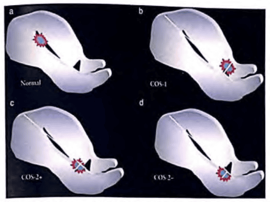
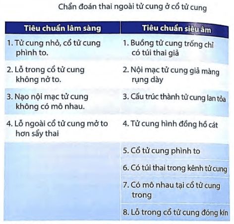
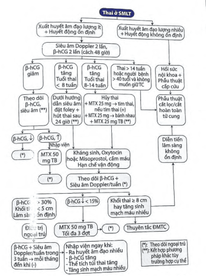

Chửa ở vết mổ lấy thai (Thai ở sẹo mổ lấy thai) là 1 dạng thai ngoài tử cung do thai làm tổ trên sẹo cơ tử cung.

Chiếm 1/1800-1/2500 tổng số sinh. Chiếm < 1% các trường hợp thai ngoài tử cung.

## Yếu tố nguy cơ

Tiền căn mổ lấy thai.

Tiền căn rau bám chặt.

Tiền căn phẫu thuật cơ tử cung như bóc u xơ, may tái tạo cơ tử cung, rau cài răng lược.

Thai ngoài tử cung.

Thụ tinh trong ống nghiệm.

Tiền sử nạo phá thai nhiều lần.

## Chẩn đoán xác định

### Lâm sàng

Tam chứng kinh điển:

- Trễ kinh.
- Ra máu âm đạo bất thường (33-44%).
- Đau bụng (25%).

Khoảng 50% không có triệu chứng, chỉ phát hiện qua siêu âm.

### Cận lâm sàng

#### Siêu âm ngả âm đạo kết hợp với Doppler

Túi thai nằm giữa bàng quang và phần trước đoạn eo tử cung, lớp cơ tử cung giữa bàng quang và túi thai có hay rất mỏng (1-3mm).

Siêu âm 3D Doppler có phình mạch máu quanh túi thai, có hình ảnh mất liên tục của vách trước cơ tử cung trên mặt cắt ngang qua túi ối.

Buồng tử cung không có hình ảnh túi thai.

Kênh cổ tử cung không có hình ảnh túi thai.

Phân nhóm thai ở sẹo mổ cũ trong hình ảnh siêu âm 3 tháng đầu là Crossover sign (COS). Trong mặt cắt dọc giữa của siêu âm, so sánh đường thẳng nối từ lỗ trong cổ tử cung đến đáy tử cung chứa nội mạc tử cung và đường kính trước sau túi thai:

- COS-1: túi thai xâm lấn vào sẹo mổ cũ và mặt trước cơ tử cung, lớn hơn 2/3 đường kính trước sau túi thai nằm trên đường nối nội mạc tử cung.

- COS-2: túi thai xâm lấn vào sẹo mổ và mặt trước cơ tử cung, nhỏ hơn 2/3 đường kính trước sau túi thai nằm trên đường nối nội mạc tử cung. Trong đó lại chia ra:
  - COS-2- có sự giao nhau của đường kính trước sau túi thai và đường nối nội mạc tử cung.
  - COS-2+ không có sự giao nhau của đường kính trước sau túi thai và đường nối nội mạc tử cung.

#### Xét nghiệm khác

beta hCG dương tính.

Siêu âm 3D và MRI trong trường hợp khó phân biệt.

## Chẩn đoán phân biệt

Thai trong buồng tử cung.

Sẩy thai và khối thai tụt ngang vết mổ (trên siêu âm màu không thấy mạch máu quanh thai).

Thai ở cổ tử cung.

U nguyên bào nuôi.

## Diễn biến

COS-2 túi thai phát triển hướng vào trong eo tử cung hay buồng, có thể tiến triển đến sinh sống nhưng có nguy cơ xuất huyết ồ ạt nơi rau bám.

COS-1 túi thai cắm sâu trong khe hở sẹo và tiến triển gây vỡ tử cung trong 3 tháng đầu và xuất huyết ồ ạt nguy hiểm đến tính mạng.

## Điều trị

Xu hướng điều trị nội khoa và can thiệp ngoại khoa tối thiểu để kết thúc thai kỳ sớm, tránh phẫu thuật lớn và bảo tồn khả năng sinh sản.

### Nguyên tắc

Ngưng hoạt động của tim thai và loại bỏ túi thai.

Bảo tồn khả năng sinh sản nếu đủ điều kiện.

Tùy theo mức độ khẩn cấp và có biện pháp điều trị phù hợp:

- Xuất huyết ồ ạt cần can thiệt cấp cứu, cắt tử cung để cầm máu nếu cần.
- Huyết động ổn định, không xuất huyết hay lượng ít có thể có nhiều phương pháp điều trị.

Không can thiệt ban đầu bằng nong và nạo vì nguy cơ xuất huyết ồ ạt.

Điều trị MTX tại chỗ kết hợp với toàn thân cho kết quả tốt.

### Điều trị nội khoa

#### Điều trị MTX

Chỉ định

- Các trường hợp thai < 14 tuần, huyết động ổn định và không chống chỉ định MTX.

- Thai lưu &le; 8 tuần, beta hCG tăng: MTX 50mg, tiêm bắp.

- Thai chưa có tim thai: dưới hướng dẫn siêu âm ngả âm đạo hút trọn phôi thai, hút hết nước ối và tiêm MTX 25mg quanh túi thai và 25mg tiêm bắp (tổng 50mg/$m^2$ diện tích da).

- Thai có hoạt động tim thai: hủy thai bằng hút trọn phôi thai (thai < 9 tuần) hoặc hút mô buồng tim thai (thai > 9 tuần) hoặc tiêm bắp MTX 25mg (hoặc KCl) và tim thai, phối hợp MTX 25mg tiêm vị trí bánh rau. Sau 60-90 phút siêu âm lại kiểm tra đã mất hay chưa và xem có xuất huyết tại chỗ không, tiêm bắp 25mg MTX (tổng liều 75mg MTX).

Chống chỉ định và xét nghiệm theo dõi như thai ngoài tử cung.

#### Sau thủ thuật cần chú ý kháng sinh, thuốc tăng co và cầm máu

Ceftriaxone 1g/lọ x 2 lần tiêm tĩnh mạch 2 ngày, sau đó chuyển sang Cephalosporin thế hệ 3 phối hợp Metronidazole 250mg x 2 viên (uống) x 2 lần/ngày x 7 ngày.

Thuốc bổ trợ:

- Oxytocin 5 IU x tiêm bắp 02 lần/ngày.
- Tranexamic 500mg uống 1 viên/lần x 2 lần/ngày x 5 ngày.

Hạn chế vận động và nên nằm nghỉ ngơi.

#### Theo dõi ngoại trú

Theo dõi beta hCG và siêu âm Doppler

- beta hCG giảm > 15% theo dõi mỗi tuần trong 3 tuần liên tiếp, sau đó mỗi tháng đến khi beta hCG âm tính. Nếu giảm < 15% cần nhập viện tiêm MTX liều 2.
- Siêu âm khối thai và tăng sinh mạch mỗi tuần trong 3 tuần, sau đó siêu âm mỗi tháng đến khi kích thước túi thai không quan sát được và chỉ số tưới máu giảm:
  - Đường kính khối thai < 5-7cm đến khi không còn.
  - Đường kính khối thai >7cm hoặc tăng cần nhập viện phối hợp thuyên tắc chọn lọc động mạch tử cung nuôi khối thai hay phẫu thuật.
  - Nếu tăng sinh mạch nhiều cần nhập viện phối hợp thuyên tắc động mạch tử cung chọn lọc.

#### Tư vấn

Không được vận động mạnh, không quan hệ tình dục, hạn chế đi lại cho đến khi khối chửa tiêu hoàn toàn.

Nhập viện ngay khi chảy máu trung bình/nhiều, beta hCG tăng, thể tích khối thai tăng hay có gia tăng tưới máu.

Thăm khám nhẹ nhàng tránh làm khối thai vỡ và gây xuất huyết ồ ạt cần phẫu thuật.

#### Điều trị bằng siêu âm độ tập trung cường độ cao (HIFU - high-intensity focused ultrasound)

### Điều trị ngoại khoa

#### Nong nạo

Chỉ định:

- 1 số ít trường hợp beta hCG < 2000 mIU/mL sau điều trị MTX, chảy máu khối thai sảy hoặc khối thai không giảm kích thước.
- Phân độ trên siêu âm là COS-2-

Nong nạo không nên là điều trị đầu tiên vì nguy cơ thủng tử cung và xuất huyết ồ ạt cần phẫu thuật.

Cần tư vấn nguy cơ thủng tử cung, tổn thương bàng quang, niệu quản phải chuyển phẫu thuật nếu cần thiết, chuẩn bị máu, dịch truyền.

Kỹ thuật: Dùng Karman 1 van, đặt ống số 6 hay số 8 tại phía trên vết mổ cũ, hút nhẹ nhàng (tránh hút ngay vết mổ vì nguy cơ tổn thương vết mổ cũ vốn mỏng và nhau xâm lấn nhiều), hút vừa đủ mô (mục tiêu giảm thể tích khối thai không cố gắng lấy hết toàn bộ).

Khi có chảy máu trung bình/nhiều đặt bóng chèn bơm 20-30mL nước muối sinh lý có hiệu quả cầm máu. Rút bóng chèn sau 12-24h.

#### Đặt foley kết hợp hút thai

Chỉ định thai &le; 8 tuần.

Đặt foley để đẩy khối thai tách khỏi vết mổ:

- Thực hiện dưới hướng dẫn của siêu âm.
- Ống foley 14 hoặc 16.
- Bơm 20-25mL nước cất để đẩy khối thai lên và foley ép vào vết mổ.
- Nếu foley rơi trước 6h và chưa có dấu hiệu sẩy: đặt lại foley lần 2 và chèn 1 tampon. Nếu foley rơi sau 6h kèm dấu hiệu sảy: tiến hành hút thai.
- Lưu foley 24h.
- Sử dụng kháng sinh ngay sau đặt foley.
- Sau 24h rút foley và hút thai dưới siêu âm:
  - Sử dụng Karman 1 van và ống hút số 6.
  - Chừa 1 ít mô rau ở vị trí vết mổ cũ, không cố gắng hút hết hay hút sạch vì nguy cơ tổn thương tử cung gây chảy máu.
  - Thuốc co tử cung oxytocin 5 đơn vị, 2 ống tiêm bắp và Misoprostol 200mcg x 3 viên đặt trực tràng.
  - Nếu tình trạng ổn sau 48h được xuất viện điều trị ngoại trú.
- Theo dõi ngoại trú:
  - Tái khám mỗi 3 tuần đầu, sau đó 1 tháng cho đến khi mất khối thai, beta hCG âm tính, không có tăng sinh mạch máu.
  - Dặn dò người bệnh không làm việc nặng, không đi lại nhiều, không giao hợp.
  - Tái khám theo hẹn hoặc khi đau bụng nhiều hoặc ra huyết âm đạo nhiều (2 băng vệ sinh mỗi giờ trong 2h).
- Dấu hiệu người bệnh phải nhập viện:
  - beta hCG tăng.
  - Kích thước khối echo hỗn âm ở sẹo mổ tăng.
  - Tăng sinh mạch máu nhiều.

#### Phẫu thuật

Chỉ định khi có 1 trong 3 yếu tố:

- Tuổi thai &ge; 14 tuần.
- Người bệnh > 40 tuổi và không có nguyện vọng sinh sản.
- Huyết động không ổn định, xuất huyết nhiều, có thể có choáng hay không.

Phẫu thuật thường khó khăn vì khối rau có thể xâm lấn bàng quang. Cần tư vấn nguy cơ tổn thường bàng quang, niệu quản. Chuẩn bị máu, dịch truyền.

Phẫu thuật mở bụng cắt bỏ khối thai và bảo tồn nếu được hoặc cắt tử cung hoàn toàn. Cần thực hiện bởi phẫu thuật viên nhiều kinh nghiệm.

### Phối hợp nhiều kỹ thuật

#### MTX tại chỗ, toàn thân và nong nạo

Nong nạo chỉ áp dụng cho các trường hợp ổn định, beta hCG 2000mIU/mL có chảy máu và khối thai sảy.

#### MTX tại chỗ/toàn thân và thuyên tắc động mạch tử cung

Có hiệu quả trong các trường hợp khối thai to nhiều mạch máu. Đặc biệt trường hợp rong huyết kéo dài sau điều trị MTX, khối thai giảm kích thước và beta hCG giảm về mức bình thường nhưng không hết triệu chứng, có thể tồn tại thông nối động tĩnh mạch vùng sẹo.

#### MTX trong lúc thuyên tắc động mạch tử cung

#### Thuyên tắc động mạch tử cung và phẫu thuật

#### Chờ đợi không can thiệp và theo dõi

Thai lưu < 8 tuần, toàn trạng ổn, beta hCG < 1000mIU/mL giảm đều, chỉ cần theo dõi, không can thiệp, khối thai sẽ tự hủy theo thời gian vài tuần hoặc vài tháng.

Nếu beta hCG tăng lại hay không giảm cần can thiệp nội khoa hoặc ngoại khoa.

### Ngừa thai và khuyến cáo thai kỳ sau

Ngừa thai ít nhất 12-24 tháng, không sử dụng dụng cụ tử cung.

Thai kỳ sau chủ động mổ lấy thai khi thai đủ tháng.

### Tai biến theo phương pháp điều trị

MTX tiêm bắp (62.1%)

Nong và nạo (61.9%)

Thuyên tắc động mạch tử cung (46.9%)

Soi buồng tử cung (18.4%)

MTX tại chỗ/vào thai và toàn thân (9.7%)

## Phác đồ điều trị thai ở sẹo mổ cũ

## Nguồn tham khảo

- PHÁC ĐỒ ĐIỀU TRỊ SẢN PHỤ KHOA 2022 - Bệnh viện Từ Dũ.
