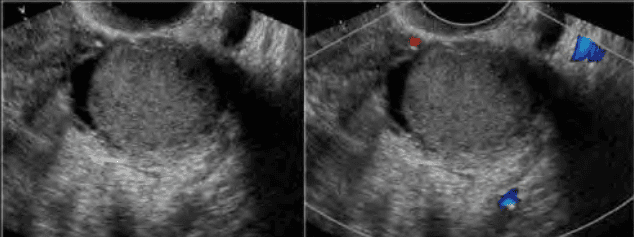
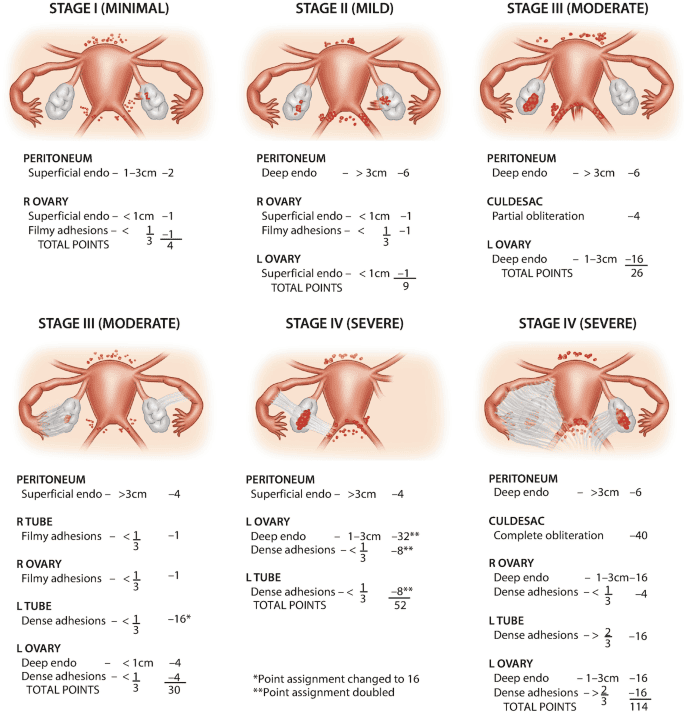

Các khối thực thể không tân lập tại phần phụ là thuật ngữ tổng quát dùng để chỉ mọi cấu trúc dạng khối bất thường ở phần phụ, với cấu trúc mô học không mang các đặc điểm của tân sinh.

Các khối thực thể không tân lập của phần phụ thường thấy nhất là nang lạc tuyến nội mạc tử cung ở buồng trứng (endometrioma), ứ dịch vòi Fallope do di chứng nhiễm Chlamydia trachomatis hay do các yếu tố gây viêm dính vùng chậu khác, các khối dính ở phần phụ do lao, các giả nang phúc mạc di chứng của nhiễm trùng kinh niên vùng chậu hay sau phẫu thuật...

Đặc trưng chung của các khối thực thể không tân lập tại phần phụ là thường rất "ồn ào" về mặt triệu chứng học. Các triệu chứng thay đổi tùy nguyên nhân, nhưng luôn luôn có 1 vấn đề chủ gợi ý định hướng chẩn đoán, và đó cũng thường là vấn đề khiến bệnh nhân đến khám. Điều này hoàn toàn trái ngược khi tiếp cận các khối thực thể tân lập. Các cấu trúc tân lập ở buồng trứng là rất im hơi lặng tiếng, diễn tiến âm thầm không triệu chứng, thỉnh thoảng lộ diện bằng các triệu chứng vay mượn.

Tiếp cận 1 khối thực thể không tân lập tại phần phụ có thể là nội khoa, nhưng cũng có thể là ngoại khoa. Quản lý 1 cấu trúc cơ năng tại buồng trứng chủ yếu là nội khoa. Quản lý 1 cấu trúc tân lập, bất kể lành hay ác đều là ngoại khoa.

## Nang lạc tuyến nội mạc tử cung ở buồng trứng

### Bệnh học và bệnh sinh

Nang lạc tuyến nội mạc tử cung tại buồng trứng là 1 giả nang, phát triển bề mặt của buồng trứng, được cấu tạo bởi biểu mô nội mạc tử cung và mô đệm tùy hành.

Nang lạc nội mạc tử cung tại buồng trứng là 1 giả nang, không có vỏ bao thật ngăn cách nang với mô buồng trứng. Cấu trúc của nang có liên hệ mật thiết với mô lành của buồng trứng. Thành của nang là 1 lớp biểu mô lót. Biểu mô này giống hệt biểu mô của 1 nội mạc tử cung chính vị về cấu tạo cũng như về chức năng. Cùng với biểu mô là mô đệm tùy hành, giống hệt như tại nội mạc tử cung.

Về bản chất, đây là 1 nội mạc tử cung chức năng lạc vị tại bề mặt buồng trứng. Trong chu kỳ kinh nguyệt, khi tại nội mạc tử cung chính vị xảy ra hành kinh, thì tại cấu trúc lạc vị cũng xảy ra hiện tượng sụp đổ nội mạc và xuất huyết. Tuy nhiên, máu chảy ra bị giam cầm trong nang, bị hấp thu 1 phần, với đậm độ hemosiderin đậm đặc dần theo sự cô đặc của dịch nang theo thời gian, hình thành 1 dịch nang đặc quánh, màu nâu chocolate, giàu hemosiderin.

Giả thuyết cấy ghép hiện đại, máu kinh trào ngược qua ngả vòi Fallope sẽ gieo rắc các mảnh vụn của nội mạc vào khoang phúc mạc, trong đó có bề mặt buồng trứng. Bề mặt buồng trứng sần sùi, nhiều khe rãnh là nơi bám rất tốt của các mảnh vụn nội mạc tử cung. Tế bào được cấy ghép là các tế bào có đặc tính nguyên thủy, tức là các progenitor chưa biệt hóa của nội mạc. Sau khi được gieo rắc trên bề mặt buồng trứng, các progenitor sẽ xâm nhập và phát triển khi và chỉ khi có các điều kiện đáp ứng miễn dịch thuận lợi. Đột biến tái cấu trúc các gene HMGA1 và HMGA2 được ghi nhận có liên quan mật thiết đến hình thành của các cấu trúc lạc tuyến nội mạc tử cung.

_Giả nang, không vỏ bọc thật, lòng chứa dịch nâu chocolate._

Đáp ứng miễn dịch bẩm sinh được kích hoạt dẫn đến tiến trình viêm. Acid arachidonic rồi COX-2 và cuối cùng là các prostaglandin gây ra biểu hiện viêm tại vị trí xâm nhập. Prostaglandin PGE2 của tiến trình viêm sẽ gián tiếp kích hoạt tổng hợp estrogen thông qua aromatase P450 và STAR (steroidogenic acute regulatory protein). Estrogen là điều kiện quan trọng cho duy trì và phát triển các tổ chức nội mạc lạc vị.

### Hình ảnh học và CA125

Trường hợp điển hình, nang lạc nội mạc tử cung ở buồng trứng thể hiện trên siêu âm thang xám là 1 hay nhiều cấu trúc nang, có phản âm kém đều. Nang có giới hạn rõ với cấu trúc buồng trứng chung quanh, thường không có chồi hay vách. Không có tăng dòng chảy quanh nang. Mô tả IOTA không hiện diện các M-rules.

Siêu âm là đủ để chẩn đoán lạc tuyến nội mạc tử cung ở buồng trứng. Các phương tiện hình ảnh khác thường không cần thiết cho việc xác lập chẩn đoán nang lạc tuyến nội mạc tử cung ở buồng trứng. MRI có thể có ích trong việc khảo sát và xác định thương tổn lạc tuyến nội mạc tử cung tùy hành như lạc tuyến nội mạc tử cung thâm nhiễm sâu vùng chậu khi có thống kinh hay giao hợp đau.

CA125 là 1 chỉ báo sinh học của biểu mô phúc mạc nguyên thủy. CA125 tăng cao, thậm chí rất cao, trong nang lạc tuyến nội mạc tử cung tại buồng trứng, nhưng là 1 triệu chứng không đặc hiệu. CA125 tăng cao trong cả nang lạc tuyến nội mạc tử cung tại buồng trứng lẫn trong trường hợp u tân lập biểu mô buồng trứng dạng nội mạc tử cung (và các u buồng trứng biểu mô khác).

### Vấn đề chính của lạc nội mạc

Vấn đề chính của lạc nội mạc tử cung gồm:

1. Nang lạc nội mạc tử cung không triệu chứng với tiềm năng ác tính thấp.
2. Đau, chủ yếu trong các trường hợp nang lạc tuyến nội mạc tử cung ở buồng trứng có kèm theo lạc tuyến nội mạc tử cung ở phúc mạc.
3. Hiếm muộn do hệ quả của tiến trình viêm trên phúc mạc và trên giải phẫu học của vòi Fallope và của vùng chậu.

#### Lạc tuyến nội mạc đơn thuần

Nang lạc tuyến nội mạc tử cung ở buồng trứng là 1 bệnh lý lành tính. Khả năng có ác tính trên 1 nang lạc tuyến nội mạc tử cung ở buồng trứng là rất thấp, nhưng không thể bỏ qua.

Trong trường hợp này, nang lạc tuyến nội mạc tử cung đơn thuần phát hiện tình cờ qua khám định kỳ, và không kèm theo bất cứ triệu chứng nào khác. Nếu bệnh nhân đến vì triệu chứng khối đơn thuần thì cần nhớ rằng:

- Phẫu thuật chỉ làm sạch các mảnh cấy ghép nội mạc trên buồng trứng mà không ngăn chặn các cấy ghép mới trong tương lai. Tái phát nang lạc tuyến nội mạc tử cung sau phẫu thuật gần như là chắc chắn. Vì thế, hiếm khi có chỉ định phẫu thuật vì lý do khối u đơn thuần.
- Phẫu thuật chỉ cần thiết khi cần thiết tìm bằng chứng của lành tính và để loại trừ khả năng ác tính khi có các dấu chỉ nghi ngờ.

Không có điều trị nội khoa nào làm thoái triển các nang lạc tuyến nội mạc tử cung ở buồng trứng. Nếu bệnh nhân hoàn toàn không đau, không có vấn đề về hiếm muộn, và nang lạc tuyến nội mạc tử cung được đánh giá là nguy cơ thấp có ác tính thì không có chỉ định điều trị nội khoa. Nếu bệnh nhân không có ý định có thai, có thể dùng COCs nhằm mục đích không làm cho nang lạc tuyến nội mạc tử cung lớn thêm, đồng thời tránh 1 thai kỳ ngoài ý muốn.

Chỉ chỉ định phẫu thuật vì lý do khối u đơn thuần khi không thể loại trừ được 1 khả năng ác tính, dù rất hiếm, như trên siêu âm có các nguyên tắc của ác tính (M-rules, IOTA), hay khi có diễn biến bất thường của CA125, hay khi nang to nhanh bất thường, hay khi nang có kích thước to, đường kính nang > 5-6 cm. Tuy nhiên, cần cân nhắc mọi yếu tố tùy hành như tình trạng hôn nhân, kế hoạch sanh con, triệu chứng đau...

#### Lạc tuyến nội mạc gây đau

Đau không phải là chỉ định phẫu thuật của nang lạc tuyến nội mạc tử cung. Đau là hậu quả của các lạc tuyến nội mạc tử cung khác là lạc tuyến nội mạc tử cung ở phúc mạc, lạc tuyến nội mạc tử cung thâm nhiễm sâu hay bệnh tuyến cơ tử cung.

Điều trị nội khoa hàng thứ nhất là NSAIDs nói chung, và các chất ức chế COX-2 nói riêng do cơ chế bệnh sinh chủ yếu của đau là tiến trình viêm thông qua COX-2 và prostaglandin PGE2 nên NSAIDs thông thường, ức chế COX-2 là các điều trị ưu tiên, được xem như lựa chọn đầu tay. Việc dùng NSAIDs không ảnh hưởng đến các điều trị hiếm muộn, nếu như đau có kèm theo vấn đề hiếm muộn.

Điều trị nội khoa hàng thứ hai là COCs và progestogen sau thất bại của NSAIDs trong giảm đau. Trong các progestogen, IUS-LNG có ưu thế giảm đau hơn các điều trị progestogen khác. Trái với NSAIDs, việc dùng COCs và progestogen đối lập hoàn
toàn với các điều trị hiếm muộn. Có nhiều phương thức dùng progestogen cho đau, nhưng IUS-LNG (Mirena®) là progestogen có hiệu quả cao trong giảm đau của nang lạc tuyến nội mạc tử cung. IUS-LNG cũng ít tác dụng phụ hơn so với các progestogen khác. COCs có thể được dùng theo cách dùng tiêu chuẩn. Việc dùng COCs liên tục không khoảng nghỉ trong thời gian dài liên tục (nhằm tránh có kinh, để tăng hiệu quả) không mang lại khác biệt trong hiệu quả điều trị. Danazol cũng có hiệu quả tương tự như các thuốc hàng thứ nhì, tuy nhiên, danazol gây nam hóa, và gây trầm giọng không hồi phục. Danazol không được khuyến cáo cho sử dụng thường quy để điều trị lạc tuyến nội mạc tử cung.

Thuốc hàng thứ ba là GnRH. Nhiều ảnh hưởng toàn thân, được chỉ định trong bối cảnh của 1 kế hoạch điều trị tổng thể. Ức chế men aromatase, GnRH đồng vận là các biện pháp điều trị nhắm vào mục đích triệt tiêu nguồn cung cấp estrogen. Tuy nhiên, GnRH đồng vận không thể dùng kéo dài, do nhiều tác dụng phụ liên quan đến thiếu hụt nghiêm trọng và dài hạn estrogen, nhất là nguy cơ gây loãng xương. GnRH đồng vận phải được đặt trong bối cảnh của 1 kế hoạch điều trị tổng thể.

Rất hiếm khi phải phẫu thuật do đau vì nang lạc tuyến nội mạc tử cung đơn thuần. Đau là do các tổn thương đi kèm. Vì thế, bóc nang lạc tuyến nội mạc tử cung đơn thuần không có hiệu quả giảm đau. Trong phẫu thuật, cần tìm hiểu các nguyên nhân khả dĩ có thể giải thích được đau như các tổn thương lạc tuyến nội mạc tử cung thâm nhiễm sâu, hay các tổn thương viêm dính của phúc mạc gây bởi lạc tuyến nội mạc tử cung phúc mạc.

#### Lạc tuyến nội mạc tử cung kèm hiếm muộn

Nếu bệnh nhân với nang lạc tuyến nội mạc tử cung đến vì hiếm muộn, thì việc quyết định phẫu thuật hay không lệ thuộc vào rất nhiều yếu tố tùy hành, gồm tuổi, yếu tố chồng, dự trữ buồng trứng, đã từng phẫu thuật trước đó hay chưa...

Nang lạc tuyến nội mạc tử cung không có ảnh hưởng trực tiếp trên chất lượng và khả năng thụ tinh của noãn bào. Dù sự hiện diện của nồng độ cao hemosiderin có làm tăng nồng độ hemosiderin trong nang noãn, nhưng điều này không ảnh hưởng đến kết quả của thụ tinh trong ống nghiệm. Như vậy, điều trị nang lạc tuyến nội mạc tử cung có hiếm muộn không đồng nghĩa với phẫu thuật.

_Nang lạc tuyến nội mạc tử cung ở buồng trứng trái. Vùng chậu viêm dính toàn bộ, với các tổn thương lạc tuyến nội mạc tử cung ở phúc mạc. Cùng đồ Douglas bị xóa. Giải phẫu học của 2 vòi Fallope bị thay đổi._

Vai trò của phẫu thuật chủ yếu nhằm để đánh giá giai đoạn của lạc tuyến nội mạc tử cung vùng chậu. Đây là mục đích quan trọng nhất, giúp đánh giá và lên kế hoạch tổng thể cho điều trị hiếm muộn, gồm sinh sản hỗ trợ hay ngoài sinh sản hỗ trợ.

_Phân giai đoạn lạc tuyến nội mạc tử cung vùng chậu (AFS-ASRM). Hệ thống này được chấp nhận rộng rãi. Dù còn hạn chế, nhưng hệ thống phân loại này là 1 mẫu tiêu chuẩn để ghi nhận các bằng chứng lâm sàng và so sánh hiệu quả của các phương pháp điều trị khác nhau._

Phẫu thuật không nhằm mục tiêu duy nhất là lấy bỏ nang lạc tuyến nội mạc tử cung. Lấy bỏ nang lạc tuyến có thể làm cho tiến trình điều trị thuận lợi hơn về mặt kỹ thuật, nhưng làm cho dự trữ buồng trứng có thể bị suy giảm. Vì thế, nếu buộc phải phẫu thuật để cải thiện kết cục của điều trị hiếm muộn thì phải cân nhắc tính toán đến 3 "tiền đề":

1. Tái phát sau phẫu thuật là chắc chắn.
2. Suy giảm dự trữ buồng trứng là chắc chắn.
3. Hiệu quả của phẫu thuật trên kết cục điều trị hiếm muộn là không chắc chắn.

## Ứ dịch vòi Fallope do di chứng của nhiễm Chlamydia trachomatis

Ứ dịch ống dẫn trứng di chứng của nhiễm Chlamydia trachomatis, áp-xe tai vòi buồng trứng không đáp ứng với kháng sinh, lao vòi trứng là các cấu trúc thực thể không tân lập có chỉ định ngoại khoa ưu tiên.

_Hình ảnh 1 khối ở phần phụ luôn đặt ra câu hỏi về nguồn gốc của khối này. Khi có hình ảnh tương tự, buộc phải tìm thấy cấu trúc buồng trứng với noãn nang, biệt lập với cấu trúc phản âm trống, dạng dài, có vách của ứ dịch vòi Fallope. Trên hình này, ta vẫn chưa nhìn thấy buồng trứng._

### Bệnh học

Do các phản ứng viêm, vòi Fallope bị tổn hại, xơ hóa và bít tắc. Thay đổi môi trường tại vòi Fallope là điều kiện thuận lợi phát sinh các nhiễm khuẩn thứ cấp đa vi khuẩn, kể cả với vi khuẩn yếm khí. Nhiễm khuẩn thứ phát tạo ra nội độc tố (endotoxins), cytokines, gốc tự do (oxidative stress), và rò rỉ chúng vào buồng tử cung. Nhiễm khuẩn thứ phát còn tạo nên 1 môi trường dịch vòi Fallope nghèo dinh dưỡng, chủ yếu là nghèo glucose do cạnh tranh.

_Vòi Fallope ứ dịch, hoàn toàn mất chức năng, và là nguồn độc chất._

Ứ dịch vòi Fallope sau nhiễm Chlamydia trachomatis gây kết cục xấu cho thụ tinh trong ống nghiệm vẫn chưa được rõ. Nếu phẫu thuật lấy bỏ vòi Fallope ứ dịch trước khi thực hiện thụ tinh trong ống nghiệm, thì kết quả sẽ được cải thiện đáng kể khi so với không được cắt bỏ vòi Fallope ứ dịch trước thụ tinh trong ống nghiệm. Xu hướng hiện nay có vẻ thiên về các ảnh hưởng của các độc tố từ vòi Fallope trên khả năng làm tổ của phôi (tức ảnh hưởng gây hỗn loạn dòng thác đối thoại miễn nhiễm trước chấp nhận mảnh bán dị ghép) mà rối loạn vi sinh,sinh hóa-miễn nhiễm tại vòi Fallope sau nhiễm Chlamydia trachomatis gây ra. đối thoại miễn nhiễm thể hiện bằng việc chế tiết 1 số cytokines quanh cửa sổ làm tổ gồm cytokines like IL-1, LIF, colony stimulating factor-1 (CSF-1) và integrin αvβ3. Dịch từ vòi Fallope tổn thương có thể ảnh hưởng đến sản xuất các thành tố này từ phôi hay nội mạc tử cung và ảnh hưởng đến làm tổ.

Trong các tình huống khó khăn, quá dính, không thể thực hiện cắt vòi Fallope, như "đông đặc vùng chậu", việc chọn giải pháp thay thế là làm gián đoạn thông thương vòi Fallope tại đoạn gần cũng mang lại hiệu quả tương đồng với cắt vòi. Vấn đề duy nhất của giải pháp này là vấn đề để lại 1 ổ có tiềm năng đe dọa lâu dài về mặt vi sinh học.

## Nguồn tham khảo

- TEAM-BASED LEARNING - Trường Đại học Y Dược Thành phố Hồ Chí Minh 2020.
