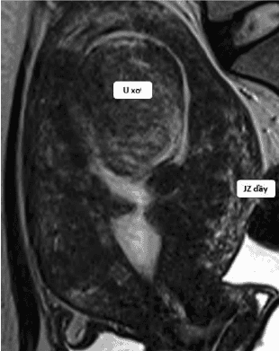
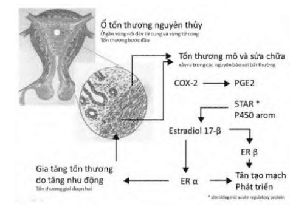

Lạc nội mạc tử cung là bệnh phụ khoa mãn tính, dễ tái phát, trong đó có sự hiện diện của mô giống mô tuyến ở nội mạc tử cung và mô đệm tùy hành nằm ngoài buồng tử cung. Lạc nội mạc tử cung có thể ở phúc mạc, buồng trứng, lạc nội mạc sâu, bệnh tuyến cơ-tử cung (adenomyosis). Đây là chẩn đoán phân biệt quan trọng nhất của u xơ-cơ tử cung trong thực hành hàng ngày.

## Bệnh học

Tên gọi "lạc nội mạc tử cung trong cơ" quá đơn giản, gây nhiều nhầm lẫn, cũng như không phản ánh được các đặc điểm sinh bệnh học phức tạp của adenomyosis.

2 đặc trưng mô bệnh học của adenomyosis là:

1. Hiện diện của mô tuyến nội mạc tử cung cùng mô đệm tùy hành của nó tại lớp cơ của tử cung.
2. Tăng sản và tăng dưỡng của lớp cơ tử cung lân cận.

_Adenomyosis là cấu trúc tuyến nội mạc tử cung hiện diện tại lớp cơ của tử cung. Ranh giới với cơ tử cung không được phân định rõ ràng, không có vỏ bao. Biểu hiện viêm rất rõ ràng quanh tổ chức tuyến nội mạc lạc vị._

Mô tuyến nội mạc tử cung trong lớp cơ tử cung có đặc điểm hình thái giống với tuyến nội mạc tử cung chính vị.

Khi khảo sát về biểu hiện gene, nội mạc tử cung lạc vị có biểu hiện gene khác với nội mạc tử cung chính vị. Đây là hệ quả của tình trạng lệch lạc trong điều hòa gene, gây bởi các bất thường trong tiến trình kiểm soát chuyển mã và sau chuyển mã.

Tăng sản về số lượng sợi cơ và tăng dưỡng về kích thước tế bào cơ tử cung làm thay đổi kích thước và hình dạng của tử cung. Tổn thương tăng dưỡng và tăng sản cơ của adenomyosis có thể là lan tỏa khắp cơ tử cung, làm cho tử cung có dạng hình cầu, với bề dầy của các thành trước và sau không cân đối, thường là thành sau dầy hơn thành trước. Mật độ của tử cung rất cứng. Có thể nói tử cung như "1 quả cầu bằng gỗ".

_Trên đại thể, mặt cắt của adenomyosis không đều, do có các cấu trúc tuyến, mô đệm và các sợi cơ xen lẫn vào nhau, và không có ranh giới với mô cơ tử cung lân cận._

_Adenomyosis được biểu hiện bằng các cấu trúc tuyến cho tín hiệu mạnh trên T2W (mũi tên đỏ), mô đệm cho tín hiệu yếu hơn. Các sợi cơ tăng dưỡng và tăng sản làm cho tử cung to không đều ở các mặt (mũi tên xanh lá). Có thể thấy hình ảnh các u xơ-cơ tử cung kèm theo (mũi tên xanh). Không có ranh giới với mô cơ tử cung lân cận._

Tổn thương tăng dưỡng và tăng sản cơ của adenomyosis có thể là khu trú tại 1 vùng trên tử cung và tạo cho mình 1 hình ảnh tương tự 1 nhân xơ tử cung. Trong nhiều trường hợp, adenomyosis có thể kèm theo u xơ-cơ tử cung làm chẩn đoán khó khăn.

Tùy theo thành phần cấu tạo chủ yếu là tuyến hay là cơ, adenomyosis sẽ có đặc tính hình ảnh học khác biệt.

_Ghi nhận JZ dầy, không đều. Kèm theo là hình ảnh của các u xơ-cơ tử cung to làm biến dạng lòng tử cung._

## Bệnh sinh

Adenomyosis liên quan đến sự xâm nhập của mô tuyến vào cấu trúc bên dưới. Cho đến ngày nay, người ta vẫn chưa đồng thuận khi được yêu cầu phải giải thích về nguồn gốc của mô tuyến nội mạc lạc vị. Có 2 nguồn gốc chính:

1. Thuyết vi sang chấn và tái tạo (TIAR).
2. Thuyết tử cung nguyên thủy.

### Thuyết vi sang chấn và tái tạo (TIAR)

Mô hình bệnh học vi sang chấn và tái tạo (TIAR) là thuyết được chấp nhận nhiều nhất hiện nay để giải thích bệnh sinh của adenomyosis:

Vi sang chấn → xâm nhập → viêm → cường estrogen → đề kháng progesterone → co thắt nghịch thường→ tăng nặng vi sang chấn.

Adenomyosis được hình thành do các chấn thương vi thể tại màng đáy của nội mạc tử cung. Các chấn thương vi thể này có thể có nguồn gốc đa dạng, tự nhiên (các hoạt động co thắt nghịch thường của tử cung) hay thụ đắc (tổn thương màng đáy của nội mạc do sinh đẻ hay thủ thuật).

Tổn thương màng đáy của nội mạc nội mạc tạo điều kiện cho sự xâm nhập vào mô đệm bên dưới của các tế bào gốc. Tế bào xâm nhập lạc vị là các tế bào gốc trung mô. Tùy theo đáp ứng miễn nhiễm của cơ thể, sự xâm nhập này có thể bị loại trừ, những cá thể không mắc adenomyosis, cơ chế miễn nhiễm đóng vai trò quan trọng trong việc "dọn sạch" các tế bào xâm nhập. Ở những cá thể mắc adenomyosis, cơ chế miễn nhiễm đã thất bại trong việc loại trừ các tế bào xâm nhập. Giả thuyết về bất thường trong kiểm soát chu trình tế bào, viêm... thông qua các micro-RNA là giả thuyết được chấp nhận nhiều nhất hiện nay. Các bất thường của mi-RNA profiling liên quan chủ yếu đến các mi-RNA kiểm soát chu trình chết tế bào, tạo mạch và viêm. Dưới bất thường của kiểm soát mi-RNA. Tế bào trở thành tế bào "bất tử". Vì lý do này mà mi-RNA profiling được xem như 1 khảo sát hứa hẹn cho tầm soát và nhận diện các endometriosis dưới lâm sàng.

Cơ thể sẽ phản ứng lại sự xâm nhập này của tế bào gốc bằng 1 tiến trình viêm. Trong trường hợp sự xâm nhập không bị loại trừ, tiến trình viêm sẽ tiếp diễn. Viêm tại mô bị xâm nhập bởi các cấu trúc tuyến nội mạc lạc vị khởi động 1 vòng xoắn bệnh lý trong đó mối liên quan giữa viêm và tình trạng cường estrogen đóng vai trò quan trọng. COX-2 dường như đóng vai trò chủ lực trong tiến trình này. Thông qua PGE2 và được tiếp theo bằng STAR (steroidogenic acute regulatory protein) và enzyme P450 aromatase, tiến trình sản xuất estrogen bị kích hoạt. Cường estrogen là hiện tượng quan trọng được quan sát thấy trong mô nội mạc tử cung lạc vị, làm tăng nặng tiến trình xâm nhập của mô tuyến nội mạc tử cung lạc vị. Tương tự, các thụ thể với estrogen, đặc biệt là ER-α, aromatase P450 và 17-β hydroxy dehydrogenase cũng tăng cao trong mô tuyến nội mạc lạc vị. Hoạt động bất thường của men aromatase P450 và của men 17-β hydroxy dehydrogenase tại mô tuyến nội mạc tử cung lạc vị gây ra sự tăng estrogen cục bộ, mà không lệ thuộc vào estrogen buồng trứng. Cường estrogen kích hoạt tổng hợp các ER, trong đó có ER-α, làm tăng thêm các hoạt động nghịch thường của tử cung, cuối cùng làm tăng thêm các vi sang chấn.

Như vậy, viêm dẫn đến kết cục là tình trạng hoạt động co thắt nghịch thường của cơ tử cung, làm cho tiến trình vi sang chấn tiến triển xa hơn và làm nặng thêm tình trạng xâm nhập bất thường vào cấu trúc bên dưới của tổ chức tuyến nội mạc. Vòng xoắn bệnh lý của adenomyosis được xác lập (vòng Leyendecke).

Cường estrogen cũng kích hoạt tổng hợp ER-β, chi phối hoạt động tân tạo mạch và thần kinh. Đại thực bào sẽ phóng thích các hoạt chất tạo mạch và sinh thần kinh, tạo ra 1 tình trạng đặc biệt là viêm thần kinh-sinh mạch.

Nội mạc tử cung trở nên đề kháng với progesterone, dù rằng nồng độ progesterone trong máu ngoại vi là không thay đổi do dưới ảnh hưởng của tình trạng cường estrogen tại chỗ, biểu hiện gene của gene PGR bị ảnh hưởng. Gene PGR lúc này sẽ biểu hiện chủ yếu bằng PR-A thay vì PR-B. Biểu hiện ưu thế PR-A làm thay đổi tỷ lệ PR-A:PR-B tại nội mạc. Đề kháng progesterone gây ra các kết cục xấu cho sinh sản và các khó khăn cho điều trị trên nền tảng progestin. Là nguồn gốc của xuất huyết tử cung bất thường (AUB-A), gây ra các khó khăn cho các liệu pháp nội tiết trên cơ sở steroid, và đồng thời cũng ảnh hưởng nghiêm trọng trên chức năng sinh sản của người phụ nữ như sẩy thai, tiền sản giật...

_Lưu ý mối tương quan giữa xâm nhập nguyên thủy do vi sang chấn với viêm và COX-2, aromatase P450, estrogen và nhu động nghịch thường._

_Các bất thường trong biểu hiện gene của ER và PR gây ra các hệ quả là vòng Leyendecke, viêm thần kinh sinh mạch và đề kháng progesterone._

### Thuyết tử cung 2 nguồn gốc

Theo thuyết tử cung 2 nguồn gốc, tử cung được hình thành từ sự hợp nhất của tử cung cổ (có nguồn gốc Muller) và tử cung mới (có nguồn gốc trung mô).

Nguồn gốc Muller tạo ra 1 tử cung cổ hay tử cung nguyên thủy. Tử cung nguyên thủy chịu trách nhiệm hình thành nội mạc tử cung chức năng lệ thuộc steroid. Sau khi hoàn thành tiến trình hợp nhất 2 ống Muller, sẽ có sự tăng cường hoạt động của trung mô đề hình thành nên cấu trúc cơ tử cung. Tử cung cổ và tử cung mới sẽ nối với nhau tại 1 vùng trung chuyển, gọi là vùng kết nối (JZ). Trên mô học JZ có thể được nhận ra bằng 1 vùng có hoạt động phân bào khác với hoạt động phân bào của các cơ tử cung bình thường. Sự khác biệt về hoạt động của các tế bào tại JZ tạo ra hình ảnh khác biệt trên MRI. Trên T2W của MRI các tế bào của JZ cho 1 mức tín hiệu thấp hơn so với cường độ tín hiệu của các tế bào cơ tử cung bình thường.

Trong adenomyosis, kết nối bất thường của tử cung cổ và tử cung mới tạo ra các vùng chồng lấn, trong đó tử cung cổ hiện diện bên trong lòng của tử cung mới. Hình ảnh này thể hiện qua bất thường JZ, thấy được trên MRI.

_Nội mạc tử cung bình thường có tín hiện cao. Cơ tử cung bình thư. JZ có tín hiệu thấp._

_Tử cung hình cầu bất đối xứng, với JZ tăng rất dầy, khu trú ở thành sau tử cung, xâm nhập ra gần đến thanh mạc tử cung. Tiêu chuẩn JZ là 1 trong các tiêu chuẩn quan trọng để nhận diện adenomyosis trên MRI._

Thuyết này giải thích được các trường hợp adenomyosis thầm lặng không kèm theo triệu chứng lâm sàng. Cũng giải thích được sự kết hợp giữa adenomyosis và bệnh lý lạc tuyến nội mạc tử cung sâu trong vùng chậu.

## Yếu tố nguy cơ

Phụ nữ chưa sinh, chu kỳ ngắn, hành kinh dài ngày, cường kinh, dậy thì sớm.

Tiền sử gia đình có người bị lạc nội mạc tử cung.

Tắc nghẽn đường thoát máu kinh.

Chế độ ăn thịt đỏ, chất béo, thuốc lá, uống đồ uống có cồn, caffeine...

## Chẩn đoán xác định

### Lâm sàng

Trái với tính "trầm lặng" về mặt triệu chứng của u-xơ cơ tử cung, adenomyosis rất "ồn ào" về mặt triệu chứng học. Chỉ có 1 số nhỏ trường hợp adenomyosis là không có triệu chứng lâm sàng, chỉ phát hiện khi khám định kỳ thấy 1 tử cung to, với những đặc trưng hình ảnh học của adenomyosis.

Biểu hiện lâm sàng của adenomyosis là các biểu hiện của viêm, của cường estrogen tại chỗ và của đề kháng với progesterone.

#### Thống kinh

Thống kinh là than phiền thường thấy nhất của adenomyosis. Lúc đầu là đau do viêm, sau đó là viêm thần kinh sinh mạch và cuối cùng là đau do nhạy cảm trung ương đặc điểm:

- Đau thường bắt đầu ngay từ trước khi hành kinh, và kéo dài trong suốt thời gian hành kinh và không chấm dứt hoàn toàn sau khi sạch kinh. Có thể đau không có tính chu kỳ, đau sau giao hợp. Đau khu trú theo kỳ kinh tại sẹo mổ lấy thai, vùng tầng sinh môn,...
- Đau bụng kéo dài, mức độ nặng, kèm theo tử cung to, cứng chắc, di động kém, chạm đau gợi ý tình trạng thống kinh do adenomyosis, chứ không phải 1 trường hợp đau bụng kinh thông thường.
- Thống kinh trong adenomyosis khởi đầu bằng viêm, thông qua trung gian của IL-1β, của COX-2 và của PGE2.
- Sau đó, thống kinh có xu hướng tăng nặng dần do sự hiện diện của viêm thần kinh-sinh mạch hệ quả của cường estrogen, chuyển dạng các macrophage, tân tạo mạch và sinh thần kinh hướng về tổn thương.
- Cuối cùng, sau 1 thời gian dài bị kích thích bởi đau, đau trong adenomyosis trở thành đau với nhạy cảm trung ương. Lúc này, 1 kích thích nhỏ cũng đủ để gây ra 1 tình trạng đau dữ dội.

#### Xuất huyết tử cung bất thường

Rong huyết là than phiền thường gặp (AUB-A). Liên quan đến cường estrogen tại chỗ, cũng như là hệ quả của đề kháng progesterone:

_Nội mạc tử cung dầy cục bộ với các vùng tuyến xâm nhập._

- Tại mô tuyến nội mạc chính vị và lạc vị, sự tăng hoạt động của men aromatase P450 và bất thường trong hoạt động của men 17-β hydroxy dehydrogenase gây ra tăng bất thường của estrogen tại chỗ.
- Xuất huyết tử cung bất thường do cường estrogen trong adenomyosis gây ra những khó khăn trong điều trị, do kèm theo đó là hiện tượng đề kháng với progesterone.

#### Hiếm muộn

Adenomyosis gây hiếm muộn, đồng thời cũng ảnh hưởng đến kết cục của các điều trị hiếm muộn. Tình trạng cường estrogen tại chỗ, đề kháng progesterone có ảnh hưởng trực tiếp đến hiện tượng làm tổ của trứng đã thụ tinh. Thất bại làm tổ là 1 yếu tố quan trọng làm giảm khả năng thành công của thụ tinh trong ống nghiệm ở bệnh nhân có adenomyosis.

#### Đặc điểm khác

Lạc nội mạc buồng trứng 1 bên hoặc 2 bên khiến tử cung di động kém, dính cùng đồ sau, vách chậu. Lạc nội mạc sâu vách âm đạo trực tràng, 2 dây chằng tử cung cùng nề cứng khi khám bằng tay kết hợp khám trực tràng các nốt xanh tím ở vùng cùng đồ sau khi khám bằng mỏ vịt/van âm đạo, có thể chạm đau. Các vị trí khác có thể thấy khối đau khi sờ, cứng, đau theo chu kỳ kinh,...

Các khối lạc nội mạc tử cung buồng trứng lớn có thể chèn ép trực tràng, bàng quang gây tiểu khó, tiểu rắt, táo bón,...

Adenomyosis có ảnh hưởng trên khả năng mang thai cũng kết cục của thai kỳ:

- Thai ngoài tử cung xảy ra với tần xuất cao hơn bình thường trên bệnh nhân có adenomyosis, ngay cả trên bệnh nhân đã bị cắt bỏ 2 vòi Fallope. Người ta giả định rằng các nhu động nghịch thường của adenomyosis có xu hướng gây ra các dòng vận chuyển ngược dòng về phía vòi Fallope.
- Nhau tiền đạo và nhau cài răng lược cũng thường gặp hơn trong các thai kỳ ở bệnh nhan có adenomyosis.

### Cận lâm sàng

#### Siêu âm ngả đường âm đạo

Lạc nội mạc buồng trứng phản âm kém, dạng kính mờ, có thể 1 hay nhiều thùy, không có chồi nhú,...

Lạc nội mạc trong cơ tử cung toàn bộ cơ tử cung phản âm kém, phản âm sọc trong bệnh tuyến cơ tử cung (thể lan tỏa) hoặc cơ tử cung có phần âm kém khu trú giới hạn không rõ (thể khu trú).

#### Cộng hưởng từ

Dùng trong trường hợp cần phân biệt tuyến cơ tử cung và u xơ tử cung, đánh giá sang thương lạc nội mạc tử cung sâu, đánh giá tính chất, mức độ xâm lấn cơ quan xung quanh,...

## Chẩn đoán phân biệt

Khối u buồn trứng.

Bệnh lý ác tính xâm lấn vách trực tràng-âm đạo, vách bàng quang, cùng đồ sau, vách chậu,...

U xơ tử cung.

## Điều trị

Các trường hợp adenomyosis là không có triệu chứng, và không cần phải can thiệp điều trị.

Việc tiếp cận điều trị adenomyosis là 1 tiếp cận dựa trên vấn đề chủ. Các người bệnh với các tổ hợp vấn đề chủ khác nhau phải được quản lý khác nhau. Việc điều trị phải được cá thể hóa theo vấn đề chủ:

1. Đau bụng kinh.
2. Xuất huyết tử cung bất thường.
3. Hiếm muộn.

### Điều trị thống kinh

Nếu thống kinh trong adenomyosis không kèm theo hiếm muộn, thì tình trạng có thể được điều trị bằng các can thiệp khác nhau trên các giai đoạn khác nhau của cơ chế sinh bệnh học. Nếu thống kinh trong adenomyosis có kèm theo hiếm muộn, thì việc điều trị thống kinh chỉ được phép dừng lại ở điều trị triệu chứng.

#### NSAIDs

Đau khởi đầu như hệ quả trực tiếp của phản ứng viêm, theo sau các yếu tố tiền viêm là IL-1β và yếu tố viêm gồm COX-2 và PGE2. Điều trị bằng các NSAIDs là điều trị đầu tay cho triệu chứng đau trong adenomyosis:

Trong thời kỳ này, thống kinh có thể được kiểm soát bằng cách khống chế chế tiết PGE2 với các NSAIDs.

Chấp nhận việc dùng NSAIDs như là 1 empirical treatment (điều trị theo kinh nghiệm mà không cần bằng chứng).

#### COCs

Tuy nhiên, khi đau đã diễn tiến xa hơn, đến giai đoạn của viêm thần kinh-sinh mạch, hay xa hơn nữa, đến giai đoạn nhạy cảm trung ương, thì việc dùng các NSAIDs thường tỏ ra không còn hiệu quả. Các thuốc tránh thai estrogen-progestogen phối hợp (COCs) cũng có hiệu quả trên đau nguyên khởi, và cũng có thể được dùng như 1 điều trị empirical:

Cơ chế giảm đau của COCs trong adenomyosis có liên quan đến khả năng ức chế COX-2.

Hàm lượng ethinyl estradiol trong COCs không ảnh hưởng trên hiệu quả giảm đau cho adenomyosis của COCs, cũng như không ảnh hưởng trên phát triển của sang thương adenomyosis. COCs có hàm lượng EE 20 µg hay 30 µg có hiệu quả giảm đau như nhau.

Việc dùng kéo dài COCs không có HFI, tức liên tục nhiều chu kỳ không khoảng nghỉ, không hiệu quả hơn là cách dùng COCs với các khoảng HFI truyền thống. Do COCs có hiệu quả trên đau, với các tác dụng phụ tối thiểu.

#### AIs

Khi đau đã diễn tiến đến đau do viêm thần kinh-sinh mạch thì các điều trị empirical nói chung sẽ không còn đạt được hiệu quả mong muốn. Các điều trị kế tiếp thường nhắm vào việc khắc phục các vấn đề gây bởi cường estrogen:

Tình trạng cường estrogen tại nội mạc tử cung chính vị và tại nội mạc tử cung lạc vị có thể được khắc phục bằng các chất ức chế hoạt động của men aromatase P450 (AIs).

Việc dùng AIs sẽ ảnh hưởng lên cả hoạt động sản xuất estrogen của tế bào hạt của noãn nang, vì thế tạo nên 1 tình trạng thiếu hụt toàn thân của estrogen... Hệ quả là việc dùng AIs kéo dài sẽ tạo nên các tác dụng phụ không mong muốn liên quan đến thiếu hụt estrogen, bao gồm giảm mật độ xương, các bệnh lý mạch máu,...

Chỉ định của AIs thường là các trường hợp đau tái phát, hay thất bại với các điều trị giảm đau adenomyosis chuyên biệt khác, hay dùng phối hợp với các điều trị khác.

#### Đồng vận GnRH

Điều trị bằng các đồng vận GnRH cũng tương tự với chỉ định của điều trị bằng các AIs:

Việc dùng liên tục và kéo dài các đồng vận của GnRH gây ra tình trạng giải mẫn cảm tuyến yên, ức chế hoạt động chế tiết gonadotropin của tuyến này, từ đó ngăn cản hoạt động tổng hợp hoạt động estrogen tại buồng trứng. Tương tự như AIs, các đồng vận của GnRH gây ra 1 tình trạng giảm sâu của estrogen lưu hành trong máu ngoại vi...

Các triệu chứng được cải thiện trong thời gian điều trị với đồng vận của GnRH, nhưng sẽ tái phát trở lại sau khi ngưng điều trị. Khoảng thời gian tái phát trung bình của đau sau đồng vận của GnRH là 12-18 tháng.

#### Progestin

Dù rằng có tình trạng đề kháng progesterone, nhưng 1 số điều trị dựa trên nền tảng progestin vẫn được chứng minh là có hiệu quả. Dienogest có thể được dùng như 1 điều trị empirical hay dùng như 1 điều trị khi có bằng chứng.

Dienogest hoạt động trên cả bình diện hạ đồi (ức chế phóng noãn) lẫn bình diện tại chỗ. Dưới Dienogest, các hoạt động viêm của sang thương bị khống chế, từ đó ngăn cản sự tiếp diễn của bệnh sinh, bao gồm cả cường estrogen và bất thường biểu hiện của gene ER lẫn PGR. Phân tử này được biết như là 1 progestin có hiệu quả trên IL-1β và tái lập cân bằng PR-A:PR-B.

Do ít tác dụng phụ hơn các điều trị khác, phân tử này có thể được dùng như 1 điều trị khi có bằng chứng, lẫn điều trị theo kinh nghiệm (empirical).

Dụng cụ tử cung phóng thích LNG (IUS-LNG) phóng thích tại chỗ các lượng nhỏ levonorgestrel.

#### Điều trị đa ngành

Khi đau đã diễn biến đến giai đoạn nhạy cảm trung ương thì thường phải cần đến 1 điều trị đa ngành.

Đau do nhạy cảm trung ương là hệ quả của các kích thích đau kéo dài trong quá khứ. Đau còn tăng nặng do tăng dẫn truyền và tăng nhạy cảm trên các tế bào Schwann.

Nếu đau đã đi đến giai đoạn nhạy cảm trung ương, các điều trị cho tự thân tổn thương adenomyosis không còn đủ để điều trị đau có nhạy cảm trung ương. Việc quản lý đau trong trường hợp này có thể cần đến các quản lý về mặt thần kinh (các thuốc hướng thần kinh) và sự hỗ trợ đặc biệt của xã hội.

### Điều trị AUB-A

COC là 1 lựa chọn trước tiên cho rong huyết trên adenomyosis do hoạt tính của progestogen trong COC cũng như khả năng điều hòa COX-2 của nó.

Progestogen tại chỗ kiểu IUS-LNG sẽ là lựa chọn thứ nhì. Lưu ý rằng trong adenomyosis, các kho chứa phóng thích steroid tác dụng dài khác (Implant, DMPA) không mang lại hiệu quả mong muốn trên điều trị rong huyết.

Các điều trị tác động trên cường estrogen, như ức chế men aromatase P450, hay cắt hẳn chế tiết estrogen từ buồng trứng, hay tái lập cân bằng PR-A:PR-B cũng có thể là các giải pháp cho tình trạng xuất huyết tử cung bất thường.

Tuy nhiên, do các tác dụng phụ liên quan đến tình trạng thiếu hụt toàn thân, nên GnRH đồng vận và AIs không được xem là các điều trị đầu tay.

Riêng Dienogest, do không được dán nhãn cho điều trị rong huyết do adenomyosis, nên chỉ được xem là 1 giải pháp khả dụng nhưng không có khuyến cáo.

### Điều trị hiếm muộn

Điều trị hiếm muộn có kèm theo adenomyosis thường bao gồm 2 điều trị song hành hay không song hành: điều trị adenomyosis và điều trị nguyên nhân hiếm muộn. Điều trị hiếm muộn có kèm adenomyosis là 1 điều trị khó khăn.

Mọi điều trị nội khoa adenomyosis (ngoại trừ NSAIDs) đều gây trì hoãn việc điều trị hiếm muộn.

Trong điều trị hiếm muộn có adenomyosis, GnRHa được dùng để tạo ra 1 giai đoạn tạm ổn định để chuẩn bị cho 1 điều trị khác như chuyển phôi trong thụ tinh trong ống nghiệm. Điều trị nội khoa adenomyosis bằng GnRHa dài ngày trước trước thụ tinh trong ống nghiệm cải thiện đáng kể kết quả thành công của thụ tinh trong ống nghiệm ở những phụ nữ hiếm muộn có kèm adenomyosis.

### Điều trị ngoại khoa

Hiểu biết đương đại về bệnh sinh của adenomyosis không ủng hộ các quản lý ngoại khoa/can thiệp.

Ưu tiên phẫu thuật nội soi hơn mở bụng.

#### Xử trí tùy theo vị trí

Lạc nội mạc tử cung phúc mạc có thể cắt bỏ hoặc đốt hủy.

Lạc nội mạc tử cung buồng trứng không dẫn lưu hoặc đốt laser hay đốt điện mặt trong nang vì tái phát cao, cần bóc nang vì có hiệu quả giảm đau và giảm tỷ lệ tái phát.

Lạc nội mạc sâu cân nhắc điều trị phẫu thuật cắt tổn thương vì ta biến và biến chứng phẫu thuật, có thể phối hợp các chuyên khoa liên quan. Tổn thương ở ruột có thể cắt bỏ ruột. Tổn thương gây hẹp niệu quản, ứ thận có thể đặt sonde JJ, cắt bỏ nối niệu quản hoặc cắm lại niệu quản vào bàng quang.

Lạc nội mạc ở vết mổ lấy thai hoặc vết may tầng sinh mông cắt bỏ tổn thường, lấy hết mô sượng cứng, không điều trị nội tiết sau va trước phẫu thuật.

Lạc nội mạc cơ tử cung:

- Cắt đốt nội mạc tử cung hay tắc động mạch tử cung (UAE).
- Chỉ định phụ nữ tiền mãn kinh, từ chối phẫu thuật cắt tử cung hoặc không thể phẫu thuật cắt tử cung do bệnh lý khác.
- Chống chỉ định người bệnh có chống chỉ định chụp động mạch, lạc nội mạc sâu, có u xơ dưới thanh mạc, còn mong con, bệnh lý phụ khoa ác tính.
- Tác dụng phụ, biến chứng như đau, nhiễm trùng, vô sinh.

#### HIFU

HIFU không hiệu quả và kém an toàn.

Do tính chất lan tỏa của tổn thương, nên khi dùng HIFU cho adenomyosis, phải đối diện với việc lựa chọn tiêu cự của chùm sóng, và điều này có thể ảnh hưởng nguy hiểm, gây tổn thương cho các cấu trúc đường tiêu hóa hay tiết niệu bị dính chặt vào vùng chậu do hiện tượng viêm.

Áp dụng khi có đủ điều kiện sau: phụ nữ tiền mãn kinh có khối u ở tử cung, đủ con, không nghi ngờ dính vùng chậu, tiền căn không phẫu thuật bụng dưới, cân nặng < 100kg, thành bụng dày < 5cm, kích thước lạc nội mạc 3-10 cm.

#### Phẫu thuật giảm khối (phẫu thuật Osada)

Phẫu thuật Osada nhằm vào 2 mục tiêu chính: (1) lấy bỏ 1 phần tổn thương adenomyosis, nhằm tái lập lại cấu trúc giải phẫu bình thường của tử cung, và (2) giảm nhẹ các hỗn loạn bệnh sinh gây ra bởi tiến trình viêm.

Phẫu thuật Osada là 1 phẫu thuật khó khăn, do đặc tính của tổn thương là không có giới hạn rõ rệt. Khó nhận định chính xác được vùng tổn thương phải lấy bỏ và các nguy cơ khác trong phẫu thuật, bao gồm cả việc phải chuyển sang phẫu thuật cắt tử cung.

#### Phẫu thuật cắt tử cung

Điều trị cắt tử cung có thể lấy đi phần lớn tổn thương, nhưng không phải là 1 đảm bảo cho điều trị dứt điểm tình trạng đau.

Vì thế, cắt tử cung được xem như giải pháp cuối cùng, khi không còn giải pháp khác. Tiếp theo sau điều trị cắt tử cung, 1 số không nhỏ bệnh nhân vẫn đến các giải pháp hỗ trợ.

Chỉ định khi thất bại trong điều trị bảo tồn, phụ nữ không mong con và lạc nội mạc tử cung lan tỏa hoặc kết hợp bệnh lý khác cần phẫu thuật.

### Điều trị nội tiết trước và sau phẫu thuật đau

Không chỉ định điều trị nội tiết nhằm chuẩn bị trước phẫu thuật khi có chỉ định điều trị ngoại khoa để giảm đau.

Không chỉ định điều trị nội tiết nhằm mục đích hỗ trợ phẫu thuật để cải thiện thêm kết quả phẫu thuật.

### Điều trị nội tiết dự phòng tái phát hoặc tái phát do đau ở bệnh nhân đã điều trị phẫu thuật

Điều trị kéo dài trên 6 tháng nhằm ngăn ngừa tái phát bệnh hay tái phát đau.

Có thể lựa chọn điều trị dụng cụ tử cung có nội tiết Levonorgestrel, Dienogest, thuốc viên tránh thai kết hợp,... ít nhất 18-24 tháng sau phẫu thuật.

### Lạc nội mạc phát hiện khi đang phẫu thuật khác

Cắt bỏ tùy từng tình huống.

## Phụ lục

## Nguồn tham khảo

- TEAM-BASED LEARNING - Trường Đại học Y Dược Thành phố Hồ Chí Minh 2020.
- PHÁC ĐỒ ĐIỀU TRỊ SẢN PHỤ KHOA - Bệnh viện Từ Dũ.
