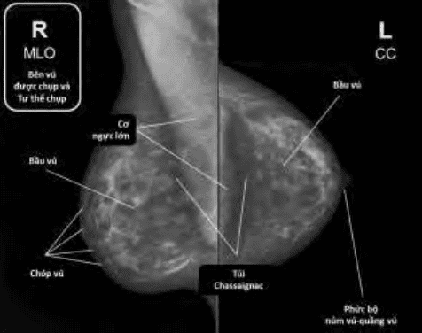

Tuyến vú có thể được khảo sát bằng:

1. Siêu âm.
2. Nhũ ảnh.
3. Cộng hưởng từ.

## Nhũ ảnh

Trong các khảo sát hình ảnh được dùng cho tuyến vú, nhũ ảnh có vai trò nổi bật nhất, do lãnh vực áp dụng của nhũ ảnh rất rộng, gồm cả tầm soát lẫn chẩn đoán.

Nhũ ảnh (mammography) khảo sát tuyến vú bằng tia X, dùng năng lượng thấp. Nhũ ảnh kỹ thuật số (digital mammography) có giá trị (accuracy) cao hơn do chất lượng xử lý hình ảnh tốt hơn, không gian quan sát mở rộng và có thể cung cấp các thông tin bổ sung khi cần thiết bằng cách xử lý thông tin số. Ngày nay, nhũ ảnh kỹ thuật số toàn trường (Full Field Digital Mammography) (FFDM) là một chuẩn mực của kỹ thuật nhũ ảnh.

Thực hiện thường qui và định kỳ nhũ ảnh đóng vai trò cực kỳ quan trọng trong tầm soát ung thư vú. Nhũ ảnh là tầm soát thường qui bắt buộc cho mọi thăm khám phụ khoa từ thời điểm 45 tuổi. Siêu âm không thay được cho nhũ ảnh ở tuổi trên 45 tuổi.

Các tư thế tiêu chuẩn, bắt buộc và quan trọng nhất là các phim CC (craniocaudal view) và phim giữa chéo bên (mediolateral oblique view) (MLO).

Phim CC đạt yêu cầu phải cho thấy được toàn bộ tuyến vú. Phía sau của phim phải thấy được cơ ngực lớn, mô mỡ sau vú (túi Chassaignac). Hai bên là phần bên ngoài cùng của tuyến vú. Phía trước phải nhìn rõ được toàn bộ núm vú. Phim MLO đạt yêu cầu phải cho thấy được cơ ngực. Phần cơ ngực lớn nhìn thấy xác định khối lượng mô vú thấy được trên phim. Quan sát cơ ngực quyết định chất lượng phim chụp, và làm giảm âm tính giả của nhũ ảnh. Hơn nữa, phần lớn các tổn thương ung thư vú xuất hiện ở 1/4 trên ngoài, nên vùng này bắt buộc phải quan sát một cách rõ ràng trên phim MLO.

_Nhũ ảnh, phim MLO (trái) và phim CC (phải). Phim MLO (trái) cho thấy toàn bộ mô vú. Cơ ngực là tiêu chuẩn quan trọng nhất để đánh giá chất lượng phim MLO. Một phim tốt sẽ cho thấy được mô vú ở mức độ tối da, đồng thời quan sát rõ được 1/4 trên ngoài của vú, nơi xuất phát của một phần quan trọng các ung thư vú. Trên phim CC (phải), về phía sau phải trình bày cho thấy được cơ ngực lớn và túi Chassaignac, về phía trước là phức bộ núm-quầng vú. Hai bên biên phải thấy trọn tuyến vú._

Hình ảnh gây chú ý nhiều nhất trên nhũ ảnh là hình ảnh đóng vôi. Đóng vôi ở vú là kết quả của lắng đọng calcium trong chủ mô tuyến vú. Đóng vôi thường rất nhỏ để cảm nhận qua khám vú, nhưng lại là hình ảnh thường thấy nhất qua nhũ ảnh. Chúng là các đốm sáng nhỏ:

1. Đóng vôi có thể là hình ảnh của một vấn đề lành tính trong đa phần các trường hợp. Thường gặp sau mãn kinh, nhiễm trùng cũ ở vú, phẫu thuật vú.
2. Đóng vôi có thể là dấu hiệu rất sớm của ác tính. Vì thế, phân tích đặc tính của đóng vôi, nhất là đóng vôi vi thể có thể giúp phát hiện sớm ung thư vú.

_Lắng đọng vôi bình thường ở các thể Montgomery.  Tại quầng vú có thể có hình ảnh đóng vôi. Các điểm rất phân tán, chỉ thấy duy nhất ở quầng vú._

_(Trái) Đóng vôi lớn và nhỏ trong một thương tổn ác tính. Đóng vôi có thể xuất hiện như những hạt rất mịn mũi tên kép, dưới). Đóng vôi cũng có thể xuất hiện dưới dạng đóng vôi to (mũi tên đơn, trên). Giải phẫu bệnh của hai thương tổn này là carcinoma in-situ ống tuyến vú. (Phải, trên) Ảnh nhìn qua kính lúp một đóng vôi nhỏ của một carcinoma vi xâm lấn. (Phải, dưới) Đóng vôi có thể xuất hiện như những hạt rất mịn. Ảnh nhìn qua kính lúp một đóng vôi nhỏ của một carcinoma in situ._

Đóng vôi có thể là lớn (macrocalcification) hay nhỏ (microcalcification). Cả hai đều thường là lành tính, nhưng cả hai cùng có thể thấy trong ác tính. Tuy nhiên, so với đóng vôi lớn, thì đóng vôi vi thể thường đòi hỏi một đánh giá rất thận trọng. Các thương tổn đóng vôi sẽ được phân ra:

1. Lành tính.
2. Có khả năng lành tính.
3. Trung gian.
4. Nghi ngờ.

## Siêu âm

Siêu âm tuyến vú dùng các sóng âm tần số cao, 7-12 MHz, nhằm có được hình ảnh cự ly gần với mức phân giải cao. Siêu âm tuyến vú không có vị trí trong một tầm soát ung thư vú theo đúng nghĩa của từ này. Không dùng cho tầm soát thường qui ở người trên 45 tuổi. Chỉ có thể xem siêu âm tuyến vú như biện pháp "khám tuyến vú" sơ cấp cho người độ tuổi 30, có đậm độ mô vú dầy, và khi nhũ ảnh chưa phải là nội dung tầm soát thường qui ở lứa tuổi này. Siêu âm tuyến vú thường được dùng để kết hợp với nhũ ảnh để thực hiện chẩn đoán khi kết quả nhũ ảnh không xác định, hoặc để hướng dẫn sinh thiết. Siêu âm Doppler tuyến vú giúp khảo sát dòng chảy mạch máu ở vùng nghi ngờ. Siêu âm hữu ích trong mô tả tính chất của nang: (1) số
lượng nang, (2) hình dáng và tính chất bờ: bờ trơn láng và mỏng hay thành dầy với chồi trong nang, (3) phản âm bên trong trống, đồng nhất hay là u đặc.

_(Trái) Siêu âm vú thường được dùng cho "khám tầm soát" ở người trẻ, hay hỗ trợ cho chẩn đoán. Hình cho thấy hai cấu trúc nang ở vú trên siêu âm, với cấu tạo âm học khác nhau, một phản âm hỗn hợp (trái) và một phản âm trống (phải). (Phải) Sinh thiết nang vú hướng dẫn bởi siêu âm._

Siêu âm tuyến vú được thực hiện ở tư thế nằm ngửa. Các chùm sóng được gửi đến thẳng đứng với bề mặt da. Lần lượt thực hiện các lát cắt:

1. Các lát cắt theo dạng lưới dọc-ngang (grid).
2. Các lát cắt hình nan hoa và theo phương tiếp tuyến.
3. Khảo sát hạch nách.

_Các lát cắt khảo sát trên siêu âm._

## Cộng hưởng từ

Cộng hưởng từ là phương pháp khảo sát hình ảnh được dùng cho các đối tượng đặc biệt, có nguy cơ cao.

Kỹ thuật cộng hưởng từ (MRI) cho phép tạo ra những hình ảnh chi tiết nhất của mô vú. Tuy nhiên MRI không được xem là biện pháp tương đồng với nhũ ảnh cho tầm soát ung thư vú ở các đối tượng nguy cơ trung bình hay thấp. Do ở đối tượng nguy cơ thấp, cộng hưởng từ không mang lại kết quả tầm soát tốt hơn. Vì thế, nó được dùng như một biện pháp tầm soát ở đối tượng có nguy cơ cao. Hội ung thư Hoa kỳ (ACS) khuyến cáo thực hiện MRI vú hàng năm cho các đối tượng chuyên biệt, là các phụ nữ:

- Có đột biết BRCA1 hay BRCA2.
- Có người thân trực hệ bị ung thư vú.
- Có người thân trực hệ có đột biết BRCA1 hay BRCA2.
- Từng bị chiếu xạ vùng ngực giữa 10-30 tuổi.

hoặc

- Đặt túi ngực.
- Từng bị ung thư vú đối bên.
- Vú có mật độ dầy.

Chỉ định chính của MRI là phối hợp để chẩn đoán, cùng với các biện pháp khảo sát hình ảnh khác, nhằm:

- Phối hợp đánh giá bất thường nhũ ảnh hay siêu âm.
- Đánh giá các khối u đa ổ.
- Đánh giá hiệu quả của hóa trị liệu.

_MRI cung cấp các hình ảnh rất chi tiết về cấu trúc mô tuyến vú. MRI này chụp ở một đối tượng nguy cơ rất cao của ung thư vú._

## GENE BRCA

BRCA là từ viết tắt của Breast Cancer. BRCA thể hiện các gene và các protein tương ứng. BRCA1 và BRCA2 là các gene tổng hợp ra protein tương ứng là BRCA1 và BRCA2. Các gene này được biết bởi tính năng ức chế u (tumor suppressor gene). Các protein BRCA1 và BRCA2 được trích xuất từ mô vú và nhiều mô khác. Nhiệm vụ của BRCA1 và BRCA2 là sửa chữa DNA bị hỏng của tế bào, hay phá hủy tế bào nếu không sửa chữa được hư hỏng.

Không phải mọi người đều phải khảo sát đột biến BRCA. Khảo sát này được chỉ định khi có tiền căn gia đình gợi ý:

- Có &ge; 3 người trong gia đình được chẩn đoán ung thư vú hoặc ung thư buồng trứng trong đó có 1 người dưới 50 tuổi.
- Có 2 người trong gia đình thế hệ thứ nhất hoặc thế hệ thứ nhì bị ung thư vú hoặc ung thư buồng trứng.
- Có người trong gia đình bị ung thư vú nam giới.
- Cá nhân được chẩn đoán ung thư trước 50 tuổi.
- Có người trong gia đình cùng lúc mắc ung thư vú và ung thư buồng trứng.

Đột biến (mutation) của gene BRCA1 và BRCA2 sẽ làm mất khả năng sửa chửa các hư hỏng về DNA tại mô tế bào, và gây ra gia tăng của ung thư, như là ung thư vú hay ung thư buồng trứng.

## Nguồn tham khảo

- TEAM-BASED LEARNING - Trường Đại học Y Dược Thành phố Hồ Chí Minh 2020.
