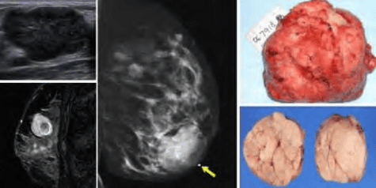
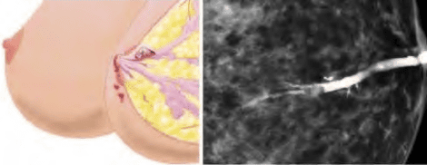
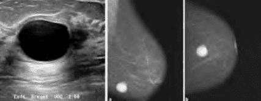

Bệnh lý lành tính của tuyến vú có thể được phân loại theo:

1. Đặc điểm lâm sàng.
2. Mô học.

_Phân loại bệnh lý tuyến vú theo đặc điểm lâm sàng._

_Phân loại bệnh lý tuyến vú theo mô học._

## Bướu sợi tuyến

Bướu sợi tuyến là loại bướu có sự tăng sản của biểu mô và mô đệm, xuất phát từ những ống và mô đệm của phần cuối của hệ thống ống của tuyến vú (đơn vị tuyến tận) và có thể được xem như 1 tiểu thùy phát triển to lên.

Bướu sợi-tuyến của tuyến vú thường gặp nhất ở phụ nữ 20-30 tuổi. Bướu thường được phát hiện tình cờ do bệnh nhân sờ thấy,
không đau. Bướu có vị trí thường gặp nhất là ở 1/4 trên ngoài của vú, có dạng hình cầu, mật độ chắc, giới hạn rõ, rất di động, không dính mô xung quanh, kích thước bướu thay đổi từ
1-5cm. Bướu thường đơn độc, ít khi có nhiều khối.

Biểu hiện trên siêu âm của bướu sợi-tuyến gồm bờ đều đặn hay có múi, thành trước dày, tăng âm phía sau vừa phải, phản âm bên trong đồng nhất ở mức thấp (đôi khi dày). Trên nhũ ảnh, bướu sợi-tuyến có đặc điểm chung của 1 sang thương dạng cục đơn độc lành tính của vú: bướu hình tròn hay bầu dục, bờ đều, có thùy, không xâm lấn, thường có 1 lớp mỏng mỡ thấu quang xung quanh bướu, và hiếm khi kèm theo những thay đổi thứ phát của vú. Có khi trong mô bướu có mật độ đồng nhất có 1 vùng thấu quang, đó là mô mỡ nằm trong bướu.

_(Trái, trên) Siêu âm bướu sợi-tuyến. Bướu có giới hạn rõ, đồng nhất, bờ đa cung. (Trái, dưới) MRI bướu sợi-tuyến. Bướu có giới hạn rõ, đồng nhất. Bên trong của bướu này có thoái hóa. (Giữa) Nhũ ảnh bướu sợi-tuyến, phim MLO. Nhìn thấy 1 lớp mỡ mỏng quanh u. Bướu sợi tuyến-tuyến vú trên đại thể. Đại thể: bướu có thùy và vỏ bao rõ. Bướu sợi tuyến-tuyến vú trên đại thể. Mặt cắt ngang cho thấy 1 mặt cắt phồng, đồng nhất._

Chẩn đoán phân biệt với ung thư vú. Bướu sợi-tuyến có đóng vôi bao quanh ngoại vi, trong khi ung thư sẽ có hình ảnh can-xi hóa li ti ở trung tâm bướu (microcalcification). Cũng cần chẩn đoán phân biệt với nang vú. Chọc hút bằng kim nhỏ là phương tiên hữu ích giúp chẩn đoán phân biệt.

Phẫu thuật là phương pháp hiệu quả duy nhất. Nên mổ lấy bướu để biết bản chất mô học, vì 1 số bướu được cho là bướu sợi-tuyến điển hình nhưng lại có kết quả giải phẫu bệnh là loại bệnh lý lành tính khác, hay đôi khi là ung thư.

## Bướu diệp thể

Bướu diệp thể gồm 3 loại: lành (60%), giáp biên (20%) và ác (20%).

Bướu thường thấy ở bệnh nhân trên 40 tuổi. Bướu thường có kích thước to, phát triển nhanh. Da trên bướu căng, bóng, mỏng. Có thể thấy giãn tĩnh mạch do bướu đè sát vào da. Loét da có thể xảy ra do căng và đè ép gây thiếu máu. Núm vú có thể bị ảnh hưởng nhưng rất ít bị xâm lấn hay co kéo. Hạch vùng nách có thể to và sờ thấy trong 20% trường hợp. Bướu diệp thể hiếm khi có di căn. Chỉ thấy có di căn trong
khoảng 5% trường hợp.

Trên siêu âm, bướu diệp thể hiện diện như là 1 khối giảm âm, giới hạn rõ, có thể có rải rác vài vùng hóa nang. Khi hình ảnh siêu âm là hình ảnh có vùng hóa nang và khe rãnh, khả năng chẩn đoán thường là bướu diệp thể. Tuy nhiên, dễ nhầm giữa bướu sợi-tuyến với bướu diệp thể lành và ác.

Trên nhũ ảnh, bướu diệp thể thường là 1 khối lớn giới hạn rõ, hình tròn, bầu dục hay chia thành nhiều thùy có thể có vôi hóa.

FNA kém tin cậy trong bướu diệp thể. Do tính chất không đồng nhất của các thành phần của bướu diệp thể, nên khó phân biệt bướu diệp thể lành, ác với bướu sợi tuyến.

_Bướu diệp thể là khối u rất to và lớn nhanh. Siêu âm bướu diệp thể với hình ảnh đặc trưng hình ảnh có vùng hóa nang và khe rãnh. Nhũ ảnh bướu diệp thể là 1 khối lớn giới hạn rõ, hình tròn, bầu dục hay chia thành nhiều thùy có thể có vôi hóa. Đại thể bướu diệp thể._

Phẫu thuật cắt rộng là phương pháp điều trị chủ yếu của bướu diệp thể lành.

Tái phát có liên quan đến bờ phẫu thuật nhưng không liên quan đến độ mô học của bướu và kích thước bướu. Khoảng 20% bướu diệp thể sẽ tái phát nếu phẫu thuật bờ bướu không đủ rộng. Khi đó, cần phẫu thuật tiếp thêm sau phẫu thuật lần đầu.

Phẫu thuật đoạn nhũ nên thực hiện khi bướu quá lớn so với kích thước của vú, bất kể loại giải phẫu bệnh.

## Bướu nhú trong ống dẫn sữa

Bướu nhú (còn gọi là bướu gai) trong ống dẫn sữa là tổn thương thường gặp khi có tiết dịch núm vú dạng máu hoặc huyết thanh-máu. Tần suất của tổn thương này là 60-80% khi có tiết dịch núm vú dạng máu hoặc huyết thanh-máu.

Đây là 1 tổn thương lành tính, đơn độc, thường chỉ thấy ở 1 bên vú, ở trong vòng 1 cm quanh quầng vú. U phát xuất từ tế bào biểu mô của ống tuyến và tạo nên những tăng sinh dạng nhú làm căng phồng ống. Bướu nhú trong ống tuyến sẽ được phân biệt với tổn thương dạng nhú khác của vú như bệnh nhú, đa bướu nhú và đặc biệt là carcinoma dạng nhú.

Trên siêu âm, có 3 dạng hình ảnh được nhìn thấy: dạng trong ống tuyến, dạng trong nang, và dạng đặc. Nếu bướu nhú quá nhỏ, chỉ nhìn thấy được ống tuyến giãn. Hầu hết các trường hợp đều không thấy bất thường trên nhũ ảnh, trừ khi có kết hợp với 1 u có thể nhìn thấy.

_(Trái) Sơ đồ vị trí 1 u nhú gây tiết dịch-máu ở vú 60-80% tiết dịch núm vú dạng máu này là các u nhú. (Phải) Chụp cản quang ống tuyến vú với hình ảnh u nhú trong ống tuyến._

Khi có bướu nhú, cần sinh thiết trọn sang thương. Sau đó điều trị theo kết quả mô học có được. Có thể thay thế sinh thiết mở bằng sinh thiết định vị dưới siêu âm. Siêu âm hướng dẫn việc định vị sang thương trong ống tuyến bằng kim định vị quy ước, nhằm phẫu thuật lấy chính xác tổn thương và tránh lấy nhiều mô vú không cần thiết. Chọc hút bằng kim nhỏ có thể không thể phân biệt được với các loại tổn thương thay đổi sợi bọc, bướu nhú, bệnh nhú, carcinoma tại chỗ hoặc xâm lấn. Đa số cần phải sinh thiết trọn.

## Nang vú

Các nang vú là do các tiểu thùy vú bị thoái triển và căng dãn. Nang vú có thể xảy ra ở bất kỳ tuổi nào nhưng tình trạng này không thường gặp sau mãn kinh. Nang có thể thay đổi theo chu kỳ kinh nguyệt.

Nang vú thường phân biệt rõ với mô xung quanh, với các đặc trưng là chắc và di động. Nang có thể đau, khó phân biệt với mô đặc.

Trên siêu âm, nang vú có thể là các nang điển hình hoặc không điển hình.

Trên nhũ ảnh, nang vú là các cấu trúc có bờ rõ, tròn hoặc bầu dục, không can-xi hóa và không tăng đậm độ.

_Nang vú trên siêu âm và trên nhũ ảnh._

Khi có các hình ảnh nang, có thể thực hiện chọc hút bằng kim nhỏ. Thường chọc không có máu, nang xẹp sau khi hút dịch. Cần tái khám lại 4-6 tuần sau khi hút dịch.

Nếu chọc hút có máu, cần phải phẫu thuật để sinh thiết.

## Bệnh Hamartoma (Fibroadenolipoma)

Hamartoma có thể xảy ra ở nhiều vị trí khác nhau trên cơ thể. Hamartoma là 1 tình trạng lành tính, khu trú, tương tự như tân sinh, nằm trong mô xuất phát của Hamartoma. Các Hamartoma thường phát triển với cùng tốc độ của mô nguyên thủy mà từ đó Hamartoma xuất hiện. Hamartoma được cấu tạo bởi các thành phần giống hệt như mô xuất phát, nhưng chỉ có rối loạn về cấu trúc và phân bố. Các Hamartoma thường không có triệu chứng.

Hamartoma ở vú có cấu tạo gồm mô tuyến và sợi bao quanh bởi mô mỡ và 1 vỏ bao. Có thể nhầm lẫn với bướu sợi tuyến.

Do đặc điểm trên, trên lâm sàng Hamartoma là 1 khối rất rõ. Trên nhũ ảnh, Hamartoma vú cho hình ảnh "vú trong vú" với vỏ bao mỏng bao quanh mô thấu quang và cản quang xen kẽ nhau.

_Nhũ ảnh của Hamartoma vú, phim LMO vú phải và phim CC. Vỏ bao mỏng có mô thấu quang và cản quang xen kẽ nhau, hình ảnh "Breast within Breast"._

Xử trí là bằng phẫu thuật cắt bỏ u. Cần lưu ý rằng đa Hamartoma (Hamartoma cùng lúc ở nhiều cơ quan) là thành phần của hội chứng Cowden và của hội chứng BannayanRiley-Ruvalcaba, là biểu hiện của đột biến gene PTEN. Chỉ trong trường hợp có các hội chứng này, thì mới phải có chính sách tầm soát như đối tượng nguy cơ cao.

## Bệnh Mondor

Bệnh Mondor có nguyên nhân là do huyết khối ở tĩnh mạch nông vùng da vú, thường gặp ở tĩnh mạch ngực thượng vị. Bệnh thường xuất hiện sau phẫu thuật, sau chấn thương hoặc kèm bệnh lý đông máu bất thường như yếu tố V Leiden. Không có điều trị đặc hiệu.

## U mỡ

U mỡ là sang thương lành tính khá phổ biến, thường gặp ở giai đoạn sau tuổi sinh sản.

Lâm sàng là khối u đơn độc, mềm và di động. Trên vi thể u mỡ bao gồm tế bào mỡ trưởng thành hình tròn. Vì vú chứa nhiều mô mỡ nên những trường hợp u mỡ nghi ngờ cần phẫu thuật cẩn thận lấy trọn sang thương cùng vỏ bao. Tuy nhiên cần phân biệt với u giả mỡ là khối mềm nằm xung quanh ung thư vú.

## Tuyến vú phụ (polythelia)

Tuyến vú phụ hoặc núm vú phụ được tìm thấy ở khoảng 1-5% phụ nữ. Tuyến vú phụ thường gặp hơn núm vú phụ. Vị trí phát triển của các tuyến vú phụ là dọc theo đường sữa.

Vị trí thường gặp nhất của núm vú phụ là dưới vú bình thường. Vị trí thường gặp nhất của tuyến vú phụ là ở nách. Núm vú phụ và tuyến vú phụ chỉ điều trị khi có vấn đề thẩm mỹ. Lưu ý rằng mô vú phụ vẫn có thể mắc những bệnh lý như mô vú bình thường.

_(Trái) Tuyến vú phụ ở nách. (Phải) Đường sữa._

## Bệnh vú thay đổi sợi bọc

Nguyên nhân của bệnh vú thay đổi sợi bọc được cho rằng do liên quan đến tình trạng mất cân bằng giữa progesterone và estrogen.

Thường gặp nhất ở độ tuổi 20-50.

53% có thay đổi về mặt mô học. Thường thấy nhất là 1 biến thể của sự thoái triển nhu mô vú theo hướng phát triển quá mức mô sợi hoặc xơ hóa khu trú, tạo ra 2 nhóm bệnh học: (1) bệnh lí xơ hóa tuyến vú (sclerosing adenosis) và (2) tổn thương xơ phức tạp hay sẹo hình sao (complex sclerosing lesion or radial scar). Khoảng 50% bệnh nhân có thay đổi sợi bọc ở vú có biểu hiện lâm sàng, với biểu hiện đau vú 2 bên, nặng căng vú theo chu kỳ, sờ thấy khối u. Khám thấy mô vú đậm đặc hơn, cảm giác có nhiều mô nốt hoặc hạt, có thể có tiết dịch núm vú tự nhiên.

## Tiết dịch núm vú

Phần lớn nguyên nhân gây tiết dịch núm vú là lành tính.

Dịch thường thấy nhất là tiết sữa. Trong trường hợp này khai thác bệnh sử về dùng thuốc như hướng thần kinh, thuốc chống trầm cảm hay ức chế bơm proton... có thể cho biết nguyên nhân do dùng thuốc của tăng tiết sữa gây tăng prolactin.

Khảo sát nội tiết để tìm các nguyên nhân xa hơn như microadenoma tuyến yên hay nhược giáp là cần thiết. Kích thích núm vú quá mức cũng thường gặp.

Trong trường hợp tiết dịch tự phát, 1 bên, có máu, cần lưu ý khả năng có bướu nhú hay các carcinoma khác và trong ống tuyến vú.

## Nguồn tham khảo

- TEAM-BASED LEARNING - Trường Đại học Y Dược Thành phố Hồ Chí Minh 2020.
