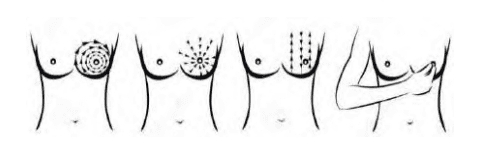

Ung thư vú là bệnh lý ác tính thường gặp nhất ở phụ nữ, chiếm 18% ung thư ở phụ nữ, và là nguyên nhân gây tử vong hàng đầu ở phụ nữ trong độ tuổi từ 40-50.

## Tầm soát ung thư vú

Khả năng sống còn sau 5 năm của ung thư vú tùy thuộc vào giai đoạn ung thư lúc phẫu thuật. Vì thế, tầm soát ung thư vú đóng vai trò quan trọng trong phát hiện và điều trị sớm ung thư vú. Khả năng này là 98% nếu ung thư vú được phát hiện ở giai đoạn sớm, còn khu trú ở vú và điều trị bằng phẫu thuật kèm nạo hạch. 89% trường hợp u &le; 1 cm điều trị bằng đoạn nhũ và nạo hạch không phát hiện di căn sau 18 năm.

### Công cụ tầm soát

Công cụ tầm soát ung thư vú gồm 2 phương tiện:

1. Nhũ ảnh.
2. Cộng hưởng từ vú.

Tự khám vú không được Hiệp hội Ung thư Hoa Kỳ xem như biện pháp tầm soát ung thư, nhưng hội vẫn khuyến cáo mọi phụ nữ &ge; 20 tuổi nên thực hiện tự khám vú. Khoảng 1/2 số ung thư vú được phát hiện qua tự khám vú.

Siêu âm không được xem là biện pháp hình ảnh thích hợp cho tầm soát ung thư vú.

_Giá trị của các phương tiện chẩn đoán._

### Khám vú

Theo ACOG 2017, có khoảng 50% trường hợp ung thư vú ở phụ nữ từ 50 tuổi trở lên và 71% trường hợp ung thư vú ở phụ nữ dưới 50 tuổi được phát hiện bởi chính phụ nữ.

Phụ nữ nên được giáo dục về các dấu hiệu và triệu chứng của ung thư vú. Họ cần thông báo cho bác sĩ phụ khoa ngay khi họ nhận thấy 1 sự thay đổi như đau vú, khối ở vú, thay đổi màu sắc (đỏ), tiết dịch bất thường.

Đơn vị phòng dịch ngừa dịch bệnh Hoa Kỳ vẫn khuyến cáo khám vú mỗi 1-3 năm cho các đối tượng nguy cơ bình quân từ 25-39 tuổi, và mỗi năm cho phụ nữ từ 40 tuổi trở lên.

Thời điểm thực hiện tự nhận thức về vú cũng như là khám vú tốt nhất là ngày thứ 8 của chu kỳ. Lúc này, mô vú ít bị ảnh hưởng của estrogen, kích thước vú là nhỏ nhất, mật độ vú không dầy nên dễ phân biệt.

Quan sát ở nhiều tư thế nhằm bộc lộ các bất thường:

- 2 tay để sau gáy.
- 2 tay chống trên hông.
- 2 tay buông xuôi theo thân.

Mục đích của quan sát là cảm nhận hình dạng, kích thước, sự cân đối của vú, cũng như các thay đổi trên da vú (ửng đỏ, co kéo, loét, thụt núm vú).

Nếu như tự quan sát, thì tốt nhất là đứng trước gương. Tự sờ nắn: được thực hiện lúc tắm, khi nằm thư giãn. Lần lượt khám mỗi 1/4 vú, hạch đòn và hạch nách.

_Tự quan sát trước gương và tự sờ nắn khi tắm và khi nằm._

_Các tư thế tự quan sát trước gương và các tư thế để tự sờ nắn._

_Khám vú bằng cách dùng 3 ngón giữa của 2 bàn tay. Khi tự sờ nắn, bàn tay để sau gáy sẽ giúp cảm nhận được tốt hơn._

_Lộ trình của các ngón tay khi tự khám vú._

Các dấu hiệu bất thường có thể nhận thấy khi tự khám vú buộc người phụ nữ phải gặp bác sĩ gồm:

- Khối u: Khối u ở vú phát hiện được có thể là (1) khối u mới, đơn độc hoặc (2) khối u mới xuất hiện ở vùng mô lổn nhổn trước đó. Đôi khi, không hẳn là cảm nhận khối u mà là cảm nhận 1 vùng mô lổn nhổn, không đối xứng ở phụ nữ tiền mãn kinh hay đã mãn kinh. 1 tình trạng viêm hay áp-xe vú không đáp ứng với điều trị cũng là 1 triệu chứng buộc người phụ nữ phải đi khám để không bỏ sót 1 ác tính ẩn mình phía sau biểu hiện bên ngoài là áp-xe hay viêm.
- Phì đại hạch nách hay hạch đòn: Mọi hạch nách phì đại mới phát hiện cần được đánh giá cẩn thận, vì có thể là hình ảnh của 1 di căn đến từ vú.
- Đau: Cần mô tả tính chất đau, vị trí, mức độ đau, tính chu kỳ. Đau vú (1) có hay không kèm theo khối u, (2) các trường hợp đau vú nhiều, ảnh hưởng đến chức lượng cuộc sống của người bệnh, (3) đau vú liên tục không có tính chu kỳ, (4) đau vú không đáp ứng với giảm đau hay các progesterone điều trị đau căng vú (mastodynia), (5) đau chỉ khu trú ở 1 bên vú, (6) đau vú ở phụ nữ đã mãn kinh đều là triệu chứng cần lưu ý.
- Tiết dịch núm vú: Nên ấn quầng vú và núm vú để tìm tiết dịch bất thường. Cần nhận định tiết dịch là 1 hay 2 bên, màu và độ quánh của dịch. Các tiết dịch có thể là nghiêm trọng gồm (1) tiết dịch ở phụ nữ ≥ 50 tuổi, (2) tiết dịch 1 bên ở phụ nữ < 50 tuổi, (3) tiết dịch lẫn máu, (4) tiết dịch kèm co rút hay biến dạng núm vú...

### Hình ảnh học tầm soát ung thư vú

Nhũ ảnh là phương tiện tầm soát đầu tay cho mọi phụ nữ với nguy cơ bình quân (average risk) của ung thư vú.

Nhũ ảnh là 1 phương tiện tầm soát có giá trị. Khi thực hiện tầm soát bằng nhũ ảnh cho đối tượng nguy cơ bình quân, nhũ ảnh thường quy sẽ:

- Làm giảm được 16-35% tử vong do ung thư vú ở phụ nữ &ge; 50 tuổi.
- Làm giảm được 15-20% tử vong do ung thư vú ở phụ nữ &ge; 40-49 tuổi. Lý do của hiện tượng nhũ ảnh có hiệu quả giảm tử suất do ung thư vú kém hơn ở tuổi trẻ so với tuổi lớn là do tần suất mắc thấp hơn của ung thư vú ở lứa tuổi này, do các khối u thường phát triển nhanh hơn và đậm độ mô vú dầy làm giảm giá trị của nhũ ảnh.

Việc xử lý kết quả tầm soát có thể dựa trên gợi ý của hệ thống BI-RADS (Breast Imaging-Reporting and Data System):

- BI-RADS 0 thể hiện rằng đã có 1 vài điểm bất thường được nhìn thấy trên nhũ ảnh, tuy nhiên không rõ ràng để cho kết luận. Cần phải thực hiện thêm các khảo sát chuyên biệt như ép điểm khi thực hiện nhũ ảnh (spot compression), phóng đại mạnh hơn, hay siêu âm... Cần phải xem lại các phim nhũ ảnh đã có trước đó và so sánh với hình ảnh hiện có, để phát hiện thay đổi của hình ảnh qua các phim.
- BI-RADS 1 thể hiện rằng không có hình ảnh bất thường phải báo cáo. Vú cân đối, không khối u, không bất thường về cấu trúc, không có đóng vôi bất thường. Thuật ngữ "kết quả âm tính" có nghĩa là âm tính với ung thư.
- BI-RADS 2 cũng là 1 báo cáo kết quả âm tính với ung thư trên nhũ ảnh. Tuy nhiên, ở đây có các tổn thương lành tính như đóng vôi lành tính, hình ảnh các hạch không ung thư hay bướu sợi-tuyến tuyến vú.
- BI-RADS 3 thể hiện rằng đặc điểm hình ảnh trên nhũ ảnh rất có khả năng (98%) có liên quan đến 1 tổn thương lành tính. Tuy nhiên, không có xác nhận lành tính. Các tổn thương BI-RADS 3 phải được xem xét theo thời gian. BI-RADS 3 phải được theo dõi mỗi 6 tháng, tập trung quan sát sự thay đổi của tổn thương. Việc theo dõi tổn thương BI-RADS 3 chỉ ngừng lại khi đã xác nhận rằng tổn thương là ổn định, không thay đổi sau khoảng thời gian theo dõi ít nhất là 2 năm. Ý nghĩa của việc theo dõi này là hạn chế các sinh thiết không thật sự cần thiết.
- BI-RADS 4 có thể là tổn thương ung thư, cũng có thể là không phải ung thư, nhưng lại nhìn giống ung thư. Trong trường hợp này, các biện pháp quyết liệt hơn như là sinh thiết là cần thiết.
- BI-RADS 5 là tổn thương có khả năng rất cao, lên đến trên 95% là ung thư. Bắt buộc phải sinh thiết.
- BI-RADS 6 là loại chỉ được dùng cho các nhũ ảnh đã được xác định là ung thư qua sinh thiết trước đó. Trong trường hợp này, nhũ ảnh là biện pháp theo dõi điều trị.

_BI-RADS được xây dựng bởi nhiều Hiệp hội khác nhau như ACS, ACOG và Hiệp hội Quang tuyến (Radiology) Hoa kỳ. Tuy nhiên, đứng tên bản quyền là của Hiệp hội Quang tuyến Hoa kỳ. $^2$ Các phiên bản trước đây của BI-RADS không chia loại 4 ra 3 mức A, B, C. Loại 6 cũng mới được đưa vào phiên bản BI-RADS 2015._

### Giải phẫu bệnh

#### Sinh thiết lõi

Sinh thiết lõi dưới hướng dẫn của khảo sát hình ảnh là tiêu chuẩn chẩn đoán mô học. Sinh thiết lõi dùng 1 kim rỗng hút mô từ tổn thương vú, thực hiện dưới hướng dẫn nhũ ảnh hoặc siêu âm khi u không sờ thấy, hoặc trực tiếp khi u sờ thấy. So với FNA, sinh thiết lõi lấy được nhiều mô hơn. Sinh thiết lõi cho phép có được bằng chứng mô học và đồng thời đánh giá ER, PR, Her trước khi có quyết định điều trị. Có thể dùng kim Titanium đánh dấu vị trí sinh thiết để hướng dẫn phẫu thuật sau sinh thiết.

#### Chọc hút kim nhỏ (FNA)

Chọc hút kim nhỏ (FNA) dùng kim nhỏ 20G hoặc 22G lấy mẫu mô từ vùng vú bất thường. FNA có độ chính xác cao, âm tính giả 10-15%, dương tính giả dưới 1%. FNA được dùng để xác định chẩn đoán khi khám vú hoặc hình ảnh học dương tính, tuy nhiên nếu FNA âm tính không loại trừ được u ác tính, cần sinh thiết
lõi hoặc sinh thiết trọn khối u. FNA còn gặp hạn chế trong việc chọc hút hạch lympho nghi ngờ ác tính hoặc nang có triệu chứng.

#### Sinh thiết trọn khối u

Sinh thiết trọn khối u, cắt bỏ toàn bộ sang thương vú được thực hiện khi chọc hút bằng kim nhỏ hay sinh thiết lõi không thực hiện được hoặc kết quả âm tính, không rõ ràng hoặc trái ngược với dấu hiệu lâm sàng.

### Lịch tầm soát

_Lịch tầm soát ung thư vú bằng nhũ ảnh cho phụ nữ với nguy cơ bình quân, theo các tổ chức/hiệp hội khác nhau tại Hoa Kỳ._

_Lịch tầm soát ung thư vú cho phụ nữ với nguy cơ trung bình, theo khuyến cáo của Hiệp hội Ung thư Hoa kỳ (2015). Tầm soát dựa trên nhũ ảnh. Ở tuổi 40, người phụ nữ với nguy cơ trung bình có thể bắt đầu chương trình tầm soát nếu như họ muốn. Tuổi 45 là lứa tuổi bắt buộc của tầm soát nhữ ảnh hàng năm, và kéo dài cho đến năm 55 tuổi. Sau 55 tuổi, việc tầm soát nhũ ảnh bắt buộc sẽ chuyển sang được thực hiện 1 lần cho mỗi 2 năm. Việc tầm soát được tiếp tục cho đến khi nào người phụ nữ còn cảm nhận rằng mình vẫn khỏe mạnh._

Khi thực hiện nhũ ảnh thường quy tầm soát ung thư vú ở mọi phụ nữ trong độ tuổi 40-49 tuổi, sẽ có ít nhất 1 lần dương tính giả. Nhũ ảnh thường quy đơn thuần không được chỉ định ở
những đối tượng có nguy cơ cao theo mô hình Claus, và các đối tượng có nguy cơ cao đặc biệt khác.

Dù rằng MRI có độ nhạy rất cao, nhưng vẫn có khả năng bỏ sót tổn thương. MRI phải được thực hiện kèm theo chứ không phải là thay cho nhũ ảnh ở các đối tượng có nguy cơ cao ung thư vú.

Đối với các đối tượng nguy cao đặc biệt của ung thư vú, không thực hiện tầm soát bằng nhũ ảnh đơn thuần. Ở các đối tượng này, việc tầm soát phải được thực hiện bằng cộng hưởng từ (MRI) và nhũ ảnh hàng năm.

_Lịch tầm soát ung thư vú bằng các phương tiện khác nhau cho phụ nữ với nguy cơ cao, theo các tổ chức/hiệp hội khác nhau tại Hoa Kỳ._

Các phụ nữ sau được xếp vào nhóm có nguy cơ cao của ung thư vú và cần được thực hiện tầm soát hàng năm bằng MRI phối hợp với nhũ ảnh:

- Có lifetime risk theo tiền sử bị ung thư vú 20-25% hoặc cao hơn.
- Có đột biến gene BRCA.
- Chưa được khảo sát đột biến BRCA nhưng có người thân trực hệ (cha mẹ, anh, chị, em hay con) có mang đột biến gene BRCA1 hay BRCA2.
- Từng bị chiếu xạ vùng ngực trong độ tuổi 10-30 tuổi.
- Mắc hội chứng Li-Fraumeni (1 ung thư hiếm, di truyền theo kiểu gen trội trên nhiễm sắc thể thường; đặc trưng bởi sarcoma, vú, bệnh bạch cầu và tuyến thượng thận; liên quan đến đột biến của gene p53 ức chế khối u), hội chứng Cowden (hội chứng đa hamartoma là 1 bệnh hiếm, đặc trưng bởi các tình trạng giống khối u không ung thư gọi là hamartoma; là 1 bệnh di truyền theo gene trội trên nhiễm sắc thể thường, liên quan đến gene PTEN, là 1 gene ức chế khối u), hay hội chứng Bannayan-Riley-Ruvalcaba (1 bệnh di truyền gene trội trên nhiễm sắc thể thường và cũng có liên quan đến đột biến gene PTEN.), hay có người thân trực hệ có 1 trong các hội chứng này.

Do chưa đủ bằng chứng cho dân số có nguy cơ cao ung thư vú, nên ACS đề nghị thực hiện tầm soát phối hợp trên kể từ năm 30 tuổi, với sự đồng thuận của bệnh nhân, cho hầu hết các trường hợp nguy cơ cao. Phụ nữ có tiền căn chiếu xạ ngực lúc 10-30 tuổi cần được thực hiện tầm soát kép nhũ ảnh-MRI hàng năm, bắt đầu từ 8-10 năm kể từ khi bị chiếu xạ hoặc bắt đầu lúc 25 tuổi.

Không đủ bằng chứng về hiệu quả của việc thực hiện đơn thuần MRI hàng năm ở phụ nữ có tiền căn ung thư vú (cùng hay đối bên), sinh thiết vú với kết quả nguy cơ cao như tăng sinh ống không điển hình (atypical ductal hyperplasia) (ADH), carcinoma tại chỗ tiểu thùy (lobular carcinoma in situ) (LCIS), carcinoma ống tại chỗ (ductal carcinoma in situ) (DCIS). Các bệnh nhân có nguy cơ đặc biệt cao này phải được theo dõi bằng phối hợp nhũ ảnh-MRI, có hay không kèm theo các biện pháp hỗ trợ khác.

## Ung thư vú

## Nguồn tham khảo

- TEAM-BASED LEARNING - Trường Đại học Y Dược Thành phố Hồ Chí Minh 2020.
