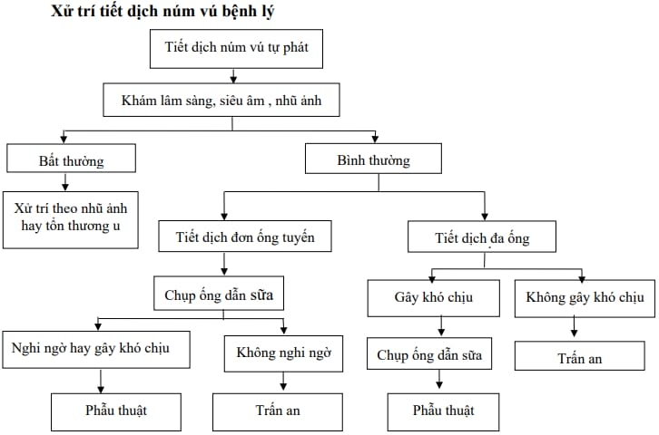

Phần lớn nguyên nhân gây tiết dịch núm vú là lành tính.

Dịch thường thấy nhất là tiết sữa. Trong trường hợp này khai thác bệnh sử về dùng thuốc như hướng thần kinh, thuốc chống trầm cảm hay ức chế bơm proton... có thể cho biết nguyên nhân do dùng thuốc của tăng tiết sữa gây tăng prolactin.

Khảo sát nội tiết để tìm các nguyên nhân xa hơn như microadenoma tuyến yên hay nhược giáp là cần thiết. Kích thích núm vú quá mức cũng thường gặp.

Trong trường hợp tiết dịch tự phát, 1 bên, có máu, cần lưu ý khả năng có bướu nhú hay các carcinoma khác và trong ống tuyến vú.

## Tiết sữa

Hiện tượng tiết dịch giống sữa, tự phát, thường là 2 bên và từ nhiều ống tuyến, do sự tăng nồng độ prolactin.

### Nguyên nhân

U tuyến yên (phù gai thị, rối loạn thị giác,...).

Chấn thương thành ngực, tổn thương tủy sống, xơ gan, nhược giáp, suy thận,...

BN đang sử dụng: estrogen liều cao, thuốc chống trầm cảm 3 vòng và cimetidine,...

### Cận lâm sàng

Tăng prolactin máu.

TSH (Thyroid Stimulating Hormone).

MRI để đánh giá u tuyến yên khi prolactin tăng cao và/hoặc có triệu chứng thị giác trên lâm sàng.

CT scan nếu BN chống chỉ định chụp MRI.

### Xử trí

Tùy theo nguyên nhân.

Điều trị tăng prolactin máu bằng Bromocriptine 2.5 mg. Liều khởi đầu 1.25-2.5 mg/ngày, sau đó tăng thêm 2.5 mg mỗi 2-7 ngày. Liều duy trì 2.5-15 mg/ngày. Theo dõi trong khoảng 3 tháng, nếu hết tiết sữa thì ngưng thuốc.

## Tiết dịch bệnh lý

Tình trạng tiết máu, nước, mủ, thanh dịch đục, thường 1 bên, trên 1 ống tuyến, xảy ra tự phát.

### Nguyên nhân

Thường gặp bướu nhú trong ống và dãn ống tuyến vú.

Các nguyên nhân khác như ung thư, viêm vú, thay đổi sợi bọc tuyến vú.

### Cận lâm sàng

Prolactin máu.

Siêu âm.

Nhũ ảnh.

Chụp ống tuyến sữa.

Tế bào học dịch núm vú.

## Phác đồ xử trí

_Xử trí tiết dịch núm vú bệnh lý._

## Nguồn tham khảo

- TEAM-BASED LEARNING - Trường Đại học Y Dược Thành phố Hồ Chí Minh 2020.
- PHÁC ĐỒ ĐIỀU TRỊ SẢN PHỤ KHOA - Bệnh viện Từ Dũ.
