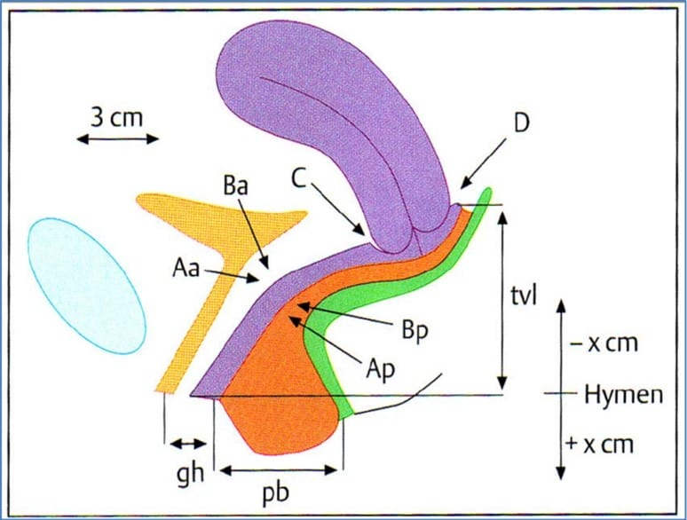
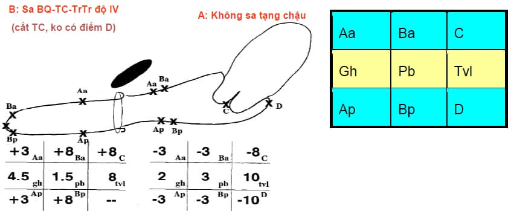
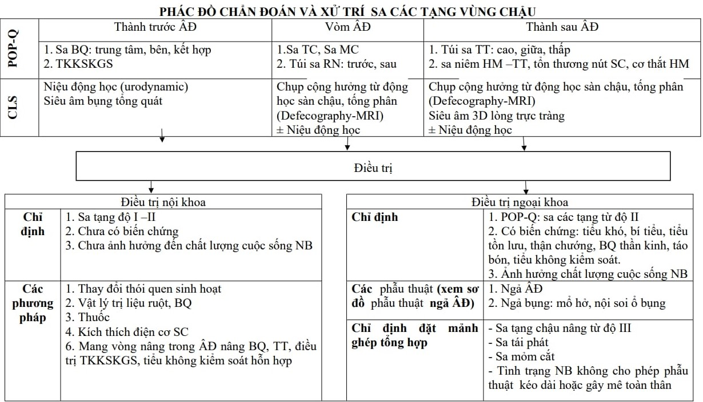
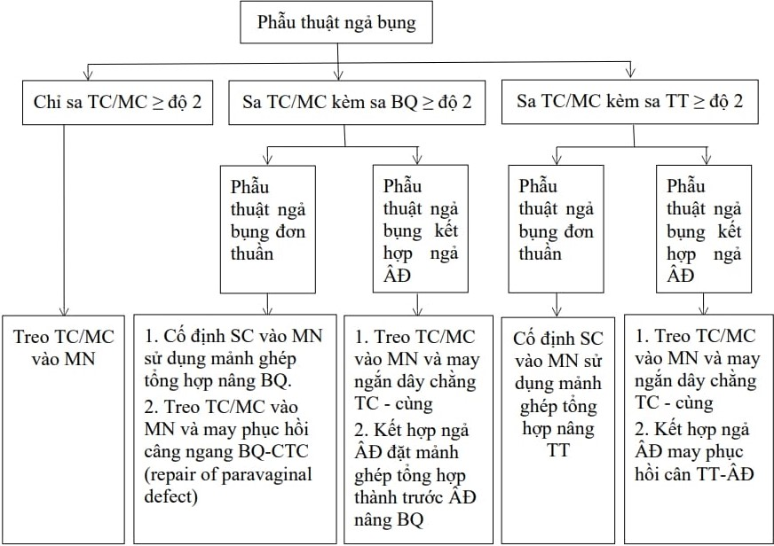
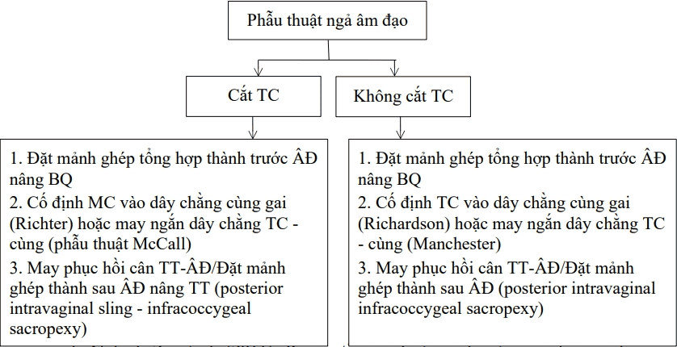

Sa các tạng trong vùng chậu (Pelvic Organ Prolapse - POP) là sự tụt xuống của tử cung, bàng quang, trực tràng, thành trước, thành sau âm đạo,... ra khỏi vị trí giải phẫu bình thường, sự tổn thương và suy yếu các cấu trúc cân cơ và dây chằng nâng đỡ sàn chậu.

Hệ thống nâng dỡ các cơ quan tiểu khung:

- Hệ thống nâng đỡ: Cơ nâng hậu môn và cơ nâng của sàn hội âm.
- Hệ thống treo: Dây chằng mu niệu đạo, mạc mu cổ tử cung, dây chằng tử cung cùng, dây chằng ngang tử cung, cân Halban, cân trực tràng âm đạo.
- Hệ thống định hướng: Dây chằng tròn, dây chằng rộng.

## Phân loại và phân độ

### Phân loại

| Vị trí giải phẫu so với thành âm đạo | Tạng chậu sa và phân loại                                                              | Xét nghiệm cần thiết     |
| ------------------------------------ | -------------------------------------------------------------------------------------- | ------------------------ |
| Thành trước (ngăn trước)             | Sa bàng quang: trung tâm, bên, kết hợp Sa niệu đạo                                  | Niệu động học            |
| Vòm âm đạo (ngăn giữa)               | Túi sa ruột non: trước, sau  Sa tử cung Sa mỏm cắt                               | MRI động ± Niệu động học |
| Thành sau (ngăn sau)                 | Túi trực tràng: cao, giữa, thấp Sa trực tràng Khối lồng trong trực tràng hậu môn | MRI động ± Niệu động học |

### Phân độ

_Phân loại - Phân độ sa tạng chậu._

Quy ước 9 mốc cần đo:

- Đơn vị đo cm, người bệnh tư thế sản phụ khoa, đầu cao $45^o$, rặn trong quá trình đánh giá.
- Dụng cụ van âm đạo, thước đo, kẹp tim, pozzi.
- Điểm cố định: Aa, Ap cách niệu quản, mép màng trinh 3 cm.
- Điểm thay đổi: Ba, Bp là điểm phồng xa nhất của đoạn âm đạo từ Aa, Ap đến túi cùng trước và sau khi BN rặn ± hỗ trợ kéo cổ tử cung bằng pozzi hoặc kẹp tim.
- Cùng đồ: C, D được tính nếu còn tử cung.
- Gh: khe niệu dục.
- Pb: thể sàn chậu (nút sàn chậu).
- Tvl: chiều dài âm đạo.
- Trên/dưới mép màng trinh đánh dấu -/+ trước số đo.

Phân độ:

- Độ 0: không sa tạng chậu. 
  Aa, Ba, Ap, Bp: 3 cm nằm trên màng trinh. 
  Điểm C hay D: tvl -2cm < C, D ≤ tvl.
- Độ I: B > 1cm trên màng trinh.
- Độ II: B trong khoảng ± 1cm trên dưới màng trinh.
- Độ III: B > 1 cm dưới màng trinh đến (tvl-2) cm.
- Độ IV: sa toàn bộ, B ≥ (tvl-2) cm.

_Sơ đồ chẩn đoán sa tạng chậu._

## Xét nghiệm chẩn đoán và chuyên biệt

### Xét nghiệm thường quy

Phát hiện và điều trị các yếu tố nguy cơ có thể ảnh hưởng kết quả phẫu thuật (đang có viêm âm đạo, nhiễm trùng tiểu, tiểu đường, thiếu máu,...).

Loại trừ bệnh lý phụ khoa (rong cường kinh, rong huyết), bệnh lý cổ tử cung, tử cung, phần phụ để quyết định có cắt tử cung không.

Siêu âm bụng tổng quát khi BN có chỉ định mổ hoặc nghi ngờ thận ứ nước do khối sa chèn ép gây bế tắc đường ra đường tiểu dưới.

### Bilan niệu động học

Thường quy với BN có bệnh lý các tạng chậu thuộc ngăn trước:

- Tiểu không kiểm soát khi gắng sức, sa bàng quang.
- Hướng dẫn chỉ định điều trị đối với sa bàng quang và niệu đạo.
- Đối chiếu kết quả điều trị trước - sau mổ đối với sa thành trước âm đạo.

Ở BN có bệnh lý các tạng chậu thuộc ngăn giữa và dưới, cần làm niệu động học khi BN có triệu chứng rối loạn chức năng đường tiểu dưới hoặc khi nghi ngờ khối sa chèn ép lên bàng quang và cổ bàng quang.

### Chụp cộng hưởng từ động học sàn chậu, tống phân (Defecography-MRI)

Khảo sát toàn bộ cấu trúc sàn chậu cùng các tạng chậu kèm động học tống phân:

- Mặc dù kết quả chụp trên MRI động là tiêu chuẩn vàng và là bằng chứng khách quan về phân loại và phân độ các tạng chậu bị sa nhưng cần cân nhắc chỉ định chụp do giá thành cao.
- MRI động cần thiết trong trường hợp BN bị rối loạn chức năng đường tiêu hóa dưới điều trị nội khoa thất bại hoặc bị nặng, kéo dài như: tiêu gấp, tiêu không kiểm soát, táo bón hoặc khi BN bị sa các tạng thuộc tầng giữa và dưới từ độ 3 mà chúng ta không thể đánh giá hết được các tạng thuộc 2 tầng này bằng khám lâm sàng.

### Siêu âm 3D ngả trực tràng

Đánh giá cơ thắt trong và ngoài hậu môn: khi BN có tổn thương nút sàn chậu, nghi ngờ tổn thương cơ thắt hậu môn, BN có triệu chứng rối loạn chức năng đường tiêu hóa dưới thất bại điều trị.

### Đo áp lực ống hậu môn, cơ thắt hậu môn

Chẩn đoán rối loạn chức năng đường tiêu hóa dưới như: tiêu gấp, tiêu không kiểm soát, táo bón. Đánh giá hiệu quả tập vật lý phục hồi sàn chậu.

### Đo điện cơ tầng sinh môn

Có giá trị trong đánh giá cải thiện chức năng các nhóm cơ sàn chậu. Đánh giá hiệu quả tập vật lý phục hồi sàn chậu.

## Chẩn đoán

Dựa vào lâm sàng theo phân loại và phân độ POP-Q và các xét nghiệm cận lâm sàng, từ đó đưa ra chẩn đoán:

- Sa tạng nào.
- Số lượng tạng bị sa.
- Độ sa của tạng đó.
- Có rối loạn tiết niệu kèm theo không (Tiểu không kiểm soát khi gắng sức, tiểu tồn lưu, bí tiểu, tiểu không kiểm soát hỗn hợp...).
- Có rối loạn đi cầu kèm theo không.
- Vẽ mô tả phân loại và phân độ sa tạng vùng chậu.

Ví dụ chẩn đoán: sa tử cung độ 3, sa bàng quang độ 2, sa trực tràng độ 2, tiểu không kiểm soát khi gắng sức, rách cơ thắt hậu môn diện rộng, táo bón.

## Điều trị

### Nội khoa

#### Chỉ định

Trong các trường hợp sa các tạng độ 1-2, chưa có biến chứng hay chưa ảnh hưởng chất lượng sống BN.

#### Điều trị

Thay đổi thói quen, sinh hoạt phù hợp.

Sử dụng nội tiết estrogen tại chỗ (dạng viên đặt âm đạo hay cream bôi thoa).

Tập vật lý trị liệu phục hồi sàn chậu: tự tập, tập với máy tập sàn chậu, kích thích điện cơ sàn chậu.

Vòng nâng bàng quang, tử cung, trực tràng ngả âm đạo và điều trị tiểu không kiểm soát khi gắng sức.

### Ngoại khoa

#### Nguyên tắc

Phục hồi lại các cấu trúc và chức năng sinh lý cơ quan bị sa của sàn chậu.

Chỉ định cắt tử cung khi có bệnh lý tại cổ tử cung, tử cung. Nếu như cổ tử cung bình thường và BN có điều kiện theo dõi cổ tử cung định kỳ thì nên cắt tử cung bán phần, giữ lại cổ tử cung để tránh phá vỡ cấu trúc nâng đỡ quan trọng của sàn chậu (vai trò của vòng xơ quanh cổ tử cung) làm phương tiện cố định các hệ thống nâng đỡ được phục hồi trong phẫu thuật như mảnh ghép, may phục hồi bằng chỉ không tan.

#### Lựa chọn phương pháp phẫu thuật phụ thuộc

Cơ quan bị sa, mức độ sa, có thay đổi chức năng sinh lý sàn chậu.

Tuổi.

Tình trạng kinh tế, lối sống.

Tình trạng sức khỏe người bệnh.

Điều kiện trang thiết bị hiện có.

Khả năng và sở trường của phẫu thuật viên.

Nhu cầu của người bệnh sau khi được tư vấn điều trị cặn kẽ.

### Chỉ định phẫu thuật

Sa tạng chậu từ độ 2 theo POP-Q, có triệu chứng hay biến hứng, ảnh hưởng chất lượng cuộc sống BN, thất bại điều trị bảo tồn 3-6 tháng (pessary) hoặc BN yêu cầu được phẫu thuật sau khi đã được đánh giá tư vấn đầy đủ.

### Các phương pháp phẫu thuật

#### Sa thành trước

Sa bàng quang: Nâng bàng quang bằng mảnh ghép tổng hợp polypropylene, may phục hồi cân ngang bàng quang-cổ tử cung qua ngả âm đạo/nội soi ổ bụng/mổ hở (repair of paravaginal defect) khi sa bàng quang bên < độ 2, may gấp nếp cân bàng quang - cổ tử cung khi sa bàng quang thể trung tâm < độ 2.

Niệu đạo: Đặt sling dưới niệu đạo (đặt TOT, mini sling hoặc TVT trong trường hợp tiểu không kiểm soát khi gắng sức nặng nghi do suy cơ thắt niệu đạo với nghiệm pháp Bonney (-), thất bại với TOT trước đó). phẫu thuật Burch nội soi/mổ bụng hở trường hợp không thực hiện được hoặc thất bại ≥ 2 lần phẫu thuật đặt sling dưới niệu đạo.

#### Sa thành sau

Sa trực tràng: Nâng trực tràng bằng mảnh ghép tổng hợp polypropylene mesh (cố định vào dây chằng cùng gai hoặc cơ nâng hậu môn và nút sàn chậu), may phục hồi cân trực tràng âm đạo bằng chỉ tan hay không tan.

Khâu phục hồi cơ nâng hậu môn.

Tái tạo, tạo hình nút sàn chậu ± sử dụng mảnh ghép.

#### Sa tử cung, mỏm cắt

Cố định tử cung/mỏm cắt vào mỏm nhô bằng chỉ không tan hoặc mảnh ghép tổng hợp.

Cố định tử cung/mỏm cắt vào dây chằng cùng - gai bằng chỉ không tan hoặc mảnh ghép tổng hợp.

May ngắn dây chằng tử cung cùng hai bên bằng chỉ không tan (may trong phúc mạc).

Cố định mỏm cắt vào dây chằng tử cung - cùng.

Cắt tử cung và cố định mỏm cắt.

### Chỉ định và chống chỉ định đặt mảnh ghép tổng hợp

Phẫu thuật đặt mảnh ghép tổng hợp là phẫu thuật ưu thế trong việc đạt hiệu quả giải phẫu ngay sau mổ và giữ cho hiệu quả phẫu thuật kéo dài hơn, giảm tỉ lệ tái phát so với phẫu thuật cắt tử cung hoặc may gấp nếp âm đạo sửa hội âm kinh điển:

- Mảnh ghép được chỉ định trong trường hợp: Sa tạng chậu nặng từ độ 3, sa tái phát, sa mỏm cắt, tình trạng BN không cho phép phẫu thuật kéo dài hoặc gây mê toàn thân.
- Chống chỉ định tuyệt đối đặt mảnh ghép tổng hợp
  - Bệnh lý rối loạn đông cầm máu, dùng kháng đông kéo dài, xơ gan, suy gan.
  - Hiện tại hoặc tiền sử huyết khối/thuyên tắc tĩnh mạch, động mạch.
  - Đái tháo đường chưa điều trị ổn, không kiểm soát tốt đường huyết.
  - Tình trạng suy giảm miễn dịch, dùng corticosteroid kéo dài.
  - Nghiện thuốc lá nặng.
  - Tình trạng teo, khiếm khuyết niêm mạc âm đạo, hệ thống cân cơ dây chằng quá nhiều.
  - Tổn thương tiền ung thư âm hộ, âm đạo, cổ tử cung chưa điều trị dứt.
  - Hoặc tiền căn tổn thương tiền ung thư âm hộ, âm đạo, cổ tử cung đã điều trị dứt kèm nhiễm HPV type nguy cơ ung thư cao kéo dài đến nay đã được xác định.
  - Ung thư cơ quan sinh dục, đường tiêu hóa và tiết niệu dưới.
  - Hiện tại hoặc tiền sử xạ trị vùng bụng chậu.
  - Hiện tại viêm nhiễm sinh dục chưa điều trị.
- Chống chỉ định tương đối đặt mảnh ghép tổng hợp đặt ra do nguy cơ lộ mảnh ghép trong các trường hợp sau:
  - Cắt tử cung kèm theo lúc mổ.
  - Vết thương ở niệu đạo, bàng quang, trực tràng trong lúc mổ.
  - Niêm mạc âm đạo còn quá ít để che phủ mảnh ghép.
  - Chọn lựa phẫu thuật điều trị sa tạng chậu ngả âm đạo hay ngả bụng.

#### Chỉ định phẫu thuật ngả âm đạo khi

BN lớn tuổi (> 70 tuổi).

Tình trạng BN không cho phép gây mê kéo dài > 2 giờ.

BN có tiền sử vết mổ cũ trên bụng nhiều lần (≥ 2 lần), hoặc tiền sử nhiễm trùng vết mổ.

BN béo phì (BMI ≥ 30 kg/$m^2$).

Tiền sử thất bại với các phẫu thuật treo tử cung ngả bụng.

#### Chỉ định phẫu thuật ngả bụng khi

BN trẻ ≤ 60 tuổi hoặc BN ≤ 70 tuổi mong muốn phẫu thuật ngả bụng.

Sa tử cung/mỏm cắt độ 3-4, sa lộn toàn bộ thành trước sau âm đạo cần phẫu thuật cố định tử cung/mỏm cắt/sàn chậu vào mỏm nhô.

Thất bại với phẫu thuật điều trị sa tạng chậu ngả âm đạo trước đó.

#### Chỉ định phẫu thuật kết hợp ngả bụng và ngả âm đạo khi

Kỹ năng phẫu thuật viên không thể thực hiện các phẫu thuật phục hồi sa tạng chậu khó qua ngả bụng như nội soi ổ bụng treo tử cung vào mỏm nhô và đặt mảnh ghép nâng bàng quang - trực tràng, khi đó cần kết hợp ngả âm đạo để đặt mảnh ghép nâng bàng quang-trực tràng, tăng hiệu quả điều trị.

Sa tử cung ≥ độ 2 kèm sa các tạng chậu khác nhưng tình trạng BN không cho phép phẫu thuật hoặc gây mê kéo dài > 2 giờ.

## Phác đồ chẩn đoán và xử trí sa tạng chậu

_Phác đồ chẩn đoán và xử trí sa tạng chậu._

_Phẫu thuật ngả bụng._

_Phẫu thuật ngả âm đạo._

## Nguồn tham khảo

- PHÁC ĐỒ ĐIỀU TRỊ SẢN PHỤ KHOA 2022 - Bệnh viện Từ Dũ.
