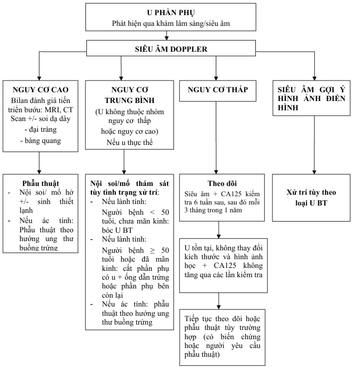

Phần phụ là thuật ngữ dùng để chỉ tất cả các cấu trúc nằm trong khoang giữa thành chậu và thân tử cung.

Phần phụ bao gồm: buồng trứng, vòi trứng, mạc treo vòi trứng, phần trên của dây chằng rộng và phần di tích của ống Muller.

U phần phụ hay gặp là u nang (chiếm 90%) ở độ tuổi sinh sản.

## Chẩn đoán

### Lâm sàng

Tiền sử bản thân và gia đình: ung thư vú, ung thư đại tràng, ung thư nội mạc tử cung hay ung thư buồng trứng đang điều trị.

Bệnh sử:

- Tình trạng kinh nguyệt: thống kinh, rong kinh, rong huyết.
- Thời điểm phát hiện u buồng trứng.
- Các triệu chứng liên quan: bụng to, nặng bụng.
- Các triệu chứng chèn ép: rối loạn tiêu hóa, tiết niệu.

Thăm khám mô tả đặc tính khối u.

Do tương quan về giải phẫu học, bệnh lý phần phụ cần phải được chẩn đoán phân biệt với nhiễm trùng đường niệu, sỏi thận-niệu quản, thận dị dạng và/hoặc lạc chỗ, viêm ruột thừa, viêm đại tràng, túi thừa đại tràng, ung thư đại-trực tràng và các khối u cùng-cụt.

### Cận lâm sàng

Siêu âm Doppler chỉ định sau khi đã phát hiện u buồng trứng bằng siêu âm đen trắng. Siêu âm mô tả chẩn đoán và nguy cơ ác tính theo khuyến cáo của Hiệp hội Siêu âm Sản phụ khoa Thế giới (ISUOG).

MRI chỉ định khi đánh giá tổn thường xâm lấn vào các cơ quan lân cận.

CT Scan chỉ định khi nghi ngờ ung thư có di căn xa hoặc chống chỉ định với MRI.

Dấu ấn sinh học (tumor markers) như CA125, AFP, CEA, beta-hCG, HE4, AMH…

Thuật toán ước tính nguy cơ ác tính ung thư buồng trứng (ROMA value, RMI).

_Theo dõi u phần phụ Bệnh viện Từ Dũ._

## Tiếp cận khối u phần phụ

Mọi vấn đề liên quan đến các khối ở phần phụ đều liên quan đến các câu hỏi chính sau:

- Khối ở phần phụ này có nguồn gốc từ cấu trúc nào của phần phụ?
- Nếu là của buồng trứng thì đây là cấu trúc cơ năng hay thực thể?
- Nếu là cấu trúc thực thể thì đây là cấu trúc tân lập hay không tân lập?
- Nếu là cấu trúc tân lập thì cấu trúc này là lành tính hay ác tính?

Khám lâm sàng toàn bộ vùng chậu là cần thiết trong đánh giá bệnh lý phần phụ.

Các kết quả thăm khám phải xét trong mối liên hệ với các hoạt động chức năng của buồng trứng. Cũng vì liên quan đến hoạt động chức năng của buồng trứng nên việc đánh giá kết quả thăm khám cũng phải xem xét tương quan với buồng trứng trong các giai đoạn của cuộc đời của người phụ nữ, tức trước dậy thì, dậy thì, trong độ tuổi sinh sản và mãn kinh, cũng như việc dùng các nội tiết có nguồn gốc ngoại lai.

Phải luôn cảnh giác trước khả năng có hay không có ác tính trước mọi cấu trúc tân lập ở buồng trứng.

Siêu âm là phương tiện đầu tay trong đánh giá khối u phần phụ.

## Nguồn tham khảo

- Trường Đại học Y Dược TP. HCM (2020) – _Team-based learning_
- Bệnh viện Từ Dũ (2022) – _Phác đồ điều trị Sản phụ khoa_
