Phân loại các khối u buồng trứng của Tổ chức Y tế Thế giới (2014) được dựa trên cơ sở mô và phôi học của các tân sinh gồm:

1. Các cấu trúc cơ năng của buồng trứng.
2. Các cấu trúc không tân lập tại phần phụ.
3. Các cấu trúc tân lập tại phần phụ.

## Các cấu trúc cơ năng của buồng trứng

Các nang cơ năng của buồng trứng hình thành do hoạt động chức năng của buồng trứng. Các cấu trúc cơ năng này gồm:

1. Nang noãn nang (follicle cyst).
2. Nang hoàng thể (corpus luteum cyst).
3. Nang hoàng tuyến.

### Nang noãn

Nang noãn nang hình thành khi nang noãn không vỡ trong quá trình trưởng thành nang, sự phóng noãn không xảy ra.

Các dấu hiệu có thể đi kèm gồm kéo dài giai đoạn phát triển nang noãn của chu kỳ kinh nguyệt, vô kinh thứ phát thoáng qua. Dịch trong nang giàu estrogen. Đa số các nang noãn nang tự biến mất trong vòng 6 tuần. Ức chế phóng thích gonadotropin bằng viên tránh thai chứa estrogen-progestogen phối hợp không làm mất hay làm giảm kích thước của nang noãn nang tuy nhiên sẽ làm giảm hình thành nang noãn mới.

Nếu khối u đã được chẩn đoán là nang noãn nang mà vẫn tồn tại dù đã trải qua các liệu pháp điều trị, thì chẩn đoán về 1 loại nang hay 1 cấu trúc khối tân lập khác nên được nghĩ đến và phải được đánh giá chuyên sâu hơn qua hình ảnh.

### Nang hoàng thể

Khi đường kính hoàng thể vượt quá 3cm nó được nhận dạng như là loại nang chứ không còn là hoàng thể đơn thuần. Có 2 loại được ghi nhận là nang hoàng thể tồn lưu và nang hoàng thể xuất huyết.

Nang hoàng thể tồn lưu là nang hoàng thể phì đại nhẹ, có thể vẫn tiếp tục sản xuất progesterone dài ngày hơn so với thông thường, kỳ kinh nguyệt bị trì hoàn từ vài ngày đến vài tuần, thông thường là trong vòng 2 tuần so với chu kỳ đã lỡ.

Nang hoàng thể xuất huyết là nang hoàng thể to nhanh do xuất huyết trong nang vào giai đoạn hoàng thể của chu kỳ kinh nguyệt, có thể diễn tiến tới vỡ muộn trong giai đoạn hoàng thể.

### Nang hoàng tuyến

Nang hoàng tuyến là loại nang hiếm gặp nhất và liên quan đến thai kỳ. Nang thường xuất hiện ở cả 2 bên, thường gặp ở bệnh nhân đa thai, bệnh lý tế bào nuôi hoặc được kích thích buồng trứng. Có nhiều nang phì đại cùng lúc tuy nhiên loại nang này thường tự thoái triển trong đa số trường hợp mà không cần bất cứ can thiệp y khoa nào.

## Các cấu trúc không tân lập tại phần phụ

Các cấu trúc không tân lập tại phần phụ làm phần phụ to lên và được nhận diện như 1 khối:

1. Cấu trúc hình thành do viêm.
2. Buồng trứng đa nang.
3. Nang lạc nội mạc tử cung (endometrioma).

### Cấu trúc do viêm

Mọi cấu trúc hình thành do viêm đều có thể tạo ra các khối ở phần phụ. Ứ máu, viêm mủ, viêm lao ống dẫn trứng hay buồng trứng và các cấu trúc của phần phụ là các nguyên nhân thường nhất.

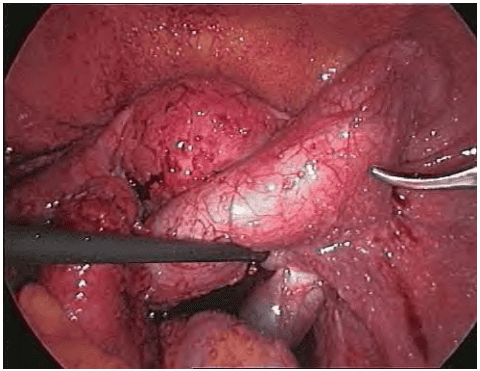

### Buồng trứng đa nang

Đa nang buồng trứng là hội chứng phổ biến, xuất hiện ở trên 20% phụ nừ tuổi sinh đẻ. Tình trạng mà trong đó các nang noãn không phát triển đến trưởng thành được, hình thành các cấu trúc nang thứ cấp muộn có kích thước nhỏ tại lớp vỏ buồng trứng. Các nang này không hoàn thành được tiến trình phát triển, tiết ra chủ yếu là androgen. Đa nang buồng trứng là nguyên nhân gây ra cường androgen, rối loạn kinh nguyệt với hình ảnh điển hình của buồng trứng với các nang nhỏ xếp thành chuỗi ở ngoại vi trên siêu âm. Cường androgen có thể rất nặng đến mức gây rậm lông (hirsutism).

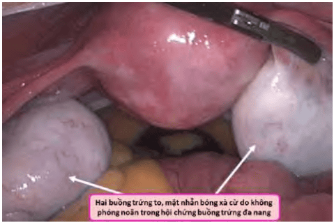

### Lạc tuyến nội mạc tử cung

Lạc tuyến nội mạc tử cung tại buồng trứng là cấu trúc không tân lập lành tính, gây đau vùng chậu và hiếm muộn.

Nang lạc nội mạc tử cung được hình thành do sự cấy ghép lên bề mặt buồng trứng của mô nội mạc tử cung bình thường có nguồn gốc từ máu kinh trào ngược. Khi có bất thường về khả năng đáp ứng miễn dịch (có thể do liên quan đến các đột biến gene), cấy ghép bất thường sẽ thành công dẫn đến hình thành các tuyến nội mạc tử cung lạc vị, vẫn còn hoạt động chức năng trên bề mặt buồng trứng. Xuất huyết kinh làm cho các nang bịt này lớn dần lên do chứa đầy máu “kinh” không có đường thoát, gây ra cấu trúc nang, với đặc trưng là viêm, với tân mạch và tàn phá cấu trúc vùng chậu.

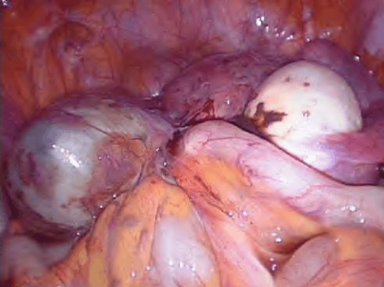
_Nang chứa dịch chocolate hình thành do ứ máu “kinh” trong bề mặt buồng trứng. Viêm là hiện tượng đi kèm rất phổ biến, gây dính vùng chậu, với hệ quả là hiếm muộn._

Khả năng ác tính của nang lạc nội mạc tử cung tại buồng trứng là rất thấp, nhưng không thể loại trừ. Chẩn đoán phân biệt quan trọng nhất của nang lạc nội mạc tử cung tại buồng trứng là [u tân sinh dạng nội mạc tử cung của buồng trứng](#u-dạng-nội-mạc-tử-cung-endometroid-tumour), là tân lập, với tế bào giống tế bào nội mạc, nhưng không có mô đệm tùy hành, có liên quan mạnh đến ác tính.

## Các cấu trúc tân lập tại phần phụ

Phân loại dựa trên nguồn gốc mô học và phôi học giúp hiểu rõ được tính đa dạng về hình thái, tiên lượng, cũng như hệ thống hóa các tân sinh của buồng trứng.

1. U xuất phát từ thượng mô (epithelial tumours).
2. U xuất phát từ tế bào mầm (germ cell tumours).
3. U xuất phát từ dây giới bào-mô đệm (sex cord-stromal tumours).
4. U xuất phát từ trung mô (mesenchymal tumours).
5. U tân sinh có nguồn gốc ở nơi khác di căn đến buồng trứng (secondary tumours).
6. Những tổn thương giống u (tumour-like lesions).

### U xuất phát từ thượng mô

Đây là tân sinh của các tế bào tại buồng trứng có nguồn gốc xa xôi là biểu mô nguyên thủy đi theo các tế bào sinh dục nguyên thủy. Các tế bào sẽ có dạng của 1 trong các dạng mà các tế bào biểu mô lát lòng ống Muller có thể chuyển dạng được:

1. Biểu mô trụ thấp có lông chuyển: U tuyến thanh dịch.
2. Biểu mô trụ tiết nhầy: U tuyến dịch nhầy.
3. Biểu mô trụ tuyến nội mạc: U dạng nội mạc tử cung.
4. Biểu mô dạng ống: U tế bào sáng.
5. Biểu mô kiểu chuyển tiếp: U Brenner.
6. U tế bào ống Muller hỗn hợp ác tính.

Đây là các tân sinh thường gặp nhất của cấu trúc tân lập buồng trứng, chiếm 50-60% các khối u buồng trứng. Đáng ngại nhất là các tân lập này chiếm đến 85% các ung thư buồng trứng.

#### U tuyến thanh dịch (serous cystadenoma)

Lòng u được lát bởi các tế bào trụ thấp, giống như tế bào của biểu mô lát lòng vòi trứng. Có thể là lành tính, giáp biên ác và ác tính.

Thường xảy ra trong độ tuổi sinh đẻ. Chiếm 30% các u buồng trứng. 70% là lành tính. U trơn láng, vỏ mỏng, đơn thùy hoặc đa thùy, bên trong chứa dịch trong. 15% các trường hợp thấy u ở cả 2 bên.

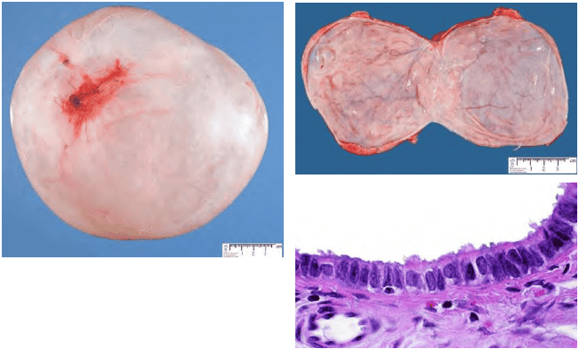
_Đại thể: khối u có thể to, mặt nhẵn. Trên bề mặt lòng nang không thấy các chồi nhú. Vi thể: thành nang lót bởi tế bào trụ thấp giống tế bào vòi Fallope._

U giáp biên không phải là u lành vì đặc tính tái phát. U giáp biên không phải là u ác vì không xâm lấn và không di căn. Đặc điểm tế bào có các đặc điểm của ác tính. U tuyến thanh dịch giáp biên chiếm khoảng 10% các u tuyến thanh dịch. Tuổi trung bình của u thanh dịch giáp biên ác là 40. 30% các u thanh dịch giáp biên ác là 2 bên. U có thể đạt đến kích thước to đến 25cm. Về mặt vi thể, các cấu trúc u nhú được tạo bởi các lớp tế bào thượng mô xếp tầng với nhân không điển hình ở những mức độ khác nhau, có sự tăng phân bào nhưng không có xâm lấn.

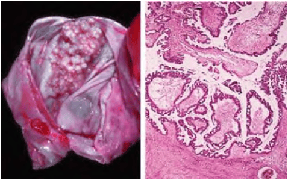
_Đại thể: ghi nhận các chồi nhú ở mặt trong u. Vi thể: ghi nhận tế bào tăng sinh, với nhân bất thường, tạo các nhú._

U tuyến thanh dịch ác tính chiếm khoảng 20% các u tuyến thanh dịch.

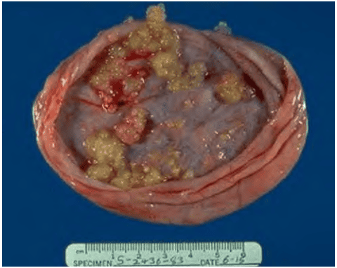
_Đại thể: ghi nhận các chồi nhú ở mặt trong u._

#### U tuyến dịch nhầy (mucinous cystadenoma)

Lòng u được lát bởi các tế bào trụ cao tiết nhầy, giống như tế bào của biểu mô lát kênh cổ tử cung. Có thể lành tính, ác tính và giáp biên ác.

Chiếm 60% các trường hợp u buồng trứng. U tuyến dịch nhầy thường khá lớn, đôi khi lấp đầy khoang chậu và chèn ép vào khoang bụng. Thường có nhiều vách và phân thùy. 15% các u tuyến dịch nhầy là ác tính. U tuyến dịch nhầy giáp biên ác có thể thể hiện dưới dạng thức đặc biệt, được gọi không chính xác là viêm phúc mạc giả nhầy (pseudomyxoma peritonei).

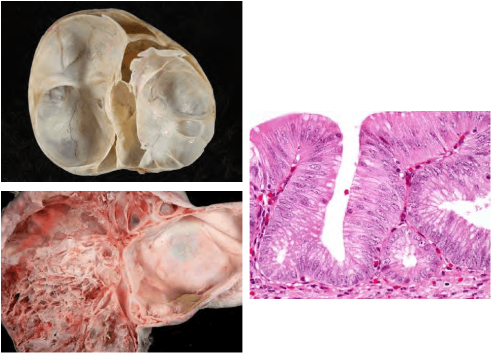
_Đại thể: là khối rất to, nhiều thùy, bên trong chứa chất nhầy. Vi thể: thành nang lót bởi tế bào trụ tiết nhầy giống tế bào kênh tử cung._

#### U dạng nội mạc tử cung (endometroid tumour)

Lòng u được lát bởi các tế bào giống như tế bào của tuyến nội mạc tử cung. Không giống như trường hợp của nang lạc nội mạc tử cung (nang thực thể không tân lập, gồm vỏ là nội mạc tử cung và mô đệm tùy hành), nang dạng nội mạc tử cung là tân lập, chỉ gồm tế bào tương tự tế bào nội mạc tử cung, hoàn toàn không kèm theo mô đệm tùy hành.

Hầu hết u dạng nội mạc tử cung là ác tính. Những u này có hình ảnh mô học tương tự với ung thư nội mạc tử cung thường đi kèm với ung thư nội mạc tử cung, và trong 15% trường hợp có kèm theo lạc nội mạc tử cung. Vì thế, chẩn đoán phân biệt giữa u dạng nội mạc tử cung với [nang lạc tuyến nội mạc tử cung ở buồng trứng](#lạc-tuyến-nội-mạc-tử-cung) là rất quan trọng và rất khó khăn.

#### U tế bào sáng (clear cell tumour)

Hầu hết các u tế bào sáng là ác tính. Có sự liên quan chặt chẽ giữa u tế bào sáng và lạc tuyến nội mạc tử cung vùng chậu. Lạc tuyến nội mạc tử cung ở vùng chậu bị nghi ngờ là tiền tố của ung thư tế bào sáng. U này cũng có liên quan đến đột biến gene. Tuy nhiên, u không liên quan đến đột biến BRCA. Các gene có liên quan là PIK3CA và PTEN. Ung thư tế bào sáng cũng có liên quan với hội chứng Lynch.

#### U Brenner (Brenner tumour)

Khối u này có dạng đặc vì chứa nhiều mô đệm và mô xơ bao quanh lớp tế bào biểu mô. U Brenner hiếm khi ác tính. Đây là dạng tân sinh biểu mô lành tính hiếm gặp của buồng trứng. U Brenner thường gặp hơn ở phụ nữ lớn tuổi và có thể có mối liên quan với u dịch nhầy tại buồng trứng. U Brenner đơn độc phát hiện được thường tương đối nhỏ, so với những khối u dịch trong và đặc biệt là u nhầy.

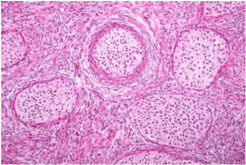
_Vi thể: Ghi nhận tỷ lệ cao mô đệm. Đây là u có dạng đặc._

### U xuất phát từ tế bào mầm

Là khối u có nguồn gốc là các tế bào nguồn dòng sinh dục. Đây là các tế bào đã trải qua 1 phần của phân bào I giảm nhiễm, và đang có bộ nhiễm sắc thể 2n kép (4n). Trong loại u này, các tế bào đã trải qua 1 phần của phân bào giảm nhiễm trong thời kỳ bào thai, nay trở thành khối u theo 2 cách khác nhau:

1. Thoái giáng trực tiếp từ 2n kép thành 2n, không thông qua phân bào I giảm nhiễm. Đây là các khối u nghịch mầm, với khả năng ác tính rất cao.
2. Đi qua phân bào I giảm nhiễm, tạo ra các tế bào n kép. Các tế bào n kép mới thoái giáng thành khối u. Đây là các khối u nghịch phôi, với tiềm năng ác tính thay đổi, nhưng trong đa số các trường hợp là lành tính.

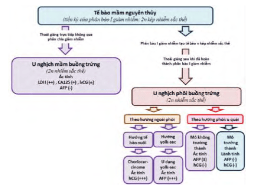

#### U nghịch phôi của buồng trứng phát triển theo hướng cấu trúc phôi

Các u nghịch phôi là các u được tạo thành từ các tế bào dòng sinh dục đã trải qua phân bào I giảm nhiễm, nhưng sau đó lại thoái giáng trực tiếp từ n kép thành 2n mà không qua phân bào II giảm nhiễm và thụ tinh.

Do được hình thành sau phân bào giảm nhiễm, với thoái giáng trực tiếp từ n kép sang 2n không qua phân bào II và thụ tinh, nên u có dạng phôi không hoàn chỉnh, với tất cả các thành phần của 3 lá phôi. Do đã hoàn thành 1 lần phân bào giảm nhiễm, nên tiềm năng ác tính là rất thấp, trong đa số trường hợp.

U quái trưởng thành (teratoma) lành tính là dạng thường thấy nhất (95%) của các u nghịch phôi lành tính của buồng trứng. U quái trưởng thành có thể là đơn mô hay đa mô.

U quái đa mô có tỷ lệ ác tính rất thấp, có thể có tân sinh ác tính xuất hiện thứ phát từ u quái dạng bọc trưởng thành. U quái trưởng thành lành tính là khối u buồng trứng thường gặp nhất, từ 10-30 tuổi. U có bề mặt trơn láng, tổn thương chứa mô ngoại bì, trung bì hoặc nội bì đã trưởng thành (răng, da, tóc, nang, tuyến mồ hôi và tuyến bã). Nang được lót bởi thượng bì và cấu trúc phụ của nó, nên còn gọi là u bọc bì. Về vi thể, các mô đều trưởng thành.

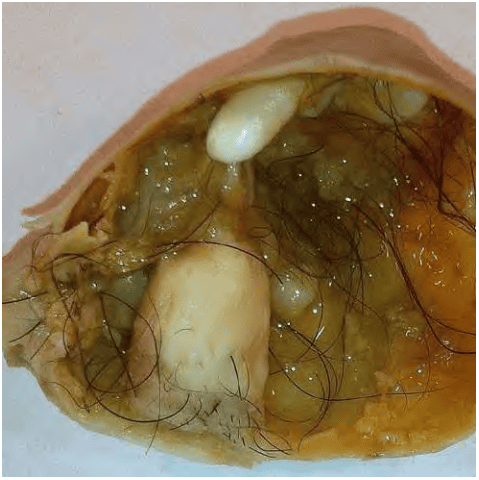

Các u quái không trưởng thành luôn luôn ác tính. Đây là nhóm u tế bào mầm thường gặp thứ 3 (15%). Độ tuổi trung bình là 19. Về đại thể, u có đường kính trung bình 18cm, bề mặt trơn láng, mặt cắt chủ yếu là phần đặc và cấu trúc nang. Về vi thể, cấu trúc của khối u bao gồm gồm những mô tương tự mô phôi, ở nhiều mức độ biệt hóa tế bào khác nhau ở cả 3 lá mầm, thường thấy mô thần kinh chưa trưởng thành.

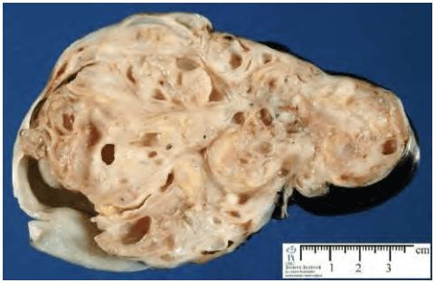
_Không thấy các cấu trúc trưởng thành. Các mô của các lá phôi chỉ thấy trên vi thể với mức biệt hóa khác nhau._

U quái giáp đơn mô có tiềm năng ác tính cao. Đôi khi cường giáp không có bướu giáp là triệu chứng lâm sàng duy nhất của các u này. Cường giáp “không giải thích được” với xạ hình giáp bình thường và tập trung Iod phóng xạ bất thường ở vùng chậu là các dấu hiệu chỉ điểm.

#### U nghịch phôi của buồng trứng phát triển theo chiều hướng cấu trúc ngoài phôi

Nếu tế bào sau phân bào I giảm nhiễm bị thoái giáng nhưng không biệt hóa theo hướng các cấu trúc phôi, mà lại biệt hóa theo hướng các cấu trúc ngoài phôi kiểu lá nuôi hoặc kiểu túi noãn hoàng (yolk-sac), ta sẽ các khối u nghịch phôi với thành phần là các cấu trúc ngoài phôi. Phần lớn các u nghịch phôi theo hướng cấu trúc ngoài phôi là các u ác tính. Thường thấy là choriocarcinoma không thai kỳ và u túi noãn hoàng.

U yolk-sac là loại u tế bào mầm có tỷ lệ tử vong cao nhất. Là 1 trong các u nghịch phôi phát triển theo chiều hướng ngoài phôi, u yolk-sac chiếm 20% u tế bào mầm (thường gặp thứ 2) và có tiềm năng ác tính cao nhất trong tất cả u tế bào mầm. U có độ tuổi chẩn đoán trung bình là 19. U thường 1 bên.

Choriocarcinoma không thai kỳ là u tế bào mầm hiếm gặp, không liên quan đến thai kỳ. Các tế bào nuôi ở đây có nguồn gốc từ thoái giáng theo chiều hướng ngoài phôi của các tế bào mầm đã qua phân bào I giảm nhiễm. Trong choriocarcinoma không thai kỳ vẫn có tăng hCG, nhưng tăng ít. hCG tăng dẫn đến hệ quả kích thích buồng trứng, gây nên các động nội tiết của buồng trứng và từ đó gây dậy thì sớm, chảy máu tử cung hoặc vô kinh. Vi thể u gồm nguyên bào nuôi, nguyên bào nuôi trung gian và hợp bào nuôi. Độ ác tính thường cao.

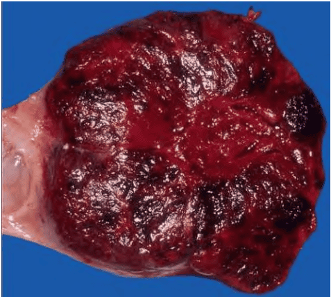

#### Các u nghịch mầm của buồng trứng (dysgerminoma)

Các u nghịch mầm là các u được tạo thành từ các tế bào dòng sinh dục chưa hoàn thành phân bào I giảm nhiễm, mà đã thoái giáng trực tiếp từ n kép thành 2n. Tuổi trung bình là 22. 50% u nghịch mầm được phát hiện tình cờ trong thai kỳ. Khoảng 20% trường hợp u ở 2 bên. Chỉ báo khối u dùng cho u nghịch mầm là lactic dehydrogenase huyết tương (LDH). LDH thường được dùng cho theo dõi tái phát của u nghịch mầm.

U nghịch mầm của buồng trứng là các khối u ác tính, chiếm 45% các khối u tế bào mầm ác tính. 2/3 trường hợp các u nghịch mầm được chẩn đoán ở giai đoạn I. Tuy ác tính nhưng u nghịch mầm có tiên lượng tốt.

Vấn đề lớn nhất của u nghịch mầm là phần lớn các bệnh nhân đều còn cần phải bảo tồn khả năng sinh sản. U nghịch mầm đáp ứng rất tốt với xạ trị bổ túc. Tuy nhiên, do ảnh hưởng trên trữ lượng noãn nang, nên xạ trị chỉ có thể thực hiện trong trường hợp bệnh nhân đã đủ con, không còn có ý định sinh thêm. U nghịch mầm cũng đáp ứng khả quan với hóa trị bổ túc. Hóa trị là biện pháp được chọn cho các bệnh nhân còn muốn sinh thêm.

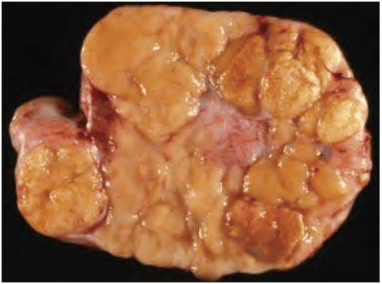
_U đặc, với mặt cắt màu vàng trắng, có thùy, không đồng nhất. Thường không kèm xuất huyết hay hoại tử._

### U xuất phát từ dây giới bào-mô đệm

U xuất phát từ mô đệm hay từ dây giới bào, xuất hiện đơn thuần hay kết hợp.

#### U mô đệm đơn thuần: u sợi và hội chứng Meigs (fibroma)

Hội chứng Meigs gồm tam chứng (1) u sợi buồng trứng, (2) báng bụng và (3) tràn dịch màng phổi. U sợi buồng trứng trong hội chứng Meigs là khối u lành tính 1 bên. Là hội chứng hiếm và khá đặc biệt, trong đó bệnh nhân đến khám không phải vì khối u buồng trứng mà là vì tình trạng nội khoa khác là báng bụng và tràn dịch màng phổi. Bệnh học của hội chứng được giải thích bằng các yếu tố tăng trưởng nội mạc mạc máu (VEGF) làm tăng tính thấm mao mạch. Bệnh thoái lui sau khi cắt bỏ khối u buồng trứng.

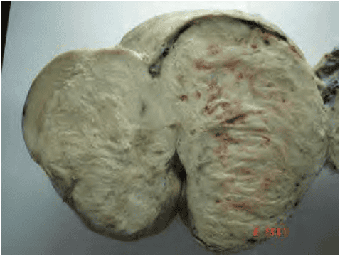

#### U mô đệm đơn thuần: u tế bào vỏ (Thecoma)

Hầu hết các u tế bào vỏ là lành tính. Hầu hết các khối u tế bào vỏ xuất hiện ở tuổi mãn kinh. U tế bào vỏ chế tiết estrogen. Rất hiếm khi u tế bào vỏ chế tiết androgen. Trên đại thể, u là u đặc. Tổn thương dạng sợi, màu vàng điển hình do hormones steroid. Do chế tiết steroid, nên xuất huyết tử cung do cường estrogen và tăng sinh nội mạc tử cung là các biểu hiện thường gặp.

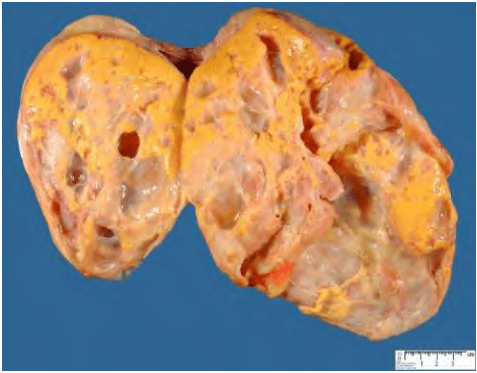

U xuất phát từ dây giới bào-mô đệm thường là các u xuất phát từ dây giới bào. Các u này chiếm 5-8% các tân lập ở buồng trứng, và chiếm 2% các u ác tính ở buồng trứng.

#### U dây giới bào đơn thuần

U xuất phát từ dây giới bào thường là các u chế tiết steroid. U phát triển biệt hóa theo hướng nữ chế tiết estrogen. U phát triển theo hướng nam chế tiết androgen.

#### U tế bào hạt (granulosa cell tumour)

U tế bào hạt là loại u có mức ác tính thấp. U có đặc trưng vi thể của tế bào hạt và chế tiết estrogen.

U thường xảy ra ở 1 bên, kích thước trung bình 15cm. U có dạng nang, mật độ mềm hoặc chắc. Nhìn mặt cắt của khối u giống với u tuyến nhầy, nhưng chứa đầy dịch máu. U có đặc trưng vi thể của tế bào hạt. Mô bệnh học của u này được đặc trưng bởi thể Call-Exner. U có mức ác tính thấp, 80-90% bệnh nhân được chẩn đoán ở giai đoạn I. 95% type mô học trưởng thành, xảy ra vào những năm đầu sau mãn kinh (adult granulosa tumour). 5% type mô học trẻ xảy ra giữa dậy thì và những năm đầu thời kì sinh sản (juvenile granulosa tumour).

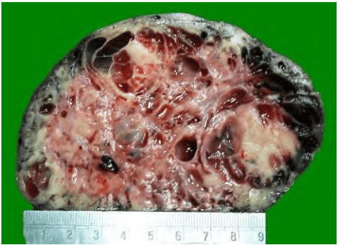
_U có mặt cắt nhìn giống như u dịch nhầy, với xuất huyết._

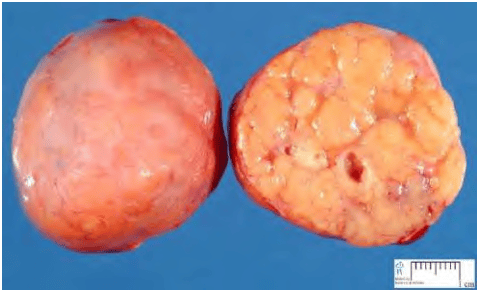
_Tiềm năng ác tính rất thấp, thường khu trú ở 1 buồng trứng và tiên lượng tốt._

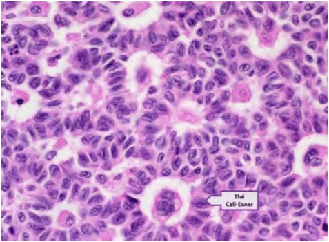
_Vi thể đặc trưng bởi các thể “Call-Exner”._

Các dấu hiệu lâm sàng là các dấu hiệu của hiện diện bất thường estrogen. Các triệu chứng liên quan với cường estrogen với khối u ở bụng, tăng sinh nội mạc tử cung, xuất huyết bất thường. Dậy thì sớm, rong huyết đôi khi xuất hiện đơn độc, như chỉ báo khối u. Đau do vỡ u không thường gặp.

#### U tế bào Sertoli (Sertoli cell tumour)

U tế bào Sertoli là tân sinh xuất phát từ dây giới bào biệt hóa theo hướng nam. Là u hiếm, với ác tính thấp. U thường xảy ra ở người dưới 30 tuổi, và chế tiết trong hơn 95% trường hợp. U Sertoli đơn thuần thường có xu hướng chế tiết estrogen. U gây nam hóa, và vì thế dễ được phát hiện sớm ở giai đoạn I.

#### U hỗn hợp mô đệm và dây giới bào: u tế bào SertoliLeydig (Sertoli-Leydig cell tumour) hay (androblastoma)

U tế bào Sertoli-Leydig là u hiếm. Do chế tiết androgen nên u này còn có tên gọi là Androsblastoma. Nhìn chung, là u với ác tính thấp, nhưng còn lệ thuộc vào độ biệt hóa tế bào. Loại u này chế tiết androgen. 40-60% bệnh nhân có biểu hiện rậm lông, vú teo, phì đại âm vật. U cũng gây dậy thì sớm, gây rong huyết ở trẻ gái mắc bệnh. Với u Sertoli-Leydig, các khảo sát như testosterone, androstenedione, và tiền chất 17-hydroxy progesterone có thể có giá trị.

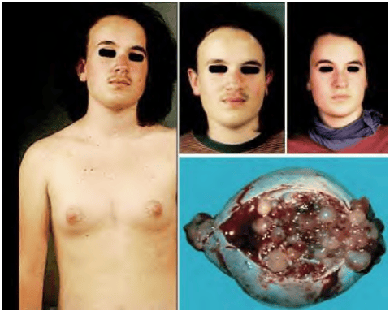
_Bé gái, 14 tuổi, khám vì mọc ria mép và lông ngực. Bé đã được phẫu thuật cắt u buồng trứng loại tế bào Sertoli-Leydig. Hình trái và hình giữa là ảnh chụp trước mổ của bé. Hình trên cùng bên phải là ảnh chụp 6 tháng sau khi mổ cắt buồng trứng có u._

### U tân sinh di căn đến buồng trứng

Ung thư đại tràng, ung thư dạ dày các là ung thư được nhắc đến nhiều nhất về khả năng cho di căn buồng trứng, dưới tên gọi u Krukenberg. Khi phẫu thuật u buồng trứng có dạng u Krukenberg, buộc phải đi tìm khối u nguyên phát, đôi khi nằm ở tầng trên mạc treo đại tràng ngang, thậm chí nằm ngoài ổ bụng. Mô học của u Krukenberg có các tế bào hình nhẫn rất đặc
trưng.

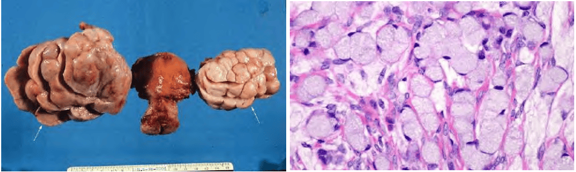
_Đại thể: u đặc, có thể 1 hay 2 bên. Vi thể: Các tế bào hình nhẫn (signet ring cell) kinh điển trong u Krukenberg di căn từ dạ dày._

### Biểu hiện lâm sàng các khối u tân lập

Các biểu hiện trên lâm sàng của khối u buồng trứng mang 2 đặc điểm:

1. Triệu chứng học đa dạng.
2. Phát hiện khi đã tiến triển xa.

Triệu chứng của các khối u buồng trứng rất đa dạng. Tuy nhiên, các triệu chứng này lại ít có liên quan đến các hoạt động của buồng trứng. Các khối u tân lập buồng trứng không gây rối loạn nội tiết hay thay đổi chu kỳ kinh.

Rối loạn kinh nguyệt chỉ thấy trong các u chế tiết steroid (u tế bào vỏ, u tế bào hạt) hay trong các cấu trúc cơ năng hậu quả của rối loạn cơ chế điều hòa chu kỳ buồng trứng.

Phần lớn các khối u buồng trứng được phát hiện tình cờ khi kiểm tra sức khỏe, siêu âm bụng tổng quát hay phát hiện khối vùng chậu qua khám bụng và phụ khoa. Các khối tân lập của buồng trứng đều tiến triển âm thầm không triệu chứng. Do không có triệu chứng nên các ung thư của buồng trứng thường được phát hiện rất muộn, khi đã tiến triển xa. Bệnh nhân đến trong bệnh cảnh của các bệnh lý thực thể khác do khối u di căn hay chèn ép các cấu trúc lân cận, hay đến do báng bụng, là hình ảnh của di căn phúc mạc của ung thư buồng trứng. 1 vài triệu chứng có thể mang tính chất gợi ý, nhưng không mang tính xác định như:

- U rất lớn hay có xu hướng giáp biên ác, grade thấp.
- U nhầy có thể có kích thước rất lớn.
- U ác tính thường có các vùng hoại tử và xuất huyết.
- Báng bụng thường là dấu chỉ của các bệnh lý ác tính.

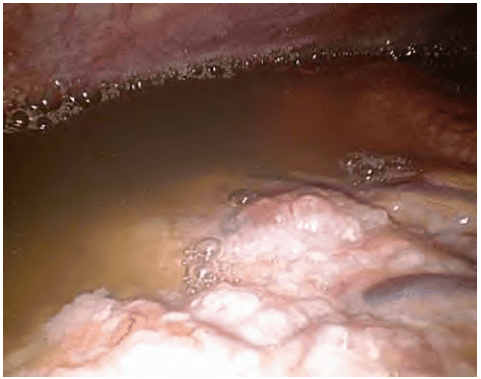

### Biến chứng của khối u buồng trứng

#### Bản chất của hiện tượng hóa ác

Khối u buồng trứng không thoái hóa ác tính. Chỉ có các khối u buồng trứng có bản chất ác tính nhưng bị bỏ sót, không được nhận ra. Đặc điểm bệnh học của các ung thư buồng trứng là rất khó nhận biết lành-ác. Vấn đề khó khăn là khối u tiến triển âm thầm làm cho chẩn đoán khó khăn hoặc dễ bỏ sót chẩn đoán. Phân định lành-ác của tân lập ở buồng trứng là rất khó khăn khi dựa trên lâm sàng, hình ảnh học. Khó khăn trong phân định lành-ác cũng cũng gặp cả trên giải phẫu bệnh. Đôi khi, trên cả khối u, chỉ có vài vùng mang các đặc điểm bệnh học điển hình của ác tính. Bỏ sót thương tổn làm cho nhận định sai về tình trạng ác tính sẵn có của khối u.

#### Xoắn khối u buồng trứng

Các khối u buồng trứng di động, có tỷ trọng lớn có nhiều khả năng bị xoắn.

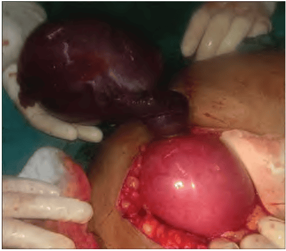
_Ảnh chụp u buồng trứng bị xoắn ở thai phụ có thai ở tam cá nguyệt thứ nhì. Khi tử cung to lên, khối u sẽ lọt ra khỏi vùng chậu. Lúc này, với tỷ trọng lớn và khoảng không gian rộng, các khối u buồng trứng sẽ rất dễ bị xoắn. Trường hợp này u buồng trứng xoắn bị mổ muộn, với buồng trứng hoại tử tím đen._

Buồng trứng là cơ quan tự do trong xoang phúc mạc, chỉ được cố định bằng mạc treo buồng trứng, dây chằng thắt lưng buồng trứng, dây chằng tử cung buồng trứng. Cả 3 cấu trúc này rất lỏng lẻo, làm cho buồng trứng là cơ quan rất dễ thay đổi vị trí.

Xoắn khối u buồng trứng thường có khởi phát bằng đau đột ngột và dữ dội vùng bụng, có thể có sốc do đau. Thăm khám thấy khối cạnh tử cung rất đau. Phúc mạc bị kích thích gây nôn ói. Tuy nhiên bụng vẫn mềm nếu khối u không bị vỡ.

Điều trị ngoại khoa là bắt buộc. Việc chẩn đoán và can thiệp phải được tiến hành càng sớm càng tốt, nhằm mục đích bảo tồn buồng trứng. Nếu tưới máu được hồi phục tốt thì phẫu thuật được tiếp theo bằng bóc khối u như trong các điều kiện thông thường. Phẫu thuật bảo tồn có thể được thực hiện qua nội soi ổ bụng hay mở bụng hở. Nếu không có đủ bằng chứng đảm bảo khả năng lành tính của khối u, phẫu thuật được thực hiện bằng cách mở bụng cắt bỏ trọn phần phụ bị xoắn.

#### Biến chứng khác

Biến chứng khác hiếm gặp trong u buồng trứng, gồm xuất huyết trong nang, vỡ khối u, chèn ép và nhiễm trùng.

## Nguồn tham khảo

- Trường Đại học Y Dược Thành phố Hồ Chí Minh (2020) - TEAM-BASED LEARNING.
