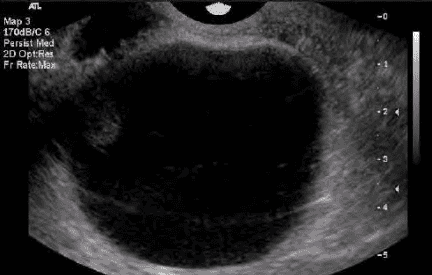
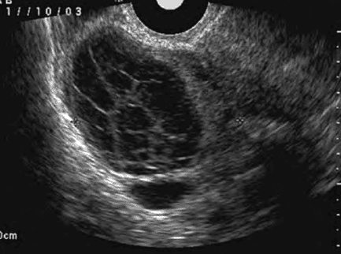
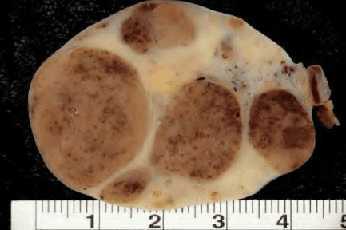

Các cấu trúc cơ năng của buồng trứng là các cấu trúc của buồng trứng, hình thành do các hoạt động chức năng của buồng trứng.

1 chu kỳ buồng trứng gọi là bình thường khi:

- Có 1 đoàn hệ noãn được chiêu mộ, đi vào phát triển.
- Có 1 nang noãn được chọn lọc và đi đến trưởng thành, nang noãn này phải sản xuất được lượng đủ cao estradiol.
- Trục hạ đồi-yên phải hoạt động bình thường để đảm bảo các feed-back của steroid sinh dục trên hạ đồi tuyến yên, gây phóng noãn, thành lập hoàng thể và ly giải sinh lý của hoàng thể.
- Hoặc có sự chuyển đổi từ hoàng thể chu kỳ sang hoàng thể thai kỳ dưới sự có mặt của hCG.

Dưới ảnh hưởng của yếu tố bất thường nào đó (stress, dùng thuốc…) hoạt động chức năng không xảy ra bình thường được, và dẫn đến 1 số lệch lạc, hình thành các cấu trúc chức năng của buồng trứng, biểu hiện:

- Khối ở buồng trứng.
- Các triệu chứng liên quan chu kỳ buồng trứng hay thai kỳ.

Các cấu trúc cơ năng của buồng trứng sẽ tự thoái lui khi không còn có sự hiện diện, hay không còn chịu tác động của yếu tố tác động đến đến hình thành cấu trúc này. Gồm có:

1. Nang noãn nang (follicle cyst).
2. Nang hoàng thể (corpus luteum cyst).
3. Nang hoàng tuyến thai kỳ (pregnancy luteoma).

## Nang noãn nang

Nang noãn nang là nang noãn, nhưng nang noãn này không đi đến được trưởng thành cuối cùng của noãn nang và không đi đến được hiện tượng phóng noãn.

Bất thường nang noãn nang do nang tiếp tục lớn lên với hoạt động sản xuất steroid bất thường.

Nguyên nhân của không phóng noãn dẫn đến hình thành nang noãn nang là mọi nguyên nhân làm triệt tiêu các phản hồi của steroid trên trục hạ đồi-yên hay làm cho phản hồi này không hiệu quả. Dậy thì, quanh mãn kinh là các thời điểm sinh lý thường quan sát thấy nang noãn nang, do hoạt động bất ổn của trục trong khoảng thời gian này. Steroid ngoại sinh hay stress là các nguyên nhân thường thấy của hình thành nang noãn nang.

Thành của nang noãn nang được lót bởi nhiều lớp tế bào hạt. Bên ngoài của tế bào hạt là các tế bào vỏ. Bên trong lòng nang là dịch nang, chứa estrogen. Đôi khi, các tế bào tróc ra, và chỉ còn trơ lại các tế bào vỏ. Do không bị vỡ, các nang noãn nang tiếp tục lớn lên trong thời gian dài sau đó, có thể đạt đến kích thước 5-8cm, và tồn tại trong nhi u chu kỳ kinh.

Không phóng noãn kèm chế tiết steroid bất thường dẫn đến bất thường của kinh nguyệt trong lần hành kinh kế tiếp. Chu kỳ không phóng noãn, bất thường chu kỳ kinh và hình thành cấu trúc nang tại buồng trứng là các đặc điểm của nang noãn nang.

1 nang noãn nang trở nên có ý nghĩa về lâm sàng nếu nang này đủ lớn để gây đau hoặc tồn tại kéo dài quá chu kỳ kinh. Đau bụng dưới, lệch 1 bên, mức độ nhẹ đến trung bình. Đau thường kèm rối loạn kinh nguyệt do hậu quả của tình trạng vắng mặt progesterone do phóng noãn. Nội mạc tử cung chịu ảnh hưởng đơn độc của estrogen sẽ không bị phân tiết, và sụp đổ không hoàn toàn. Thăm khám vùng chậu có thể phát hiện khối ở phần phụ dạng nang, di động.

Đôi khi nang noãn có thể vỡ gây đau bụng cấp. Tuy nhiên, do phóng thích dịch nang vào khoang màng bụng chỉ gây ra triệu chứng thoáng qua nên can thiệp phẫu thuật hiếm khi thực sự cần thiết. Trong trường hợp này, có thể dùng các loại thuốc giảm đau thông thường, nhằm mục đích xoa dịu triệu chứng bệnh trong thời gian ngắn.

Đa số các u nang noãn tự biến mất trong vòng 6 tuần, mà không cần bất cứ can thiệp điều trị nào. Không có can thiệp nào có thể làm mất nang noãn nang.

Trong trường hợp nang noãn nang, có thể chỉ định thuốc tránh thai estrogen-progestogen phối hợp (COC). COC không làm nang noãn nang biến mất. Mục tiêu của việc dùng COC là ngăn không cho các nang noãn thuộc 1 đoàn hệ noãn mới phát triển, nhằm tránh hình thành nang noãn nang mới, trong khi chờ đợi nang noãn nang cũ thoái triển.

_Nang đơn, 5-8cm, thành mỏng, không chồi, không vách. Nang noãn nang thường tự mất sau vài chu kỳ._

Nếu nang đã được chẩn đoán là nang noãn nang mà vẫn tồn tại qua nhiều chu kỳ, thì việc nghĩ đến loại nang hay tân sinh và phải được đánh giá chuyên sâu hơn qua hình ảnh hoặc các thăm dò khác.

## Nang hoàng thể

Hoàng thể là cấu trúc chức năng, được thành lập sau phóng noãn, do sự biến đổi của các tế bào vỏ-hạt thành tế bào hoàng thể dưới tác dụng của luteinizing hormone.

Hoàng thể có nhiệm vụ chế tiết estrogen và progesterone, chuẩn bị cho làm tổ của trứng đã thụ tinh và duy trì thai kỳ. Progesterone của hoàng thể gây phản hồi âm trên hạ đồi, làm giảm nhịp độ chế tiết xung GnRH, dẫn đến giảm nhịp điệu các xung LH, với hệ quả là ly giai tự nhiên của hoàng thể.

Bất thường của hoàng thể có thể từ:

- Progesterone không ức chế được nhịp điệu của LH, gây ly giải hoàng thể bất toàn, hay tồn tại kéo dài hoàng thể. Tình trạng hoàng thể tồn tại kéo dài với hoạt năng không ổn định gây ra hội chứng hoàng thể tồn lưu.
- Sự kích thích quá đáng hoàng thể do các chất có hoạt tính LH (LH activities) như hCG của nguyên bào nuôi có thể làm hoàng thể gia tăng kích thước, trở thành nang hoàng thể hay nang hoàng tuyến.

### Hội chứng hoàng thể tồn lưu

Hội chứng hoàng thể tồn lưu (Halban disease), hoàng thể phì đại nhẹ, tiếp tục sản xuất progesterone dài ngày hơn so với thông thường. Tuy nhiên, sản xuất progesterone từ hoàng thể tồn lưu không ổn định, do kích thích LH không đầy đủ. Sản xuất progesterone kéo dài gây trễ kinh, hoàng thể phì đại gây đau bụng âm ỉ ở dưới bụng cùng bên, nồng độ biến động và không đủ cao của progesterone gây rong huyết, thăm khám vùng chậu thấy có khối ở phần phụ, mật độ mềm, có dạng nang hoặc đặc. Như vậy, triệu chứng lâm sàng của hội chứng hoàng thể tồn lưu là trễ kinh, đau bụng, ra huyết âm đạo bất thường và khối cạnh tử cung, rất giống như thai ngoài tử cung. Khác biệt duy nhất giữa hội chứng Halban và thai ngoài tử cung là kết quả định lượng hCG âm tính trong hội chứng hoàng thể tồn lưu.

Nguyên nhân của hội chứng hoàng thể tồn lưu là bất thường của feed-back âm của progesterone trên hạ đồi. Nguyên nhân gây bất thường của feed-back có thể là ngắn hạn nhưng cũng có thể là tồn tại kéo dài và gây ra tình trạng lặp lại của tồn tạ kéo dài hoàng thể qua nhiều chu kỳ. COC có thể là giải pháp tạm thời, giúp trục hạ đồi-yên được tạm nghỉ trong thời gian để có thể hồi phục.

### Hoàng thể xuất huyết

Ở thời điểm thành lập hoàng thể, nang noãn vỡ ra, sau đó là các mạch máu từ phía ngoài sẽ xâm nhập lòng nang và hoàng thể hóa các tế bào vỏ hạt. Hiện tượng xuất huyết bên trong lòng hoàng thể là phổ biến. Thông thường, xuất huyết trong nang sẽ tự cầm. Trong 1 vài trường hợp, xuất huyết hoàng thể không tự giới hạn, làm hoàng thể to nhanh. Kích thước hoàng thể to hơn 3cm, với xuất huyết trong lòng.

Nếu chảy máu vẫn không tự cầm, hoàng thể có thể bị vỡ và gây ra xuất huyết nội do vỡ nang hoàng thể. Nếu chảy máu tự cầm, nhưng hoàng thể chứa máu bị căng, sẽ có khối ở phần phụ gây đau.

_Hoàng thể to ra do bị xuất huyết trong lòng nang, tạo phản âm dạng lưới điển hình._

Bệnh nhân điển hình là người không đang thực hiện tránh thai bằng estrogen-progestogen phối hợp đường uống, có chu kỳ kinh đều, đến khám vì triệu chứng đau cấp tính vùng bụng dưới khi đang ở trong giai đoạn trễ của pha hoàng thể. Số rất nhỏ bệnh nhân biểu hiện bằng triệu chứng của chảy máu trong ổ bụng, đôi khi cần được phẫu thuật để cầm máu. Với những bệnh nhân còn lại, cơn đau cấp tính và sự mất máu tự giới hạn. Các bệnh nhân này có thể được xử trí với thuốc giảm đau nhẹ và trấn an tinh thần bệnh nhân. Nhóm bệnh nhân có nang hoàng thể xuất huyết tái phát hoặc có nguy cơ tái phát bao gồm những bệnh nhân đang sử dụng thuốc chống đông máu và hoặc đang mắc chứng rối loạn đông máu.

## Nang hoàng tuyến

Điểm khác biệt quan trọng nhất giữa nang hoàng tuyến và nang hoàng thể là nang hoàng tuyến hình thành do toàn bộ các cấu trúc noãn nang (kể các noãn nang còn nhỏ, chưa phóng noãn) bị kích thích bởi hCG. Thông thường, chỉ có các nồng độ hCG cực cao mới gây nang hoàng tuyến.

Bệnh cảnh thường thấy nhất là nang hoàng tuyến trong thai trứng hay trong thai kỳ với đa thai. Thai kỳ cũng có thể gây hình thành nang hoàng tuyến, nhưng với mức độ kích thích yếu hơn, do nồng hCG không phải là quá cao như trong thai trứng. Sử dụng hCG ngoại sinh để gây phóng noãn trong điều trị hiếm muộn cũng có thể gây kích hoạt quá đáng các cấu trúc nang noãn, và gây ra dạng đặc biệt của tình trạng này, gọi là hội chứng quá kích buồng trứng (hyperreactio luteinalis).

_Khối u đặc tạo bởi các thành phần tế bào vỏ-hạt bị kích thích mạnh bởi hCG. Sẽ tự thoái triển khi nguồn cấp hCG bị cắt đứt._

Do tất cả các cấu trúc noãn nang đều bị kích thích nên nang hoàng tuyến thường gặp cùng lúc ở cả 2 buồng trứng. Các cấu trúc noãn nang phì đại, tạo ra cấu trúc dạng hỗn hợp, rất to. Nang hoàng tuyến sẽ tự thoái triển khi kích thích bằng hCG kết thúc.

## Nguồn tham khảo

- Trường Đại học Y Dược TP. HCM (2020) – _TEAM-BASED LEARNING_
