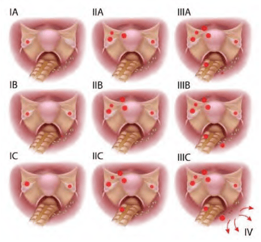

Chẩn đoán khối tân lập ở buồng trứng luôn luôn phải đi kèm với dự đoán về khả năng lành tính hay không lành tính của khối này.

## Nguyên tắc chung

Tất cả các cấu trúc tân lập ở buồng trứng đều phải được điều trị bằng ngoại khoa. Điểm quan trọng nhất khi tiến hành điều trị ngoại khoa các khối tân lập ở buồng trứng là cố gắng ước đoán đến mức chính xác nhất có thể được về khả năng lành tính hay ác tính của khối tân lập, bằng các phương tiện gồm tiền sử, lâm sàng, hình ảnh, chỉ báo khối u...

Đối với các cấu trúc có khả năng lành tính cao: thuộc dân số nguy cơ thấp, thỏa các quy tắc lành tính IOTA, ROMA thấp... thì có thể chỉ định phẫu thuật nội soi bảo tồn. Qua nội soi, lần nữa đánh giá lại khả năng lành-ác của u qua đại thể quan sát được trước khi thực hiện bóc u bảo tồn mô lành ở người trẻ. Phẫu thuật phải ở mức sang chấn thấp nhất có thể, nhằm tránh ảnh hưởng xấu đến dự trữ buồng trứng. Đối với người lớn tuổi, phẫn thuật cắt phần phụ được khuyến cáo thay vì phẫu thuật bảo tồn.

Đối với các cấu trúc có khả năng lành tính thấp, hay nghi ngờ ác tính, mang các đặc tính của các quy tắc ác tính IOTA, ROMA cao... thì phải được đánh giá qua mở bụng. Việc thám sát cẩn trọng tình trạng ở bụng là đòi hỏi tiên quyết:

1. Tế bào học dịch báng, dịch ổ bụng phải được thực hiện trước tiên, nhằm đánh giá sự lan truyền trong phúc mạc của ung thư.
2. Thám sát tất cả các cơ quan có thể có liên quan gồm dạ dày, các tạng bụng, kể cả ruột thừa nhằm giúp đánh giá các cơ quan có liên hệ mật thiết về mặt ung thư học (di căn Krukenberg, kèm theo các ung thư khác như ung thư đại trực tràng...).
3. Khi đã xác định ung thư, với khối u, thực hiện phẫu thuật ở mức tối đa nhưng hợp lý, cắt bỏ khối ung thư trên buồng trứng và những vị trí u xâm lấn hay di căn nếu có thể. Mục đích của phẫu thuật là để loại bỏ càng nhiều khối u càng tốt. Phải cắt trọn u, không được làm vỡ u. Cắt ruột thừa, cắt mạc nối lớn là cần thiết.
4. Sau khi phẫu thuật, cần cung cấp đủ thông tin TNM cho xác định giai đoạn của ung thư (FIGO).
5. Điều trị bổ sung sau phẫu thuật sẽ được xác định bởi loại ung thư, giai đoạn của bệnh, và grade mô bệnh học. Điều trị bổ túc có thể là xạ trị hay hóa trị phối hợp (carboplatin, cisplatin, palitaxel...) tùy theo giải phẫu bệnh và giai đoạn ung thư. Tuy nhiên, chủ yếu vẫn là hóa trị.
6. Nội soi lần thứ nhì để đánh giá (second look) nhằm đánh giá hiệu quả điều trị và tái phát của u.

## Phòng ngừa ung thư buồng trứng

Mang thai kỳ đủ tháng, cho con bú và sử dụng COCs làm giảm đáng kể nguy cơ ung thư thượng mô buồng trứng.

Cắt buồng trứng dự phòng là biện pháp duy nhất có thể ngăn ngừa ung thư buồng trứng. Hiệp Hội Sản Phụ Khoa Hoa Kỳ (ACOG) viết "Khuyến cáo để lại buồng trứng nếu như người phụ nữ đó chưa mãn kinh. [Tuy nhiên], xem xét nguy cơ có thể xảy ra ung thư buồng trứng ở tuổi mãn kinh, việc cắt bỏ buồng trứng có thể được xem xét".

## Giai đoạn ung thư buồng trứng theo FIGO

Các giai đoạn của ung thư buồng trứng theo FIGO:

Giai đoạn I: giới hạn ở buồng trứng

- Ia: 1 buồng trứng
- Ib: 2 buồng trứng
- Ic: 1 hoặc 2 buồng trứng, vỏ bọc vỡ hoặc dịch ổ bụng hoặc dịch rửa ổ bụng có chứa TB ác tính

Giai đoạn II: ung thư 1 hay 2 buồng trứng có di căn vùng chậu

- IIa: di căn tử cung và/hoặc vòi trứng
- IIb: di căn các nơi khác trong vùng chậu
- IIc: IIa hoặc IIb, vỏ bọc vỡ, dịch ổ bụng hoặc dịch rửa ổ bụng có tế bào ác tính

Giai đoạn III: ung thư 1 hay 2 buồng trứng lan ra ngoài vùng chậu và/hoặc có hạch sau phúc mạc, hạch bẹn, di căn bề mặt gan, di căn vi thể mạc nối lớn, mạc treo ruột non

- IIIa: không di căn hạch nhưng có di căn phúc mạc vi thể
- IIIb: có di căn phúc mạc bụng đại thể >2cm, không di căn hạch
- IIIc: IIIb và/hoặc có di căn hạch sau phúc mạc hay hạch bẹn

Giai đoạn IV: di căn xa, tràn dịch màng phổi, di căn nhu mô gan.

## Nguồn tham khảo

- Trường Đại học Y Dược Thành phố Hồ Chí Minh (2020) - TEAM-BASED LEARNING.
