Pap's test và soi cổ tử cung là 2 phương pháp sàng lọc bất thường cổ tử cung.

## Pap's test

Pap's test hay phết mỏng tế bào cổ tử cung là công cụ tầm soát sơ cấp ung thư cổ tử cung.

### Các phương pháp lấy Pap's test

Việc lấy mẫu Pap’s test được chấp nhận trong tầm soát ung thư cổ tử cung gồm cả xét nghiệm tế bào học quy ước (conventional method) và xét nghiệm tế bào học nhúng dịch (liquid-based method).

Pap’s test quy ước rẻ hơn, nhưng cả Se và Sp đều thấp. Pap’s test nhúng dịch đắt tiền hơn, nhưng do không bị mất tế bào và chất lượng cũng phết tốt hơn nên cả Se và Sp đều cao hơn.

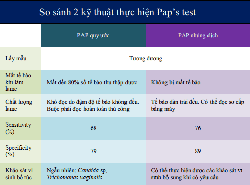

### Điều kiện thực hiện

Để đảm bảo test đủ tiêu chuẩn, Pap’s test phải được thực hiện khi đảm bảo những điều kiện cần thiết để lấy đủ và đúng tế bào:

1. Không đang ra huyết âm đạo.
2. Không có tình trạng viêm âm đạo-cổ tử cung cấp tính.
3. Không đặt thuốc ở âm đạo trong vòng 3 ngày gần đây.
4. Không giao hợp, không thụt rửa âm đạo trong vòng 48h trước thực hiện phết tế bào.
5. Không khám âm đạo bằng tay trước đó, không dùng dầu bôi trơn trước đó.

Phụ nữ mãn kinh nên được dùng estrogen tại chỗ vài ngày trước khi lấy mẫu.

Các điều kiện này nhằm vào 2 mục đích:

1. Đảm bảo lấy được đúng các tế bào muốn quan sát với chất lượng tốt nhất.
2. Đảm bảo lấy đủ lượng tế bào muốn khảo sát.

### Quy trình thực hiện

Phải cung cấp đủ thông tin cần thiết cho người đọc tế bào cổ tử cung bằng cách điền vào phiếu:

1. Họ và tên, tuổi, PARA.
2. Ngày kinh chót / có thai / mãn kinh.
3. Lý do làm Pap’s test: tầm soát / theo dõi CIN.
4. Phương pháp ngừa thai: thuốc / vòng.
5. Kết quả tầm soát lần trước.

Pap’s test quy ước: thực hiện 2 lame phết tế bào cổ ngoài và cổ trong. Trên lame có ghi bằng bút chì đầy đủ tên, tuổi, và vị trí lấy bệnh phẩm là cổ tử cung ngoài hay cổ tử cung trong) bằng viết chì. Pap’s test Thin Prep, làm tương tự với lọ đựng mẫu tế bào thu thập được.

Tế bào lấy ra được cố định bằng dung dịch cồn $95^o$ hoặc keo phun (Pap’s test quy ước) hoặc bằng môi trường của Thin Prep (Pap’s test nhúng dịch).

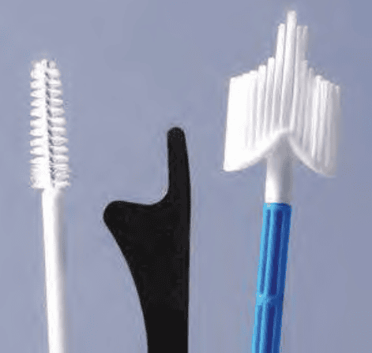
_Dụng cụ để làm Pap’s test (từ trái sang): 1. Cytobrush dùng cho kênh cổ tử cung. 2. Que Ayre dùng cho Pap’s test quy ước. 3. Chổi lớn thường dùng cho Pap’s test Thin Prep._

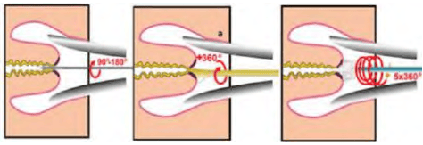
_Cách lấy mẫu (từ trái sang) 1. Cytobrush: Lấy ở kênh tử cung, tại vùng SCJ bị rút vào trong kênh, không đưa chổi lên quá sâu trong kênh cổ tử cung. 2. Que Ayre: Lấy 2 lần, với đầu to và đầu nhọn. Cả 2 lần đều phải áp vào vùng chuyển sản, và lấy được SCJ. 3. Chổi lớn: Áp vào SCJ và vùng chuyển sản._

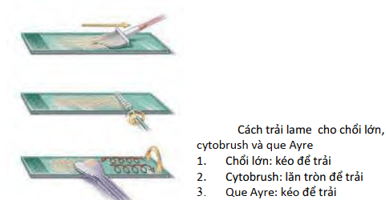
_Cách trải lame: 1. Chổi lớn: kéo để trải. 2. Cytobrush: lăn tròn để trải. 3. Que Ayre: kéo để trải._

### HPV testing

HPV testing thường được thực hiện cùng lúc với phết tế bào học cổ tử cung, gọi là co-testing.

Các xét nghiệm HPV cần định rõ các type nguy cơ cao. Các khảo sát các genotypes HPV nguy cơ thấp có giá trị rất thấp, do không có ý nghĩa trong tầm soát ung thư.

Xem thêm tại [HPV](/phu-khoa/bat-thuong-co-tu-cung/03_hpv/).

### Phân loại tế bào học theo Bethesda 2014

Diễn giải kết quả các phân nhóm chung có 2 phân nhóm lớn:

1. Âm tính với tổn thương trong biểu mô hay ác tính.
2. Khác: xem diễn giải / kết quả (tế bào nội mạc tử cung ở phụ nữ từ 45 tuổi trở lên).
3. Bất thường tế bào biểu mô: xem diễn giải / kết quả (phù hợp "tế bào vảy" hay phù hợp "tế bào tuyến").

#### Âm tính với tổn thương trong biểu mô hay ác tính (Negative for Intraepithelial Lesion or Malignancy)

Kết quả tầm soát âm tính khi không có bằng chứng về mặt tế bào của tân sinh tổn thương trong biểu mô, không có dấu hiệu ác tính.

- Các biểu hiện không tân sinh 
  _Non-neoplastic findings_ 
  Các biến thể tế bào không tân sinh: chuyển sản gai, thay đổi sừng, thay đổi trong thai kỳ, teo 
  _Non-neoplastic cellular variations_ 
  Các thay đổi tế bào do phản ứng: đi kèm với viêm, tia xạ dụng cụ tử cung 
  _Reactive cellular changes_ 
  Trạng thái tế bào tuyến sau cắt tử cung 
  _Glandular cell status post hysterectomy_
- Những thay đổi tế bào do vi sinh vật:
  Trichomonad vaginalis, nấm (Candida sp), vi khuẩn (Gardnerella, Chlamydia trachomatis...), virus (HSV, HPV...)

#### Khác

Ở phụ nữ ≥45 tuổi, phải báo cáo về hình thái tế bào học lành tính của tế bào nội mạc tử cung.

#### Bất thường tế bào biểu mô

- Tế bào gai. 
  _Squamous cell_ 
  Tế bào gai không điển hình 
  _Atypical squamous cells (ASC)_ 
  Tế bào gai không điển hình với ý nghĩa không xác định 
  _ASC-undetermined significance (ASC-US)_ 
  Tế bào gai không điển hình không thể loại tổn thương trong biểu mô gai mức độ cao
  _ASC can not excluded HIS (ASC-H)_ 
  Tổn thương trong biểu mô gai mức độ thấp (bao gồm nhiễm HPV / dị sản nhẹ / CIN 1) 
  _Low-grade squamous intraepithelial lesions (LSIL) (encompassing: HPV/mild dysplasia/CIN 1)_ 
  Tổn thương trong biểu mô gai mức độ cao (bao gồm dị sản trung bình và nặng, carcinoma tại chỗ; CIN 2 và CIN 3) 
  _High-grade squamous intraepithelial lesions (HSIL) (encompassing: moderate and severe dysplasia, CIS; CIN 2 and CIN 3)_ 
  Với đặc trưng nghi ngờ của xâm lấn (nếu nghi ngờ xâm lấn) 
  _With features suspicious for invasion (if invasion is suspected)_ 
  Ung thư tế bào gai 
  _Squamous cell carcinoma_ 
- Tế bào tuyến 
  _Glandular cell_ 
  Tế bào tuyến không điển hình 
  _Atypical_ 
  &emsp;Tế bào cổ trong cổ tử cung (không có đặc điểm khác hoặc có bình luận chuyên biệt) 
  &emsp;_Endocervical cells (no otherwise specified or specify in comments)_ 
  &emsp;Tế bào nội mạc tử cung (không có đặc điểm khác hoặc có bình luận chuyên biệt) 
  &emsp;_Endometrial cells (no otherwise specified or specify in comments)_ 
  &emsp;Tế bào tuyến (không có đặc điểm khác hoặc có bình luận chuyên biệt) 
  &emsp;_Glandular cells (no otherwise specified or specify in comments)_ 
  Tế bào tuyến không điển hình 
  _Atypical_ 
  &emsp;Tế bào cổ trong cổ tử cung, khuynh hướng tân lập 
  &emsp;_Endocervical cells, favor neoplastic_ 
  &emsp;Tế bào tuyến, khuynh hướng tân lập 
  &emsp;_Glandular cells, favor neoplastic_ 
  Carcinoma tại chỗ tuyến cổ trong cổ tử cung 
  _Endocervical adenocarcinoma in situ_ 
  Carcinoma tuyến 
  _Adenocarcinoma_ 
  &emsp;Kênh cổ tử cung 
  &emsp;_Endocervical_ 
  &emsp;Nội mạc tử cung 
  &emsp;_Endometrial_ 
  &emsp;Ngoài tử cung 
  &emsp;_Extrauterine_ 
  &emsp;Không có đặc điểm khác 
  &emsp;_No otherwise specified_ 

#### Các tân sinh ác tính khác

#### Các tổn thương tiền xâm lấn của ung thư cổ tử cung

Theo Bethesda 2014, tổn thương tiền xâm lấn của ung thư cổ tử cung có thể phân thành 3 loại:

1. ASC
2. LSIL
3. HSIL

Tế bào gai không điển hình (ASC):

- ASC-US
- ASC-H

Tổn thương trong biểu mô gai mức độ thấp (LSIL):

- CIN 1 (dị sản nhẹ)
- Những biến đổi do HPV (koilocytotic atypia)

Tổn thương trong biểu mô gai mức độ cao (HSIL):

- CIN 2
- CIN 3
- Ung thư tại chỗ

### Quản lý tế bào học

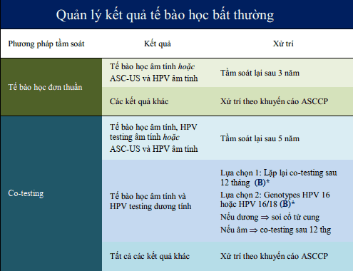
_Các khuyến cáo dựa theo: American Cancer Society, The American Society for Colposcopy and Cervical Pathology, và The American Society for Clinical Pathology. A: khuyến cáo mạnh, chứng cứ rõ ràng, hằng định. B: khuyến cáo trung bình, chứng cứ không hằng định. C: theo kinh nghiệm._

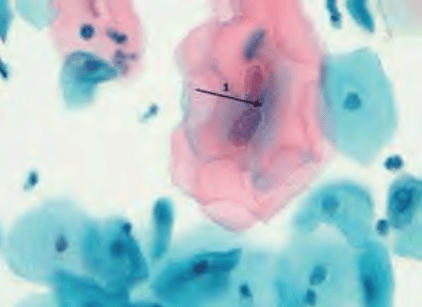
_ASC-US - Tế bào biểu mô gai kém trưởng thành hơn bình thường, với nhân to trong các tế bào hồng rộng. Nhiều tế bào trong số này có nhân đôi bất thường. Các nhân rộng với bờ kém rõ. ASC-US đòi hỏi phải có quản lý riêng, như ltổn thương có tiềm năng chuyển biến thành ung thư._

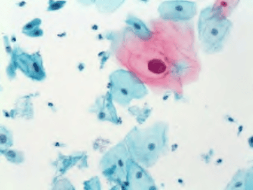
_LSIL - Các tế bào với nhân rộng gấp 5 lần so với nhân bình thường của các tế bào trung gian. Hầu hết các LSIL có liên quan đến HPV._

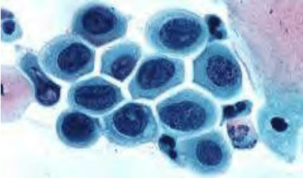
_HSIL - Các tế bào bất thường đơn lẽ với phân bố nhiễm sắc chất thô, nằm ở giữa tế bào. Tế bào chất dầy._

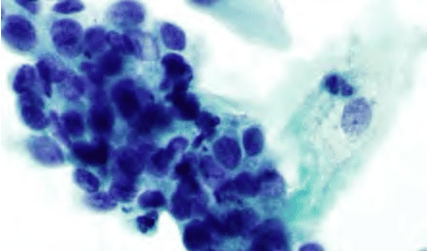
_Carcinoma in situ - Các tế bào bất thường sát nhập lại tạo thành các hội bào. Rất ít tế bào chất. Các nhân ken dầy._

## Soi cổ tử cung

Soi cổ tử cung là kỹ thuật thực hiện quan sát cổ tử cung dưới hệ thống phóng đại quang học (máy soi cổ tử cung), nhằm đánh giá các tổn thương ở cổ tử cung về kích thước, vị trí, đặc điểm, đồng thời hướng dẫn sinh thiết cổ tử cung và/hoặc nạo kênh cổ tử cung (endocervical curettage) (ECC) để thiết lập chẩn đoán xác định tổn thương cổ tử cung ở mức độ mô học.

### Điều kiện và dụng cụ

Soi cổ tử cung được thực hiện sau khi đã có kết quả phết mỏng cổ tử cung. Thời điểm thực hiện soi cổ tử cung là vào N8-N12 của chu kỳ kinh. Thông thường, nên hẹn soi cổ tử cung sau sạch
kinh được 3 ngày.

Các dụng cụ phải trang bị cho soi cổ tử cung gồm:

- Dung dịch NaCl 0.9%, Acid Acetic 3% và Lugol 1%.
- Dụng cụ soi: Mỏ vịt, bông gòn, kẹp hình tim.
- Dụng cụ bấm sinh thiết: kềm bấm sinh thiết, muỗng rỗng nạo kênh, lọ bệnh phẩm chứa formaldehyde 4%.

### Đánh giá

Soi cổ tử cung phải được thực hiện theo tiến trình gồm 3 bước bắt buộc:

1. Soi cổ tử cung không chuẩn bị.
2. Soi cổ tử cung sau bôi acid acetic 5%.
3. Soi cổ tử cung sau bôi Lugol 1%.

#### Soi cổ tử cung không chuẩn bị

Soi cổ tử cung không chuẩn bị sau khi làm sạch cổ tử cung bằng nước muối sinh lý:

- Quan sát dưới ánh sáng trắng giúp quan sát được có bạch sản (leukoplasia), nang Naboth (Naboth Follicular) (NF) hay không.
- Quan sát dưới ánh sáng xanh giúp quan sát được có hình ảnh mạch máu bất thường hay không.

#### Soi cổ tử cung bằng acid acetic

Soi cổ tử cung sau bôi acid acetic 5% nhằm đánh giá phản ứng của biểu mô tuyến và biểu mô chuyển sản với acid acetic. Bôi acid acetic, chờ 5 phút để quan sát tổn thương:

Quan sát ranh giới lát trụ (Junction) (J), vùng chuyển tiếp (Transformation Zone) (TZ), biểu mô tuyến, cửa tuyến (Opening Glands) (OG) và các hình ảnh bất thường như Acetowhite (AW), lát đá (Mosaic) (M), chấm đáy (Punctuation) (P)

#### Soi cổ tử cung bằng lugol

Soi cổ tử cung sau bôi Lugol 1% để đánh giá sự bắt màu của biểu mô lát với Iod.

- Lugol (+) khi toàn bộ biểu mô lát bắt màu vàng sậm.
- Lugol (-) khi biểu mô lát hoặc vùng chuyển sản không bắt màu vàng sậm.

### Đọc kết quả

Kết quả soi cổ tử cung được phải cung cấp đầy đủ thông tin về mô tả tiến trình soi, các hình ảnh soi cổ tử cung theo từng tiến trình và lập bản đồ tổn thương (sơ đồ hóa) (cervicography) theo đúng quy định.

Nếu có tổn thương cổ tử cung phải bấm sinh thiết, thì phải ghi nhận rõ số mẫu bấm sinh thiết, vị trí bấm sinh thiết và mô học để lưu trữ, theo dõi và đánh giá các tổn thương này của cổ tử cung.

Kết quả soi cổ tử cung được trả lời theo bảng phân loại soi cổ tử cung theo ASCCP sau đây:

(A) Nhóm hình ảnh soi cổ tử cung bình thường:

- Biểu mô lát nguyên thủy (Original Squamous Epithelium) (OSE).
- Biểu mô trụ.
- Vùng chuyển tiếp.

(B) Nhóm hình ảnh soi cổ tử cung bất thường: có thể nằm trong vùng chuyển tiếp hay nằm ngoài vùng chuyển tiếp (cổ ngoài cổ tử cung, âm đạo):

- Biểu mô trắng (acetowhite) (AW).
- Chấm đáy (punctuation) (P).
- Lát đá (mosaic) (M).
- Bạch sản (Leukoplasia) (L).
- Vùng Iodine không bắt màu.
- Mạch máu bất thường.

(C) Nghi ngờ ung thư xâm lấn.

(D) Nhóm hình ảnh soi cổ tử cung không đầy đủ: không quan sát thấy vùng chuyển tiếp, nhiễm trùng nặng hay thiểu dưỡng nặng (sau mãn kinh), hay hẹp âm đạo không thể nhìn thấy cổ tử cung.

(E) Nhóm các dấu hiệu soi khác: viêm cổ tử cung-âm đạo, loét cổ tử cung, teo biểu mô, condyloma và papilloma, các dạng khác: polyp kênh cổ tử cung, u nhú, nang Naboth...

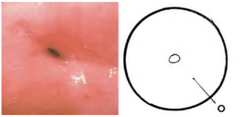
_Cổ tử cung bình thường qua soi cổ tử cung._

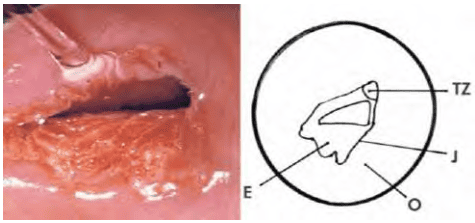
_Cổ tử cung chuyển sản với ranh giới lát trụ, biểu mô lát non._

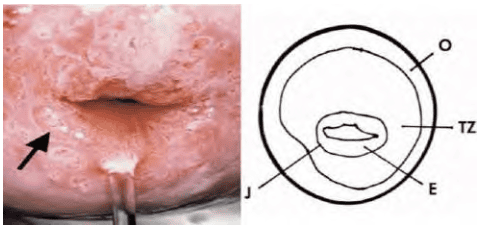
_Cổ tử cung chuyển sản với cửa tuyến, đảo tuyến._

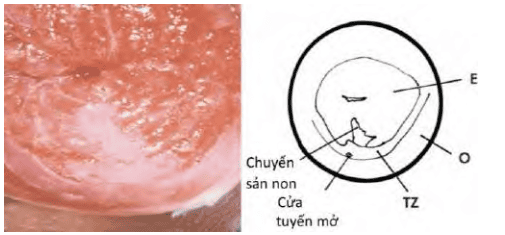
_Cổ tử cung tái tạo với lưỡi biểu mô chuyển sản lát non._

## Nguồn tham khảo

- Trường Đại học Y Dược Thành phố Hồ Chí Minh (2020) - TEAM-BASED LEARNING.
